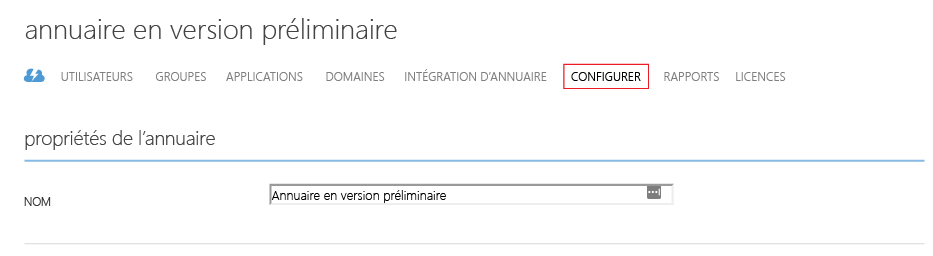

<properties
	pageTitle="Configurer le protocole LDAPS (LDAP sécurisé) dans les services de domaine Azure AD | Microsoft Azure"
	description="Configurer le protocole LDAPS (LDAP sécurisé) pour un domaine géré par les services de domaine Azure AD"
	services="active-directory-ds"
	documentationCenter=""
	authors="mahesh-unnikrishnan"
	manager="stevenpo"
	editor="curtand"/>

<tags
	ms.service="active-directory-ds"
	ms.workload="identity"
	ms.tgt_pltfrm="na"
	ms.devlang="na"
	ms.topic="article"
	ms.date="07/06/2016"
	ms.author="maheshu"/>

# Configurer le protocole LDAPS (LDAP sécurisé) pour un domaine géré par les services de domaine Azure AD
Cet article explique comment activer le protocole LDAPS pour votre domaine géré par les services de domaine Azure Active Directory. Le protocole LDAP sécurisé est également appelé « protocole LDAP sur SSL (Secure Sockets Layer) / TLS (Transport Layer Security) ».

## Avant de commencer
Pour exécuter les tâches détaillées dans cet article, vous avez besoin des éléments suivants :

1. Un **abonnement** Azure valide.

2. Un **répertoire Azure AD**, synchronisé avec un répertoire local ou un répertoire cloud uniquement.

3. Les **services de domaine Azure AD**, qui doivent être activés pour le répertoire Azure AD. Si ce n’est déjà fait, suivez l’ensemble des tâches décrites dans le [Guide de mise en route](./active-directory-ds-getting-started.md).

4. Un **certificat à utiliser pour activer le protocole LDAP sécurisé**.
    - Il est **recommandé** d’obtenir un certificat de votre autorité de certification d’entreprise ou d’une autorité de certification publique. Il s’agit d’une option de configuration plus sécurisée.
	- Le cas échéant, vous pouvez également [créer un certificat auto-signé](#task-1---obtain-a-certificate-for-secure-ldap) comme indiqué plus loin dans cet article.

 

### Configuration requise pour le certificat LDAP sécurisé
Obtenez un certificat valide, en suivant les instructions ci-dessous, avant d’activer le protocole LDAP sécurisé. Toute tentative d’activation du protocole LDAP sécurisé pour votre domaine géré avec un certificat non valide ou incorrect se soldera par un échec.

1. **Émetteur approuvé** : le certificat doit être émis par une autorité approuvée par les ordinateurs devant se connecter au domaine à l’aide du protocole LDAP sécurisé. Il peut s’agir de l’autorité de certification d’entreprise de votre organisation ou d’une autorité de certification publique, approuvée par ces ordinateurs.

2. **Durée de vie** : le certificat doit être valide pour les 3 à 6 mois à venir. Cela permet de garantir que l’accès du protocole LDAP sécurisé à votre domaine géré n’est pas interrompu lorsque le certificat arrive à expiration.

3. **Nom du sujet** : le nom du sujet du certificat doit correspondre à un caractère générique pour votre domaine géré. Par exemple, si le nom du domaine est « contoso100.com », le nom d’objet du certificat doit correspondre à « *.contoso100.com ». Le nom DNS (nom alternatif du sujet) doit également être défini sur ce nom générique.

3. **Utilisation de la clé** : le certificat doit être configuré pour le chiffrage de clés et les signatures numériques.

4. **Rôle du certificat** : le certificat doit être valide pour l’authentification de serveur SSL.

 

## Tâche 1: obtenir un certificat pour le protocole LDAP sécurisé
La première tâche consiste à obtenir un certificat à utiliser pour l’accès du protocole LDAP sécurisé au domaine géré. Deux options s'offrent à vous :

- Vous pouvez obtenir un certificat à partir d’une autorité de certification, par exemple l’autorité de certification d’entreprise de votre organisation ou une autorité de certification publique.

- Vous pouvez créer un certificat auto-signé.

### Option A (recommandée) : obtention d’un certificat LDAP sécurisé auprès d’une autorité de certification
Si votre organisation déploie une infrastructure à clé publique (PKI) d’entreprise, vous devez obtenir un certificat de l’autorité de certification d’entreprise pour votre organisation. Si votre organisation obtient ses certificats auprès d’une autorité de certification publique, vous devez obtenir le certificat LDAP sécurisé auprès de cette dernière.

Quand vous demandez un certificat, assurez-vous de suivre les exigences détaillées dans la section [Configuration requise pour le certificat LDAP sécurisé](#requirements-for-the-secure-ldap-certificate).

Remarque : les ordinateurs clients devant se connecter au domaine géré via le protocole LDAP sécurisé doivent approuver l’émetteur du certificat de ce protocole.

### Option B : création d’un certificat auto-signé pour le protocole LDAP sécurisé
Vous pouvez décider de créer vous-même un certificat auto-signé pour le protocole LDAP sécurisé si les conditions suivantes sont réunies :

- les certificats de votre organisation ne sont pas émis par une autorité de certification d’entreprise, ou
- vous n’envisagez pas d’utiliser un certificat d’une autorité de certification publique.

**Créer un certificat auto-signé à l’aide de PowerShell**

Sur votre ordinateur Windows, ouvrez une nouvelle fenêtre PowerShell en tant qu’**administrateur** et saisissez les commandes suivantes, afin de créer un certificat auto-signé.

    $lifetime=Get-Date

    New-SelfSignedCertificate -Subject *.contoso100.com -NotAfter $lifetime.AddDays(365) -KeyUsage DigitalSignature, KeyEncipherment -Type SSLServerAuthentication -DnsName *.contoso100.com

Dans l’exemple ci-dessus, remplacez « contoso100.com » par le nom de domaine DNS de votre domaine géré par les services de domaine Azure Active Directory.

Le nouveau certificat auto-signé est placé dans le magasin de certificats de l’ordinateur local.

## Tâche 2 : exporter le certificat du protocole LDAP sécurisé vers un fichier .PFX
Avant de commencer cette tâche, assurez-vous que vous avez obtenu le certificat LDAP sécurisé auprès de votre autorité de certification d’entreprise ou d’une autorité de certification publique, ou que vous avez créé un certificat auto-signé.

Procédez comme suit pour exporter le certificat LDAP sécurisé vers un fichier .PFX.

1. Appuyez sur le bouton **Démarrer** et saisissez **R** pour faire apparaître la boîte de dialogue **Exécuter**. Saisissez **mmc** et cliquez sur **OK**.

    

2. Sur l’invite **Contrôle de compte d’utilisateur**, cliquez sur **OUI** pour démarrer la console MMC (Microsoft Management Console) en tant qu’administrateur.

3. Dans le menu **Fichier**, cliquez sur **Ajouter/Supprimer un composant logiciel enfichable...**.

    

4. Dans la boîte de dialogue **Ajouter ou supprimer des composants logiciels enfichables**, sélectionnez le composant logiciel enfichable **Certificats** et cliquez sur le bouton **Ajouter >**.

    

5. Dans l’Assistant **Composant logiciel enfichable Certificats**, sélectionnez **Compte d’ordinateur** et cliquez sur **Suivant**.

    

6. Sur la page **Sélection de l’ordinateur**, sélectionnez **L’ordinateur local (l’ordinateur sur lequel cette console s’exécute)** et cliquez sur **Terminer**.

    

7. Dans la boîte de dialogue **Ajouter ou supprimer des composants logiciels enfichables**, cliquez sur **OK** et ajoutez le composant logiciel enfichable Certificats dans la console MMC.

    

8. Dans la fenêtre MMC, cliquez pour développer la **racine de la console**. Vous devriez voir le composant logiciel enfichable Certificats se charger. Cliquez sur le champ **Certificats (ordinateur local)** pour le développer. Cliquez pour développer le nœud **Personnel**, suivi par le nœud **Certificats**.

    

9. Comme indiqué ci-dessus, vous devez voir s’afficher le certificat auto-signé que nous venons de créer. Vous pouvez examiner les propriétés du certificat pour vous assurer que le Thumbprint correspond à celui qu’affichaient les fenêtres PowerShell lorsque vous avez créé le certificat.

10. Sélectionnez le certificat auto-signé et **cliquez avec le bouton droit sur ce dernier**. Dans le menu contextuel, sélectionnez **Toutes les tâches** et sélectionnez **Exporter...**.

    

11. Dans l’**Assistant Exportation de certificat**, cliquez sur **Suivant**.

    

12. Sur la page **Exportation de la clé privée**, cliquez sur **Oui, exporter la clé privée** et cliquez sur **Suivant**.

    

    > [AZURE.WARNING] Vous DEVEZ exporter la clé privée avec le certificat. L’activation du protocole LDAP sécurisé pour votre domaine géré échoue si vous fournissez un fichier PFX qui ne contient pas la clé privée associée au certificat.

13. Sur la page **Format de fichier d’exportation**, sélectionnez le format de fichier **Échange d’informations personnelles - PKCS #12 (.PFX)** pour le certificat exporté.

    

	> [AZURE.NOTE] Seul le format de fichier .PFX est pris en charge. N’exportez pas le certificat au format de fichier .CER.

14. Sur la page **Sécurité**, sélectionnez l’option **Mot de passe** et saisissez le mot de passe de protection du fichier .PFX. N’oubliez pas ce mot de passe, car il est nécessaire pour la tâche suivante. Cliquez sur **Suivant** pour continuer.

    

	> [AZURE.NOTE] Notez ce mot de passe. Vous en aurez besoin quand vous activerez le protocole LDAP sécurisé pour ce domaine géré dans le cadre de la [Tâche 3 : activer le protocole LDAP sécurisé pour le domaine géré](#task-3---enable-secure-ldap-for-the-managed-domain).

15. Sur la page **Fichier à exporter**, spécifiez le nom du fichier et l’emplacement d’exportation prévus pour le certificat.

    

16. Sur la page suivante, cliquez sur **Terminer** pour exporter le certificat en tant que fichier PFX. Vous devez voir apparaître une boîte de dialogue de confirmation lorsque le certificat est exporté.

    

## Tâche 3 : activer le protocole LDAP sécurisé pour le domaine géré
Exécutez les étapes de configuration suivantes pour activer le protocole LDAP sécurisé.

1. Accédez au **[portail Azure Classic](https://manage.windowsazure.com)**.

2. Sélectionnez le nœud **Active Directory** dans le volet gauche.

3. Sélectionnez le répertoire Azure AD (également appelé « client ») pour lequel vous avez activé les services de domaine Azure Active Directory.

    

4. Cliquez sur l’onglet **Configurer**.

    

5. Faites défiler la page jusqu’à la section relative aux **services de domaine**. L’option **LDAP sécurisé (LDAPS)** doit s’afficher (voir capture d’écran ci-dessous).

    

6. Cliquez sur le bouton **Configurer le certificat...** pour ouvrir la boîte de dialogue **Configurer le certificat pour LDAP sécurisé**.

    

7. Cliquez sur l’icône du dossier sous **Fichier PFX avec certificat** pour spécifier le fichier PFX qui contient le certificat que vous souhaitez utiliser pour l’accès LDAP sécurisé au domaine géré. Indiquez également le mot de passe spécifié lors de l’exportation du certificat vers le fichier PFX. Lorsque vous avez terminé, cliquez sur le bouton Terminé, au bas de la page.

    

8. La section **Services de domaine** de l’onglet **Configurer** doit être grisée ; elle restera à l’état **En attente...** pendant quelques minutes. Pendant cette période, l’exactitude du certificat LDAP sécurisé est vérifiée et le protocole LDAP sécurisé est configuré pour votre domaine géré.

    

    > [AZURE.NOTE] L’activation du protocole LDAP sécurisé pour votre domaine géré dure 10 à 15 minutes. Si le certificat LDAP sécurisé fourni ne respecte pas les critères requis (par exemple, le nom de domaine est incorrect, le certificat a expiré ou arrivera bientôt à expiration, etc.), le protocole LDAP sécurisé n’est pas activé pour votre répertoire ; un échec s’affiche.

9. Lorsque le protocole LDAP sécurisé est activé pour votre domaine géré, le message **En attente...** doit disparaître. Le Thumbprint du certificat doit être affiché.

    

 

## Tâche 4: activer l’accès LDAP sécurisé sur Internet
**Tâche facultative** : ignorez cette tâche si vous n’envisagez pas d’accéder au domaine géré via le protocole LDAP sécurisé sur Internet.

Avant de commencer cette tâche, vérifiez que vous avez effectué les étapes décrites dans la [Tâche 3](#task-3---enable-secure-ldap-for-the-managed-domain).

1. Vous devez voir apparaître une option **ACTIVER L’ACCÈS LDAP SÉCURISÉ SUR INTERNET** dans la section **Services de domaine** de la page **Configurer**. Cette description est définie sur **NON** par défaut, car l’accès Internet au domaine géré via LDAP sécurisé est désactivé par défaut.

    

2. Affectez à l’option **ACTIVER L’ACCÈS LDAP SÉCURISÉ SUR INTERNET** la valeur **OUI**. Cliquez sur le bouton **ENREGISTRER** situé sur le panneau inférieur. 

3. La section **Services de domaine** de l’onglet **Configurer** doit être grisée ; elle restera à l’état **En attente...** pendant quelques minutes. Pendant cette période, l’accès Internet à votre domaine géré via LDAP sécurisé s’active.

    

    > [AZURE.NOTE] L’activation de l’accès Internet via le protocole LDAP sécurisé pour votre domaine géré dure 10 minutes environ.

4. Lorsque l’accès LDAP sécurisé à votre domaine géré via Internet est activé, le message **En attente...** doit disparaître. Vous devez voir l’adresse IP externe qui peut être utilisée pour accéder à votre répertoire par l’intermédiaire du protocole LDAP sécurisé dans le champ **ADRESSE IP EXTERNE POUR L’ACCÈS LDAPS**.

    

 

## Tâche 5: configurer DNS pour accéder au domaine géré depuis Internet
**Tâche facultative** : ignorez cette tâche si vous n’envisagez pas d’accéder au domaine géré via le protocole LDAP sécurisé sur Internet.

Avant de commencer cette tâche, vérifiez que vous avez effectué les étapes décrites dans la [Tâche 4](#task-4---enable-secure-ldap-access-over-the-internet).

Une fois l’accès LDAP sécurisé via Internet activé pour le domaine géré, vous devez mettre à jour DNS, afin que les ordinateurs clients puissent détecter ce domaine. À la fin de la tâche 4, une adresse IP externe est affichée sur l’onglet **Configurer** de la page **ADRESSE IP EXTERNE POUR L’ACCÈS LDAPS**.

Configurez votre fournisseur DNS externe afin que le nom DNS du domaine géré (par exemple : contoso100.com) pointe sur cette adresse IP externe. Dans notre exemple, nous devrons créer l’entrée DNS suivante :

    contoso100.com  -> 52.165.38.113

Et voilà, vous êtes maintenant prêt à vous connecter au domaine géré à l’aide du protocole LDAP sécurisé sur Internet.

> [AZURE.WARNING] N’oubliez pas que les ordinateurs clients doivent approuver l’émetteur du certificat LDAP sécurisé afin d’être en mesure de se connecter au domaine géré à l’aide du protocole LDAP sécurisé. Si vous utilisez une autorité de certification d’entreprise ou une autorité de certification approuvée publiquement, ce n’est pas un problème, car les ordinateurs clients approuvent ces émetteurs de certificats. Si vous utilisez un certificat auto-signé, vous devez installer la partie publique du certificat auto-signé (c’est-à-dire exporté sans la clé privée) dans le magasin de certificats de confiance sur l’ordinateur client.

 

## Contenu connexe

- [Administrer un domaine géré par les services de domaine Azure Active Directory](active-directory-ds-admin-guide-administer-domain.md)

<!---HONumber=AcomDC_0706_2016-->