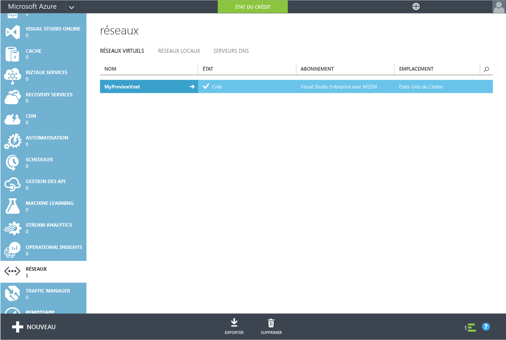
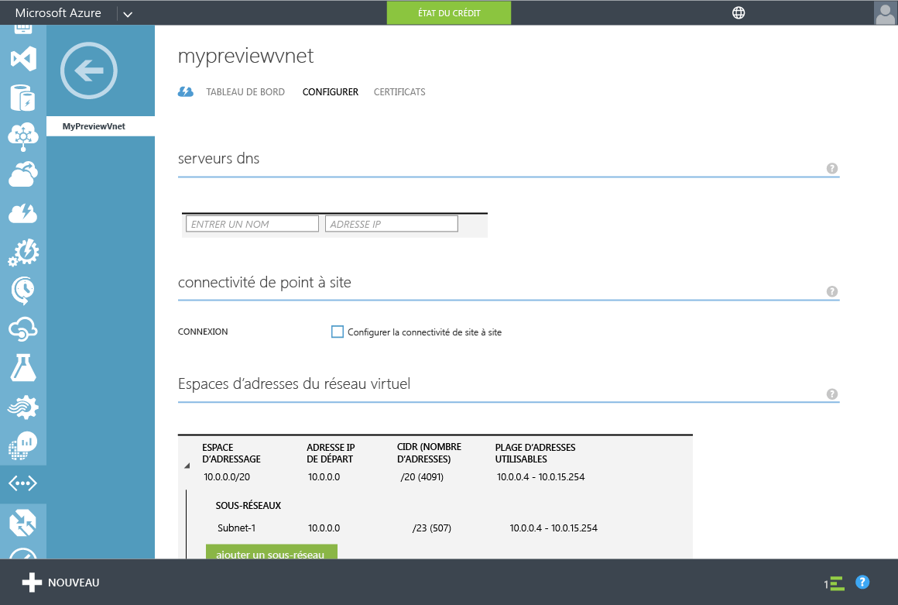
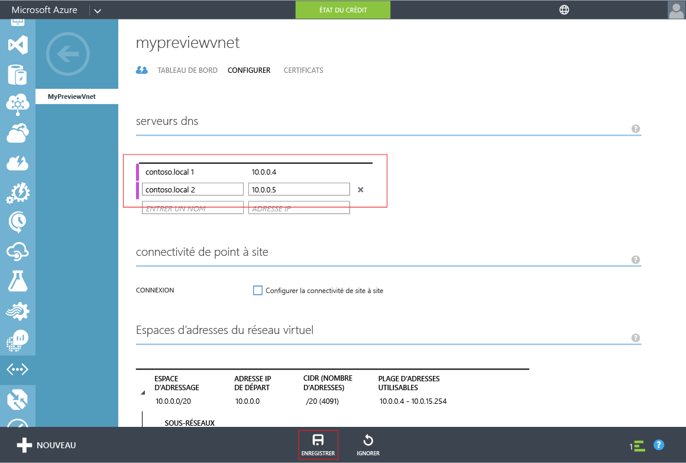

<properties
	pageTitle="Version préliminaire des services de domaine Azure Active Directory : prise en main | Microsoft Azure"
	description="Prise en main des services de domaine Azure Active Directory"
	services="active-directory-ds"
	documentationCenter=""
	authors="mahesh-unnikrishnan"
	manager="udayh"
	editor="inhenk"/>

<tags
	ms.service="active-directory-ds"
	ms.workload="identity"
	ms.tgt_pltfrm="na"
	ms.devlang="na"
	ms.topic="article"
	ms.date="10/12/2015"
	ms.author="mahesh-unnikrishnan"/>

# Services de domaine Azure AD *(version préliminaire)* : prise en main

## Étape 4 : mettre à jour les paramètres DNS pour le réseau virtuel Azure
Maintenant que vous avez activé les services de domaine Azure AD pour votre annuaire, l'étape suivante consiste à vérifier que les ordinateurs du réseau virtuel peuvent se connecter et utiliser ces services. Pour cela, vous devez mettre à jour les paramètres du serveur DNS de votre réseau virtuel afin de pointer vers les adresses IP pour lesquelles les services de domaine Azure AD sont disponibles sur le réseau virtuel.

> [AZURE.NOTE]Notez les adresses IP des services de domaine Azure AD affichées dans l’onglet **Configurer** de votre annuaire, après avoir activé les services de domaine Azure AD pour l’annuaire.

Effectuez les étapes de configuration suivantes pour mettre à jour le paramètre du réseau DNS pour le réseau virtuel sur lequel vous souhaitez activer les services de domaine Azure AD.

1. Accédez au **portail de gestion Azure** ([https://manage.windowsazure.com](https://manage.windowsazure.com)).
2. Sélectionnez le nœud **Réseaux** dans le volet gauche.

    

3. Dans l’onglet **Réseaux virtuels**, sélectionnez le réseau virtuel sur lequel vous avez activé les services de domaine Azure AD afin d’afficher ses propriétés.
4. Cliquez sur l’onglet **Configurer**.

    

5. Dans la section **Serveurs DNS**, entrez les adresses IP des services de domaine Azure AD.
6. Vérifiez que vous entrez les adresses IP qui étaient affichées dans la section **Services de domaine** de l’onglet **Configurer** de votre annuaire.
7. Cliquez sur **Enregistrer** dans le volet de la tâche au bas de la page afin d’enregistrer les paramètres de serveur DNS pour ce réseau virtuel.

   

> [AZURE.NOTE]Après la mise à jour des paramètres de serveur DNS pour le réseau virtuel, la mise à jour de la configuration DNS sur les machines virtuelles sur le réseau peut prendre du temps. Si une machine virtuelle ne peut pas se connecter au domaine, vous pouvez vider le cache DNS (par ex. ipconfig/flushdns) sur cette machine virtuelle afin de forcer une actualisation de ses paramètres DNS.

---
[**Étape suivante - Activation de la synchronisation du mot de passe pour les services de domaine Azure AD.**](active-directory-ds-getting-started-password-sync.md)

<!---HONumber=Oct15_HO3-->