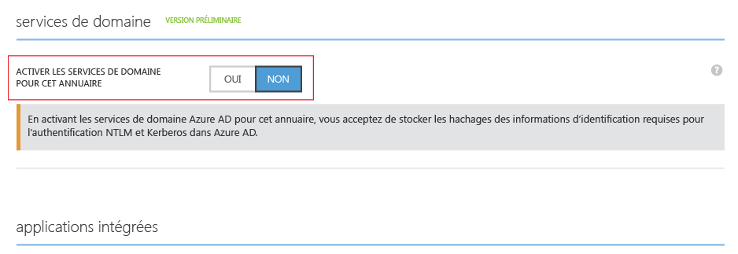
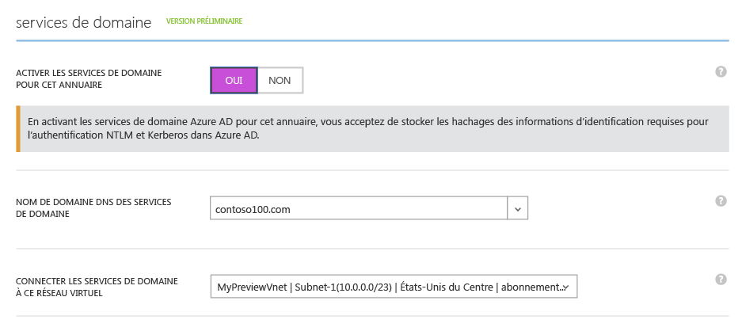
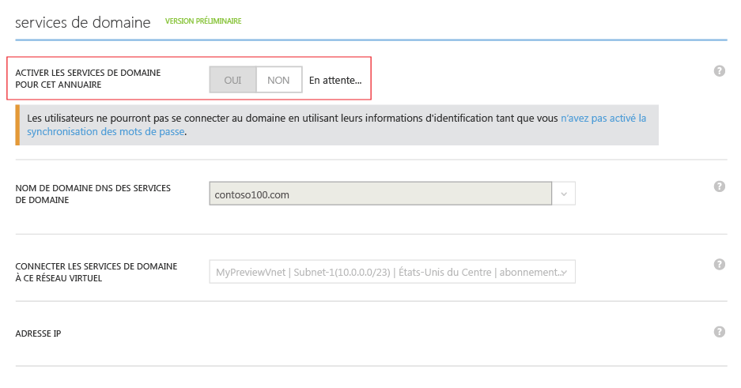
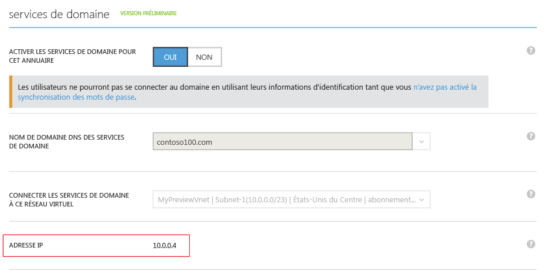
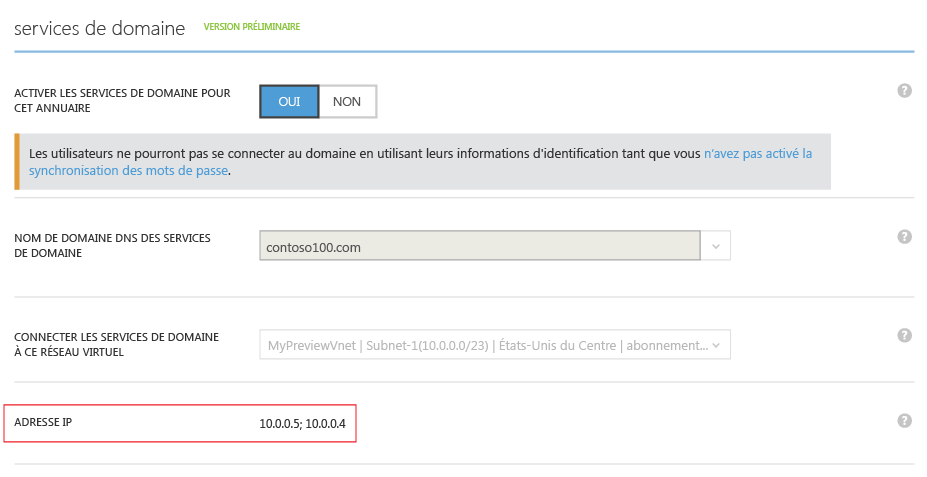

<properties
	pageTitle="Services de domaine Azure AD : Activer les services de domaine Azure AD | Microsoft Azure"
	description="Prise en main des services de domaine Azure Active Directory (version préliminaire)"
	services="active-directory-ds"
	documentationCenter=""
	authors="mahesh-unnikrishnan"
	manager="stevenpo"
	editor="curtand"/>

<tags
	ms.service="active-directory-ds"
	ms.workload="identity"
	ms.tgt_pltfrm="na"
	ms.devlang="na"
	ms.topic="get-started-article"
	ms.date="07/06/2016"
	ms.author="maheshu"/>

# Services de domaine Azure AD *(Version préliminaire)* : Activer les services de domaine Azure AD

## Tâche 3 : activer les services de domaine Azure AD
Au cours de cette tâche, vous activerez les services de domaine Azure AD pour votre répertoire. Effectuez les étapes de configuration suivantes pour activer les services de domaine Azure AD pour votre annuaire.

1. Accédez au **portail Azure Classic** ([https://manage.windowsazure.com](https://manage.windowsazure.com)).

2. Sélectionnez le nœud **Active Directory** dans le volet gauche.

3. Sélectionnez le client Azure AD (annuaire) pour lequel vous souhaitez activer les services de domaine Azure AD.

    

4. Cliquez sur l’onglet **Configurer**.

    

5. Faites défiler jusqu’à la section **services de domaine**.

    

6. Définissez l’option **Activer les services de domaine pour cet annuaire** sur **OUI**. Quelques options de configuration supplémentaires pour les services de domaine Azure AD s’affichent alors dans la page.

    

    > [AZURE.NOTE] Quand vous activez les services de domaine Azure AD pour votre client, Azure AD génère et stocker les hachages d’informations d’identification Kerberos et NTLM nécessaires pour l’authentification des utilisateurs.

7. Spécifiez le **Nom de domaine DNS des services de domaine**.

   - Le nom de domaine par défaut de l’annuaire (qui se termine par le suffixe de domaine **.onmicrosoft.com**) est sélectionné par défaut.

   - La liste contient tous les domaines qui ont été configurés pour votre annuaire Azure AD, y compris les domaines vérifiés et non vérifiés que vous configurez sous l’onglet « Domaines ».

   - En outre, vous pouvez ajouter un nom de domaine personnalisé à cette liste en le tapant dans celle-ci. Dans cet exemple, nous avons saisi un nom de domaine personnalisé « contoso100.com »

     > [AZURE.WARNING] Assurez-vous que le préfixe associé au nom de domaine spécifié (par exemple, « contoso100 » dans le nom de domaine « contoso100.com ») présente moins de 15 caractères. Vous ne pouvez pas créer un domaine des services de domaine Azure Active Directory avec un préfixe de domaine comportant plus de 15 caractères.

8. L’étape suivante consiste à sélectionner un réseau virtuel dans lequel vous souhaitez que les services de domaine Azure AD soient disponibles. Sélectionnez le réseau virtuel que vous venez de créer dans la liste déroulante **Connecter les services de domaine à ce réseau virtuel**.

   - Assurez-vous que le réseau virtuel que vous avez spécifié appartient à une région Azure prise en charge par les services de domaine Azure Active Directory.

   - Reportez-vous à la page [Services Azure par région](https://azure.microsoft.com/regions/#services/) pour connaître les régions Azure dans lesquelles les services de domaine Azure AD sont disponibles.

   - Notez que les réseaux virtuels appartenant à une région ne prenant pas en charge les services de domaines Azure AD ne sont pas gérés ; ils n’apparaîtront pas dans la liste déroulante.

   - De même, les réseaux virtuels créés à l’aide du logiciel Azure Resource Manager (réseaux virtuels avec systèmes ARM) ne seront pas affichés dans cette liste. En effet, ces réseaux virtuels ne sont pas gérés par les services de domaines Azure AD, pour l’instant.

9. Vérifiez que le nom de domaine DNS choisi pour le domaine géré n’existe pas au sein du réseau virtuel. Cela peut se produire dans les scénarios suivants :

   - Vous disposez déjà d’un domaine présentant le nom de domaine DNS au sein du réseau virtuel.

   - Le réseau virtuel que vous avez sélectionné dispose d’une connexion VPN avec votre réseau local et vous disposez d’un domaine présentant le même nom de domaine DNS sur votre réseau local.

   - Il existe un service cloud portant le même nom sur le réseau virtuel.

10. Après avoir sélectionné les options ci-dessus, cliquez sur **Enregistrer** dans le volet des tâches en bas de la page pour activer les services de domaine Azure AD.

11. La page affiche l’état « En attente... », le temps que les services de domaine Azure AD soient activés pour votre annuaire.

    

    > [AZURE.NOTE] Les services de domaine Azure AD offrent une haute disponibilité pour votre domaine géré. Quand vous activez les services de domaine Azure AD pour votre domaine, les adresses IP auxquelles les services de domaine sont disponibles sur le réseau virtuel s’affichent une par une. La deuxième adresse IP s’affiche sous peu, dès que le service active la haute disponibilité pour votre domaine. Une fois que la haute disponibilité est configurée et active pour votre domaine, deux adresses IP apparaissent normalement dans la section **services de domaine** de l’onglet **Configurer**.

12. Après environ 20 à 30 minutes, la première adresse IP à laquelle les services de domaine sont disponibles sur votre réseau virtuel apparaît dans le champ **Adresse IP** de la page **Configurer**.

    

13. Une fois que la haute disponibilité est opérationnelle pour votre domaine, deux adresses IP apparaissent dans la page. Ce sont les adresses IP auxquelles les services de domaine Azure AD sont disponibles sur votre réseau virtuel sélectionné. Notez ces adresses IP afin de pouvoir mettre à jour les paramètres DNS pour votre réseau virtuel. Cette étape permet aux machines virtuelles du réseau virtuel de se connecter au domaine en vue de diverses opérations telles que la jonction de domaine.

    

> [AZURE.NOTE] Selon la taille de votre annuaire Azure AD (nombre d’utilisateurs, groupes, etc.), la mise à disposition du contenu de l’annuaire dans les services de domaine Azure AD peut prendre du temps. Ce processus de synchronisation se produit en arrière-plan. Pour les annuaires volumineux comportant des dizaines de milliers d’objets, un ou deux jours peuvent s’écouler avant que la totalité des utilisateurs, des appartenances aux groupes et des informations d’identification soient synchronisés et disponibles dans les services de domaine Azure AD.

 

## Tâche 4 : mettre à jour les paramètres DNS pour le réseau virtuel Azure
La tâche de configuration suivante consiste à [mettre à jour les paramètres DNS pour le réseau virtuel Azure](active-directory-ds-getting-started-dns.md).

<!-----HONumber=AcomDC_0706_2016-->