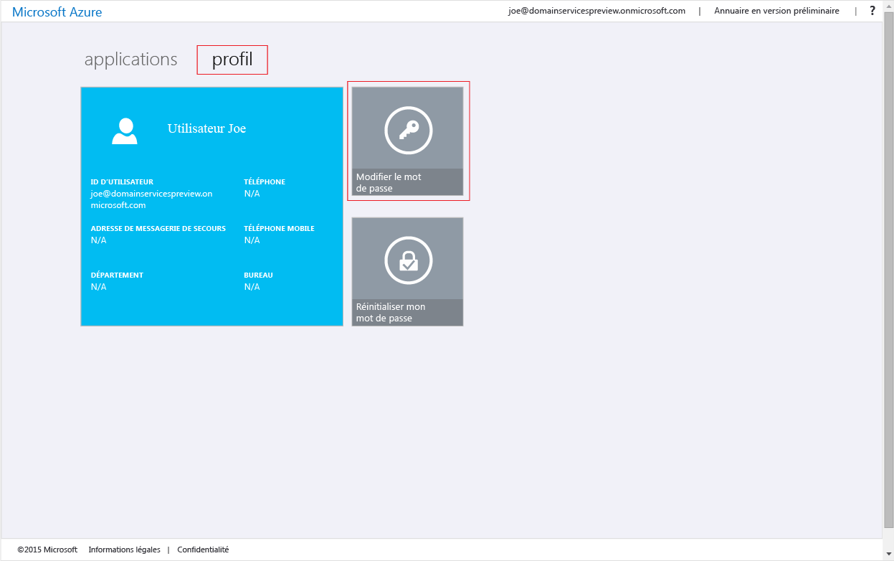
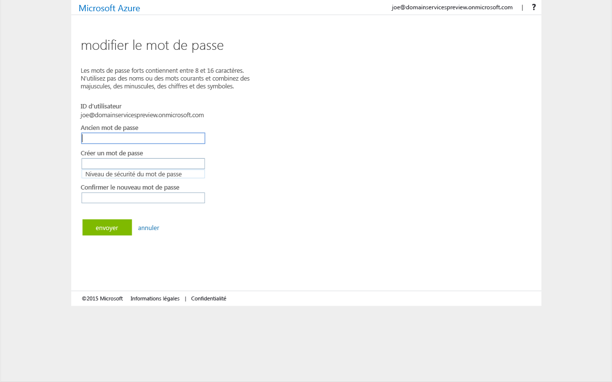

<properties
	pageTitle="Services de domaine : Activer la synchronisation de mot de passe | Microsoft Azure"
	description="Prise en main des services de domaine Azure Active Directory"
	services="active-directory-ds"
	documentationCenter=""
	authors="mahesh-unnikrishnan"
	manager="stevenpo"
	editor="curtand"/>

<tags
	ms.service="active-directory-ds"
	ms.workload="identity"
	ms.tgt_pltfrm="na"
	ms.devlang="na"
	ms.topic="get-started-article"
	ms.date="09/20/2016"
	ms.author="maheshu"/>

# Activer la synchronisation de mot de passe pour les services de domaine Azure AD
Dans les tâches précédentes, vous avez activé Services de domaine Azure AD pour votre client Azure AD. Dans la tâche suivante, vous allez activer les hachages d’informations d’identification pour que l’authentification NTLM et Kerberos se synchronise avec Services de domaine Azure AD. Une fois la synchronisation des informations d’identification configurée, les utilisateurs peuvent se connecter au domaine géré à l’aide des informations d’identification d’entreprise.

Les étapes sont différentes selon que votre organisation a un client Azure AD uniquement dans le cloud ou est paramétrée de manière à se synchroniser avec votre annuaire local à l’aide d’Azure AD Connect.

 

> [AZURE.SELECTOR]
- [Client Azure AD dans le cloud uniquement](active-directory-ds-getting-started-password-sync.md)
- [Client Azure AD synchronisé](active-directory-ds-getting-started-password-sync-synced-tenant.md)

 

## Tâche 5 : activer la synchronisation de mot de passe pour les services de domaine AAD pour un client Azure AD dans le cloud uniquement
Services de domaine Azure AD exige que les hachages d’informations d’identification soient dans un format approprié pour l’authentification NTLM et Kerberos, afin d’authentifier les utilisateurs sur le domaine géré. À moins que vous activiez Services de domaine AAD pour votre client, Azure AD ne génère pas et ne stocke pas les hachages d’informations d’identification dans le format requis pour l’authentification NTLM ou Kerberos. Pour des raisons évidentes de sécurité, Azure AD ne stocke pas non plus d’informations d’identification dans un format en texte clair. Par conséquent, Azure AD n’a pas la capacité de générer ces hachages d’informations d’identification NTLM ou Kerberos en fonction des informations d’identification existantes des utilisateurs.

> [AZURE.NOTE] Si votre organisation a un client Azure AD uniquement dans le cloud, les utilisateurs ayant besoin d’utiliser Services de domaine Azure AD doivent modifier leur mot de passe.

Ce processus de modification du mot de passe entraîne la génération, dans Azure AD, des hachages des informations d’identification dont ont besoin les services de domaine Azure AD pour l’authentification Kerberos et NTLM. Vous pouvez faire expirer les mots de passe de tous les utilisateurs dans le locataire qui doivent recourir aux services de domaine Azure AD, ou demander à ces utilisateurs de modifier leur mot de passe.

### Activer la génération du hachage des informations d’identification NTLM et Kerberos pour un client Azure AD dans le cloud uniquement
Voici les instructions que vous devez fournir aux utilisateurs finaux pour qu’ils modifient leur mot de passe :

1. Accédez à la page du volet d’accès Azure AD pour votre organisation sur [http://myapps.microsoft.com](http://myapps.microsoft.com).

2. Dans cette page, sélectionnez l’onglet **profil**.

3. Cliquez sur la vignette **Modifier le mot de passe** dans cette page.

    

    > [AZURE.NOTE] Si vous ne voyez pas l’option **Modifier le mot de passe** sur la page du volet d’accès, vérifiez que votre organisation a configuré la [gestion des mots de passe dans Azure AD](../active-directory/active-directory-passwords-getting-started.md).

4. Dans la page **Modifier le mot de passe**, tapez votre ancien mot de passe, puis tapez un nouveau mot de passe et confirmez-le. Cliquez sur **Envoyer**.

    

Une fois que vous avez modifié votre mot de passe, le nouveau mot de passe est rapidement utilisable dans Services de domaine Azure AD. Après quelques minutes (généralement environ 20 minutes), vous pouvez vous connecter aux ordinateurs joints au domaine géré à l’aide du nouveau mot de passe.

 

## Contenu connexe

- [Comment mettre à jour votre mot de passe](../active-directory/active-directory-passwords-update-your-own-password.md)

- [Prise en main de la gestion de mot de passe dans Azure AD](../active-directory/active-directory-passwords-getting-started.md).

- [Activer la synchronisation de mot de passe pour les services de domaine AAD pour un client Azure AD synchronisé](active-directory-ds-getting-started-password-sync-synced-tenant.md)

- [Administrer un domaine géré par les services de domaine Azure Active Directory](active-directory-ds-admin-guide-administer-domain.md)

- [Joindre une machine virtuelle Windows à un domaine géré par les services de domaine Azure AD](active-directory-ds-admin-guide-join-windows-vm.md)

- [Joindre une machine virtuelle Linux Red Hat Enterprise à un domaine géré par les services de domaine Azure AD](active-directory-ds-admin-guide-join-rhel-linux-vm.md)

<!-----HONumber=AcomDC_0921_2016-->