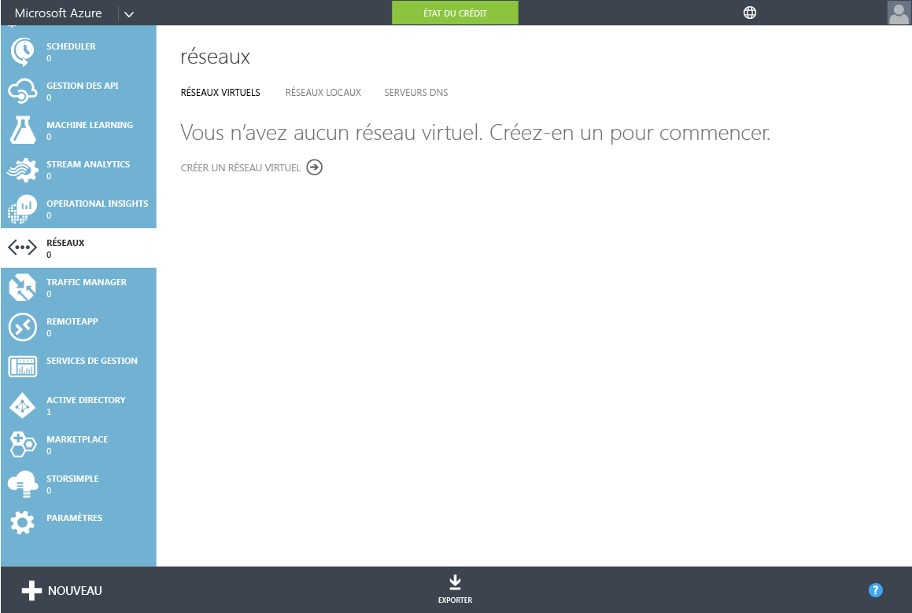
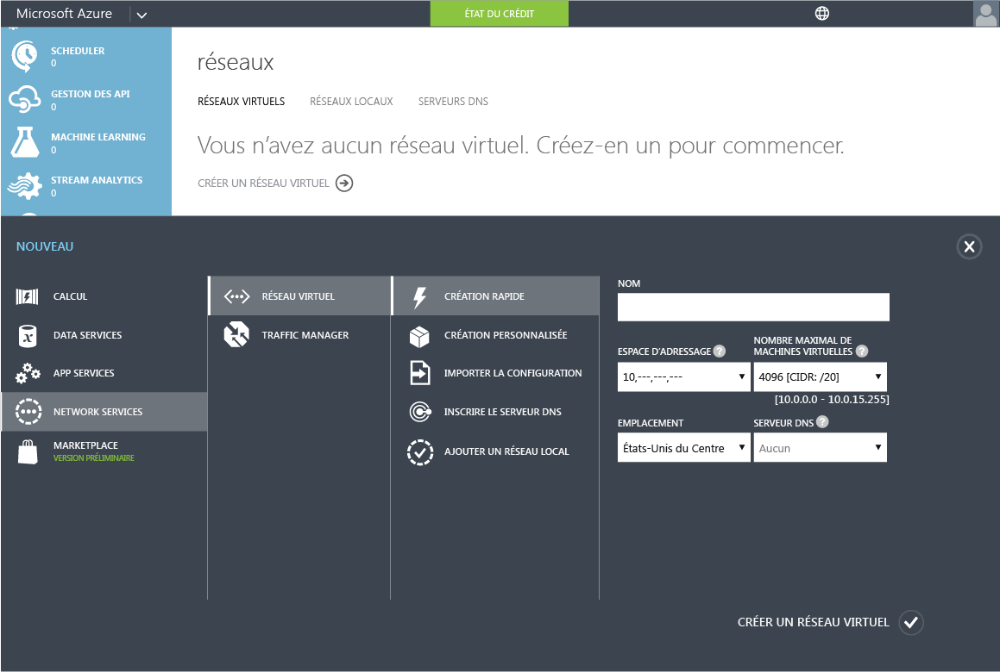
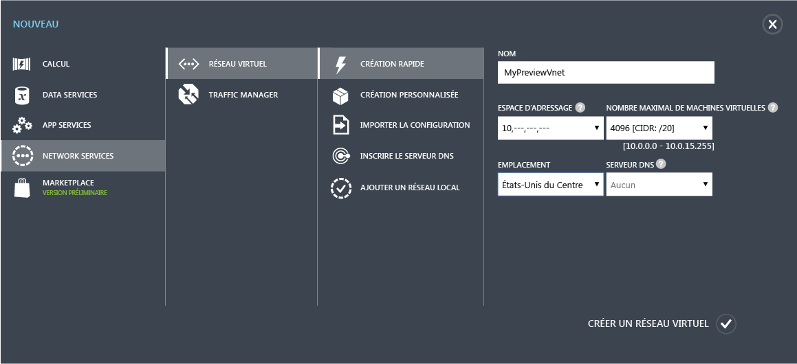

<properties
	pageTitle="Version préliminaire des services de domaine Azure Active Directory : prise en main | Microsoft Azure"
	description="Prise en main des services de domaine Azure Active Directory"
	services="active-directory-ds"
	documentationCenter=""
	authors="mahesh-unnikrishnan"
	manager="udayh"
	editor="curtand"/>

<tags
	ms.service="active-directory-ds"
	ms.workload="identity"
	ms.tgt_pltfrm="na"
	ms.devlang="na"
	ms.topic="article"
	ms.date="11/09/2015"
	ms.author="maheshu"/>

# Services de domaine Azure AD *(version préliminaire)* : prise en main

## Instructions pour sélectionner un réseau virtuel Azure
Quand vous sélectionnez un réseau virtuel en vue de l’utiliser avec les services de domaine Azure AD, gardez à l’esprit les instructions suivantes :

- Veillez à sélectionner un réseau virtuel dans une région qui est prise en charge par les services de domaine Azure AD. La liste actuelle des régions Azure prises en charge est disponible dans la [page Régions](https://azure.microsoft.com/regions/#services).
- Si vous prévoyez d’utiliser un réseau virtuel existant, assurez-vous qu’il s’agit d’un réseau virtuel régional. Les réseaux virtuels qui recourent au mécanisme des groupes d’affinités hérité ne peuvent pas être utilisés avec les services de domaine Azure AD. Dans ce cas de figure, vous devez [migrer les réseaux virtuels hérités vers des réseaux virtuels régionaux](../virtual-networks-migrate-to-regional-vnet.md).
- Sélectionnez le réseau virtuel qui héberge actuellement, ou qui hébergera, des machines virtuelles ayant besoin d’accéder aux services de domaine Azure AD. Vous ne pourrez pas déplacer les services de domaine vers un autre réseau virtuel ultérieurement.
- Les services de domaine Azure AD ne sont pas pris en charge avec les réseaux virtuels créés à l’aide d’Azure Resource Manager.

## Étape 2 : créer un réseau virtuel Azure
L’étape suivante de la configuration consiste à créer un réseau virtuel Azure dans lequel vous souhaitez activer les services de domaine Azure AD. Si vous souhaitez utiliser un réseau virtuel existant, vous pouvez ignorer cette étape.

> [AZURE.NOTE]Assurez-vous que le réseau virtuel Azure que vous créez ou que vous choisissez d’utiliser avec les services de domaine Azure AD appartient à une région Azure qui est prise en charge par les services de domaine Azure AD. Pour obtenir la liste des régions Azure où les services de domaine Azure AD sont disponibles, reportez-vous à la page [Régions](active-directory-ds-regions.md).

Notez le nom du réseau virtuel, car vous en aurez besoin au cours d’une prochaine étape de configuration pour sélectionner le réseau virtuel adéquat au moment de l’activation des services de domaine Azure AD.

Effectuez les étapes de configuration suivantes pour créer un réseau virtuel Azure dans lequel vous souhaitez activer les services de domaine Azure AD.

1. Accédez au **portail de gestion Azure** ([https://manage.windowsazure.com](https://manage.windowsazure.com)).
2. Sélectionnez le nœud **Réseaux** dans le volet gauche.
3. Cliquez sur **NOUVEAU** dans le volet des tâches en bas de la page.

    

4. Dans le nœud **Services réseau**, sélectionnez **Réseau virtuel**.
5. Cliquez sur **Création rapide** pour créer un réseau virtuel.

    

6. Spécifiez un **Nom** pour votre réseau virtuel. Vous pouvez également choisir de configurer l’**Espace d’adressage** ou le **Nombre maximal de machines virtuelles** pour ce réseau. Vous pouvez laisser le paramètre du serveur DNS sur « Aucun » pour l’instant. Ce paramètre sera actualisé une fois que vous aurez activé les services de domaine Azure AD.
7. Vérifiez que vous sélectionnez une région Azure prise en charge dans la liste déroulante **Emplacement**. Pour obtenir la liste des régions Azure où les services de domaine Azure AD sont disponibles, reportez-vous à la page [Régions](active-directory-ds-regions.md). Cette étape est essentielle. Si vous sélectionnez un réseau virtuel dans une région Azure qui n’est pas prise en charge par les services de domaine Azure AD, vous ne pouvez pas activer le service dans ce réseau virtuel.
8. Cliquez sur le bouton **Créer un réseau virtuel** pour créer votre réseau virtuel.

    

---
[**Étape suivante : activer les services de domaine Azure AD.**](active-directory-ds-getting-started-enableaadds.md)

<!---HONumber=Nov15_HO3-->