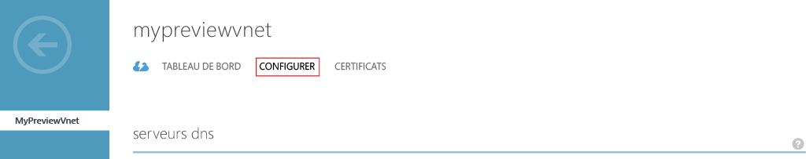
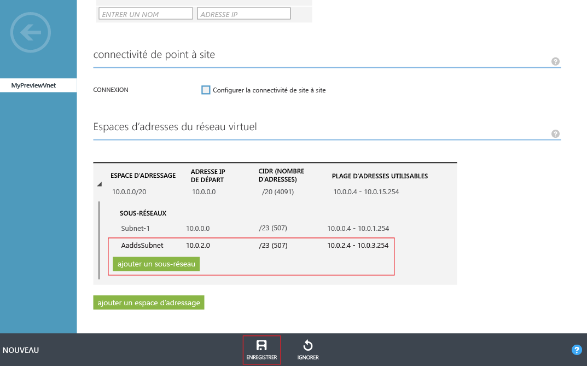

# Créer ou sélectionner un réseau virtuel pour les services de domaine Azure AD
## Instructions pour sélectionner un réseau virtuel Azure
> [!NOTE]
> **Avant de commencer**: reportez-vous à la section [Considérations relatives à la mise en réseau pour les services de domaine Azure AD](active-directory-ds-networking.md).
> 
> 

## Tâche 2 : créer un réseau virtuel Azure
La tâche de configuration suivante consiste à créer un réseau virtuel Azure et un sous-réseau à l’intérieur de celui-ci. Vous activez Azure AD Domain Services dans ce sous-réseau de votre réseau virtuel. Si vous souhaitez utiliser un réseau virtuel existant, vous pouvez ignorer cette étape.

> [!NOTE]
> Assurez-vous que le réseau virtuel Azure que vous créez ou que vous choisissez d’utiliser avec les services de domaine Azure AD appartient à une région Azure qui est prise en charge par les services de domaine Azure AD. Consultez la page [Services Azure par région](https://azure.microsoft.com/regions/#services/) pour connaître les régions Azure dans lesquelles les services de domaine Azure AD sont disponibles.
> 
> 

Notez le nom du réseau virtuel, car vous en aurez besoin au cours d’une étape de configuration ultérieure pour sélectionner le réseau virtuel adéquat au moment de l’activation des services de domaine Azure AD.

Effectuez les étapes de configuration suivantes pour créer un réseau virtuel Azure dans lequel vous souhaitez activer les services de domaine Azure AD.

1. Accédez au **portail Azure Classic** ([https://manage.windowsazure.com](https://manage.windowsazure.com)).
2. Sélectionnez le nœud **Réseaux** dans le volet gauche.
   
    
3. Cliquez sur **NOUVEAU** dans le volet des tâches en bas de la page.
   
    
4. Dans le nœud **Services réseau**, sélectionnez **Réseau virtuel**.
5. Cliquez sur **Création rapide** pour créer un réseau virtuel.
   
    
6. Spécifiez un **Nom** pour votre réseau virtuel. Vous pouvez également choisir de configurer **l’Espace d’adressage** ou le **Nombre maximal de machines virtuelles** pour ce réseau. Vous pouvez laisser le paramètre du **serveur DNS** sur « Aucun » pour l’instant. Vous pourrez mettre à jour ce paramètre après avoir activé Azure AD Domain Services.
7. Vérifiez que vous sélectionnez une région Azure prise en charge dans la liste déroulante **Emplacement** . Consultez la page [Services Azure par région](https://azure.microsoft.com/regions/#services/) pour connaître les régions Azure dans lesquelles les services de domaine Azure AD sont disponibles.
8. Pour créer votre réseau virtuel, cliquez sur le bouton **Créer un réseau virtuel** .
   
    
9. Une fois le réseau virtuel créé, sélectionnez-le et cliquez sur l’onglet **CONFIGURER**.
   
    
10. Accédez à la section **Espace d’adresses du réseau virtuel**. Cliquez sur **Ajouter un sous-réseau** et spécifiez un sous-réseau nommé **AaddsSubnet**. Cliquez sur **Enregistrer** pour créer le sous-réseau.
    
    

 

## Tâche 3 : activer les services de domaine Azure AD
La tâche de configuration suivante consiste à [activer les services de domaine Azure AD](active-directory-ds-getting-started-enableaadds.md).

<!--HONumber=Dec16_HO2-->

