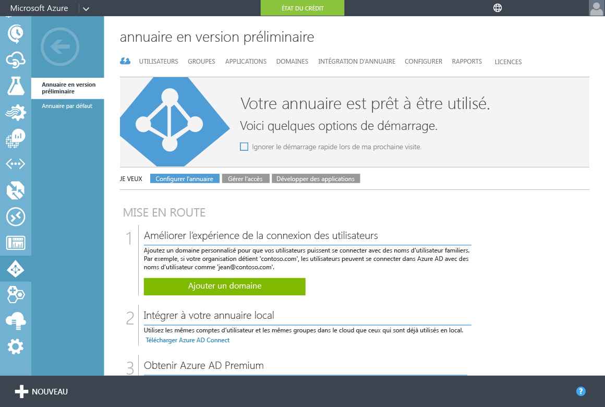

# Prise en main des services de domaine Azure AD
Cet article décrit les tâches de configuration nécessaires pour activer les services de domaine Azure AD pour votre client Azure AD.

## Tâche 1 : créer le groupe « AAD DC Administrators »
La première tâche consiste à créer un groupe d’administration dans votre client Azure Active Directory. Ce groupe d’administration spécial est appelé **AAD DC Administrators**. Les membres de ce groupe se voient accorder des privilèges d’administrateur sur les ordinateurs joints au domaine géré des services de domaine Azure AD. Sur les ordinateurs joints au domaine, ce groupe est ajouté au groupe « Administrateurs ». En outre, les membres de ce groupe sont également autorisés à utiliser le Bureau à distance pour se connecter à distance aux ordinateurs joints au domaine.  

> [!NOTE]
> Vous ne bénéficiez pas de privilèges d’administrateur de domaine ou d’administrateur d’entreprise sur le domaine géré créé à l’aide des services de domaine Azure AD. Dans un domaine géré, ces privilèges sont réservés par le service et ne sont pas accessibles aux utilisateurs au sein du client. Toutefois, vous pouvez utiliser le groupe d’administrateurs spécial créé dans cette tâche de configuration, afin d’exécuter des opérations privilégiées. Ces opérations comprennent l’ajout d’ordinateurs au domaine, l’appartenance au groupe Administrateurs sur les ordinateurs joints au domaine, la configuration de stratégie de groupe, etc.
>
>

Au cours de cette tâche de configuration, vous créez le groupe d’administration et y ajoutez un ou plusieurs utilisateurs de votre répertoire. Pour créer le groupe d’administration pour les services de domaine Azure AD, procédez comme suit :

1. Accédez au **portail Azure Classic** ([https://manage.windowsazure.com](https://manage.windowsazure.com))
2. Sélectionnez le nœud **Active Directory** dans le volet gauche.
3. Sélectionnez le client Azure AD (annuaire) pour lequel vous souhaitez activer les services de domaine Azure AD. Vous ne pouvez créer qu’un seul domaine par annuaire Azure AD.

    
4. Cliquez sur l’onglet **Groupes** .
5. Cliquez sur **Ajouter un groupe** à partir du volet de tâches en bas de la page pour ajouter un groupe à votre client Azure AD.

    
6. Créez un groupe nommé **AAD DC Administrators**. Définissez **TYPE DE GROUPE** sur **sécurité**.

   > [!WARNING]
   > Vous devez créer un groupe portant exactement ce nom pour activer l’accès au sein des services de domaine Azure AD.
   >
   >

    
7. Ajoutez une description pour ce groupe, afin que les autres utilisateurs comprennent que ce groupe permet d’accorder des privilèges d’administrateur au sein des services de domaine Azure AD.
8. Après avoir créé le groupe, cliquez sur le nom du groupe pour afficher ses propriétés. Cliquez sur le bouton **Ajouter des membres** dans le panneau inférieur, pour ajouter des utilisateurs en tant que membres de ce groupe.

    
9. Dans la boîte de dialogue **Ajouter des membres** , sélectionnez les utilisateurs qui doivent être membres de ce groupe et cochez la case quand vous avez terminé.

    

 

## Tâche 2 : créer ou sélectionner un réseau virtuel Azure
La tâche de configuration suivante consiste à [créer ou à sélectionner un réseau virtuel Azure](active-directory-ds-getting-started-vnet.md).

