<properties
   pageTitle="Azure AD Connect : mise à niveau à partir de l’outil de synchronisation Microsoft Azure AD | Microsoft Azure"
   description="Découvrez comment mettre à niveau la synchronisation d’annuaires vers Azure AD Connect. Cet article décrit les étapes de la mise à niveau de votre outil de synchronisation Microsoft Azure AD (synchronisation d’annuaires) vers Azure AD Connect."
   services="active-directory"
   documentationCenter=""
   authors="andkjell"
   manager="stevenpo"
   editor=""/>

<tags
   ms.service="active-directory"
   ms.workload="identity"
   ms.tgt_pltfrm="na"
   ms.devlang="na"
   ms.topic="article"
   ms.date="12/16/2015"
   ms.author="shoatman;billmath"/>

# Mise à niveau de la synchronisation Microsoft Azure Active Directory (DirSync) vers Azure AD Connect

Cette documentation vous aidera à mettre à niveau votre installation DirSync existante vers Azure AD Connect.

## Documentation connexe
Si vous n’avez pas lu la documentation sur l’[intégration de vos identités locales à Azure Active Directory](active-directory-aadconnect.md), le tableau suivant fournit des liens vers des rubriques connexes. Vous devez absolument lire les deux premières rubriques en gras avant la mise à niveau à partir de DirSync.

| Rubrique | |
| --------- | --------- |
| **Téléchargez Azure AD Connect** | [Téléchargez Azure AD Connect](http://go.microsoft.com/fwlink/?LinkId=615771) |
| **Matériel et conditions préalables** | [Azure AD Connect : matériel et conditions préalables](active-directory-aadconnect-prerequisites.md) |
| **Comptes utilisés pour l’installation** | [Informations supplémentaires sur les autorisations et les comptes Azure AD Connect](active-directory-aadconnect-accounts-permissions.md) |

## Effectuer une mise à niveau à partir de DirSync
Selon votre déploiement DirSync actuel, il existe différentes options pour la mise à niveau. Si la durée de mise à niveau attendue est inférieure à 3 heures, nous vous recommandons de faire une mise à niveau sur place. Si la durée de mise à niveau attendue est supérieure à 3 heures, nous vous recommandons d'effectuer un déploiement parallèle sur un autre serveur. Nous estimons que si vous avez plus de 50 000 objets, la mise à niveau prendra plus de 3 heures.

| Scénario | |
| ---- | ---- |
| [Mise à niveau sur place](#in-place-upgrade) | Option recommandée si la mise à niveau doit prendre moins de 3 heures. |
| [Déploiement en parallèle](#parallel-deployment) | Option recommandée si la mise à niveau doit prendre plus de 3 heures. |

>[AZURE.NOTE]Lorsque vous envisagez de mettre à niveau à partir de DirSync vers Azure AD Connect, ne désinstallez pas DirSync vous-même avant la mise à niveau. Azure AD Connect lit et migre la configuration de DirSync et procède à la désinstallation après l'inspection du serveur.

**Mise à niveau sur place**

La durée estimée pour effectuer la mise à niveau est affichée par l'Assistant. Cette estimation est basée sur l'hypothèse qu'il faut 3 heures pour effectuer une mise à niveau d'une base de données contenant 50 000 objets (utilisateurs, contacts et groupes). Azure AD Connect analysera vos paramètres DirSync actuels et recommandera une mise à niveau sur place si le nombre d'objets dans votre base de données est inférieur à 50 000. Si vous décidez de continuer, vos paramètres actuels sont appliqués automatiquement au cours de la mise à niveau et votre serveur reprendra automatiquement la synchronisation active.

Si vous souhaitez effectuer une migration de la configuration et un déploiement en parallèle, vous pouvez remplacer la recommandation de mise à niveau sur place. Vous pouvez, par exemple, prendre l'opportunité d'actualiser le matériel et le système d'exploitation. Consultez la section sur le [déploiement en parallèle](#parallel-deployment) pour plus d'informations.

**Déploiement en parallèle**

Un déploiement en parallèle est recommandé si vous avez plus de 50 000 objets. Cela permet d'éviter des retards opérationnels expérimentés par vos utilisateurs. L'installation d'Azure AD Connect va tenter d'estimer le temps d'arrêt associé à la mise à niveau, mais si vous avez déjà mis à niveau DirSync, votre propre expérience est sans doute plus fiable.

### Configurations de DirSync prises en charge à mettre à niveau
Les modifications de configuration suivantes sont prises en charge avec DirSync et seront mises à niveau :

- Filtrage domaine et unité organisationnelle
- Autre ID (UPN)
- Synchronisation de mot de passe et paramètres hybrides d'Exchange
- Vos paramètres domaine/forêt et Azure AD
- Filtrage basé sur les attributs de l'utilisateur

Les modifications suivantes ne peuvent pas être mises à niveau. Si vous avez apporté ces modifications, la mise à niveau sera bloquée.

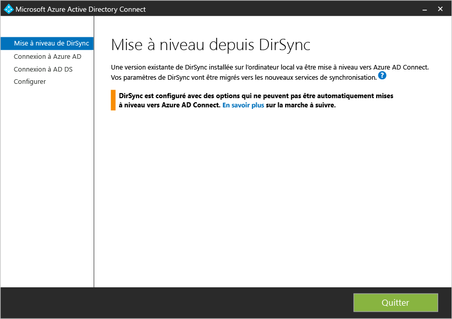

Dans ces cas, il est recommandé d’installer un nouveau serveur Azure AD Connect en [mode de préproduction](active-directory-aadconnectsync-operations.md#staging-mode) et de vérifier l’ancienne configuration de DirSync et la nouvelle configuration d’Azure AD Connect. Appliquez de nouveau les éventuelles modifications à l’aide de la configuration personnalisée, comme décrit dans [Azure AD Connect Sync : configuration personnalisée](active-directory-aadconnectsync-whatis.md).

- Modifications de DirSync non prises en charge, par exemple : attributs supprimés et utilisation d'une DLL d'extension personnalisée

Les mots de passe utilisés par DirSync pour les comptes de service ne peuvent pas être récupérés et ne seront pas migrés. Ces mots de passe seront réinitialisés lors de la mise à niveau.

### Étapes générales pour la mise à niveau à partir de DirSync vers Azure AD Connect

1. Bienvenue dans Azure AD Connect
2. Analyse de la configuration DirSync actuelle
3. Collecte du mot de passe administrateur global Azure AD
4. Collecte des informations d’identification pour le compte d’administrateur entreprise (utilisé uniquement lors de l’installation d’Azure AD Connect)
5. Installation d'Azure AD Connect
    * Désinstallation de la synchronisation d’annuaires
	* Installer Azure AD Connect
	* Synchronisation, si nécessaire

Des étapes supplémentaires sont nécessaires dans les cas suivants :

* Vous utilisez actuellement un serveur SQL complet, local ou distant
* Vous avez plus de 50 000 objets à synchroniser

## Mise à niveau sur place

1. Lancez le programme d'installation d'Azure AD Connect (MSI).
2. Lisez et acceptez les termes du contrat de licence et la déclaration de confidentialité. 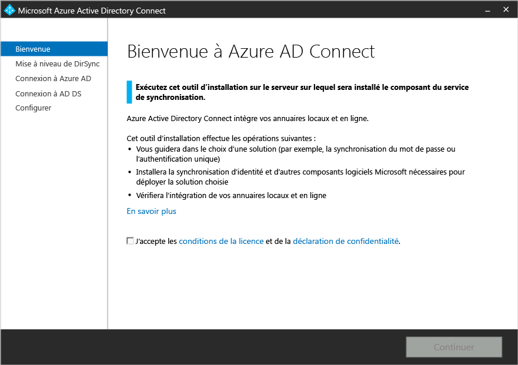
3. Cliquez sur le bouton Suivant pour analyser votre installation DirSync existante. 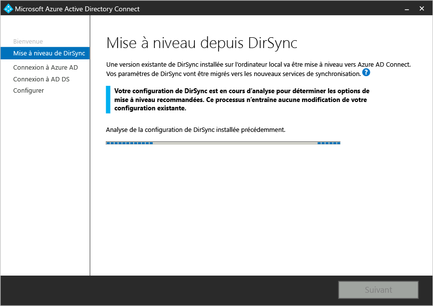
4. Lorsque l’analyse est terminée, nous proposons des recommandations sur la marche à suivre.  
    - Si vous utilisez SQL Server Express et que vous avez moins de 50 000 objets, l'écran suivant s'affiche : 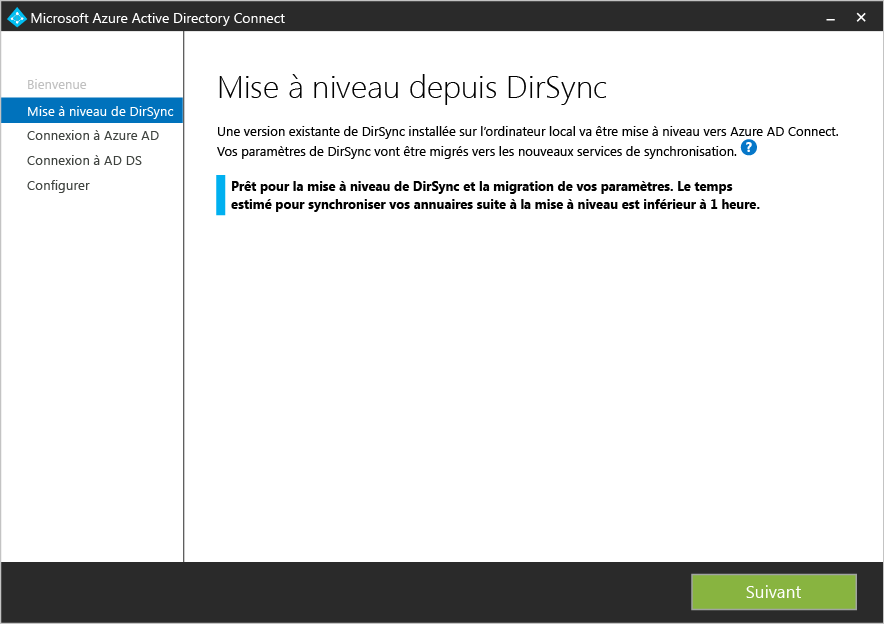
    - Si vous utilisez un serveur SQL complet pour DirSync, la page suivante s'affiche : 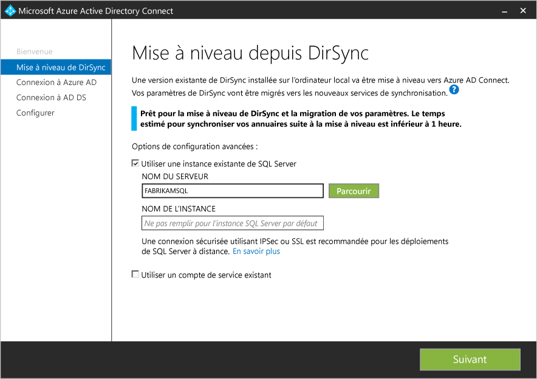  Les informations concernant le serveur de base de données SQL Server existant utilisé par DirSync s'affichent. Apportez des modifications, si nécessaire. Cliquez sur **Suivant** pour continuer l'installation.
    - Si vous avez plus de 50 000 objets, l'écran suivant s'affiche : 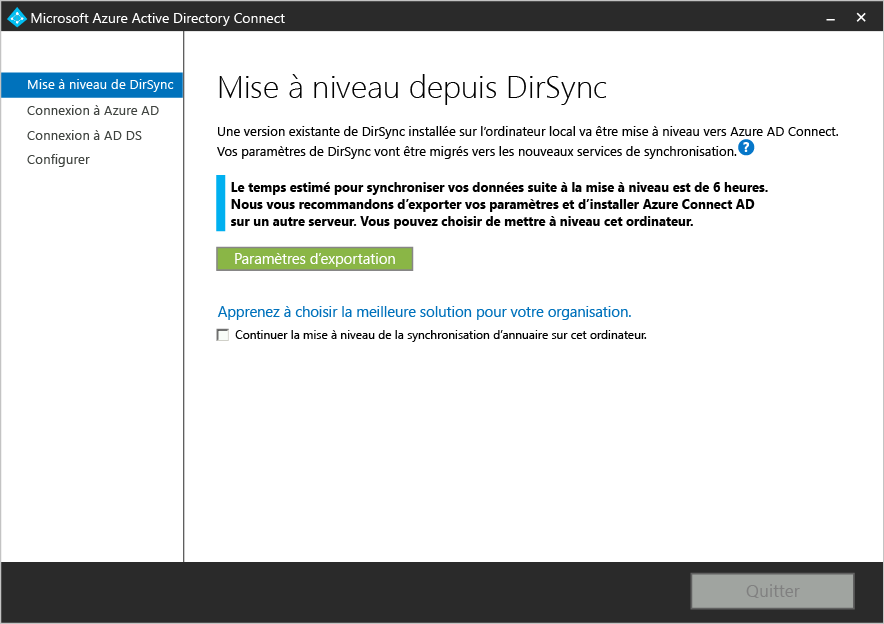  Pour procéder à une mise à niveau sur place, cochez la case en regard du message : **Continuez à mettre à niveau DirSync sur cet ordinateur.** Pour effectuer plutôt un [déploiement en parallèle](#parallel-deployment), exportez les paramètres de la configuration DirSync et les déplacer vers le nouveau serveur.
5. Indiquez le mot de passe du compte que vous utilisez actuellement pour vous connecter à Azure AD. Il doit s'agir du compte actuellement utilisé par DirSync. 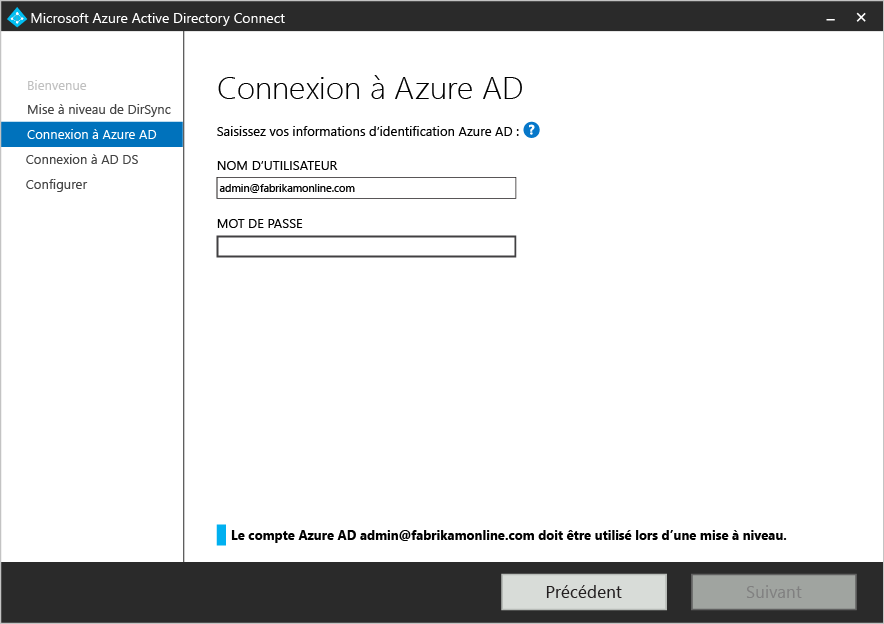
6. Indiquez un compte d'administrateur d'entreprise pour Active Directory. 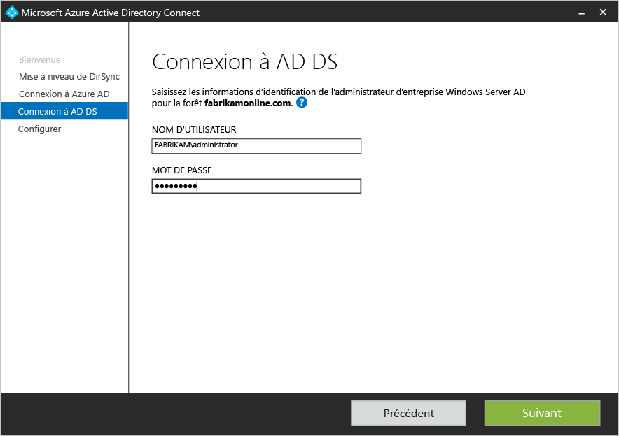
7. Vous êtes prêt à passer à la configuration. Lorsque vous cliquez sur **Mettre à niveau**, DirSync est désinstallé et Azure AD Connect est configuré et lance la synchronisation. 

## Déploiement en parallèle

### Exportation de la configuration de DirSync
**Déploiement en parallèle avec plus de 50 000 objets**

Si vous avez plus de 50 000 objets, l'installation d'Azure AD Connect recommande un déploiement en parallèle.

Un écran semblable à celui-ci s’affiche :

Si vous souhaitez appliquer un déploiement en parallèle, vous devez effectuer les opérations suivantes :

- Cliquez sur le bouton **Paramètres d'exportation**. Lorsque vous installez Azure AD Connect sur un autre serveur, ces paramètres sont importés pour migrer tous les paramètres de votre synchronisation d'annuaires (DirSync) actuelle vers votre nouvelle installation Azure AD Connect.

Une fois vos paramètres exportés, vous pouvez quitter l’Assistant Azure AD Connect sur le serveur de synchronisation d’annuaires. Passez à l'étape suivante pour [installer Azure AD Connect sur un serveur distinct](#installation-of-azure-ad-connect-on-separate-server)

**Déploiement en parallèle avec moins de 50 000 objets**

Si vous avez moins de 50 000 objets mais que vous souhaitez effectuer un déploiement en parallèle, procédez comme suit :

1. Lancez le programme d’installation d’Azure AD Connect (MSI).
2. Lorsque l'écran **Bienvenue à Azure AD Connect** s'affiche, quittez l'Assistant d'installation en cliquant sur le X en haut à droite de la fenêtre.
3. Ouvrez une invite de commandes.
4. À partir de l'emplacement d'installation d'Azure AD Connect (par défaut C:\\Program Files\\Microsoft Azure Active Directory Connect), exécutez la commande suivante : `AzureADConnect.exe /ForceExport`.
5. Cliquez sur le bouton **Paramètres d'exportation**. Lorsque vous installez Azure AD Connect sur un autre serveur, ces paramètres sont importés pour migrer tous les paramètres de votre synchronisation d'annuaires (DirSync) actuelle vers votre nouvelle installation Azure AD Connect.

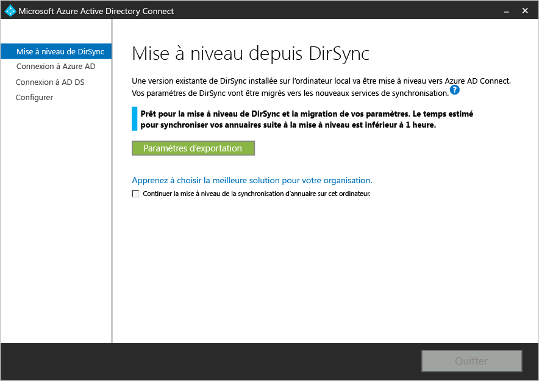

Une fois vos paramètres exportés, vous pouvez quitter l’Assistant Azure AD Connect sur le serveur de synchronisation d’annuaires. Passez à l'étape suivante pour [installer Azure AD Connect sur un serveur distinct](#installation-of-azure-ad-connect-on-separate-server)

### Installation d'Azure AD Connect sur un serveur distinct

Lorsque vous installez Azure AD Connect sur un nouveau serveur, il suppose que vous souhaitez effectuer une nouvelle installation d'Azure AD Connect. Étant donné que vous souhaitez utiliser la configuration de DirSync, quelques étapes supplémentaires sont à effectuer :

1. Lancez le programme d’installation d’Azure AD Connect (MSI).
2. Lorsque l'écran **Bienvenue à Azure AD Connect** s'affiche, quittez l'Assistant d'installation en cliquant sur le X en haut à droite de la fenêtre.
3. Ouvrez une invite de commandes.
4. À partir de l'emplacement d'installation d'Azure AD Connect (par défaut C:\\Program Files\\Microsoft Azure Active Directory Connect), exécutez la commande suivante : `AzureADConnect.exe /migrate`. L'Assistant d'installation d'Azure AD Connect démarre et affiche l'écran suivant : 
5. Sélectionnez le fichier de paramètres exportés à partir de votre installation de la synchronisation d’annuaires.
6. Configurez les options avancées :
    - Un emplacement d'installation personnalisé pour Azure AD Connect.
	- Une instance de SQL Server (par défaut, Azure AD Connect installe SQL Server 2012 Express). N'utilisez pas la même instance de base de données que celle de votre serveur DirSync.
	- Un compte de service utilisé pour la connexion à SQL Server (si votre base de données SQL Server est distante, ce compte doit être un compte de service du domaine). Ces options s'affichent dans cet écran : 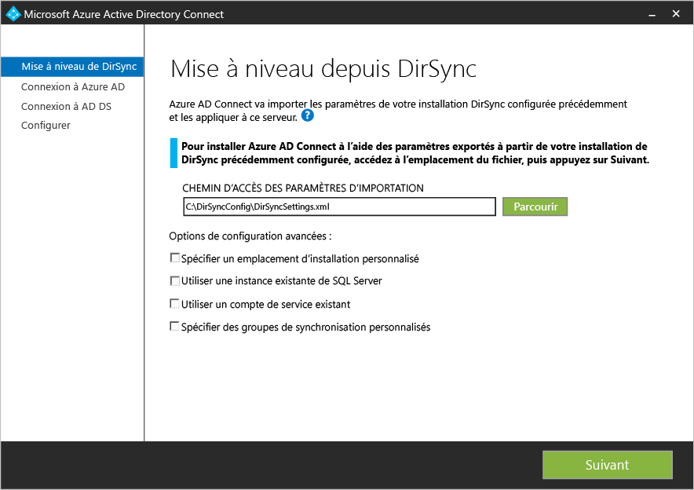
7. Cliquez sur **Next**.
8. Sur la page **Prêt pour la configuration**, laissez la case **Démarrez le processus de synchronisation dès que la configuration est terminée** cochée. Le serveur sera en [mode de préproduction](active-directory-aadconnectsync-operations.md#staging-mode). Les modifications ne seront donc pas exportées vers Azure AD pour l'instant.
9. Cliquez sur **Installer**.

>[AZURE.NOTE]La synchronisation entre Windows Server Active Directory et Azure Active Directory commence mais aucune modification n'est exportée vers Azure AD. Les modifications ne peuvent être exportées activement que par un seul outil de synchronisation à la fois. Il s'agit du [mode de préproduction](active-directory-aadconnectsync-operations.md#staging-mode).

### Vérifiez qu'Azure AD Connect est prêt à commencer la synchronisation

Afin de vérifier qu'Azure AD Connect est prêt à prendre le relais de DirSync, vous devrez ouvrir le gestionnaire **Synchronization Service Manager** dans le groupe **Azure AD Connect** du menu Démarrer.

Dans l'application, vous devez afficher l'onglet **Opérations**. Sous cet onglet, vérifiez que les opérations suivantes ont été effectuées :

- Importation sur le connecteur Active Directory
- Importation sur le connecteur Azure Active Directory
- Synchronisation complète sur le connecteur Active Directory
- Synchronisation complète sur le connecteur Azure Active Directory

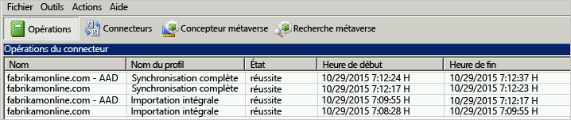

Examinez le résultat de ces opérations et vérifiez qu'il n'y a aucune erreur.

Si vous souhaitez afficher et examiner les modifications qui sont sur le point d'être exportées vers Azure AD, lisez comment vérifier la configuration en [mode de préproduction](active-directory-aadconnectsync-operations.md#staging-mode). Apportez les modifications de la configuration requises jusqu'à ce que tout soit correct.

Une fois ces 4 opérations effectuées, sans erreur, et si vous êtes satisfait des modifications qui doivent être exportées, vous êtes prêt à désinstaller DirSync et à activer la synchronisation d'Azure AD Connect. Effectuez les deux étapes suivantes pour terminer la migration.

### Désinstallation de DirSync (ancien serveur)

- Dans **Programmes et fonctionnalités**, recherchez l'**outil de synchronisation Microsoft Azure Active Directory**
- Désinstallez l'**outil de synchronisation Microsoft Azure Active Directory**
- Notez que la désinstallation peut prendre jusqu'à 15 minutes.

Une fois DirSync désinstallé, aucun serveur actif n'exporte vers Azure AD. L'étape suivante doit être terminée pour que les modifications dans votre Active Directory local continuent à être synchronisées avec Azure AD.

### Activation d'Azure AD Connect (nouveau serveur)
Après l'installation, lorsque vous rouvrez Azure AD Connect, vous aurez la possibilité d'apporter des modifications de la configuration supplémentaires. Démarrez **Azure AD Connect** depuis le menu Démarrer ou à partir du raccourci sur le bureau. Assurez-vous que vous n'essayez pas d'exécuter à nouveau le programme MSI d'installation.

Les éléments suivants doivent s’afficher :

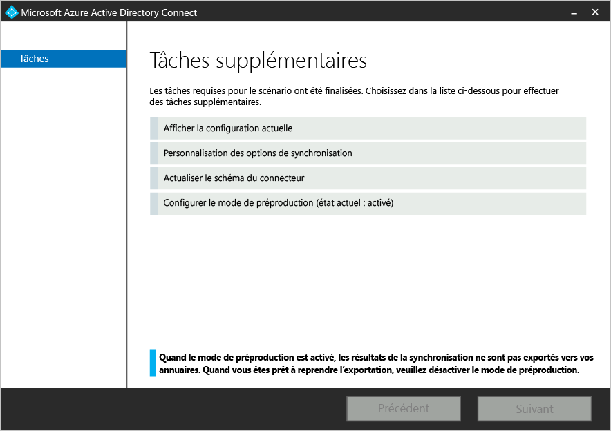

- Sélectionnez **Configuration du mode de préproduction**.
- Désactivez le mode de préproduction en désactivant la case à cocher **Mode de préproduction activé**.

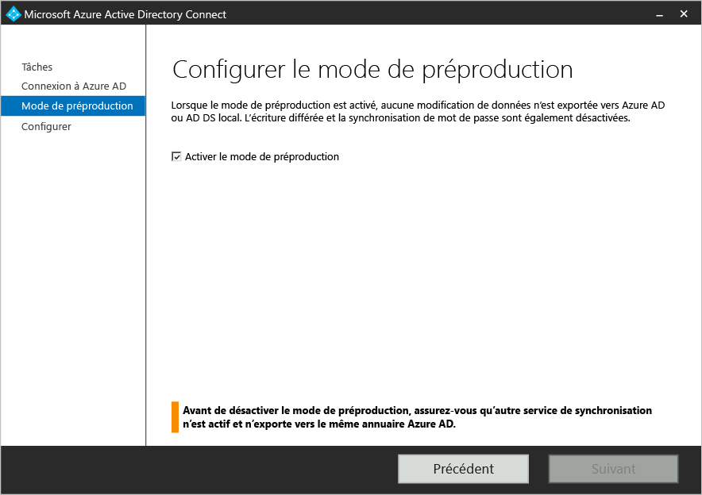

- Cliquez sur le bouton **Suivant**.
- Sur la page Confirmation, cliquez sur le bouton **Installer**.

Azure AD Connect est maintenant votre serveur actif.

## Étapes suivantes
Notez que, lorsqu'Azure AD Connect est installé, vous pouvez [vérifier l'installation et affecter des licences ](active-directory-aadconnect-whats-next.md).

En savoir plus sur l'[intégration de vos identités locales avec Azure Active Directory](active-directory-aadconnect.md).

<!----HONumber=AcomDC_1217_2015-->