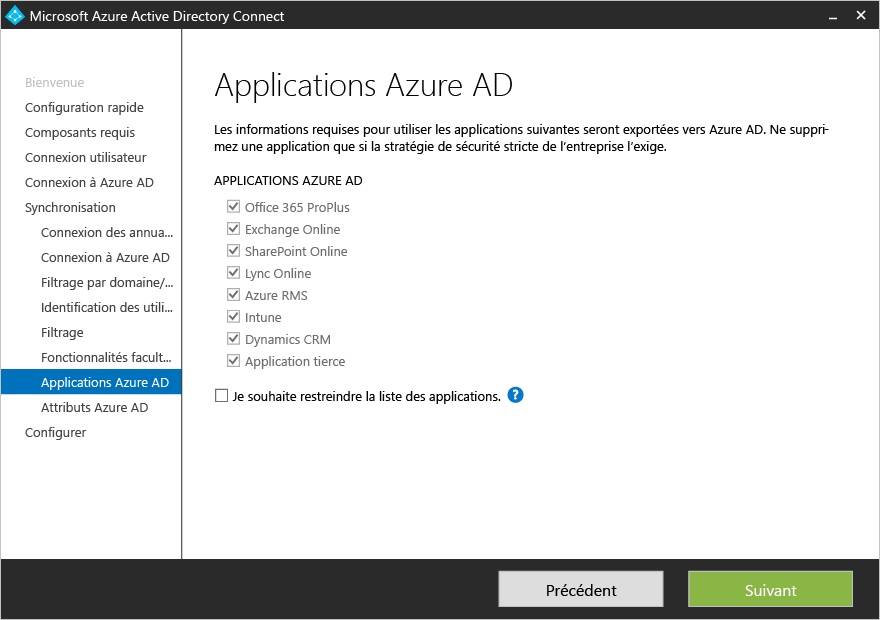
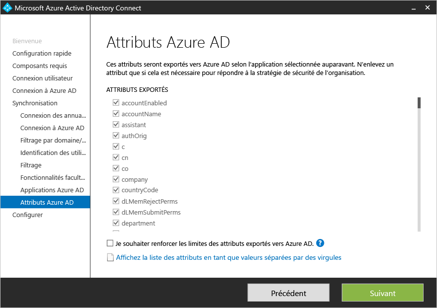

<properties
	pageTitle="Installation personnalisée d’Azure AD Connect | Microsoft Azure"
	description="Ce document présente les options de l’installation personnalisée d’Azure AD Connect."
	services="active-directory"
	documentationCenter=""
	authors="billmath"
	manager="stevenpo"
	editor="curtand"/>

<tags
	ms.service="active-directory"  
	ms.workload="identity"
	ms.tgt_pltfrm="na"
	ms.devlang="na"
	ms.topic="article"
	ms.date="01/08/2016"
	ms.author="billmath;andkjell"/>

# Installation personnalisée d’Azure AD Connect

La documentation suivante explique comment utiliser l’option d’installation personnalisée pour Azure AD Connect. Vous pouvez utiliser cette option si vous avez des options de configuration supplémentaires ou si vous avez besoin de fonctionnalités facultatives qui ne sont pas traitées par l’installation rapide.

## Documentation connexe
Si vous n’avez pas lu la documentation sur l’[Intégration de vos identités locales à Azure Active Directory](active-directory-aadconnect.md), le tableau suivant fournit des liens vers des rubriques connexes. Les trois premières rubriques en gras doivent absolument être lues avant l’installation.

| Rubrique | |
| --------- | --------- |
| **Téléchargez Azure AD Connect** | [Téléchargez Azure AD Connect](http://go.microsoft.com/fwlink/?LinkId=615771) |
| **Matériel et conditions préalables** | [Azure AD Connect : matériel et conditions préalables](active-directory-aadconnect-prerequisites.md) |
| **Comptes utilisés pour l’installation** | [Autorisations et comptes Azure AD Connect](active-directory-aadconnect-accounts-permissions.md) |
| Installation à l’aide de la configuration rapide | [Installation rapide pour Azure AD Connect](active-directory-aadconnect-get-started-express.md) |
| Effectuer une mise à niveau à partir de DirSync | [Effectuer une mise à niveau à partir de l’outil de synchronisation Azure AD (DirSync)](active-directory-aadconnect-dirsync-upgrade-get-started.md) |
| Après l’installation | [Vérifier l’installation et affecter les licences](active-directory-aadconnect-whats-next.md) |

## Installation des composants requis

Lorsque vous installez les services de synchronisation, vous pouvez laisser la section de configuration facultative de côté. Azure AD Connect configurera tout automatiquement. Cela comprend la configuration d’une instance de SQL Server 2012 Express et la création des groupes appropriés, avec attribution des autorisations. Si vous souhaitez modifier les valeurs par défaut, vous pouvez utiliser le tableau ci-dessous pour comprendre les différentes options de configuration facultatives.

| Configuration facultative | Description |
| ------------- | ------------- |
| Utiliser un serveur SQL Server existant | Permet de spécifier le nom du serveur SQL et le nom de l’instance. Choisissez cette option si vous souhaitez utiliser un serveur de base de données existant. Si la navigation n’est pas activée sur votre serveur SQL Server et que vous devez spécifier un numéro de port, dans la zone **Nom de l’instance**, entrez le nom de l’instance suivi d’une virgule et du numéro de port. |
| Utiliser un compte de service existant | Par défaut, Azure AD Connect crée le compte de service local qu’utilisent les services de synchronisation. Le mot de passe est généré automatiquement et n’est pas connu de la personne qui installe Azure AD Connect. Si vous utilisez un serveur SQL distant, vous avez besoin d’un compte de service dans le domaine et devez connaître le mot de passe. Dans ce cas, entrez le compte de service à utiliser. Assurez-vous que l’utilisateur qui exécute l’installation est une association de sécurité dans SQL pour qu’il soit possible de créer une session pour le compte de service. Consultez [Autorisations et comptes Azure AD Connect](active-directory-aadconnect-accounts-permissions.md#custom-settings-installation). |
| Spécifier des groupes de synchronisation personnalisés | Par défaut, Azure AD Connect crée quatre groupes locaux vers le serveur lorsque les services de synchronisation sont installés. Ces groupes sont Administrateurs, Opérateurs, Parcourir et Réinitialisation du mot de passe. Si vous souhaitez spécifier vos propres groupes, vous pouvez le faire ici. Les groupes doivent être locaux sur le serveur et ne peuvent pas être situés dans le domaine. |

## Connexion de l’utilisateur
Après avoir installé les composants requis, vous devez spécifier la méthode d’authentification unique des utilisateurs. Le tableau ci-dessous fournit une brève description des options disponibles. Pour une description complète des méthodes de connexion, consultez [Connexion de l’utilisateur](active-directory-aadconnect-user-signin.md).

Option d’authentification unique | Description
------------- | ------------- |
Synchronisation de mot de passe |Les utilisateurs peuvent se connecter aux services cloud Microsoft tels qu’Office 365, Dynamics CRM et Windows InTune à l’aide du mot de passe utilisé pour se connecter à leurs réseaux locaux. Le mot de passe de l’utilisateur est synchronisé avec Azure par le biais d’un hachage de mot de passe, et l’authentification se produit dans le cloud. Pour plus d’informations, consultez [Synchronisation de mot de passe](active-directory-aadconnectsync-implement-password-synchronization.md).
Fédération avec AD FS|Les utilisateurs peuvent se connecter aux services cloud Microsoft tels qu’Office 365, Dynamics CRM et Windows InTune à l’aide du mot de passe utilisé pour se connecter à leurs réseaux locaux. Ils sont redirigés vers leur instance AD FS locale, car la connexion et l’authentification sont effectuées en local.
Ne pas configurer| Aucune fonctionnalité n’est installée ni configurée. Choisissez cette option si vous disposez déjà d’un serveur de fédération tiers ou d’une autre solution.

## Connexion à Azure AD
Sur l’écran Connexion à Azure AD, entrez un compte et un mot de passe d’administrateur général. Assurez-vous que l’authentification multifacteur n’est pas activée pour ce compte. Sinon, l’authentification va échouer. Ce compte est uniquement destiné à créer un compte de service dans Azure AD et n’est plus utilisé une fois l’Assistant terminé.

## Pages de la section Synchronisation

### Connexion de vos annuaires
Pour vous connecter à votre service de domaine Active Directory, Azure AD Connect a besoin des informations d’identification d’un compte doté d’autorisations suffisantes. Ce compte peut être un compte d’utilisateur normal, car seules des autorisations de lecture par défaut sont nécessaires. Toutefois, selon votre scénario, vous pouvez avoir besoin d’autorisations supplémentaires. Pour plus d’informations, consultez [Autorisations et comptes Azure AD Connect](active-directory-aadconnect-accounts-permissions.md#create-the-ad-ds-account).

### Identification unique de vos utilisateurs

La fonctionnalité Correspondance entre les forêts vous permet de définir la méthode de représentation des utilisateurs de vos forêts AD DS dans Azure AD. Il est possible de représenter seulement une fois chaque utilisateur entre toutes les forêts, ou de présenter une combinaison des comptes activés et désactivés.

Paramètre | Description
------------- | ------------- |
[Mes utilisateurs ne sont représentés qu’une seule fois à travers toutes les forêts](active-directory-aadconnect-topologies.md#multiple-forests-separate-topologies) | Tous les utilisateurs sont créés en tant qu’objets individuels dans Azure AD.  Les objets ne sont pas associés dans le métaverse.
[Attribut de messagerie](active-directory-aadconnect-topologies.md#multiple-forests-full-mesh-with-optional-galsync) | Cette option associe des utilisateurs et des contacts si l’attribut de messagerie a la même valeur dans des forêts différentes. Nous vous recommandons d’utiliser cette option si vos contacts ont été créés avec GALSync.
[ObjectSID et msExchangeMasterAccountSID](active-directory-aadconnect-topologies.md#multiple-forests-account-resource-forest)|Cette option associe un utilisateur activé dans une forêt de comptes à un utilisateur désactivé dans une forêt de ressources Exchange. Elle est également nommée Boîte aux lettres liée dans Exchange. Cette option peut également être utilisée si vous utilisez uniquement Lync et si Exchange n'est pas présent dans la forêt de ressources.
sAMAccountName et MailNickName|Cette option associe des attributs où l’ID de connexion est requis pour rechercher l’utilisateur.
Mon propre attribut|Cette option vous permet de sélectionner votre propre attribut. **Limitation :** assurez-vous de sélectionner un attribut qui existe déjà dans le métaverse. Si vous sélectionnez un attribut personnalisé, l’Assistant va échouer.

- **Point d’ancrage** : l’attribut sourceAnchor ne varie pas pendant la durée de vie d’un objet utilisateur. Il s’agit de la clé primaire liant l’utilisateur local avec l’utilisateur dans Azure AD. Comme l’attribut ne peut pas être modifié, vous devez prévoir l’attribut adéquat à utiliser. Pour cela, nous vous recommandons objectGUID. Cet attribut ne change pas, sauf si le compte de l’utilisateur est déplacé entre les forêts/domaines. Dans un environnement à plusieurs forêts où vous déplacez des comptes entre des forêts, vous devez utiliser un autre attribut, comme un attribut avec l’employeeID. Les attributs à éviter sont ceux susceptibles de changer si une personne se marie ou si son affectation est modifiée. Vous ne pouvez pas utiliser d’attributs avec un signe @, donc les adresses de messagerie et userPrincipalName et ne peuvent pas être utilisées. L’attribut est également sensible à la casse, donc si vous déplacez un objet entre des forêts, veillez à conserver ses minuscules/majuscules. La valeur des attributs binaires est codée en base64, mais pour d’autres types, elle ne sera pas codée. Dans les scénarios de fédération et dans certaines interfaces Azure AD, cet attribut est également appelé immutableID. Vous trouverez plus d’informations sur l’ancre source dans les [principes de conception](active-directory-aadconnect-design-concepts.md#sourceAnchor).

- **UserPrincipalName** : l’attribut userPrincipalName est utilisé par les utilisateurs lorsqu’ils se connectent à Azure AD et Office 365. Les domaines utilisés, également nommés « Suffixe UPN » doivent être vérifiés dans Azure AD avant la synchronisation des utilisateurs. Il est fortement recommandé de conserver l’userPrincipalName de l’attribut par défaut. Si cet attribut ne peut pas être acheminé ni vérifié, vous pouvez sélectionner un autre attribut, par exemple une adresse de messagerie électronique, comme attribut contenant l’ID de connexion. Il s’agit de l’**ID secondaire**. La valeur de l’attribut ID secondaire doit suivre la norme RFC822. Un ID secondaire peut être utilisé avec l’authentification unique par mot de passe et avec l’authentification unique de fédération comme solution de connexion.

>[AZURE.WARNING]L’utilisation d’un ID secondaire n’est pas compatible avec toutes les charges de travail Office 365. Pour plus d’informations, consultez [Configuration d’un ID secondaire de connexion](https://technet.microsoft.com/library/dn659436.aspx).

### Filtrage de synchronisation basé sur les groupes
Le filtrage de la fonctionnalité Groupes vous permet d’exécuter un pilote réduit où seul un petit sous-ensemble d’objets doit être créé dans Azure AD et Office 365. Pour utiliser cette fonctionnalité, créez un groupe dans votre version d’Active Directory, puis ajoutez les utilisateurs et groupes à synchroniser avec Azure AD en tant que membres directs. Vous pouvez ajouter et supprimer ultérieurement des utilisateurs à ce groupe pour tenir à jour la liste des objets présents dans Azure AD. Les objets que vous voulez synchroniser doivent tous être un membre direct du groupe. Celui-ci comprend des utilisateurs, des groupes, des contacts et des ordinateurs/appareils. L’appartenance à des groupes imbriqués n’est pas résolue ; un membre de groupe doit inclure uniquement le groupe lui-même et pas ses membres.

Pour utiliser cette fonctionnalité, le chemin personnalisé comporte cette page : 

>[AZURE.WARNING]Cette fonctionnalité est uniquement destinée à prendre en charge un déploiement pilote et ne doit pas être utilisée dans un déploiement de production véritable.

Dans un véritable déploiement de production, il va être difficile de maintenir un seul groupe avec tous les objets à synchroniser. Vous avez plutôt intérêt à utiliser l’une des méthodes décrites dans [Configurer le filtrage](active-directory-aadconnectsync-configure-filtering.md).

### Fonctionnalités facultatives

Cet écran vous permet de sélectionner des fonctionnalités facultatives pour vos scénarios spécifiques. Voici de brèves explications de chaque fonctionnalité.

> [AZURE.WARNING]Si DirSync ou Azure AD Sync sont actuellement actifs, n’activez aucune des fonctionnalités d’écriture différée dans Azure AD Connect.

Fonctionnalités facultatives | Description
-------------------    | ------------- |
Déploiement Exchange hybride |La fonctionnalité de déploiement Exchange hybride permet la coexistence de boîtes aux lettres Exchange locales et dans Azure grâce à la synchronisation d’un jeu d’[attributs](active-directory-aadconnectsync-attributes-synchronzied.md#exchange-hybrid-writeback) spécifique d’Azure AD Connect dans votre annuaire local.
Application Azure AD et filtrage des attributs|En activant l’application Azure AD et le filtrage des attributs, l’ensemble des attributs synchronisés peut être adapté à un ensemble spécifique dans une page à venir de l’Assistant. Deux pages de configuration supplémentaires s’ouvrent dans l’Assistant.  
Synchronisation du mot de passe | Vous pouvez activer cette option si vous avez sélectionné la fédération comme solution de connexion. La synchronisation de mot de passe peut ensuite servir d’option de sauvegarde. Pour plus d’informations, consultez [Synchronisation de mot de passe](active-directory-aadconnectsync-implement-password-synchronization.md).
Écriture différée du mot de passe|En activant l’écriture différée du mot de passe, les modifications de mot de passe provenant d’Azure AD Connect sont réécrites dans votre annuaire local. Pour plus d’informations, consultez [Prise en main de la gestion de mot de passe](active-directory-passwords-getting-started.md).
Écriture différée de groupe |Si vous utilisez la fonctionnalité **Groupes dans Office 365**, ces groupes peuvent servir de groupes de distribution dans votre annuaire Active Directory local. Cette option n’est disponible que si Exchange est présent dans votre annuaire Active Directory local. Pour plus d’informations, consultez [Écriture différée de groupe](active-directory-aadconnect-feature-preview.md#group-writeback).
Écriture différée des appareils | Permet d’écrire de façon différée des objets d’appareil dans Azure AD, au sein de l’annuaire Active Directory local, dans le cadre de scénarios à accès conditionnel. Pour plus d’informations, consultez [Activation de l’écriture différée d’appareils dans Azure AD Connect](active-directory-aadconnect-get-started-custom-device-writeback.md).
Synchronisation des attributs des extensions d’annuaire|En activant la synchronisation des attributs des extensions d’annuaire, les attributs supplémentaires spécifiés seront synchronisés avec Azure AD. Pour plus d’informations, consultez [Extensions d’annuaire](active-directory-aadconnect-feature-preview.md#directory-extensions).

### Application Azure AD et filtrage des attributs
Si vous souhaitez limiter les attributs à synchroniser avec Azure AD, commencez par sélectionner les services que vous utilisez. Si vous configurez cette page, tout nouveau service doit être activé explicitement en réexécutant l’Assistant d’installation.

Selon les services sélectionnés à l’étape précédente, cette page affiche tous les attributs à synchroniser. Cette liste est une combinaison de tous les types d’objet en cours de synchronisation. Si certains attributs ne doivent pas être synchronisés, vous pouvez les désélectionner. Dans l’image ci-dessous l’attribut homePhone a été désélectionné et ne sera pas synchronisé avec Azure AD.

### Synchronisation des attributs des extensions d’annuaire (version préliminaire)
Les extensions d’annuaire vous permettent d’étendre le schéma dans Azure AD en utilisant des attributs personnalisés ajoutés par votre organisation ou d’autres attributs dans Active Directory. Pour utiliser cette fonctionnalité, sélectionnez « Synchronisation des attributs des extensions d’annuaire » sur la page « Fonctionnalités facultatives ». Vous allez accéder à cette page et sélectionner vos attributs supplémentaires.

Pour plus d’informations, consultez [Extensions d’annuaire](active-directory-aadconnect-feature-preview.md#directory-extensions).

## Configuration de la fédération avec AD FS
La configuration d’AD FS avec Azure AD Connect s’effectue simplement en quelques clics. La configuration suivante est requise avant la configuration.

- Un serveur Windows Server 2012 R2 pour le serveur de fédération avec la gestion distante activée
- Un serveur Windows Server 2012 R2 pour le serveur proxy d’application web avec la gestion distante activée
- Un certificat SSL pour le nom de service de fédération que vous prévoyez d’utiliser (par exemple, adfs.contoso.com)

### Création d’une batterie de serveurs AD FS ou utilisation d’une batterie de serveurs AD FS existante
Vous pouvez utiliser une batterie de serveurs AD FS existante ou en créer une. Si vous choisissez de créer une batterie de serveurs, vous devez fournir le certificat SSL. Si le certificat SSL est protégé par un mot de passe, vous devez fournir le mot de passe.

**Remarque :** si vous choisissez d’utiliser une batterie de serveurs AD FS existante, vous devez passer quelques pages avant d’être dirigé directement vers l’écran de configuration de la relation d’approbation entre AD FS et Azure AD.

### Spécification des serveurs AD FS

Ici, vous devez entrer les serveurs spécifiques sur lesquels vous souhaitez installer AD FS. Vous pouvez ajouter un ou plusieurs serveurs selon vos besoins de planification de capacité. Ces serveurs doivent tous être associés à un domaine Active Directory avant d’effectuer cette configuration. Nous vous recommandons d’installer un seul serveur AD FS pour tester et superviser les déploiements avant de déployer des serveurs supplémentaires en ouvrant Azure AD Connect et en déployant AD FS sur des serveurs supplémentaires pour répondre à vos besoins de mise à l’échelle.

> [AZURE.NOTE]Avant d’effectuer cette configuration, veuillez vérifier que tous les serveurs sont associés à un domaine Active Directory.

### Spécification des serveurs proxy d’application web
Ici, vous devez entrer les serveurs spécifiques que vous souhaitez utiliser en tant que serveurs proxy d’application web. Les serveurs proxy d’application web sont déployés dans votre DMZ (accès extranet) et prennent en charge les demandes d’authentification provenant de l’extranet. Vous pouvez ajouter un ou plusieurs serveurs selon vos besoins de planification de capacité. Nous vous recommandons d’installer un seul serveur proxy d’application web pour tester et superviser les déploiements avant de déployer des serveurs supplémentaires en ouvrant Azure AD Connect et en déployant d’autres serveurs proxy d’application web. Nous recommandons généralement d’avoir un nombre suffisant de serveurs proxy pour répondre aux demandes d’authentification à partir de l'intranet.

> [AZURE.NOTE]- Si le compte que vous utilisez pour installer Azure AD Connect n’est pas un administrateur local sur les serveurs AD FS, vous devez indiquer les informations d’identification d’un compte qui dispose des autorisations suffisantes. - Avant de procéder à cette configuration, vérifiez la connectivité HTTP/HTTPS entre le serveur Azure AD Connect et le serveur proxy d’application web. Assurez-vous également qu’il existe une connectivité HTTP/HTTPS entre le serveur d’applications web et le serveur AD FS pour autoriser les transmissions de demandes d’authentification.

Vous devez vous connecter pour que le serveur d’application web puisse établir une connexion sécurisée vers le serveur AD FS. Cette connexion doit utiliser des informations d’identification de compte d’administrateur local sur le serveur AD FS.

### Spécification du compte de service pour le service AD FS
Le service AD FS requiert un compte de service de domaine pour authentifier les utilisateurs et rechercher les informations utilisateur dans Active Directory. Il prend en charge 2 types de compte de service :

- **Comptes de service gérés de groupe** : il s’agit d’un type de compte de service introduit dans le service de domaine Active Directory avec Windows Server 2012. Ce type de compte fournit des services tels qu’AD FS pour utiliser un seul compte sans avoir à mettre à jour son mot de passe régulièrement. Utilisez cette option si vous avez déjà des contrôleurs de domaine Windows Server 2012 dans le domaine auquel appartiennent vos serveurs AD FS.
- **Compte d’utilisateur de domaine** : ce type de compte requiert un mot de passe et des mises à jour régulières, à chaque modification du mot de passe. Utilisez cette option si vous n’avez pas de contrôleur de domaine Windows Server 2012 dans le domaine auquel appartiennent vos serveurs AD FS.

Azure AD Connect crée automatiquement le compte de service géré par un groupe si vous vous connectez en tant qu’administrateur de domaine.

### Sélection du domaine Azure AD à fédérer
Cette opération permet de configurer la relation de fédération entre AD FS et Azure AD. Il s’agit de configurer AD FS pour émettre des jetons de sécurité pour Azure AD et de configurer Azure AD pour approuver les jetons de cette instance d’AD FS spécifique. Dans un premier temps, cette page vous permet de configurer un seul domaine. Par la suite, vous pouvez configurer des domaines supplémentaires à tout moment en rouvrant Azure AD Connect.

### Tâches supplémentaires pour terminer la configuration de la fédération
Les tâches supplémentaires suivantes sont requises pour terminer la configuration de la fédération.

- Configurez les enregistrements DNS pour le nom de service de fédération AD FS (par exemple, adfs.contoso.com) pour l’intranet (votre serveur DNS interne) et l’extranet (le DNS public via votre bureau d’enregistrement de domaines). Pour l’enregistrement DNS intranet, vérifiez que vous utilisez des enregistrements A et non des enregistrements CNAME. Ceci est requis pour le bon fonctionnement de l’authentification Windows à partir de l’ordinateur associé à votre domaine.
- Si vous déployez plusieurs serveurs AD FS ou serveurs proxy d’application web, vérifiez que vous avez configuré votre équilibreur de charge et que les enregistrements DNS pour le nom de service de fédération AD FS (par ex. adfs.contoso.com) pointent vers l’équilibreur de charge.
- Pour que l’authentification Windows intégrée fonctionne avec les applications de navigateur utilisant Internet Explorer dans votre intranet, vérifiez que le nom de service de fédération AD FS (par exemple, adfs.contoso.com) est ajouté à la zone Intranet dans Internet Explorer. Vous pouvez vérifier cela par le biais de la stratégie de groupe, puis procéder au déploiement vers tous les ordinateurs associés à votre domaine.

### Configuration facultative de votre service AD FS
Vous pouvez personnaliser l’illustration et l’image de logo de vos pages de connexion AD FS en vous connectant à AD FS, puis en utilisant PSH pour effectuer cette configuration.

	Set-AdfsWebTheme -TargetName default -Logo @{path="c:\Contoso\logo.png"} –Illustration @{path=”c:\Contoso\illustration.png”}

## Pages de configuration et de vérification
C’est dans cette page que la configuration a réellement lieu.

### Mode intermédiaire
Le mode intermédiaire permet de configurer un nouveau serveur de synchronisation parallèlement à un serveur existant. Le système prend en charge une seule connexion directe de serveur de synchronisation à un seul annuaire dans le cloud. Mais si vous voulez procéder à un déplacement à partir d’un autre serveur (par exemple, un serveur exécutant DirSync), vous pouvez activer Azure AD Connect en mode intermédiaire. Une fois activé, le moteur de synchronisation importe et synchronise les données comme d’habitude, mais il n’exporte rien vers Azure AD tout en désactivant à la fois la synchronisation et l’écriture différée du mot de passe.

En mode intermédiaire, vous pouvez modifier le moteur de synchronisation selon vos besoins et examiner ce qui doit être exporté. Lorsque la configuration vous convient, réexécutez l’Assistant Installation et désactivez le mode intermédiaire. Cela permet l’exportation de données vers Azure AD. Veillez à désactiver l’autre serveur en même temps, pour qu’un seul serveur puisse exporter de manière active.

 Pour plus d’informations, consultez [Mode intermédiaire](active-directory-aadconnectsync-operations.md#staging-mode).

### Vérification de votre configuration de fédération

Lorsque vous cliquez sur le bouton Vérifier, Azure AD Connect vérifie la configuration DNS pour vous.

Veuillez également vérifier les points suivants :

- Validez la connexion du navigateur à partir d’un ordinateur associé à votre domaine à partir d’Internet Explorer vers l’intranet : connectez-vous à https://myapps.microsoft.com et vérifiez la connexion avec votre compte connecté.
- Validez la connexion du navigateur à partir de n’importe quel appareil à partir de l’extranet : sur un ordinateur personnel ou un appareil mobile, connectez-vous à https://myapps.microsoft.com et entrez votre ID de connexion et votre mot de passe.
- Validez la connexion à un client complet : connectez-vous à https://testconnectivity.microsoft.com, sélectionnez l’onglet « Office 365 », puis « Test d’authentification unique dans Office 365 ».

## Étapes suivantes
Une fois l’installation terminée, déconnectez-vous puis reconnectez-vous à Windows avant d’utiliser le gestionnaire Synchronization Service Manager ou l’éditeur de règles de synchronisation.

Azure AD Connect étant installé, vous pouvez passer à [Vérification de l’installation et affectation des licences](active-directory-aadconnect-whats-next.md).

En savoir plus sur l’[intégration de vos identités locales dans Azure Active Directory](active-directory-aadconnect.md).

<!---HONumber=AcomDC_0114_2016-->