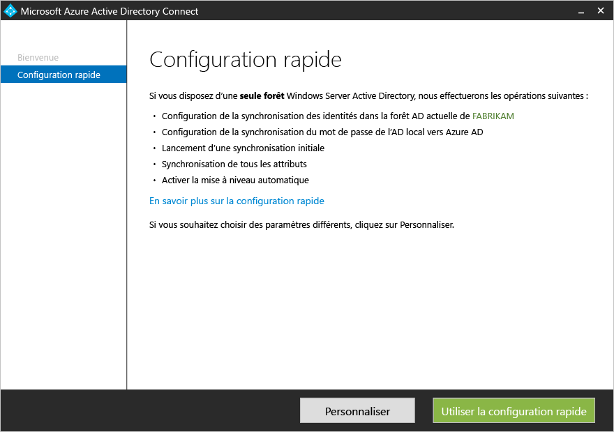
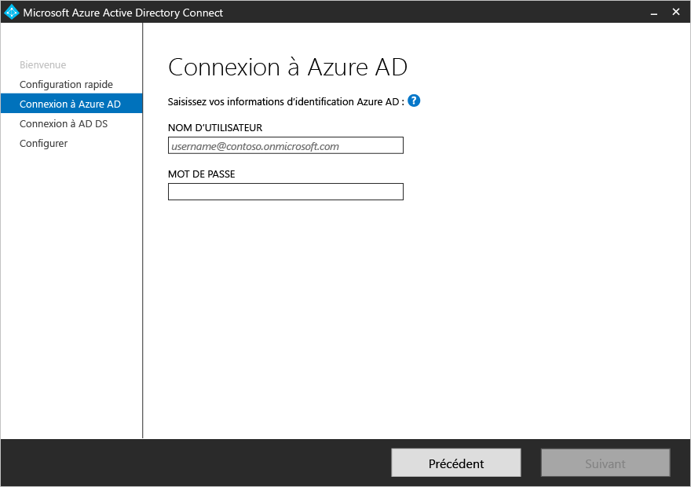
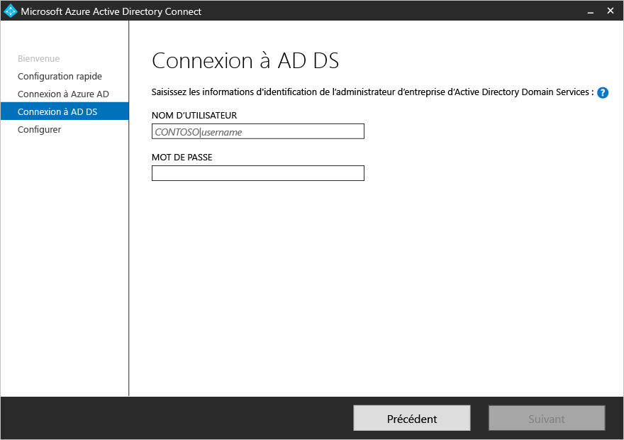
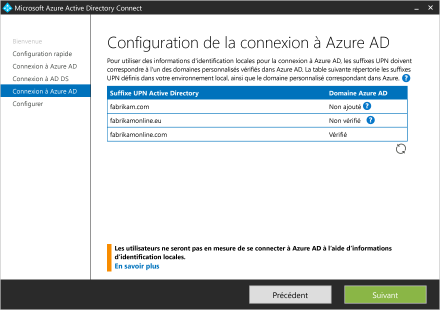
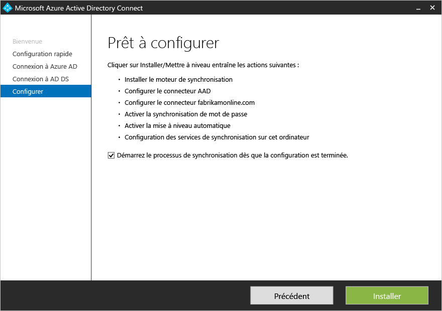

<properties
	pageTitle="Azure AD Connect : Prise en main à l’aide de paramètres express | Microsoft Azure"
	description="Découvrez comment télécharger, installer et exécuter l’Assistant d’installation d’Azure AD Connect."
	services="active-directory"
	documentationCenter=""
	authors="andkjell"
	manager="stevenpo"
	editor="curtand"/>

<tags
	ms.service="active-directory"
	ms.workload="identity"
	ms.tgt_pltfrm="na"
	ms.devlang="na"
	ms.topic="get-started-article"
	ms.date="06/27/2016"
	ms.author="billmath;andkjell"/>

# Prise en main d’Azure AD Connect à l’aide de paramètres express
La **configuration rapide** d’Azure AD Connect est utilisée lorsque vous disposez d’une topologie à une forêt unique et la [synchronisation de mot de passe](active-directory-aadconnectsync-implement-password-synchronization.md) est utilisée pour l’authentification. La **configuration rapide** est l’option par défaut et s’applique à la plupart des scénarios de déploiement. L’extension de votre répertoire local dans le cloud n’est plus qu’à quelques clics.

Avant de commencer l’installation d’Azure AD Connect, veillez à [télécharger Azure AD Connect](http://go.microsoft.com/fwlink/?LinkId=615771) et effectuer les étapes préalables décrites dans [Azure AD Connect : matériel et conditions préalables](active-directory-aadconnect-prerequisites.md).

Si la configuration rapide ne correspond pas à votre topologie, consultez la [documentation connexe](#related-documentation) pour d’autres scénarios.

## Installation rapide pour Azure AD Connect
Vous pouvez voir ces étapes en action dans la section [vidéos](#videos).

1. Connectez-vous en tant qu’administrateur local au serveur sur lequel vous souhaitez installer Azure AD Connect. Il doit s’agir du serveur que vous choisissez comme serveur de synchronisation.
2. Accédez à **AzureADConnect.msi** et double-cliquez sur ce fichier.
3. Sur l'écran d’accueil, sélectionnez la case pour accepter les termes du contrat de licence et cliquez sur **Continuer**.
4. Sur l'écran Paramètres Express, cliquez sur **Utiliser les paramètres Express**. 
5. Sur l’écran Connexion à Azure AD, entrez le nom d’utilisateur et un mot de passe d’administrateur général pour votre instance Azure AD. Cliquez sur **Next**.  Si vous recevez une erreur et que vous avez des problèmes de connectivité, consultez l’article [Résoudre les problèmes de connectivité](active-directory-aadconnect-troubleshoot-connectivity.md).
6. Sur l’écran Connexion à AD DS, entrez le nom d’utilisateur et le mot de passe d’un compte d’administrateur d’entreprise. Vous pouvez saisir la partie domaine au format NetBios ou nom de domaine complet, c’est-à-dire FABRIKAM\\administrator ou fabrikam.com\\administrator. Cliquez sur **Suivant**. 
7. La page [**Configuration de connexion Azure AD**](active-directory-aadconnect-user-signin.md#azure-ad-sign-in-configuration) s’affiche uniquement si vous n’avez pas effectué l’étape de [vérification de vos noms de domaines](active-directory-add-domain.md) dans les [conditions préalables](active-directory-aadconnect-prerequisites.md).  Si vous voyez cette page, passez en revue chaque domaine marqué **Non ajouté** et **Non vérifié**. Assurez-vous que ceux que vous utilisez ont été vérifiés dans Azure AD. Cliquez sur le symbole d’actualisation dès que vous avez vérifié vos domaines.
8. Sur l’écran Prêt à configurer, cliquez sur **Installer**.
	- Dans la page Prêt à configurer, vous pouvez éventuellement décocher la case **Démarrer le processus de synchronisation dès que la configuration est terminée**. Vous devez décocher cette case si vous souhaitez effectuer une configuration supplémentaire, tel que le [filtrage](active-directory-aadconnectsync-configure-filtering.md). Si vous désélectionnez cette option, l’Assistant configure la synchronisation, mais laisse le planificateur désactivé. Il ne sera pas exécuté jusqu’à ce que vous l’activiez manuellement en [exécutant de nouveau l’Assistant d’installation](active-directory-aadconnectsync-installation-wizard.md).
	- Si Exchange est présent dans votre répertoire Active Directory local, vous avez également la possibilité d’activer le [**déploiement Exchange hybride**](https://technet.microsoft.com/library/jj200581.aspx). Activez cette option si vous envisagez de disposer simultanément de boîtes aux lettres Exchange dans le cloud et en local. 
9. Une fois l’installation terminée, cliquez sur **Quitter**.
10. Une fois l’installation terminée, déconnectez-vous puis reconnectez-vous à Windows avant d’utiliser le gestionnaire Synchronization Service Manager ou l’éditeur de règles de synchronisation.

## Vidéos

Pour une vidéo sur l’utilisation de l’installation rapide, voir :

>[AZURE.VIDEO azure-active-directory-connect-express-settings]

## Étapes suivantes
Azure AD Connect étant installé, vous pouvez passer à [Vérification de l’installation et affectation des licences](active-directory-aadconnect-whats-next.md).

Pour en savoir plus sur ces fonctionnalités, activées lors de l’installation, consultez les pages [Azure AD Connect : Mise à niveau automatique](active-directory-aadconnect-feature-automatic-upgrade.md), [Azure AD Connect Sync : Prévention des suppressions accidentelles](active-directory-aadconnectsync-feature-prevent-accidental-deletes.md) et [Utilisation d’Azure AD Connect Health pour la synchronisation](active-directory-aadconnect-health-sync.md).

Pour en savoir plus sur ces sujets courants, consultez l’article [Planificateur Azure AD Connect Sync](active-directory-aadconnectsync-feature-scheduler.md).

En savoir plus sur l’[intégration de vos identités locales à Azure Active Directory](active-directory-aadconnect.md).

## Documentation connexe

Rubrique |  
--------- | ---------
Présentation d’Azure AD Connect | [Intégration de vos identités locales avec Azure Active Directory](active-directory-aadconnect.md)
Installation à l’aide des paramètres personnalisés | [Installation personnalisée d’Azure AD Connect](active-directory-aadconnect-get-started-custom.md)
Effectuer une mise à niveau à partir de DirSync | [Effectuer une mise à niveau à partir de l’outil de synchronisation Azure AD (DirSync)](active-directory-aadconnect-dirsync-upgrade-get-started.md)
Comptes utilisés pour l’installation | [Informations supplémentaires sur les autorisations et les comptes Azure AD Connect](active-directory-aadconnect-accounts-permissions.md)

<!----HONumber=AcomDC_0629_2016-->