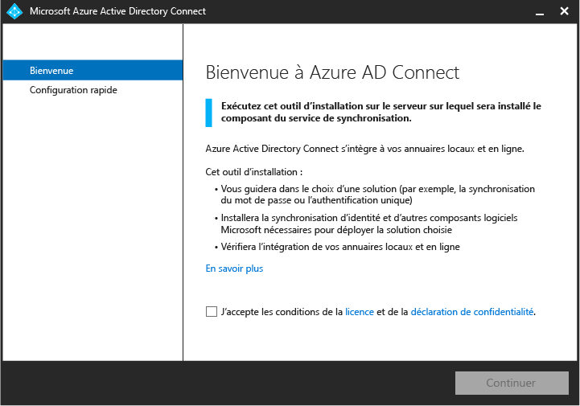

<properties
	pageTitle="Azure AD Connect : Prise en main à l’aide de paramètres express | Microsoft Azure"
	description="Découvrez comment télécharger, installer et exécuter l’Assistant d’installation d’Azure AD Connect."
	services="active-directory"
	documentationCenter=""
	authors="billmath"
	manager="stevenpo"
	editor="curtand"/>

<tags
	ms.service="active-directory"
	ms.workload="identity"
	ms.tgt_pltfrm="na"
	ms.devlang="na"
	ms.topic="get-started-article"
	ms.date="05/19/2016"
	ms.author="billmath;andkjell"/>

# Prise en main d’Azure AD Connect à l’aide de paramètres express
Cette rubrique permet de vous familiariser avec Azure Active Directory Connect. Cette documentation traite de l’installation rapide d’Azure AD Connect. La configuration rapide est utilisée dans une topologie de forêt unique avec synchronisation de mot de passe. L’extension de votre répertoire local dans le cloud n’est plus qu’à quelques clics.

## Documentation connexe
Si vous n’avez pas lu la documentation sur l’[intégration de vos identités locales à Azure Active Directory](active-directory-aadconnect.md), le tableau suivant fournit des liens vers des rubriques connexes. Les deux premières rubriques en gras doivent absolument être lues avant l'installation.

Rubrique |  
--------- | ---------
**Téléchargez Azure AD Connect** | [Téléchargez Azure AD Connect](http://go.microsoft.com/fwlink/?LinkId=615771)
**Matériel et conditions préalables** | [Azure AD Connect : matériel et conditions préalables](active-directory-aadconnect-prerequisites.md)
Installation à l’aide des paramètres personnalisés | [Installation personnalisée d’Azure AD Connect](active-directory-aadconnect-get-started-custom.md)
Effectuer une mise à niveau à partir de DirSync | [Effectuer une mise à niveau à partir de l’outil de synchronisation Azure AD (DirSync)](active-directory-aadconnect-dirsync-upgrade-get-started.md)
Après l’installation | [Vérification de l’installation et affectation des licences ](active-directory-aadconnect-whats-next.md)
Comptes utilisés pour l’installation | [Informations supplémentaires sur les autorisations et les comptes Azure AD Connect](active-directory-aadconnect-accounts-permissions.md)

## Installation rapide pour Azure AD Connect
La **configuration rapide ** est l’option par défaut et s’applique à la plupart des scénarios de déploiement. Lorsque vous utilisez la configuration rapide, Azure AD Connect déploie la synchronisation pour une topologie de forêt unique. La [synchronisation de mot de passe](active-directory-aadconnectsync-implement-password-synchronization.md) est activée et permet aux utilisateurs d’utiliser leur mot de passe local pour se connecter au cloud. La [mise à niveau automatique](active-directory-aadconnect-feature-automatic-upgrade.md) est activée, ce qui facilite vos tâches de maintenance. L’utilisation de la configuration rapide lancera automatiquement une synchronisation une fois l’installation terminée (mais vous pouvez également choisir de ne pas le faire).

### Pour installer Azure AD Connect à l'aide de paramètres Express

1. Connectez-vous en tant qu’administrateur local au serveur sur lequel vous souhaitez installer Azure AD Connect. Il doit s’agir du serveur que vous choisissez comme serveur de synchronisation.
2. Accédez à **AzureADConnect.msi** et double-cliquez sur ce fichier.
3. Sur l’écran d’accueil, sélectionnez la case pour accepter les termes du contrat de licence et cliquez sur **Continuer**. 
4. Sur l'écran Paramètres Express, cliquez sur **Utiliser les paramètres Express**. 
5. Sur l’écran Connexion à Azure AD, entrez le nom d’utilisateur et un mot de passe d’administrateur général pour votre instance Azure AD. Cliquez sur **Next**.  Si vous recevez une erreur et que vous avez des problèmes de connectivité, consultez l’article [Résoudre les problèmes de connectivité](active-directory-aadconnect-troubleshoot-connectivity.md).
6. Sur l’écran Connexion à AD DS, entrez le nom d’utilisateur et le mot de passe d’un compte d’administrateur d’entreprise. Vous pouvez saisir la partie domaine au format NetBios ou nom de domaine complet, c’est-à-dire FABRIKAM\\administrator ou fabrikam.com\\administrator. Cliquez sur **Suivant**. 
7. Si des domaines UPN inscrits dans Active Directory local sont absents ou non vérifiés, cette page s’affiche. Si tous les domaines UPN de vos services de domaines AD locaux ont été vérifiés, cette page n’apparaît pas.  Si vous voyez cette page, passez en revue chaque domaine marqué **Non ajouté** et **Non vérifié**. Assurez-vous que ceux que vous utilisez ont été vérifiés dans Azure AD. Cliquez sur le symbole d’actualisation dès que vous avez vérifié vos domaines. Pour plus d’informations, consultez [Ajouter et vérifier le domaine](active-directory-add-domain.md)
8. Sur l’écran Prêt à configurer, cliquez sur **Installer**.
	- Dans la page Prêt à configurer, vous pouvez éventuellement décocher la case **Démarrer le processus de synchronisation dès que la configuration est terminée**. Vous devez décocher cette case si vous souhaitez effectuer une configuration supplémentaire, tel que le [filtrage](active-directory-aadconnectsync-configure-filtering.md). Si vous désélectionnez cette option, l’Assistant configure la synchronisation, mais laisse le planificateur désactivé. Il ne sera pas exécuté jusqu’à ce que vous l’activiez manuellement en exécutant de nouveau l’Assistant d’installation.
	- Éventuellement, vous pouvez également choisir de configurer les services de synchronisation pour le **déploiement hybride Exchange** en cochant la case correspondante. Activez cette option si vous envisagez de disposer simultanément de boîtes aux lettres Exchange dans le cloud et en local. 
9. Une fois l’installation terminée, cliquez sur **Quitter**.
10. Une fois l’installation terminée, déconnectez-vous puis reconnectez-vous à Windows avant d’utiliser le gestionnaire Synchronization Service Manager ou l’éditeur de règles de synchronisation.

Pour une vidéo sur l’utilisation de l’installation rapide, voir :

>[AZURE.VIDEO azure-active-directory-connect-express-settings]

## Étapes suivantes
Notez que lorsque vous avez Azure AD Connect installé, vous pouvez [vérifier l'installation et affecter des licences ](active-directory-aadconnect-whats-next.md).

En savoir plus sur l’[intégration de vos identités locales à Azure Active Directory](active-directory-aadconnect.md).

<!---HONumber=AcomDC_0525_2016-->