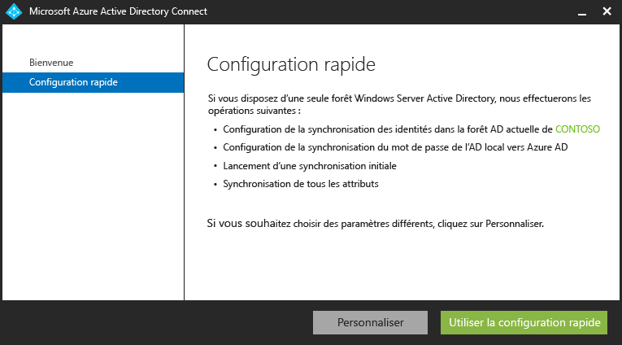
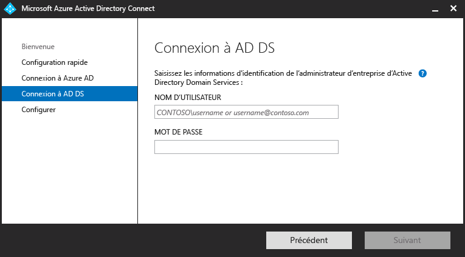
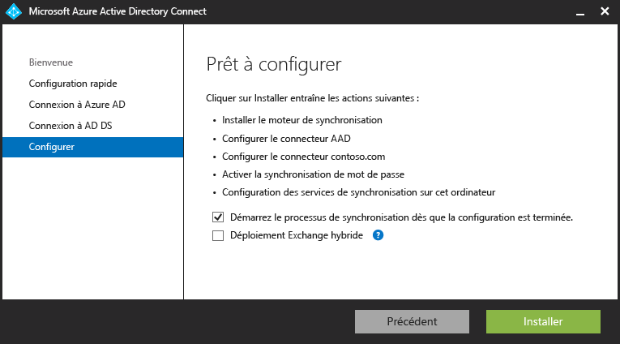
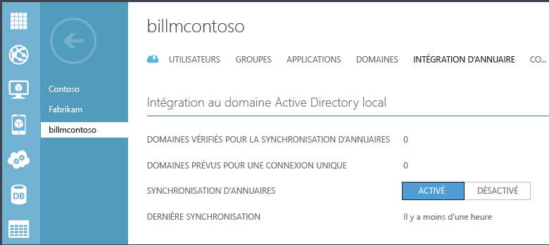

<properties 
	pageTitle="Prise en main d’Azure AD Connect" 
	description="Découvrez comment télécharger, installer et exécuter l’Assistant d’installation d’Azure AD Connect." 
	services="active-directory" 
	documentationCenter="" 
	authors="billmath" 
	manager="swadhwa" 
	editor="curtand"/>

<tags 
	ms.service="active-directory" 
	ms.workload="identity" 
	ms.tgt_pltfrm="na" 
	ms.devlang="na" 
	ms.topic="article" 
	ms.date="05/28/2015" 
	ms.author="billmath"/>

# Prise en main d’Azure AD Connect

<a href="../active-directory-aadconnect/" title="Présentation">Présentation</a> <a href="../active-directory-aadconnect-how-it-works/" title="Fonctionnement">Fonctionnement</a> <a href="../active-directory-aadconnect-get-started/" title="Prise en main" class="current">Prise en main</a> <a href="../active-directory-aadconnect-whats-next/" title="Étapes suivantes">Étapes suivantes</a> <a href="../active-directory-aadconnect-learn-more/" title="En savoir plus">En savoir plus</a>

La documentation suivante vous aide à faire vos premiers pas avec Azure Active Directory Connect. Cette documentation traite de l’installation rapide d’Azure AD Connect. Pour plus d'informations sur une installation personnalisée, consultez [Installation personnalisée pour Azure AD Connect](active-directory-aadconnect-get-started-custom.md). Pour plus d’informations sur la mise à niveau depuis DirSync vers Azure AD Connect, consultez [Mise à niveau de DirSync pour Azure Active Directory Connect.](active-directory-aadconnect-dirsync-upgrade-get-started.md)

## Téléchargez Azure AD Connect

Pour commencer à utiliser Azure AD Connect, vous pouvez télécharger la dernière version à l’adresse suivante : [Télécharger Azure AD Connect](http://go.microsoft.com/fwlink/?LinkID=615771)

## Avant d’installer Azure AD Connect
Avant d’installer Azure AD Connect avec les paramètres Express, voici ce dont vous aurez besoin.

 
- Un abonnement Azure ou un [abonnement d'essai Azure](http://azure.microsoft.com/pricing/free-trial/). Cette condition est nécessaire uniquement pour accéder au portail Azure mais pas pour l'utilisation d’Azure AD Connect. Si vous utilisez PowerShell ou Office 365, vous n’avez pas besoin d’un abonnement Azure pour utiliser Azure AD Connect.
- Le compte d’administrateur global Azure AD du locataire Azure AD que vous souhaitez intégrer
- Un contrôleur de domaine ou un serveur membre AD avec Windows Server 2008 ou version ultérieure
- Un compte d’administrateur d’entreprise pour votre Active Directory local
- Facultatif : un compte d’utilisateur test pour vérifier la synchronisation. 

### Configuration matérielle requise pour Azure AD Connect
Le tableau ci-dessous présente la configuration minimale requise pour l’ordinateur Azure AD Connect.

| Nombre d’objets dans Active Directory | UC | Mémoire | Taille du disque dur |
| ------------------------------------- | --- | ------ | --------------- |
| Moins de 10 000 | 1,6 GHz | 4 Go | 70 Go |
| Entre 10 000 et 50 000 | 1,6 GHz | 4 Go | 70 Go |
| Entre 50 000 et 100 000 | 1,6 GHz | 16 Go | 100 Go |
| Dans les systèmes comportant 100 000 objets ou plus, la version complète de SQL Server est requise.| | | |
| Entre 100 000 et 300 000 | 1,6 GHz | 32 Go | 300 Go |
| Entre 300 000 et 600 000 | 1,6 GHz | 32 Go | 450 Go |
| Plus de 600 000 | 1,6 GHz | 32 Go | 500 Go |

Pour les options personnalisées telles que les forêts multiples ou des authentifications fédérées, découvrez les conditions requises supplémentaires [ici.](active-directory-aadconnect-get-started-custom.md)

## Installation rapide pour Azure AD Connect
La sélection des paramètres Express est l’option par défaut et s’applique à la plupart des scénarios. Ce faisant, Azure AD Connect déploie la synchronisation avec l’option de synchronisation du hachage de mot de passe. Cela concerne une seule forêt et permet aux utilisateurs d’utiliser leur mot de passe local pour se connecter au cloud. L’utilisation des paramètres Express lancera automatiquement une synchronisation une fois l’installation terminée (mais vous pouvez également choisir de ne pas le faire). Avec cette option, l’extension de votre répertoire local dans le cloud n’est plus qu’à quelques clics.

### Pour installer Azure AD Connect à l'aide de paramètres Express
--------------------------------------------------------------------------------------------

1. Connectez-vous en tant qu’administrateur d’entreprise au serveur sur lequel vous souhaitez installer Azure AD Connect. Il doit s'agir du serveur que vous choisissez comme serveur de synchronisation.
2. Accédez à AzureADConnect.msi et double-cliquez sur ce fichier.
3. Sur l'écran d’accueil, sélectionnez la case pour accepter les termes du contrat de licence et cliquez sur **Continuer**.
4. Sur l'écran Paramètres Express, cliquez sur **Utiliser les paramètres Express**.

6. Sur l’écran la connexion à l'écran d'Azure AD, entrez le nom d'utilisateur et un mot de passe d'administrateur global Azure pour votre instance Azure AD. Cliquez sur **Next**.
8. Sur l’écran Connexion à AD DS, entrez le nom d'utilisateur et le mot de passe d’un compte d'administrateur d’entreprise. Cliquez sur **Next**.

9. Sur l’écran Prêt à configurer, cliquez sur **Installer**.
	- Sur la page Prêt à configurer, vous pouvez éventuellement la case à cocher « **Démarrer le processus de synchronisation dès que la configuration est terminée** ». Si vous faites cela, l'assistant configurera la synchronisation, mais laissera la tâche désactivée afin qu'elle ne s’exécute pas avant que vous ne l'activiez manuellement dans le Planificateur de tâches. Une fois que la tâche est activée, la synchronisation s'exécute toutes les trois heures.
	- Éventuellement, vous pouvez également choisir de configurer les services de synchronisation pour le **déploiement hybride Exchange** en cochant la case à cocher correspondante. Si vous n'envisagez pas d'avoir des boîtes aux lettres Exchange dans le cloud et en local, vous n’avez pas besoin de cela.

8. Une fois l'installation terminée, cliquez sur **Quitter**.

   

Suivez ce lien pour une vidéo sur l’utilisation de l'installation rapide :

[AZURE.VIDEO azure-active-directory-connect-express-settings]

## Vérification de l’installation

Une fois que vous avez correctement installé Azure AD Connect vous pouvez vérifier que la synchronisation s’effectue en vous connectant au portail Azure et vérifiant l’heure de la dernière synchronisation.

1.  Connectez-vous au portail Azure.
2.  Sélectionnez Active Directory à gauche.
3.  Double-cliquez sur le répertoire que vous venez d'utiliser pour configurer Azure AD Connect.
4.  En haut, sélectionnez l'intégration de répertoires. Notez l’heure de la dernière synchronisation.

## Que faire ensuite ?
Maintenant que vous avez Azure AD Connect installé, vous pouvez utiliser le lien [ici](active-directory-aadconnect-whats-next.md) pour commencer avec les tâches suivant l'installation telles que l'attribution des licences Azure AD Premium ou Enterprise Mobility à vos utilisateurs ou la configuration d’options supplémentaires.

**Ressources supplémentaires**

[Comparaison des outils d’intégration de répertoire](active-directory-aadconnect-get-started-tools-comparison.md)

 

<!---HONumber=July15_HO4-->