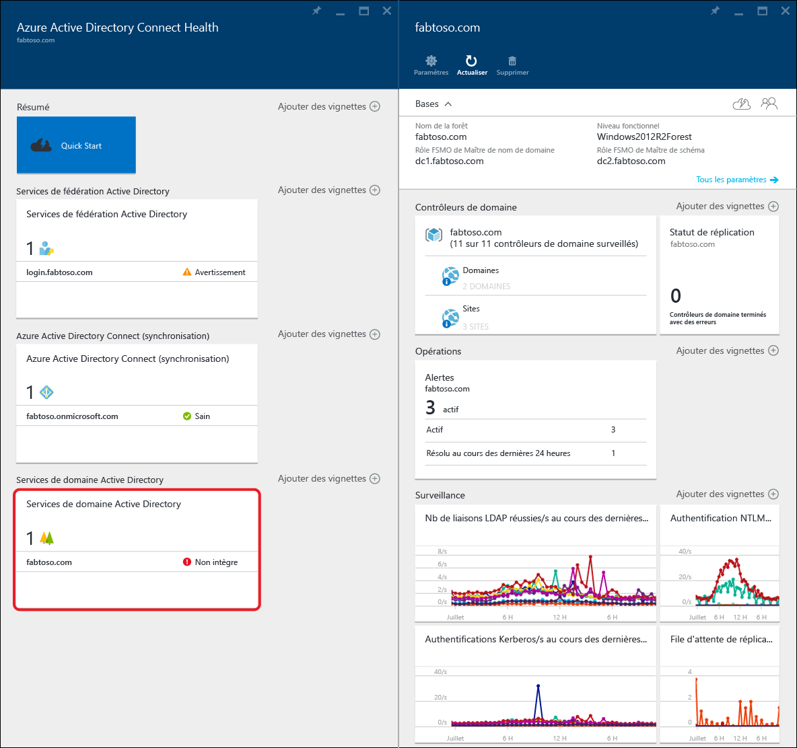
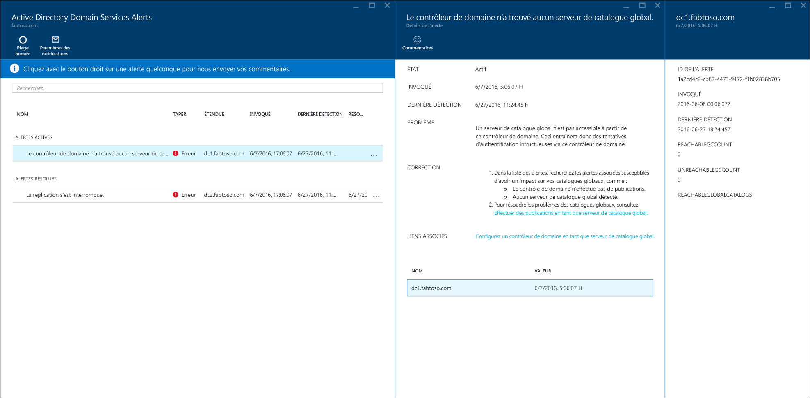
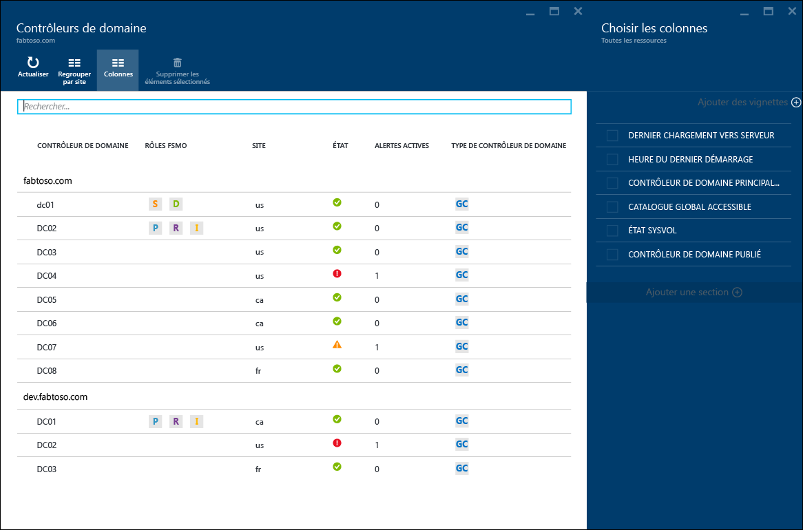
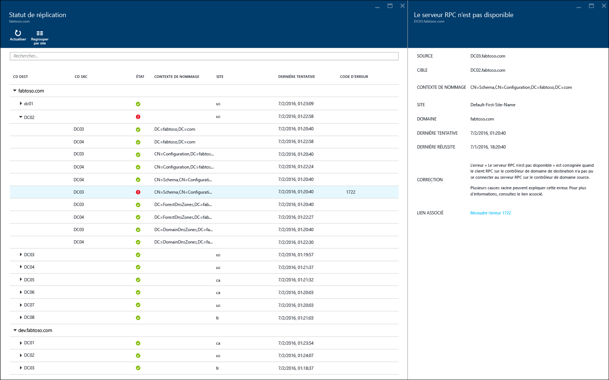
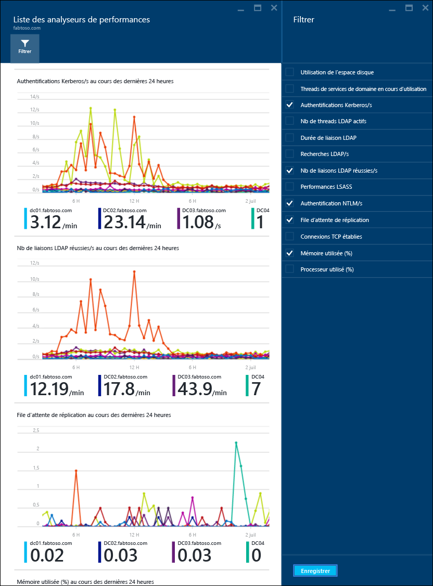

<properties
	pageTitle="Utilisation d’Azure AD Connect Health avec AD DS | Microsoft Azure"
	description="Cette page dédiée à Azure AD Connect Health explique comment surveiller AD DS."
	services="active-directory"
	documentationCenter=""
	authors="arluca"
	manager="samueld"
	editor="curtand"/>

<tags
	ms.service="active-directory"
	ms.workload="identity"
	ms.tgt_pltfrm="na"
	ms.devlang="na"
	ms.topic="get-started-article"
	ms.date="07/14/2016"
	ms.author="arluca"/>

# Utilisation d’Azure AD Connect Health avec AD DS
La documentation suivante s’applique à la surveillance des services de domaine Active Directory avec Azure AD Connect Health. Cela inclut AD DS installé sur Windows Server 2008 R2, Windows Server 2012 et Windows Server 2012 R2.

Pour plus d’informations sur la surveillance AD FS avec Azure AD Connect Health, consultez [Utilisation d’Azure AD Connect Health avec AD FS](active-directory-aadconnect-health-adfs.md). En outre, pour plus d’informations sur la surveillance de la synchronisation Azure AD Connect avec Azure AD Connect Health, consultez [Utilisation d’Azure AD Connect Health pour la synchronisation](active-directory-aadconnect-health-sync.md).

## Alertes d’Azure AD Connect Health pour AD DS
La section Alertes dans Azure AD Connect Health pour AD DS vous propose une liste d’alertes actives et résolues, liées à vos contrôleurs de domaine. Si vous sélectionnez une alerte active ou résolue, un nouveau panneau contenant des informations supplémentaires, ainsi que les étapes de résolution et des liens vers la documentation de support s’ouvre. Chaque type d’alerte peut avoir une ou plusieurs instances, qui correspondent à chacun des contrôleurs de domaine affectés par cette alerte. Au bas du panneau d’alerte, vous pouvez sélectionner un contrôleur de domaine affecté. Un nouveau panneau contenant des informations supplémentaires sur cette instance d’alerte spécifique s’ouvre alors.

L’activation des notifications par courrier électronique pour les alertes est possible dans ce panneau, ainsi que la modification de l’intervalle de temps dans la vue. Étendez la plage de temps pour voir les alertes résolues antérieures.

## Contrôleurs de domaine
Ce tableau de bord fournit une vue de topologie de votre environnement, ainsi que les mesures opérationnelles essentielles et l’état d’intégrité de chacun de vos contrôleurs de domaine surveillés. Les mesures présentées permettent d’identifier rapidement des contrôleurs de domaine qui peuvent nécessiter un examen supplémentaire. Par défaut, un seul sous-ensemble de colonnes est affiché. Vous pouvez toutefois cliquer sur la commande de colonnes pour obtenir l’ensemble des colonnes disponibles. Sélectionnez les colonnes qui vous intéressent le plus pour faire de ce tableau de bord un emplacement unique et facile pour afficher l’état de votre environnement AD DS.

Les contrôleurs de domaine peuvent être regroupés par leur domaine ou site respectif, ce qui est utile pour comprendre la topologie de l’environnement. Enfin, si vous double-cliquez sur l’en-tête du panneau, le tableau de bord est agrandi pour pouvoir utiliser l’écran réel disponible. Cela peut être plus particulièrement utile lorsque vous affichez plusieurs colonnes.

## État de la réplication
Ce tableau de bord fournit une vue de l’état de réplication et de la topologie de réplication de vos contrôleurs de domaine surveillés. L’état de la dernière tentative de réplication est indiqué, ainsi que la documentation utile en cas de détection d’erreur. Si vous sélectionnez un contrôleur de domaine avec une erreur, un nouveau panneau contenant des informations supplémentaires, ainsi que les étapes de résolution et des liens vers la documentation de dépannage s’ouvre.

## Surveillance
Cette fonctionnalité fournit les tendances graphiques de différents compteurs de performances, qui sont collectées en permanence à partir de chacun des contrôleurs de domaine surveillés. Les performances d’un contrôleur de domaine peuvent être facilement comparées avec tous les autres contrôleurs de domaine surveillés de votre forêt. En outre, vous pouvez afficher plusieurs compteurs de performances côte à côte, ce qui est utile lors du dépannage de problèmes dans votre environnement.

Par défaut, nous avons présélectionné quatre compteurs de performances. Vous pouvez toutefois en inclure d’autres en cliquant sur la commande de filtre et en sélectionnant ou en désélectionnant les compteurs de performances de votre choix. En outre, si vous cliquez sur un graphique de compteur de performances particulier, un nouveau panneau incluant les points de données respectifs de chacun des contrôleurs de domaine surveillés s’ouvre.

## Liens connexes

* [Azure AD Connect Health](active-directory-aadconnect-health.md)
* [Installation de l'agent Azure AD Connect Health](active-directory-aadconnect-health-agent-install.md)
* [Opérations Azure AD Connect Health](active-directory-aadconnect-health-operations.md)
* [Utilisation d’Azure AD Connect Health avec AD FS](active-directory-aadconnect-health-adfs.md)
* [Utilisation d'Azure AD Connect Health pour la synchronisation (en Anglais)](active-directory-aadconnect-health-sync.md)
* [Forum Aux Questions (FAQ) Azure AD Connect Health](active-directory-aadconnect-health-faq.md)
* [Historique de publication des versions d’Azure AD Connect Health](active-directory-aadconnect-health-version-history.md)

<!---HONumber=AcomDC_0720_2016-->