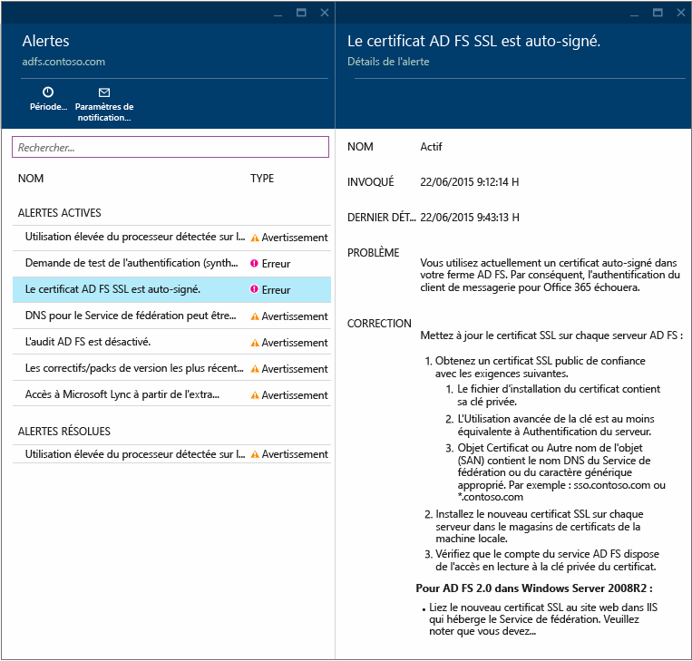
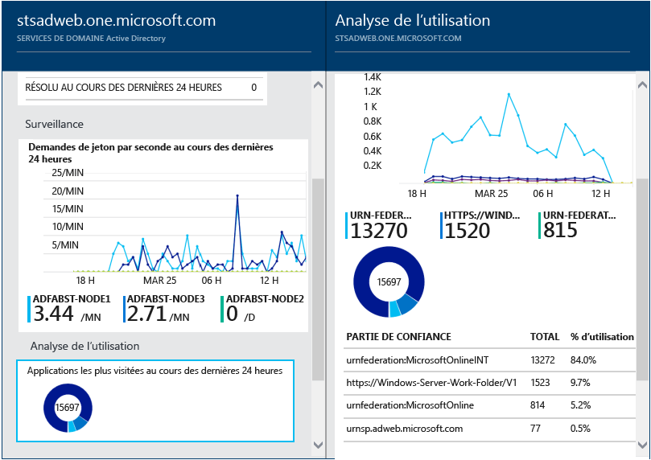
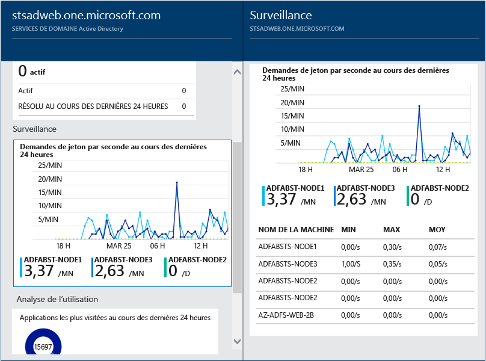

<properties 
	pageTitle="Utilisation d’Azure AD Connect Health avec AD FS | Microsoft Azure" 
	description="Ceci est la page d’Azure AD Connect Health spécifiant comment surveiller votre infrastructure AD FS locale." 
	services="active-directory" 
	documentationCenter="" 
	authors="billmath" 
	manager="stevenpo" 
	editor="curtand"/>

<tags 
	ms.service="active-directory" 
	ms.workload="identity" 
	ms.tgt_pltfrm="na" 
	ms.devlang="na" 
	ms.topic="get-started-article" 
	ms.date="01/21/2016" 
	ms.author="billmath"/>

# Utilisation d’Azure AD Connect Health avec AD FS 
La documentation suivante est spécifique à la surveillance de votre infrastructure AD FS avec Azure AD Connect Health.

## Alertes pour AD FS
Cette section vous fournit une liste des alertes actives. Chaque alerte inclut les informations associées, la procédure de résolution et des liens vers la documentation afférente. Si vous sélectionnez une alerte active ou résolue, vous verrez apparaître un nouveau panneau comportant des informations supplémentaires, ainsi qu’une procédure de résolution de l’alerte et des liens vers de la documentation supplémentaire. Vous pouvez également afficher des données d’historique sur les alertes résolues par le passé.

Si vous sélectionnez une alerte, vous aurez accès à des informations supplémentaires, à une procédure de résolution de l’alerte et à des liens vers de la documentation supplémentaire.

## Analyse de l’utilisation pour AD FS
L’analyse de l’utilisation d’Azure AD Connect Health observe le trafic d’authentification des serveurs de fédération. Sélectionnez la zone Analyse de l’utilisation pour ouvrir le panneau Analyse de l’utilisation, qui vous indique les mesures et les regroupements.

>[AZURE.NOTE] Pour utiliser l’analyse de l’utilisation avec AD FS, vous devez vous assurer que les audits AD FS sont activés. Pour plus d’informations, consultez [Activer l’audit pour AD FS](active-directory-aadconnect-health-operations.md#enable-auditing-for-ad-fs).

Pour sélectionner des mesures supplémentaires, spécifiez une plage de temps ou, pour modifier le regroupement, cliquez avec le bouton droit sur le graphique d’analyse de l’utilisation, puis sélectionnez Modifier le graphique. Vous pouvez ensuite spécifier la plage de temps, modifier ou sélectionner les mesures et modifier le regroupement. Vous pouvez afficher la distribution du trafic d’authentification en fonction de « mesures » différentes et regrouper les mesures en fonction des paramètres de « regroupement » appropriés décrits ci-dessous.

| Mesure | Regroupement | En quoi consiste le regroupement ? Quel est son intérêt ? |
| ------ | -------- | -------------------------------------------- |
| Nombre total de requêtes : le nombre total de requêtes traitées par le service de fédération | Tout | Ce paramètre indique le nombre total de requêtes sans regroupement. |
| | Application | Cette option regroupe la totalité des requêtes en fonction de la partie de confiance cible. Ce regroupement permet de comprendre le pourcentage du trafic total reçu par chaque application. |
| | Serveur | Cette option regroupe la totalité des requêtes en fonction du serveur qui a traité la requête. Ce regroupement permet de mieux comprendre la distribution de charge du trafic total. |
| | Jonction d’espace de travail | Cette option regroupe la totalité des requêtes en fonction de la provenance des requêtes, selon qu’elles soient ou non issues d’appareils joints à un espace de travail (connu). Ce regroupement permet de comprendre si vos ressources sont consultées à l’aide d’appareils inconnus de l’infrastructure d’identité. |
| | Méthode d'authentification | Cette option permet de regrouper la totalité des requêtes en fonction de la méthode d’authentification utilisée. Ce regroupement permet de mieux comprendre la méthode courante d’authentification utilisée. Voici les méthodes d’authentification possibles : <ol> <li>Authentification intégrée de Windows (Windows)</li> <li>Authentification basée sur les formulaires (Formulaires)</li> <li>Authentification unique</li> <li>Authentification par certificat X509 (Certificat)</li>  Notez que la requête est considérée comme une authentification unique si les serveurs de fédération la reçoivent avec un cookie d’authentification unique. Le cas échéant, si le cookie est valide, l’utilisateur ne doit pas fournir d’informations d’identification et bénéficie d’un accès transparent à l’application. Cette configuration est courante si vous disposez de multiples parties de confiance protégées par les serveurs de fédération. |
| | Emplacement réseau | Cette option permet de regrouper la totalité des requêtes en fonction de l’emplacement du réseau de l’utilisateur. Il peut s’agir d’un réseau intranet ou extranet. Ce regroupement permet de comparer les pourcentages de trafic issus de l’internet et de l’extranet. |
| Nombre total de requêtes échouées : nombre total de requêtes échouées traitées par le service de fédération.   (Cette métrique est disponible uniquement sur AD FS pour Windows Server 2012 R2)| Type d’erreur | Cette option indique le nombre d’erreurs en fonction des types d’erreur prédéfinis. Ce regroupement permet de mieux comprendre les types courants d’erreurs. <ul><li>Mot de passe ou nom incorrect : erreurs dues à un mot de passe ou un nom incorrect.</li> <li>« Verrouillage extranet » : défaillances provoquées par les requêtes reçues d’un utilisateur ne disposant d’aucun accès à l’extranet </li><li> « Mot de passe expiré » : défaillances provoquées par des utilisateurs se connectant avec des mots de passe expirés </li><li>« Compte désactivé » : défaillances dues aux utilisateurs se connectant avec un compte désactivé </li><li>« Authentification de l’appareil » : défaillances provoquées par les utilisateurs ne réussissant pas à s’authentifier à l’aide de l’authentification de l’appareil </li><li>« Authentification par certificat utilisateur » : défaillances dues aux utilisateurs ne réussissant pas à se connecter à cause d’un certificat non valide </li><li>« MFA » : défaillances dues aux utilisateurs ne réussissant pas à s’identifier à l’aide de l’authentification multifacteur (Multi Factor Authentication, MFA) </li><li>« Autres informations d’identification » : « Autorisation d’émission » : défaillances dues à des défauts d’autorisation </li><li>« Délégation d’émission » : défaillances dues à des erreurs de délégation d’émission </li><li>« Acceptation de jetons » : défaillances dues au rejet par ADFS du jeton d’un fournisseur d’identité tiers </li><li>« Protocole » : défaillances dues à des erreurs de protocoles.</li><li>« Inconnu » : intercepte tout. Toutes les autres défaillances qui n’entrent pas dans les catégories définies.</li> |
| | Serveur | Cette option regroupe les erreurs en fonction du serveur. Elle permet de mieux comprendre la distribution des erreurs entre les serveurs. Une distribution inégale peut indiquer qu’un serveur présente un état défectueux. |
| | Emplacement réseau | Cette option regroupe les erreurs basées sur l’emplacement réseau des requêtes (intranet et extranet). Elle procure une meilleure visibilité sur le type des requêtes défaillantes. |
| | Application | Ici, les défaillances basées sur l’application cible (partie de confiance) sont regroupées. Elle permet d’identifier l’application cible présentant le nombre le plus important d’erreurs. |
| Nombre d’utilisateurs : nombre moyen d’utilisateurs actifs dans le système | Tout | Cette option fournit le nombre moyen de personnes utilisant le service de fédération durant l’intervalle sélectionné. Les utilisateurs ne sont pas regroupés.  Cette moyenne dépend de la tranche horaire sélectionnée. |
| | Application | Cette option regroupe le nombre moyen d’utilisateurs sur l’application cible (partie de confiance). Elle procure une plus grande visibilité sur le nombre d’utilisateurs exécutant chaque application. |

## Surveillance des performances pour AD FS
L’analyse des performances Azure AD Connect Health fournit des informations d’analyse sur les mesures. Si vous sélectionnez la zone Surveillance, un panneau s’ouvre et présente des informations détaillées sur les mesures.

Si vous sélectionnez l’option Filtre en haut du panneau, vous pouvez filtrer par serveur afin d’afficher les mesures spécifiques à chacun d’entre eux. Pour modifier les mesures, cliquez avec le bouton droit sur le graphique de surveillance situé sous le panneau de surveillance, puis sélectionnez Modifier le graphique. Ensuite, dans le nouveau panneau ouvert, vous pouvez sélectionner des mesures supplémentaires à partir de la liste déroulante et spécifier une plage de temps pour l’affichage des données de performances.

## Liens connexes

* [Azure AD Connect Health](active-directory-aadconnect-health.md)
* [Installation de l'agent Azure AD Connect Health](active-directory-aadconnect-health-agent-install.md)
* [Opérations Azure AD Connect Health](active-directory-aadconnect-health-operations.md)
* [Utilisation d’Azure AD Connect Health pour la synchronisation](active-directory-aadconnect-health-sync.md)
* [Forum Aux Questions (FAQ) Azure AD Connect Health](active-directory-aadconnect-health-faq.md)

<!---HONumber=AcomDC_0128_2016-->