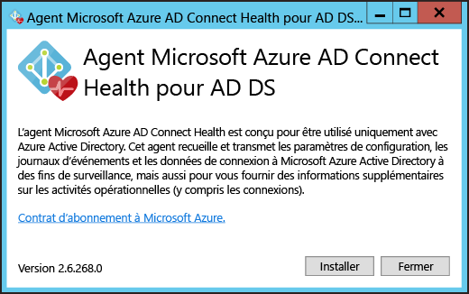
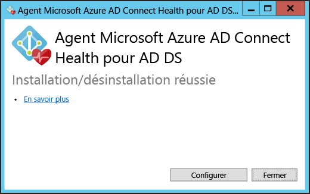
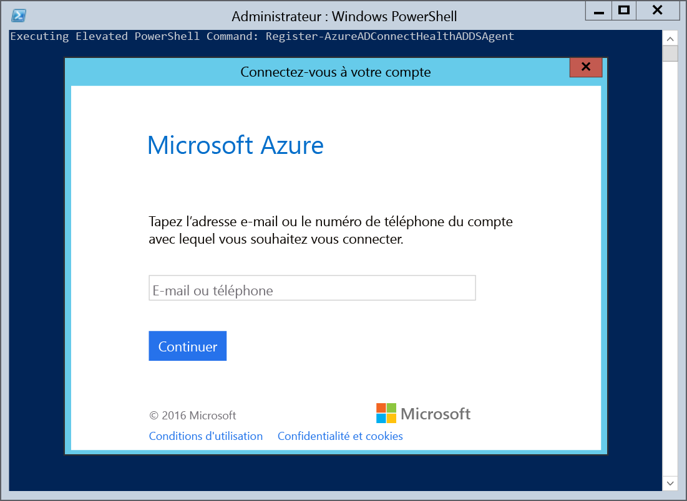
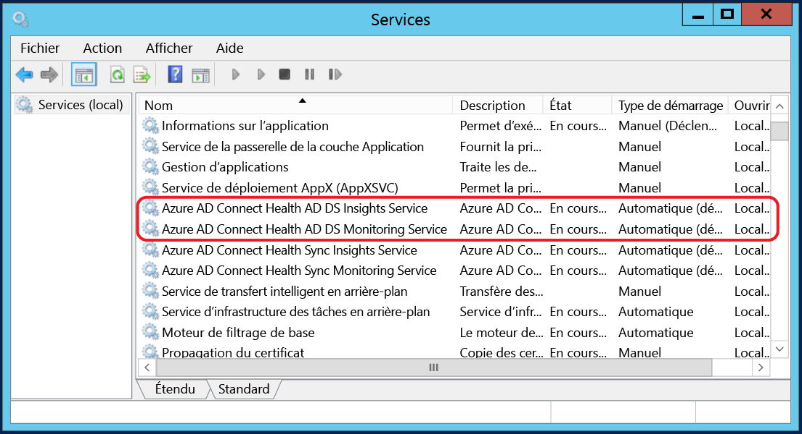

# Installation de l'agent Azure AD Connect Health
Ce document vous guide à travers l’installation et la configuration des agents Azure AD Connect Health. Vous pouvez télécharger les agents [ici](active-directory-aadconnect-health.md#download-and-install-azure-ad-connect-health-agent) :

## Configuration requise
Le tableau qui suit est une liste d’exigences d’utilisation d’Azure AD Connect Health.

| Prérequis | Description |
| --- | --- |
| Azure AD Premium |Azure AD Connect Health est une fonctionnalité d’Azure AD Premium qui nécessite Azure AD Premium.   Pour plus d’informations, consultez [Prise en main d’Azure AD Premium](active-directory-get-started-premium.md). Pour démarrer une période d’évaluation gratuite de 30 jours, consultez [Démarrer l’essai gratuit](https://azure.microsoft.com/trial/get-started-active-directory/). |
| Vous devez être administrateur général de votre instance Azure AD pour démarrer Azure AD Connect Health |Par défaut, seuls les administrateurs généraux peuvent installer et configurer les agents d’intégrité afin de permettre leur démarrage, accéder au portail et exécuter des opérations au sein d’Azure AD Connect Health. Pour plus d’informations, consultez l’article [Administration de votre annuaire Azure AD](active-directory-administer.md).    À l’aide du contrôle d’accès en fonction du rôle, vous pouvez accorder l’accès à Azure AD Connect Health à d’autres utilisateurs dans votre organisation. Pour plus d’informations, consultez [Contrôle d’accès en fonction du rôle pour Azure AD Connect Health](active-directory-aadconnect-health-operations.md#manage-access-with-role-based-access-control).   **Important :** Le compte utilisé lors de l’installation des agents doit être un compte professionnel ou scolaire. Il ne peut pas s’agir d’un compte Microsoft. Pour plus d’informations, consultez [Inscription à Azure en tant qu’organisation](sign-up-organization.md). |
| L’agent Azure AD Connect Health est installé sur chaque serveur cible |Azure AD Connect Health requiert l’installation d’un agent sur les serveurs cibles pour fournir les données affichées dans le portail.   Par exemple, pour obtenir les données de votre infrastructure locale AD FS, l’agent doit être installé sur les serveurs AD FS, les serveurs proxy AD FS et les serveurs proxy d’application web. De même, pour obtenir des données sur votre infrastructure locale AD DS, l’agent doit être installé sur les contrôleurs de domaine.   **Important :** Le compte utilisé lors de l’installation des agents doit être un compte professionnel ou scolaire. Il ne peut pas s’agir d’un compte Microsoft. Pour plus d’informations, consultez [Inscription à Azure en tant qu’organisation](sign-up-organization.md). |
| Connectivité sortante vers les points de terminaison de service Azure |Pendant l’installation et l’exécution, l’agent nécessite une connectivité vers les points de terminaison de service Azure AD Connect Health. Si la connectivité sortante est bloquée, veillez à ajouter les points de terminaison suivants à la liste autorisée :   <li>&#42;.blob.core.windows.net </li><li>&#42;.queue.core.windows.net</li><li>adhsprodwus.servicebus.windows.net - Port: 5671 </li><li>https://management.azure.com </li><li>https://s1.adhybridhealth.azure.com/</li><li>https://policykeyservice.dc.ad.msft.net/</li><li>https://login.windows.net</li><li>https://login.microsoftonline.com</li><li>https://secure.aadcdn.microsoftonline-p.com</li> |
| Ports du pare-feu sur le serveur qui exécute l’agent. |L’agent requiert que les ports de pare-feu suivants soient ouverts pour pouvoir communiquer avec les points de terminaison du service Azure AD Health.  <li>Port TCP/UDP 443</li><li>Port TCP/UDP 5671</li> |
| Autoriser les sites web suivants en cas d’activation de la sécurité renforcée d’IE |Si la sécurité renforcée d’Internet Explorer est activée, les sites web suivants doivent être autorisés sur le serveur où l’agent sera installé.  <li>https://login.microsoftonline.com</li><li>https://secure.aadcdn.microsoftonline-p.com</li><li>https://login.windows.net</li><li>Serveur de fédération de votre organisation approuvé par Azure Active Directory. Par exemple : https://sts.contoso.com</li> |

## Installation de l'agent Azure AD Connect Health pour AD FS
Pour démarrer l’installation de l’agent, double-cliquez sur le fichier .exe que vous avez téléchargé. Sur le premier écran, cliquez sur Installer.

Une fois l’installation terminée, cliquez sur Configurer maintenant.

Une invite de commandes est lancée, suivie par certains éléments PowerShell qui exécutent Register-AzureADConnectHealthADFSAgent. Lorsque vous y êtes invité, connectez-vous à Azure.

Une fois que vous êtes connecté, PowerShell continue. À l’issue du processus, vous pouvez fermer PowerShell ; la configuration est terminée.

À ce stade, les services doivent être démarrés automatiquement, permettant à l’agent de surveiller et de collecter les données. Si vous n’avez pas satisfait la configuration requise décrite dans les sections précédentes, des avertissements s’affichent dans la fenêtre PowerShell. Assurez-vous que vous disposez de la [configuration requise](active-directory-aadconnect-health-agent-install.md#requirements) avant d’installer l’agent. La capture d’écran suivante est un exemple de ces erreurs.

Pour vérifier que l’agent a été installé, recherchez les services suivants sur le serveur. Si vous avez terminé la configuration, ces services devraient déjà être en cours d’exécution. Dans le cas contraire, ils sont arrêtés tant que la configuration n’est pas terminée.

* Azure AD Connect Health AD FS Diagnostics Service
* Azure AD Connect Health AD FS Insights Service
* Azure AD Connect Health AD FS Monitoring Service

### Installation de l’agent sur les serveurs Windows Server 2008 R2
Procédure pour les serveurs Windows Server 2008 R2 :

1. Assurez-vous que le serveur est exécuté au Service Pack 1 ou une version supérieure.
2. Désactivez la Configuration de sécurité renforcée pour l’installation de l’agent :
3. Installez Windows PowerShell 4.0 sur chacun des serveurs avant d’installer l’agent AD Health. Pour installer Windows PowerShell 4.0 :
   * Installez [Microsoft .NET Framework 4.5](https://www.microsoft.com/download/details.aspx?id=40779) en cliquant sur le lien suivant pour télécharger le programme d’installation hors connexion.
   * Installer PowerShell ISE (à partir des fonctionnalités de Windows)
   * Installez [Windows Management Framework 4.0.](https://www.microsoft.com/download/details.aspx?id=40855)
   * Installez Internet Explorer version 10 ou supérieure sur le serveur. (Cette installation est requise par le service Health pour l’authentification avec vos informations d’identification d’administrateur Azure.)
4. Pour plus d’informations sur l’installation de Windows PowerShell 4.0 sur Windows Server 2008 R2, consultez l’article wiki [ici](http://social.technet.microsoft.com/wiki/contents/articles/20623.step-by-step-upgrading-the-powershell-version-4-on-2008-r2.aspx).

### Activer l’audit pour AD FS
> [!NOTE]
> Cette section s’applique uniquement aux serveurs de fédération AD FS.
> 
> 

Pour que la fonctionnalité d’analyse de l’utilisation puisse collecter et analyser les données, l’agent Azure AD Connect Health doit avoir les informations à disposition dans les journaux d’audit AD FS. Ces journaux ne sont pas activés par défaut. Utilisez les procédures suivantes pour activer l’audit AD FS et localiser les journaux d’audit AD FS sur vos serveurs AD FS.

#### Pour activer l’audit pour AD FS 2.0
1. Cliquez sur **Démarrer**, pointez sur **Programmes**, pointez sur **Outils d’administration**, puis cliquez sur **Stratégie de sécurité locale**.
2. Accédez au dossier **Security Settings\\Local Policies\\User Rights Management**, puis double-cliquez sur Générer des audits de sécurité.
3. Sur l’onglet **Paramètre de sécurité locale**, vérifiez que le compte de service AD FS 2.0 est répertorié. S’il n’est pas présent, cliquez sur **Ajouter un utilisateur ou un groupe** et ajoutez-le à la liste, puis cliquez sur **OK**.
4. Pour activer l’audit, ouvrez une invite de commandes avec des privilèges élevés et exécutez la commande suivante : <code>auditpol.exe /set /subcategory:"Application Generated" /failure:enable /success:enable</code>
5. Fermez Stratégie de sécurité locale, puis ouvrez le composant logiciel enfichable Gestion. Pour ouvrir le composant logiciel enfichable Gestion, cliquez sur **Démarrer**, pointez sur **Programmes**, pointez sur **Outils d’administration**, puis cliquez sur Gestion AD FS 2.0.
6. Dans le volet Actions, cliquez sur Modifier les propriétés du service FS (Federation Service).
7. Dans la boîte de dialogue **Propriétés du service FS**, cliquez sur l’onglet **Événements**.
8. Cochez les cases **Audits des succès** et **Audits des échecs**.
9. Cliquez sur **OK**.

#### Pour activer l’audit pour AD FS sur Windows Server 2012 R2
1. Ouvrez **Stratégie de sécurité locale** en ouvrant **Gestionnaire de serveur** sur l’écran d’accueil, ou Gestionnaire de serveur dans la barre des tâches sur le bureau, puis cliquez sur **Outils/Stratégie de sécurité locale**.
2. Accédez au dossier **Security Settings\\Local Policies\\User Rights Assignment**, puis double-cliquez sur **Générer des audits de sécurité**.
3. Sous l’onglet **Paramètre de sécurité locale**, vérifiez que le compte de service AD FS est répertorié. S’il n’est pas présent, cliquez sur **Ajouter un utilisateur ou un groupe** et ajoutez-le à la liste, puis cliquez sur **OK**.
4. Pour activer l’audit, ouvrez une invite de commandes avec des privilèges élevés et exécutez la commande suivante : <code>auditpol.exe /set /subcategory:"Application Generated" /failure:enable /success:enable.</code>
5. Fermez **Stratégie de sécurité locale**, puis ouvrez le composant logiciel enfichable **Gestion AD FS** (dans Gestionnaire de serveur, cliquez sur Outils, puis sélectionnez Gestion AD FS).
6. Dans le volet Actions, cliquez sur **Modifier les propriétés du service de fédération**.
7. Dans la boîte de dialogue Propriétés du service de fédération, cliquez sur l’onglet **Événements**.
8. Sélectionnez les cases **Audits des succès et Audits des échecs**, puis cliquez sur **OK**.

#### Pour localiser les journaux d’audit AD FS
1. Ouvrez l’**Observateur d’événements**.
2. Accédez à Journaux Windows et sélectionnez **Sécurité**.
3. Sur la droite, cliquez sur **Filtrer les journaux actuels**.
4. Dans Source de l’événement, sélectionnez **Audit AD FS**.

> [!WARNING]
> S’il existe une stratégie de groupe qui désactive l’audit AD FS, l’agent Azure AD Connect Health ne peut pas collecter les informations. Assurez-vous de ne pas disposer de stratégie de groupe susceptible de désactiver l’audit.
> 
> 

[//]: # "Début de la section de configuration de l'agent proxy"

## Installation de l'agent Azure AD Connect Health pour la synchronisation
L'agent Azure AD Connect Health pour la synchronisation est installé automatiquement dans la dernière version d'Azure AD Connect. Pour utiliser Azure AD Connect pour la synchronisation, vous devez télécharger la dernière version d’Azure AD Connect et l’installer. Vous pouvez télécharger la dernière version [ici](http://www.microsoft.com/download/details.aspx?id=47594).

Pour vérifier que l’agent a été installé, recherchez les services suivants sur le serveur. Si vous avez terminé la configuration, ils doivent déjà être en cours d’exécution. Dans le cas contraire, ils sont arrêtés tant que la configuration n’est pas terminée.

* Azure AD Connect Health Sync Insights Service
* Azure AD Connect Health Sync Monitoring Service

> [!NOTE]
> N'oubliez pas que l'utilisation d'Azure AD Connect Health requiert Azure AD Premium. Si vous ne disposez pas d’Azure AD Premium, vous ne pouvez pas effectuer la configuration dans le portail Azure. Pour plus d’informations, consultez la [page relative à la configuration requise](active-directory-aadconnect-health-agent-install.md#requirements).
> 
> 

## Enregistrement manuel d’Azure AD Connect Health pour la synchronisation
Si l’enregistrement de l’agent Azure AD Connect Health pour la synchronisation échoue après avoir correctement installé Azure AD Connect, vous pouvez utiliser la commande PowerShell suivante pour enregistrer l’agent manuellement.

> [!IMPORTANT]
> Cette commande PowerShell est uniquement requise si l’enregistrement de l’agent échoue après l’installation d’Azure AD Connect.
> 
> 

La commande PowerShell suivante est requise UNIQUEMENT lorsque l’enregistrement de l’Agent d’intégrité échoue, même après une installation et une configuration réussies d’Azure AD Connect. Les services Azure AD Connect Health démarreront une fois l’agent correctement enregistré.

Vous pouvez enregistrer manuellement l’agent Azure AD Connect Health pour la synchronisation à l’aide de la commande PowerShell suivante :

`Register-AzureADConnectHealthSyncAgent -AttributeFiltering $false -StagingMode $false`

La commande prend les paramètres qui suivent :

* AttributeFiltering : $true (par défaut), si Azure AD Connect ne synchronise pas le jeu d’attributs par défaut et a été personnalisé pour utiliser un jeu d’attributs filtré. Dans le cas contraire, c’est le paramètre $false qui s’applique.
* StagingMode : $false (par défaut), si le serveur Azure AD Connect n’est PAS en mode de préproduction, $true s’applique si le serveur est configuré en mode de préproduction.

Lorsque vous êtes invité à vous authentifier, vous devez utiliser le compte d’administrateur général (tel que admin@domain.onmicrosoft.com) que vous avez utilisé pour la configuration d’Azure AD Connect.

## Installation de l’agent Azure AD Connect Health pour AD DS
Pour démarrer l’installation de l’agent, double-cliquez sur le fichier .exe que vous avez téléchargé. Sur le premier écran, cliquez sur Installer.

Une fois l’installation terminée, cliquez sur Configurer maintenant.

Une invite de commandes est lancée, suivie par certains éléments PowerShell qui exécutent Register-AzureADConnectHealthADDSAgent. Lorsque vous y êtes invité, connectez-vous à Azure.

Une fois que vous êtes connecté, PowerShell continue. À l’issue du processus, vous pouvez fermer PowerShell ; la configuration est terminée.

À ce stade, les services doivent être démarrés automatiquement, permettant à l’agent de surveiller et de collecter les données. Si vous n’avez pas satisfait la configuration requise décrite dans les sections précédentes, des avertissements s’affichent dans la fenêtre PowerShell. Assurez-vous que vous disposez de la [configuration requise](active-directory-aadconnect-health-agent-install.md#requirements) avant d’installer l’agent. La capture d’écran suivante est un exemple de ces erreurs.

Pour vérifier que l’agent a été installé, recherchez les services suivants sur le contrôleur de domaine.

* Azure AD Connect Health AD DS Insights Service
* Azure AD Connect Health AD DS Monitoring Service

Si vous avez terminé la configuration, ces services doivent déjà être en cours d’exécution. Dans le cas contraire, ils sont arrêtés tant que la configuration n’est pas terminée.

## Installation de l’agent Azure AD Connect Health pour AD DS sur Server Core.
Après avoir installé le fichier .exe, vous pouvez terminer le processus d’inscription à l’aide de la commande PowerShell suivante :

`Register-AzureADConnectHealthADDSAgent -Credential $cred`

## Configuration des agents Azure AD Connect Health pour utiliser le proxy HTTP
Vous pouvez configurer des agents Azure AD Connect Health pour utiliser un proxy HTTP.

> [!NOTE]
> * L’utilisation de « Netsh WinHttp set ProxyServerAddress » n’est pas prise en charge, car l’agent utilise System.Net pour effectuer des requêtes web au lieu des services HTTP Microsoft Windows.
> * L’adresse de proxy HTTP configurée sert à transmettre des messages HTTPS chiffrés.
> * Les serveurs proxy authentifiés (à l’aide de HTTPBasic) ne sont pas pris en charge.
> 
> 

### Modification de la configuration du proxy d’un agent Health
Vous disposez des options suivantes afin de configurer un agent Azure AD Connect Health pour utiliser un proxy HTTP.

> [!NOTE]
> Tous les services de l’agent Azure AD Connect Health doivent être redémarrés pour que la mise à jour des paramètres du proxy prenne effet. Exécutez la commande suivante :  Restart-Service AdHealth*
> 
> 

#### Importation des paramètres de proxy existants
##### Importation à partir d'Internet Explorer
Les paramètres de proxy HTTP Internet Explorer peuvent être importés pour être utilisés par les agents Azure AD Connect Health. Sur chacun des serveurs exécutant l’agent Health, exécutez la commande PowerShell suivante :

    Set-AzureAdConnectHealthProxySettings -ImportFromInternetSettings

##### Importation à partir de WinHTTP
Les paramètres de proxy WinHTTP peuvent être importés pour être utilisés par les agents Azure AD Connect Health. Sur chacun des serveurs exécutant l’agent Health, exécutez la commande PowerShell suivante :

    Set-AzureAdConnectHealthProxySettings -ImportFromWinHttp

#### Spécification manuelle des adresses du proxy
Vous pouvez spécifier manuellement un serveur proxy sur chacun des serveurs qui exécute l’agent Health en exécutant la commande PowerShell suivante :

    Set-AzureAdConnectHealthProxySettings -HttpsProxyAddress address:port

Exemple : *Set-AzureAdConnectHealthProxySettings -HttpsProxyAddress myproxyserver: 443*

* « address » peut être un nom de serveur DNS pouvant être résolu ou une adresse IPv4
* "port" peut être omis. Dans ce cas, 443 est choisi comme port par défaut.

#### Effacement de la configuration de proxy existante
Vous pouvez effacer la configuration du proxy en exécutant la commande suivante :

    Set-AzureAdConnectHealthProxySettings -NoProxy

### Lecture des paramètres de proxy actuels
Vous pouvez lire les paramètres de proxy actuellement configurés en exécutant la commande suivante :

    Get-AzureAdConnectHealthProxySettings

## Tester la connectivité au service Azure AD Connect Health
Des problèmes provoquant la perte de connectivité entre l’agent Azure AD Connect Health et le service Azure AD Connect Health peuvent survenir. Cela inclut, entre autres, des problèmes réseau et des problèmes d’autorisation.

Si l’agent ne parvient pas à envoyer des données au service Azure AD Connect Health pendant plus de deux heures, le message d’alerte suivant s’affiche dans le portail : « Les données du service de contrôle d’intégrité ne sont pas à jour. » Vous pouvez vérifier si l’agent Azure AD Connect Health affecté peut télécharger des données vers le service Azure AD Connect Health en exécutant la commande PowerShell suivante :

    Test-AzureADConnectHealthConnectivity -Role ADFS

Le paramètre de rôle peut avoir les valeurs suivantes :

* ADFS
* Synchronisation
* AJOUTE

Vous pouvez utiliser l’indicateur - ShowResults dans la commande pour afficher des journaux détaillés. Consultez l’exemple qui suit :

    Test-AzureADConnectHealthConnectivity -Role Sync -ShowResult

> [!NOTE]
> Pour utiliser l’outil de connectivité, vous devez d’abord effectuer l’inscription de l’agent. Si vous n’êtes pas en mesure de terminer l’inscription de l’agent, assurez-vous que vous avez respecté la [configuration requise](active-directory-aadconnect-health-agent-install.md#requirements) pour Azure AD Connect Health. Ce test de connectivité est effectué par défaut lors de l’inscription de l’agent.
> 
> 

## Liens connexes
* [Azure AD Connect Health](active-directory-aadconnect-health.md)
* [Opérations Azure AD Connect Health](active-directory-aadconnect-health-operations.md)
* [Utilisation d’Azure AD Connect Health avec AD FS](active-directory-aadconnect-health-adfs.md)
* [Utilisation d'Azure AD Connect Health pour la synchronisation (en Anglais)](active-directory-aadconnect-health-sync.md)
* [Utilisation d’Azure AD Connect Health avec AD DS](active-directory-aadconnect-health-adds.md)
* [Forum Aux Questions (FAQ) Azure AD Connect Health](active-directory-aadconnect-health-faq.md)
* [Historique de publication des versions d’Azure AD Connect Health](active-directory-aadconnect-health-version-history.md)

<!---HONumber=AcomDC_1005_2016-->