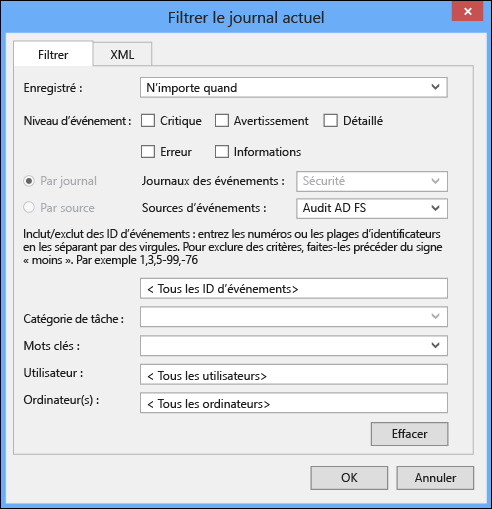
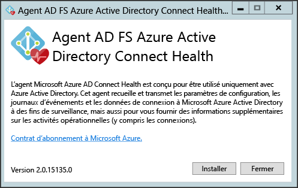
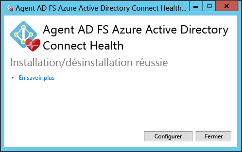
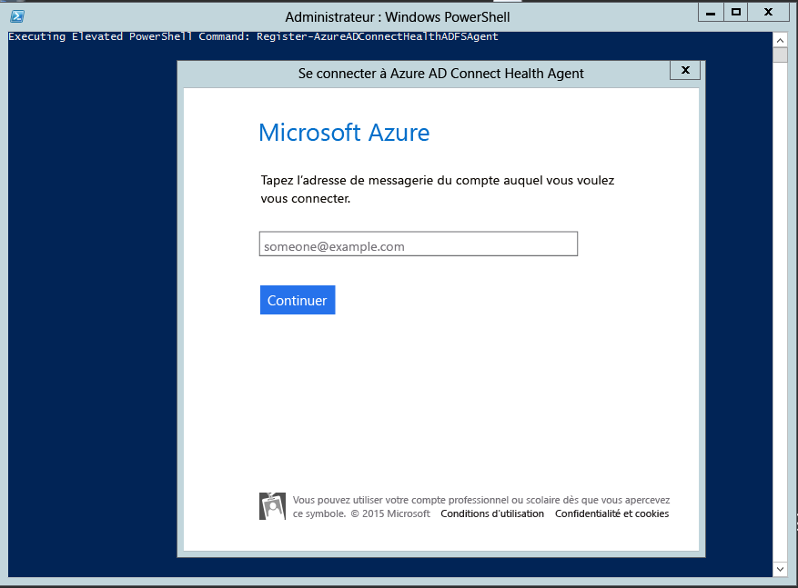

<properties 
	pageTitle="Configuration requise d’Azure AD Connect Health." 
	description="Vous vous trouvez sur la page dédiée à Azure AD Connect Health qui décrit la configuration requise et l’installation de l’agent." 
	services="active-directory" 
	documentationCenter="" 
	authors="billmath" 
	manager="swadhwa" 
	editor="curtand"/>

<tags 
	ms.service="active-directory" 
	ms.workload="identity" 
	ms.tgt_pltfrm="na" 
	ms.devlang="na" 
	ms.topic="article" 
	ms.date="07/12/2015" 
	ms.author="billmath"/>

# Configuration requise d’Azure Active Directory Connect Health
La documentation suivante décrit la configuration requise à respecter avant de commencer à utiliser Azure AD Connect Health.

## Une licence Azure AD Premium

Azure AD Connect Health est une fonctionnalité d’Azure AD Premium qui nécessite une licence Azure AD Premium. Pour obtenir une licence, consultez la page Prise en main d’Azure AD Premium.
 

## Vous devez être un administrateur global de votre locataire Azure AD.

Par défaut, les administrateurs globaux disposent d’un accès aux informations fournies par Azure AD Connect Health. Si vous n’êtes pas un administrateur global de votre locataire Azure AD fédéré avec votre domaine Active Directory local, vous ne pourrez pas créer une instance de service d’Azure AD Connect Health. Assurez-vous d’être un administrateur global. Pour plus d’informations, consultez la section [Administration de votre annuaire Azure AD](https://msdn.microsoft.com/library/azure/hh967611.aspx).
 

## L’agent Azure AD Connect Health installé sur chaque serveur cible

Lorsque vous utilisez Azure AD Connect Health, vous devez installer un agent sur les serveurs cible afin d’activer la transmission des données affichées sur le portail Azure AD Connect Health. Ainsi, pour placer les données sur votre infrastructure AD FS locale, l’agent doit être installé sur les serveurs AD FS. Les serveurs proxy AD FS et les serveurs proxy d’application web sont visés par cette règle. Pour plus d’informations sur l’installation de l’agent Azure AD Connect Health, consultez la section Procédure d’installation de l’agent Azure AD Connect Health.

## Configuration requise de l’agent Azure AD Connect Health

Les sections suivantes décrivent la configuration requise spécifique de l’agent Azure AD Connect Health.
 

### Téléchargement de l’agent Azure AD Connect Health

Pour commencer à utiliser Azure AD Connect Health, vous pouvez télécharger sa dernière version ici : [Télécharger l’agent Azure AD Connect Health](http://go.microsoft.com/fwlink/?LinkID=518973) Vérifiez que vous avez ajouté le service à partir de Marketplace avant d’installer les agents.

 
### Connectivité sortante vers les points de terminaison de service Azure
Pendant l’installation et l’exécution, l’agent nécessite une connectivité vers les points de terminaison de service Azure AD Connect Health répertoriés ci-dessous. Si vous bloquez la connectivité sortante, assurez-vous d’ajouter les éléments suivants à la liste autorisée :

- *.servicebus.windows.net - Port : 5671 - https://*.adhybridhealth.azure.com/
- https://*.table.core.windows.net/
- https://policykeyservice.dc.ad.msft.net/
- https://login.windows.net
- https://login.microsoftonline.com
- https://secure.aadcdn.microsoftonline-p.com 

## Autoriser les sites web suivants en cas d’activation de la sécurité renforcée d’IE
Les sites web suivants doivent être autorisés en cas d’activation de la sécurité renforcée d’IE sur le serveur sur lequel l’agent sera installé.

- https://login.microsoftonline.com 
- https://secure.aadcdn.microsoftonline-p.com
- https://login.windows.net
- Le serveur de fédération pour votre structure approuvée par Azure Active Directory. Par exemple : https://sts.contoso.com 

### Pour AD FS, l’audit AD FS doit être activé pour exécuter l’analyse de l’utilisation.

Pour que la fonctionnalité d’analyse de l’utilisation puisse collecter les données et les analyser, l’agent Azure AD Connect Health doit avoir les informations à disposition dans les journaux d’audit AD FS. Ces journaux ne sont pas activés par défaut. Cette règle s’applique uniquement aux serveurs de fédération AD FS. Il est inutile d’activer l’audit sur les serveurs proxy AD FS ou sur les serveurs proxy d’application web. Utilisez les procédures suivantes pour activer l’audit AD FS et localiser les journaux d’audit AD FS.

#### Pour activer l’audit pour AD FS 2.0

1. Cliquez sur **Démarrer**, survolez **Programmes**, **Outils d’administration**, puis cliquez sur **Stratégie de sécurité locale**.
1. Accédez au dossier **Security Settings\\Local Policies\\User Rights Management**, puis double-cliquez sur Générer des audits de sécurité.
1. Sur l’onglet **Paramètre de sécurité locale**, vérifiez que le compte de service AD FS 2.0 est répertorié. S’il n’est pas présent, cliquez sur **Ajouter un utilisateur ou un groupe** et ajoutez-le dans la liste, puis cliquez sur **OK**.
1. Ouvrez une invite de commandes avec des privilèges élevés et exécutez la commande suivante pour activer l’audit. `auditpol.exe /set /subcategory:"Application Generated" /failure:enable /success:enable`
1. Fermez Stratégie de sécurité locale, puis ouvrez le composant logiciel enfichable Gestion. Pour ouvrir le composant logiciel enfichable Gestion, cliquez sur **Démarrer**, survolez **Programmes**, **Outils d’administration**, puis cliquez sur Gestion AD FS 2.0.
1. Dans le volet Actions, cliquez sur Modifier les propriétés du service FS (Federation Service).
1. Dans la boîte de dialogue **Propriétés du service FS**, cliquez sur l’onglet **Événements**.
1. Sélectionnez les cases **Audits des succès** et **Audits des échecs**.
1. Cliquez sur **OK**.

#### Pour activer l’audit pour AD FS sur Windows Server 2012 R2

1. Ouvrez **Stratégie de sécurité locale** en ouvrant **Gestionnaire de serveur** sur l’écran d’accueil, ou Gestionnaire de serveur dans la barre des tâches sur le bureau, puis cliquez sur **Outils/Stratégie de sécurité locale**.
1. Accédez au dossier **Security Settings\\Local Policies\\User Rights Assignment**, puis double-cliquez sur **Générer des audits de sécurité**.
1. Sur l’onglet **Paramètre de sécurité locale**, vérifiez que le compte de service AD FS est répertorié. Si ce n’est pas le cas, cliquez sur **Ajouter un utilisateur ou un groupe** et procédez à l’ajout dans la liste, puis cliquez sur **OK**.
1. Ouvrez une invite de commandes avec des privilèges élevés et exécutez la commande suivante pour activer l’audit : `auditpol.exe /set /subcategory:"Application Generated" /failure:enable /success:enable.`
1. Fermez **Stratégie de sécurité locale**, puis ouvrez le composant logiciel enfichable **Gestion AD FS** (dans Gestionnaire de serveur, cliquez sur Outils, puis sélectionnez Gestion AD FS).
1. Dans le volet Actions, cliquez sur **Modifier les propriétés du service FS (Federation Service)**.
1. Dans la boîte de dialogue Propriétés du service FS, cliquez sur l’onglet **Événements**.
1. Sélectionnez les cases **Audits des succès et Audits des échecs**, puis cliquez sur **OK**.

#### Pour localiser les journaux d’audit AD FS

1. Ouvrez l’**Observateur d’événements**.</li>
1. Accédez aux Journaux Windows, puis sélectionnez **Securité**.
1. Sur la droite, cliquez sur **Filtrer les journaux actuels**.
1. Dans Source de l’événement, sélectionnez **Audit AD FS**.

> [AZURE.WARNING]Si vous disposez d’une stratégie de groupe qui désactive l’audit AD FS, l’agent Azure AD Connect Health ne pourra pas collecter les informations. Assurez-vous de ne pas disposer de stratégie de groupe susceptible de désactiver l’audit.

### Installation de l’agent sur les serveurs Windows Server 2008 R2

Pour les serveurs Windows Server 2008 R2, procédez comme suit :

1. Assurez-vous que le serveur est exécuté au Service Pack 1 ou une version supérieure.
1. Désactivez la Configuration de sécurité renforcée pour l’installation de l’agent :
1. Installez Windows PowerShell 4.0 sur chacun des serveurs avant d’installer l’agent AD Health. Pour installer Windows PowerShell 4.0 :
 - Installez [Microsoft .NET Framework 4.5](https://www.microsoft.com/download/details.aspx?id=40779) en cliquant sur le lien suivant pour télécharger le programme d’installation hors connexion.
 - Installer PowerShell ISE (à partir des fonctionnalités de Windows)
 - Installez [Windows Management Framework 4.0.](https://www.microsoft.com/download/details.aspx?id=40855)
 - Installez Internet Explorer version 10 ou supérieure sur le serveur. Cette installation est requise par le service Health, afin de vous authentifier avec vos informations d’identification d’administrateur Azure.
1. Pour plus d’informations sur l’installation de Windows PowerShell 4.0 sur Windows Server 2008 R2, consultez l’article wiki [ici](http://social.technet.microsoft.com/wiki/contents/articles/20623.step-by-step-upgrading-the-powershell-version-4-on-2008-r2.aspx).

## Déploiement de l’agent Azure AD Connect Health
Cette section vous présente les étapes d’installation et de configuration de l’agent Azure AD Connect Health sur vos serveurs. Avant de pouvoir consulter des données sur votre instance d’Azure AD Connect Health, il vous faudra installer l’agent Azure AD Connect Health sur vos serveurs cibles. Veillez à procéder à la configuration requise avant d’installer l’agent. Pour télécharger l’agent, cliquez sur le lien ci-dessus, puis exécutez la procédure ci-dessous.

Double-cliquez sur le fichier .exe téléchargé. Sur le premier écran, cliquez sur Installer.

Une fois l’installation terminée, cliquez sur Configurer maintenant.

Cette action lance une invite de commandes suivie par certains éléments PowerShell qui exécuteront Register-AzureADConnectHealthADFSAgent. Vous serez invité à vous connecter à Azure. Connectez-vous.

Une fois que vous êtes connecté, PowerShell continue. À l’issue du processus, vous pouvez fermer PowerShell ; la configuration est terminée.

À ce stade, les services doivent être démarrés automatiquement. L’agent surveille et collecte désormais les données. Gardez à l’esprit que vous verrez des avertissements s’afficher dans la fenêtre PowerShell si vous n’avez pas satisfait la configuration requise décrite dans les sections précédentes. La capture d’écran suivante constitue un bon exemple.

Pour vérifier que l’agent a été installé, ouvrez les services et procédez aux vérifications suivantes. Si vous avez terminé la configuration, ces services doivent s’exécuter. Dans le cas contraire, vous devez impérativement terminer la configuration pour exécuter les services.

- Azure AD Connect Health AD FS Diagnostics Service
- Azure AD Connect Health AD FS Insights Service
- Azure AD Connect Health AD FS Monitoring Service
 

<!---HONumber=July15_HO5-->