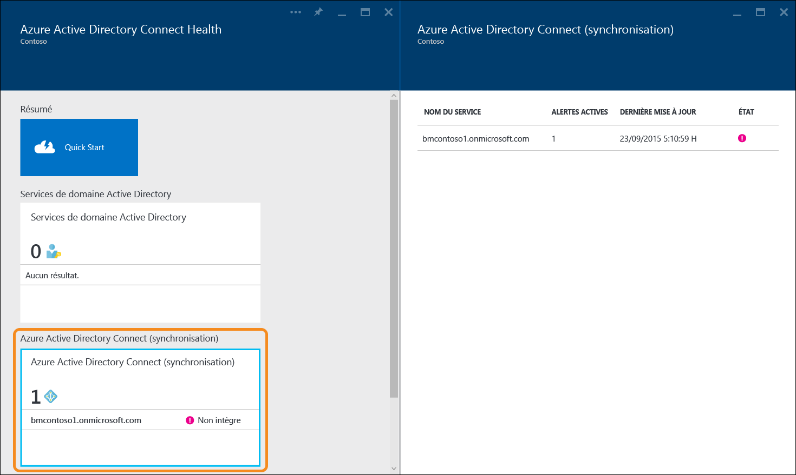
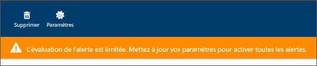
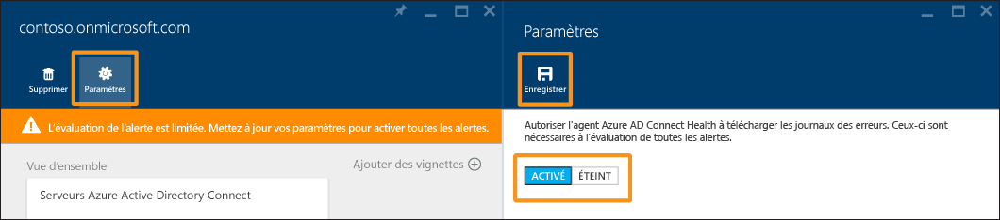

<properties
	pageTitle="Utilisation d’Azure AD Connect Health avec la synchronisation | Microsoft Azure"
	description="Cette page dédiée à Azure AD Connect Health explique comment surveiller la synchronisation d’Azure AD Connect."
	services="active-directory"
	documentationCenter=""
	authors="billmath"
	manager="stevenpo"
	editor="curtand"/>

<tags
	ms.service="active-directory"
	ms.workload="identity"
	ms.tgt_pltfrm="na"
	ms.devlang="na"
	ms.topic="get-started-article"
	ms.date="07/14/2016"
	ms.author="billmath"/>

# Utilisation d’Azure AD Connect Health pour la synchronisation
La documentation suivante s’applique à la surveillance de la synchronisation Azure AD Connect avec Azure AD Connect Health. Pour plus d’informations sur la surveillance AD FS avec Azure AD Connect Health, consultez [Utilisation d’Azure AD Connect Health avec AD FS](active-directory-aadconnect-health-adfs.md). En outre, pour plus d’informations sur la surveillance des services de domaine Active Directory avec Azure AD Connect Health, consultez [Utilisation d’Azure AD Connect Health avec AD DS](active-directory-aadconnect-health-adds.md).

## Alertes d’Azure AD Connect Health pour la synchronisation
La section relative aux alertes d’Azure AD Connect Health fournit une liste des alertes actives. Chaque alerte inclut les informations associées, la procédure de résolution et des liens vers la documentation afférente. Si vous sélectionnez une alerte active ou résolue, vous verrez apparaître un nouveau panneau comportant des informations supplémentaires, ainsi qu’une procédure de résolution de l’alerte et des liens vers de la documentation supplémentaire. Vous pouvez également afficher des données d’historique sur les alertes résolues par le passé.

Si vous sélectionnez une alerte, vous aurez accès à des informations supplémentaires, à une procédure de résolution de l’alerte et à des liens vers de la documentation supplémentaire.

### Évaluation limitée des alertes
Si Azure AD Connect n’utilise PAS la configuration par défaut (par exemple, si le filtrage des attributs passe d’une configuration par défaut à une configuration personnalisée), l’agent Azure AD Connect Health ne télécharge pas les événements d’erreur liés à Azure AD Connect.

Cela limite l’évaluation des alertes par le service. Vous verrez une bannière indiquant cette condition dans le portail Azure, sous votre service.

Pour modifier ceci, cliquez sur « Paramètres », puis autorisez l’agent Azure AD Connect Health à télécharger tous les journaux d’erreurs.

## Aperçu de synchronisation
Les nouvelles fonctionnalités suivantes ont été ajoutées à la dernière version d’Azure AD Connect Health pour la synchronisation :

- Latence des opérations de synchronisation
- Tendance de modification d’objet

### Latence de synchronisation
Cette fonctionnalité fournit une tendance graphique de la latence des opérations de synchronisation (importation, exportation, etc.) pour les connecteurs. Vous disposez ainsi d’un moyen rapide et simple de connaître non seulement la latence de vos opérations (ce qui s’avère utile en cas de nombreuses modifications), mais également d’un bon outil de détection des anomalies de latence susceptibles de nécessiter un examen supplémentaire.

Par défaut, seule la latence de l’opération « Exportation » pour le connecteur Azure AD est affichée. Pour visualiser davantage d’opérations sur le connecteur ou pour afficher les opérations d’autres connecteurs, cliquez avec le bouton droit sur le graphique et choisissez l’opération spécifique et le connecteur.

### Synchronisation des modifications d’objet
Cette fonctionnalité fournit une représentation graphique du nombre de modifications en cours d’évaluation et d’exportation vers Azure AD. Aujourd’hui, il est difficile de rassembler ces informations dans les journaux de synchronisation. Le graphique constitue non seulement un moyen plus simple d’analyser le nombre de modifications qui se produisent dans votre environnement, mais également un aperçu visuel des défaillances qui se produisent.

## Liens connexes

* [Azure AD Connect Health](active-directory-aadconnect-health.md)
* [Installation de l'agent Azure AD Connect Health](active-directory-aadconnect-health-agent-install.md)
* [Opérations Azure AD Connect Health](active-directory-aadconnect-health-operations.md)
* [Utilisation d’Azure AD Connect Health avec AD FS](active-directory-aadconnect-health-adfs.md)
* [Utilisation d’Azure AD Connect Health avec AD DS](active-directory-aadconnect-health-adds.md)
* [Forum Aux Questions (FAQ) Azure AD Connect Health](active-directory-aadconnect-health-faq.md)
* [Historique de publication des versions d’Azure AD Connect Health](active-directory-aadconnect-health-version-history.md)

<!---HONumber=AcomDC_0720_2016-->