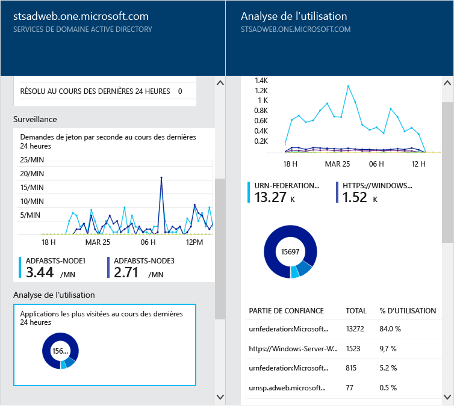
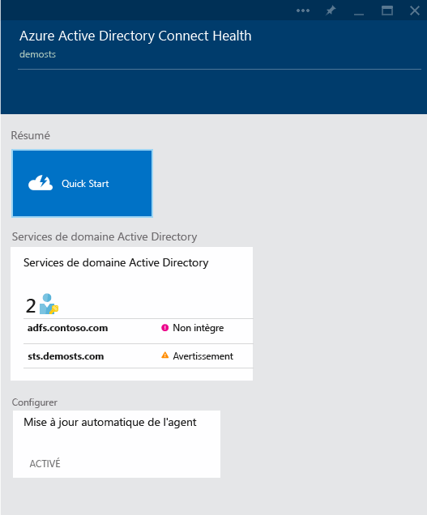

<properties
	pageTitle="Surveillez votre infrastructure d’identité locale dans le cloud."
	description="Cette page décrit Azure AD Connect Health et vous explique pourquoi l’utiliser."
	services="active-directory"
	documentationCenter=""
	authors="billmath"
	manager="stevenpo"
	editor="curtand"/>

<tags
	ms.service="active-directory"
	ms.workload="identity"
	ms.tgt_pltfrm="na"
	ms.devlang="na"
	ms.topic="get-started-article"
	ms.date="12/16/2015"
	ms.author="billmath"/>

# Surveillez votre infrastructure d’identité locale et vos services de synchronisation dans le cloud

Azure AD Connect Health vous permet de surveiller et d’analyser votre infrastructure d’identité locale et les services de synchronisation disponibles via Azure AD Connect. Vous pouvez ainsi consulter des alertes, en savoir plus sur les performances, connaître les modèles d’utilisation, découvrir les paramètres de configuration, maintenir une connexion fiable à Office 365 et bien plus encore. Tout ceci peut être accompli à l’aide d’un agent installé sur les serveurs cibles.

Ces informations sont toutes disponibles dans le portail Azure AD Connect Health. Ce portail vous permet d’afficher des alertes, de surveiller les performances et d’analyser les utilisations. Ces informations sont présentées au même endroit pour faciliter leur utilisation et vous permettre de gagner du temps en trouvant immédiatement l’information dont vous avez besoin.

Les mises à jour prévues pour Azure AD Connect Health incluent une amélioration de la surveillance et de l’analyse d’autres composants d’identité. Vous pouvez ainsi bénéficier d’un tableau de bord unique focalisé sur l’identité, vous permettant de profiter d’un environnement intégré, sécurisé et robuste que vos utilisateurs peuvent exploiter pour améliorer leur productivité.

## Pourquoi utiliser Azure AD Connect Health

L’intégration de vos annuaires locaux avec Azure AD améliore la productivité de vos utilisateurs en leur fournissant une identité commune pour accéder aux ressources cloud et locales. Toutefois, avec cette intégration, vous devez vous assurer que cet environnement est sécurisé pour que les utilisateurs puissent accéder aux ressources locales et cloud en toute sécurité depuis n’importe quel appareil. Azure AD Connect Health fournit une approche basée sur le cloud pour surveiller et obtenir facilement des informations sur l’infrastructure d’identité locale que vous utilisez pour accéder à Office 365 ou à d’autres applications Azure AD. Son installation est aussi simple que celle d’un agent sur chacun de vos serveurs d’identité local.

Azure AD Connect Health pour AD FS prend en charge AD FS 2.0 dans Windows Server 2008/2008 R2, AD FS Windows Server 2012/2012 R2. Cette prise en charge inclut également tous les serveurs AD FS Proxy AD FS ou les serveurs Proxy d’application web qui permettent la prise en charge de l’authentification pour l’accès extranet. Azure AD Connect Health pour AD FS fournit les fonctionnalités clé suivantes :

- Affichage d’alertes et prises de mesures pour accéder de façon fiable aux applications AD FS protégées, y compris Azure AD
- Notifications par courrier électronique pour les alertes critiques
- Affichage des données de performances pour déterminer la planification de capacité
- Affichage détaillé de vos modèles de connexion AD FS pour déterminer les anomalies ou établir des lignes de base pour la planification de capacité

Azure AD Connect Health pour la synchronisation surveille et fournit des informations sur les synchronisations effectuées entre votre instance Active Directory locale et Azure Active Directory. Azure AD Connect Health pour la synchronisation fournit les fonctionnalités clés suivantes :

- Affichage des alertes et mise en place d’actions pour garantir la fiabilité des synchronisations entre votre infrastructure locale et Azure Active Directory.
- Notifications par courrier électronique pour les alertes critiques
- Affichage des données de performances

La vidéo suivante fournit une vue d’ensemble sur Azure AD Connect Health :

[AZURE.VIDEO azure-ad-connect-health--monitor-you-identity-bridge]

## Prise en main dans le portail Azure
Pour démarrer avec Azure Active Directory Connect Health, exécutez la procédure suivante.

1. Connectez-vous au [portail Microsoft Azure.](https://portal.azure.com/)
2. Pour accéder à Azure Active Directory Connect Health, rendez-vous sur Marketplace et recherchez ce composant, ou sélectionnez Marketplace, puis Sécurité + Identité.
3. Sur le panneau de présentation (un panneau correspond à une portion de la vue générale ; Vous pouvez considérer qu’un panneau est une fenêtre ou un accès vers d’autres éléments), cliquez sur **Créer**. Un autre panneau s’ouvre ; il comporte vos informations de répertoire.
4. Sur le panneau de l’annuaire, cliquez sur **Créer**. Pour utiliser Azure AD Connect Health, vous devez posséder une licence Azure Active Directory Premium. Pour plus d’informations sur Azure AD Premium, consultez la rubrique Prise en main d’Azure AD Premium.

>[AZURE.NOTE]Avant de pouvoir consulter des données sur votre instance d’Azure AD Connect Health, il vous faudra installer l’agent Azure AD Connect Health sur vos serveurs cibles. Pour télécharger l’agent Azure AD Connect Health, dans le premier panneau, sélectionnez Démarrage rapide et Obtenir les outils. Vous pouvez aussi télécharger directement l’agent en utilisant le [lien](#download-the-agent) ci-dessous. Pour utiliser Azure Active Directory Connect Health, procédez comme suit :

### Portail et services Azure AD Connect Health
Ce portail vous permet d’afficher des alertes, de surveiller les performances et d’analyser les utilisations. Lorsque vous accédez pour la première fois à Azure AD Connect Health, vous verrez le premier panneau. Considérez les panneaux comme des fenêtres. Le premier panneau affiché comporte les options Démarrage rapide, Services et Configurer. Vous trouverez sous la capture une brève description de chacune d’entre elles. La section des services montre les services actifs et les instances de ces services surveillés par Azure AD Connect Health.

- **Démarrage rapide** : sélectionnez cette option pour ouvrir le panneau Démarrage rapide. Ici, téléchargez l’agent Azure AD Connect Health en sélectionnant Obtenir les outils, accédez à la documentation et fournissez des commentaires.
- **Active Directory Federation Services** : ce panneau représente tous les services AD FS actuellement surveillés par Azure AD Connect Health. Si vous sélectionnez une des instances, Azure AD Connect Health ouvre un panneau comportant des informations sur cette instance de services. Il comporte une vue d’ensemble, les propriétés, les alertes, les données de surveillance et une analyse de l’utilisation. 
- Configurer : vous pouvez ici activer ou désactiver les éléments suivants :
<ol>
1. La mise à jour automatique de l’agent Azure AD Connect Health vers la version la plus récente. Concrètement, cela signifie que votre système est automatiquement mis à jour vers la dernière version disponible de l’agent Azure AD Connect Health. Cette option est activée par défaut.
2. L’autorisation de l’accès, par Microsoft, aux données d’intégrité de votre répertoire Azure AD à des fins exclusives de résolution des problèmes. Si cette option est activée, Microsoft pourra consulter les données auxquelles vous avez accès. Cette option simplifie la résolution des problèmes. Elle est désactivée par défaut.

## Configuration requise
Le tableau suivant contient une liste des conditions requises à satisfaire avant de commencer à utiliser Azure AD Connect Health.

| Prérequis | Description|
| ----------- | ---------- |
|Azure AD Premium| Azure AD Connect Health est une fonctionnalité d’Azure AD Premium qui nécessite Azure AD Premium.   Pour plus d’informations, consultez [Prise en main d’Azure AD Premium](active-directory-get-started-premium.md).  Pour démarrer une période d’évaluation gratuite de 30 jours, consultez [Démarrer une période d’évaluation.](https://azure.microsoft.com/trial/get-started-active-directory/)|.
|Vous devez être un administrateur général de votre instance Azure AD pour activer (créer) Azure AD Connect Health|Par défaut, seuls les administrateurs généraux sont en mesure d’activer (de créer), d’accéder à toutes les informations et d’effectuer toutes les opérations au sein d’Azure AD Connect Health. Pour plus d’informations, consultez la section [Administration de votre annuaire Azure AD](active-directory-administer.md).    À l’aide du contrôle d’accès en fonction du rôle, vous pouvez accorder l’accès à Azure AD Connect Health à d’autres utilisateurs dans votre organisation. Pour plus d’informations, consultez [Contrôle d’accès en fonction du rôle pour Azure AD Connect Health.](active-directory-aadconnect-health-operations.md#manage-access-with-role-based-access-control)   ** Important : ** le compte que vous utilisez lors de l’installation des agents doit être un compte professionnel ou d’organisation. Il ne peut pas s’agir d’un compte Microsoft. Pour plus d’informations, consultez [Inscription à Azure en tant qu’organisation](sign-up-organization.md)|
|Pour AD FS, l’audit AD FS doit être activé pour exécuter l’analyse de l’utilisation.| Si vous prévoyez d’utiliser Analyse de l’utilisation avec AD FS, l’audit AD FS doit être activé.   Voir [Installation de l’agent Azure AD Connect Health pour AD FS.](active-directory-aadconnect-health-agent-install.md#installing-the-azure-ad-connect-health-agent-for-ad-fs)
|Satisfaire aux conditions requises de l’agent Azure AD Connect Health|Consultez le tableau ci-dessous pour les conditions requises spécifiques de l’agent.

Le tableau suivant contient une liste des conditions requises de l’agent à satisfaire avant de commencer à utiliser Azure AD Connect Health.

| Prérequis | Description|
| ----------- | ---------- |
|L’agent Azure AD Connect Health installé sur chaque serveur cible| Azure AD Connect Health requiert qu’un agent soit installé sur les serveurs cibles pour fournir les données affichées dans le portail.   Ainsi, pour obtenir des données sur votre infrastructure locale AD FS, l’agent doit être installé sur les serveurs AD FS. Les serveurs proxy AD FS et les serveurs proxy d’application web sont visés par cette règle.   Pour plus d’informations sur l’installation de l’agent, consultez [Installation de l’agent Azure AD Connect Health](active-directory-aadconnect-health-agent-install.md).  ** Important : ** le compte que vous utilisez lors de l’installation des agents doit être un compte professionnel ou d’organisation. Il ne peut pas s’agir d’un compte Microsoft. Pour plus d’informations, consultez [Inscription à Azure en tant qu’organisation](sign-up-organization.md)|
|Déploiement de l’agent Azure AD Connect Health pour la synchronisation| Cet agent est installé automatiquement avec la dernière version d’Azure AD Connect.   Si vous débutez simplement, vous n’avez rien de plus à faire. L’Agent est installé parallèlement à Azure AD Connect.   Si vous avez déjà installé Azure AD Connect, vous devrez télécharger [ici](http://www.microsoft.com/download/details.aspx?id=47594) la version la plus récente pour vous mettre à niveau.
|Connectivité sortante vers les points de terminaison de service Azure|Pendant l’installation et l’exécution, l’agent nécessite une connectivité vers les points de terminaison de service Azure AD Connect Health répertoriés ci-dessous. Si vous bloquez la connectivité sortante, assurez-vous d’ajouter les éléments suivants à la liste autorisée :   <li>**Nouveau**: https://management.azure.com </li><li>**Nouveau**: &#42;.blob.core.windows.net </li><li>**Nouveau**: &#42;.queue.core.windows.net</li><li>&#42;.servicebus.windows.net - Port : 5671</li><li>https://&#42;.adhybridhealth.azure.com/</li><li>https://&#42;.table.core.windows.net/</li><li>https://policykeyservice.dc.ad.msft.net/</li><li>https://login.windows.net</li><li>https://login.microsoftonline.com</li><li>https://secure.aadcdn.microsoftonline-p.com</li> |
|Ports du pare-feu sur le serveur qui exécute l’agent.| L’agent nécessite que les ports de pare-feu suivants soient ouverts pour pouvoir communiquer avec les points de terminaison du service Azure AD Health.  <li>Port TCP/UDP 80</li><li>Port TCP/UDP 443</li><li>Port TCP/UDP 5671</li>
|Autoriser les sites web suivants en cas d’activation de la sécurité renforcée d’IE|Les sites web suivants doivent être autorisés si la sécurité renforcée d’Internet Explorer est activée sur le serveur où l’agent sera installé.  <li>https://login.microsoftonline.com</li><li>https://secure.aadcdn.microsoftonline-p.com</li><li>https://login.windows.net</li><li>Le serveur de fédération pour votre organisation approuvé par Azure Active Directory. Par exemple : https://sts.contoso.com</li>

## Télécharger l’agent

Pour commencer, effectuez l’une des actions suivantes :

- Pour commencer à utiliser Azure AD Connect Health pour AD FS, vous pouvez télécharger sa dernière version ici : [Télécharger l’agent Azure AD Connect Health pour AD FS.](http://go.microsoft.com/fwlink/?LinkID=518973) Vérifiez que vous avez ajouté le service à partir de Marketplace avant d’installer les agents.
- Pour commencer à utiliser Azure AD Connect Health pour la synchronisation, téléchargez et installez la dernière version d’Azure AD Connect. L’agent d’intégrité sera ajouté dans le cadre de l’installation d’Azure AD Connect. Azure AD Connect prend en charge la mise à niveau des versions précédentes.

## Liens connexes

* [Installation de l’agent Azure AD Connect Health](active-directory-aadconnect-health-agent-install.md)
* [Opérations Azure AD Connect Health](active-directory-aadconnect-health-operations.md)
* [Utilisation d’Azure AD Connect Health avec AD FS](active-directory-aadconnect-health-adfs.md)
* [Utilisation d’Azure AD Connect Health pour la synchronisation](active-directory-aadconnect-health-sync.md)
* [Forum Aux Questions (FAQ) Azure AD Connect Health](active-directory-aadconnect-health-faq.md)

<!---HONumber=AcomDC_1217_2015-->