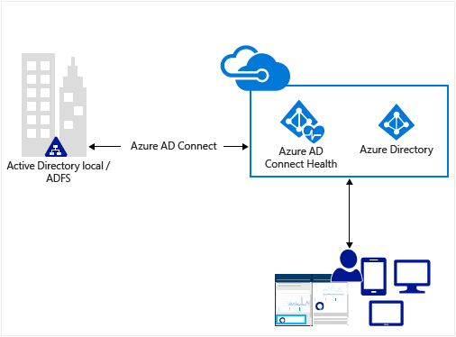
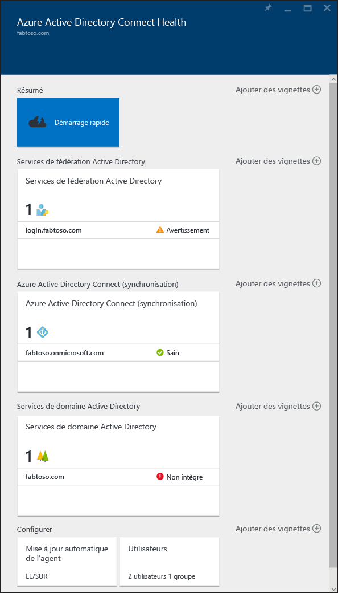

<properties
	pageTitle="Surveillez votre infrastructure d’identité locale dans le cloud."
	description="Cette page décrit Azure AD Connect Health et vous explique pourquoi l’utiliser."
	services="active-directory"
	documentationCenter=""
	authors="karavar"
	manager="femila"
	editor="karavar"/>

<tags
	ms.service="active-directory"
	ms.workload="identity"
	ms.tgt_pltfrm="na"
	ms.devlang="na"
	ms.topic="get-started-article"
	ms.date="07/14/2016"
	ms.author="vakarand"/>

# Surveillez votre infrastructure d’identité locale et vos services de synchronisation dans le cloud

Azure AD Connect Health vous permet de surveiller et d’analyser votre infrastructure d’identité locale et les services de synchronisation. Il vous permet de maintenir une connexion fiable à Office 365 et à Microsoft Online Services en fournissant des fonctionnalités de surveillance de vos composants d’identification clés tels que les serveurs AD FS, les serveurs Azure AD Connect (moteur de synchronisation), contrôleurs de domaine Active Directory etc. En outre, les points de données clés sur ces composants sont facilement accessibles, ce qui facilite l’utilisation et d’autres informations importantes.

Ces informations vous sont toutes présentées dans le [portail Azure AD Connect Health](https://aka.ms/aadconnecthealth). L’utilisation du portail Azure AD Connect Health vous permet d’afficher des alertes, de surveiller les performances et d’analyser les utilisations entre autres. Azure AD Connect Health prend en compte l’intégrité des composants d’identité clé, le tout à un seul endroit.

Les mises à jour futures pour Azure AD Connect Health incluent une amélioration de la surveillance et de l’analyse d’autres composants d’identité. Vous pouvez ainsi bénéficier d’un tableau de bord unique focalisé sur l’identité, vous permettant de profiter d’un environnement intégré, sécurisé et robuste que vos utilisateurs peuvent exploiter pour améliorer leur productivité.

<!-- 

 -->

## Pourquoi utiliser Azure AD Connect Health

L’intégration de vos annuaires locaux avec Azure AD améliore la productivité de vos utilisateurs en leur fournissant une identité commune pour accéder aux ressources cloud et locales. Toutefois, avec cette intégration, vous devez vous assurer que cet environnement est sécurisé pour que les utilisateurs puissent accéder aux ressources locales et cloud en toute sécurité depuis n’importe quel appareil. Azure AD Connect Health fournit une approche basée sur le cloud pour surveiller et obtenir facilement des informations sur l’infrastructure d’identité locale utilisée pour accéder à Office 365 ou à d’autres applications Azure AD. Son installation est aussi simple que celle d’un agent sur chacun de vos serveurs d’identité local.

## [Utilisation d’Azure AD Connect Health pour AD FS](active-directory-aadconnect-health-adfs.md)

Azure AD Connect Health pour AD FS prend en charge AD FS 2.0 dans Windows Server 2008 R2, AD FS Windows Server 2012 et 2012 R2. Cette prise en charge inclut également tous les serveurs proxy AD FS ou les serveurs proxy d’application web qui prennent en charge l’authentification pour l’accès extranet. Avec une installation très simple et économique de l’agent d’intégrité, Azure AD Connect Health pour AD FS fournit l’ensemble des fonctionnalités clés suivantes :

- Analyse des alertes pour savoir quand les serveurs AD FS et proxy AD FS ne sont pas sains
- Notifications par courrier électronique pour les alertes critiques
- Afficher les tendances des données de performance, utile pour la planification des capacités d’AD FS
- Analyse de l’utilisation des connexions AD FS avec un autre tableau croisé dynamique (applications, utilisateurs, emplacement réseau etc.), utiles pour comprendre comment AD FS est utilisé.
- Rapports AD FS comme le Top 50 des utilisateurs avec des tentatives ayant échoué en raison de nom d’utilisateur/de mots de passe incorrects

La vidéo suivante fournit une vue d’ensemble d’Azure AD Connect Health pour AD FS

> [AZURE.VIDEO azure-ad-connect-health--monitor-you-identity-bridge]

## [Azure AD Connect Health pour la synchronisation](active-directory-aadconnect-health-sync.md)

Azure AD Connect Health pour la synchronisation surveille et fournit des informations sur les synchronisations effectuées entre votre instance Active Directory locale et Azure Active Directory. Azure AD Connect Health pour la synchronisation fournit les fonctionnalités clés suivantes :

- Analyse grâce à des alertes, pour savoir quand les serveurs Azure AD Connect et donc, le moteur de synchronisation ne sont pas intègres
- Notifications par courrier électronique pour les alertes critiques
- Analyse opérationnelle de synchronisation, notamment les graphiques de latence pour les opérations de synchronisation et les tendances dans les opérations synchronisation, notamment les ajouts, les mises à jour, les suppressions.
- Rapide aperçu des informations sur les propriétés de synchronisation, la dernière réussite de l’exportation vers Azure AD

La vidéo suivante fournit une vue d’ensemble d’Azure AD Connect Health pour la synchronisation

>[AZURE.VIDEO azure-active-directory-connect-health-monitoring-the-sync-engine]

## [Utilisation d’Azure AD Connect Health pour AD DS (version préliminaire)](active-directory-aadconnect-health-adds.md)

Azure AD Connect Health pour AD DS permet de surveiller les contrôleurs de domaine installés sur Windows Server 2008 R2, Windows Server 2012 et Windows Server 2012 R2. Une installation de l’agent d’intégrité simple et économique vous permet de surveiller votre environnement local AD DS directement à partir du cloud. Azure AD Connect Health pour AD DS fournit les fonctionnalités clé suivantes :

- Alertes de surveillance pour détecter quand les contrôleurs de domaine sont défectueux, ainsi que des notifications par courrier électronique pour les alertes critiques.
- Tableau de bord des contrôleurs de domaine qui fournit un aperçu rapide de l’intégrité et de l’état de fonctionnement de vos contrôleurs de domaine.
- Tableau de bord d’état de réplication fournissant les dernières informations de réplication, ainsi que des liens vers des guides de dépannage lorsque des erreurs sont détectées.
- Accès rapide n’importe où aux graphiques de données de compteurs de performances populaires, nécessaires pour la résolution des problèmes et à des fins de surveillance.

La vidéo suivante fournit une vue d’ensemble d’Azure AD Connect Health pour AD DS

>[AZURE.VIDEO azure-ad-connect-health-monitors-on-premises-ad-domain-services]

## Démarrer avec Azure AD Connect Health
Il est très facile de s’initier à Azure AD Connect Health. Pour ce faire, procédez comme suit :

1. Accédez à [Obtenir Azure AD Premium](active-directory-get-started-premium.md) ou [Démarrer une version d’évaluation](https://azure.microsoft.com/trial/get-started-active-directory/)

2. [Téléchargez et installez les agents Azure AD Connect Health](#download-and-install-azure-ad-connect-health-agent) sur vos serveurs d’identité.

3. Affichez le tableau de bord d’Azure AD Connect Health sur [https://aka.ms/aadconnecthealth](https://aka.ms/aadconnecthealth)

>[AZURE.NOTE]Avant de pouvoir consulter des données sur votre instance d’Azure AD Connect Health, il vous faudra installer les agents Azure AD Connect Health sur vos serveurs cibles.

## Téléchargement et installation de l’agent Azure AD Connect Health

- Voir la [Configuration requise](active-directory-aadconnect-health-agent-install.md#Requirements) pour Azure AD Connect Health

- Pour commencer à utiliser Azure AD Connect Health pour AD FS, vous pouvez télécharger sa dernière version sur : [Télécharger l’agent Azure AD Connect Health pour AD FS.](http://go.microsoft.com/fwlink/?LinkID=518973) 

- Pour commencer à utiliser Azure AD Connect Health pour la synchronisation, téléchargez et installez la [dernière version d’Azure AD Connect](http://go.microsoft.com/fwlink/?linkid=615771). L’agent d’intégrité sera ajouté dans le cadre de l’installation d’Azure AD Connect (version 1.0.9125.0 ou ultérieure). Azure AD Connect prend en charge la mise à niveau des versions précédentes.

- Pour commencer à utiliser Azure AD Connect Health pour AD DS, vous pouvez télécharger sa dernière version sur : [Télécharger l’agent Azure AD Connect Health pour AD DS.](http://go.microsoft.com/fwlink/?LinkID=820540) 

## Portail Azure AD Connect Health
Le portail Azure AD Connect Health vous permet d’afficher des alertes, de surveiller les performances et d’analyser les utilisations. https://aka.ms/aadconnecthealth vous emmène sur le panneau principal d’Azure AD Connect Health. Considérez les panneaux comme des fenêtres. Dans le panneau principal, vous pouvez voir Démarrage rapide, les services offerts dans Azure AD Connect Health et d’autres options de configuration. Vous trouverez sous la capture une brève description de chacune d’entre elles. Après le déploiement des agents, le service de contrôle d’intégrité s’identifie automatiquement pour les services qu’Azure AD Connect Health analyse.

- **Démarrage rapide** : sélectionnez cette option pour ouvrir le panneau Démarrage rapide. Ici, téléchargez l’agent Azure AD Connect Health en sélectionnant Obtenir les outils, accédez à la documentation et fournissez des commentaires.

- **Active Directory Federation Services** : ce panneau représente tous les services AD FS actuellement surveillés par Azure AD Connect Health. Si vous sélectionnez une des instances, Azure AD Connect Health ouvre un panneau comportant des informations sur cette instance de services. Il comporte une vue d’ensemble, les propriétés, les alertes, les données de surveillance et une analyse de l’utilisation. Vous pouvez en savoir plus sur les fonctionnalités [ici.](active-directory-aadconnect-health-adfs.md)

- **Azure Active Directory Connect (synchronisation)** : ce panneau représente les serveurs Azure AD Connect actuellement surveillés par Azure AD Connect Health. Lorsque vous sélectionne une entrée, un panneau contenant des informations sur vos serveurs Azure AD Connect s’ouvre. Vous pouvez en savoir plus sur les fonctionnalités [ici.](active-directory-aadconnect-health-sync.md)
 
- **Services de domaine Active Directory** : ce panneau représente toutes les forêts AD DS actuellement surveillées par Azure AD Connect Health. Si vous sélectionnez une des forêts, un panneau comportant des informations sur cette forêt s’ouvre. Ces informations incluent une vue d’ensemble des informations essentielles, le tableau de bord des contrôleurs de domaine, le tableau de bord d’état de réplication du tableau de bord, des alertes et la surveillance. Vous pouvez en savoir plus sur les fonctionnalités [ici.](active-directory-aadconnect-health-adds.md)

- **Configurer** : vous pouvez ici activer ou désactiver les éléments suivants :

	1. La mise à jour automatique de l’agent Azure AD Connect Health vers la version la plus récente. Concrètement, cela signifie que votre système est automatiquement mis à jour vers la dernière version disponible de l’agent Azure AD Connect Health. Cette option est activée par défaut.

	2. L’autorisation de l’accès, par Microsoft, aux données d’intégrité de votre répertoire Azure AD à des fins exclusives de résolution des problèmes. Si cette option est activée, Microsoft pourra consulter les données auxquelles vous avez accès. Cette option simplifie la résolution des problèmes. Elle est désactivée par défaut.

## Liens connexes

* [Installation de l’agent Azure AD Connect Health](active-directory-aadconnect-health-agent-install.md)
* [Opérations Azure AD Connect Health](active-directory-aadconnect-health-operations.md)
* [Utilisation d’Azure AD Connect Health avec AD FS](active-directory-aadconnect-health-adfs.md)
* [Utilisation d’Azure AD Connect Health pour la synchronisation](active-directory-aadconnect-health-sync.md)
* [Utilisation d’Azure AD Connect Health avec AD DS](active-directory-aadconnect-health-adds.md)
* [Forum Aux Questions (FAQ) Azure AD Connect Health](active-directory-aadconnect-health-faq.md)
* [Historique de publication des versions d’Azure AD Connect Health](active-directory-aadconnect-health-version-history.md)

<!---HONumber=AcomDC_0928_2016-->