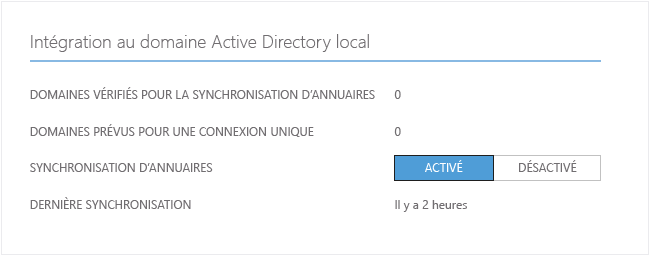
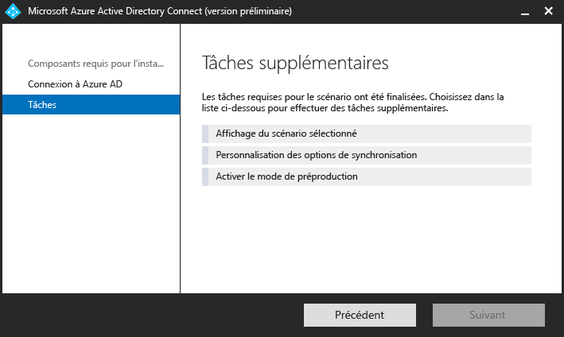

<properties 
	pageTitle="Gestion d’Azure AD Connect" 
	description="Apprenez à étendre la configuration par défaut et les tâches opérationnelles pour Azure AD Connect." 
	services="active-directory" 
	documentationCenter="" 
	authors="billmath" 
	manager="swadhwa" 
	editor="curtand"/>

<tags 
	ms.service="active-directory" 
	ms.workload="identity" 
	ms.tgt_pltfrm="na" 
	ms.devlang="na" 
	ms.topic="article" 
	ms.date="05/28/2015" 
	ms.author="billmath"/>

# Gestion d’Azure AD Connect 

<a href="../active-directory-aadconnect/" title="Présentation">Présentation</a> <a href="../active-directory-aadconnect-how-it-works/" title="Fonctionnement">Fonctionnement</a> <a href="../active-directory-aadconnect-get-started/" title="Prise en main">Prise en main</a> <a href="../active-directory-aadconnect-whats-next/" title="Étapes suivantes" class="current">Étapes suivantes</a> <a href="../active-directory-aadconnect-learn-more/" title="En savoir plus">En savoir plus</a>

Les rubriques suivantes relatives aux fonctionnalités avancées vous permettent de personnaliser Azure Active Directory Connect pour l’adapter aux besoins et aux spécifications de votre organisation.

## Attribution des licences aux utilisateurs Azure AD Premium et Enterprise Mobility

Maintenant que vos utilisateurs ont été synchronisés dans le cloud, vous devez leur attribuer une licence afin qu’ils puissent commencer à utiliser les applications de cloud telles qu’Office 365.

### Pour l’attribution d’une licence Azure AD Premium ou Enterprise Mobility Suite
--------------------------------------------------------------------------------
<ol>
<li>Connectez-vous au portail Azure en tant qu’administrateur.</li>
<li>Sélectionnez **Active Directory** à gauche.</li>
<li>Sur la page Active Directory, double-cliquez sur le répertoire qui contient les utilisateurs que vous souhaitez activer.</li>
<li>En haut de la page du répertoire, sélectionnez **Licences**.</li>
<li>Sur la page des licences, sélectionnez Active Directory Premium ou Enterprise Mobility Suite, puis cliquez sur **Attribuer**.</li>
<li>Dans la boîte de dialogue, sélectionnez les utilisateurs auxquels vous souhaitez attribuer des licences, puis cliquez sur l’icône de coche pour enregistrer les modifications.</li>

## Vérification de la tâche de synchronisation planifiée
Si vous souhaitez vérifier l’état d’une synchronisation, vous pouvez le faire dans le portail Azure.

### Pour la vérification de la tâche de synchronisation planifiée
--------------------------------------------------------------------------------

1. Connectez-vous au portail Azure en tant qu’administrateur.
2. Sélectionnez **Active Directory** à gauche.
3. Sur la page Active Directory, double-cliquez sur le répertoire qui contient les utilisateurs que vous souhaitez activer.
4. En haut de la page du répertoire, sélectionnez **Intégration du répertoire**.
5. Sous Intégration avec un répertoire actif local, notez l’heure de la dernière synchronisation.

## Début de la tâche de synchronisation planifiée
Si vous devez exécuter une tâche de synchronisation, vous pouvez le faire en l’exécutant une nouvelle fois depuis l’Assistant Azure AD Connect. Vous devez fournir vos informations d’identification Azure AD. Dans l’Assistant, sélectionnez la tâche **Personnalisation des options de synchronisation** et cliquez sur Suivant dans l’Assistant. À la fin, vérifiez que la case **Démarrer le processus de synchronisation dès que la configuration initiale est terminée** est cochée.

## Tâches supplémentaires disponibles dans Azure AD Connect
Après l’installation initiale d’Azure AD Connect, vous pouvez toujours redémarrer l’Assistant depuis la page de démarrage ou le raccourci du bureau Azure AD Connect. Vous remarquerez qu’en passant à nouveau par l’Assistant de nouvelles options apparaissent sous forme de tâches supplémentaires.

Le tableau suivant fournit un résumé de ces tâches et une brève description de chacune d’elles.

 

Informations supplémentaires | Description 
------------- | ------------- |
Afficher le scénario sélectionné |Vous pouvez afficher votre solution Azure AD Connect actuelle. Cela inclut les paramètres généraux, les répertoires synchronisés, les paramètres de synchronisation, etc.
Personnaliser les options de synchronisation | Vous pouvez modifier la configuration actuelle, y compris l’ajout de forêts Active Directory supplémentaires à la configuration ou l’activation des options de synchronisation telles que l’utilisateur, le groupe, l’appareil ou le mot de passe en écriture différée.
Activation du mode intermédiaire | Cela vous permet d’organiser les informations qui seront synchronisées plus tard, mais rien ne sera exporté vers Azure AD ou Active Directory. Cela vous permet d’afficher un aperçu des synchronisations avant qu’elles ne s’effectuent.

 

## Documentation supplémentaire
Consultez les liens suivants pour obtenir de la documentation supplémentaire sur l’utilisation de Azure AD Connect :

- [Modification de la configuration par défaut de Azure AD Connect](active-directory-aadconnect-whats-next-change-default-config.md)
- [Utilisation de l’éditeur de règles de synchronisation Azure AD Connect](active-directory-aadconnect-whats-next-synch-rules-editor.md)
- [Utilisation de l’approvisionnement déclaratif](active-directory-aadconnect-whats-next-declarative-prov.md)

Une partie de la documentation qui a été créée pour Azure AD Sync est toujours adaptée et s’applique à Azure AD Connect. Bien que nous nous efforcions de transférer cette documentation sur Azure.com, une partie se trouve encore dans la bibliothèque MSDN. Pour plus de documentation, consultez [Azure AD Connect sur MSDN](https://msdn.microsoft.com/library/azure/dn832695.aspx) et [Azure AD Sync sur MSDN](https://msdn.microsoft.com/library/azure/dn790204.aspx).

 

<!---HONumber=July15_HO3-->