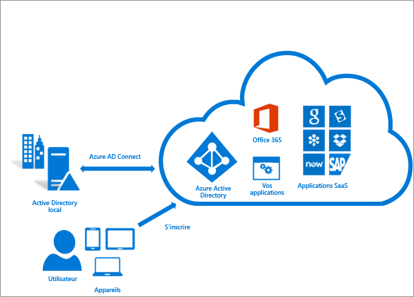
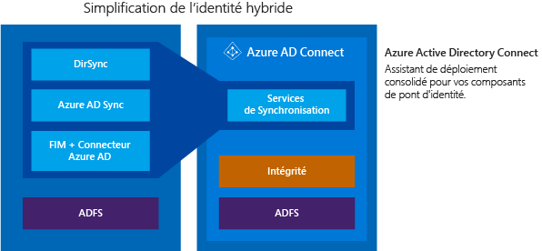

<properties
	pageTitle="Azure AD Connect : intégration de vos identités locales avec Azure Active Directory | Microsoft Azure"
	description="Azure AD Connect est l’outil permettant d’intégrer votre système d’identité local, par exemple Windows Server Active Directory avec Azure Active Directory, et de connecter vos utilisateurs à Office 365, Azure et à des milliers d’applications SaaS. Cette rubrique décrit les fonctionnalités d’Azure AD Connect et fournit des informations sur le fonctionnement d’Azure AD Connect, son installation, sa configuration et sa personnalisation."
    keywords="introduction à Azure AD Connect, présentation d’Azure AD Connect, qu’est-ce qu’Azure AD Connect, installation d’active directory"
	services="active-directory"
	documentationCenter=""
	authors="andkjell"
	manager="stevenpo"
	editor="curtand"/>

<tags
	ms.service="active-directory"
	ms.workload="identity"
	ms.tgt_pltfrm="na"
	ms.devlang="na"
	ms.topic="get-started-article"
	ms.date="02/16/2016"
	ms.author="andkjell;billmath"/>

# Intégration de vos identités locales avec Azure Active Directory
Azure AD Connect est l’outil permettant d’intégrer votre système d’identité local, par exemple Windows Server Active Directory avec Azure Active Directory, et de connecter vos utilisateurs à Office 365, Azure et à des milliers d’applications SaaS. Cette rubrique fournit un guide complet pour préparer et déployer les composants nécessaires afin que vos utilisateurs finaux accèdent aux services cloud avec la même identité que celle qu’ils utilisent aujourd’hui pour accéder aux applications d’entreprise existantes.

## Pourquoi utiliser Azure AD Connect
L’intégration de vos annuaires locaux avec Azure AD améliore la productivité de vos utilisateurs en leur fournissant une identité commune pour accéder aux ressources cloud et locales. Cette intégration procure aux utilisateurs et aux organisations les avantages suivants :

- Les utilisateurs peuvent utiliser une identité unique pour accéder aux applications locales et aux services cloud comme Office 365.

- Outil unique offrant une expérience de déploiement simple pour la synchronisation et la connexion.

- Fournit les fonctionnalités les plus récentes pour vos scénarios. Azure AD Connect remplace les versions antérieures des outils d’intégration d’identité tels que DirSync et Azure AD Sync. Pour plus d’informations, consultez [Identité hybride : Comparaison des outils d’intégration d’annuaire](active-directory-hybrid-identity-design-considerations-tools-comparison.md).

### Fonctionnement d’Azure AD Connect

Azure Active Directory Connect est constitué de trois parties principales. Il s’agit des services de synchronisation, de la partie facultative Active Directory Federation Services. La partie surveillance est effectuée à l’aide d’[Azure AD Connect Health](active-directory-aadconnect-health.md).

 

- Synchronisation : cette partie est constituée des composants et des fonctionnalités précédemment publiés sous le nom de [DirSync et Azure AD Sync](active-directory-hybrid-identity-design-considerations-tools-comparison.md). Il s’agit de la partie chargée de créer les utilisateurs et les groupes. Elle est également chargée de s’assurer que les informations relatives aux utilisateurs et aux groupes dans votre environnement local correspondent à celles qui se trouvent dans le cloud.
- AD FS : ceci est une partie facultative d’Azure AD Connect, qui peut être utilisée pour configurer un environnement hybride à l’aide d’une infrastructure AD FS locale. Cette partie permet aux organisations de faire face à des déploiements complexes, par exemple l’authentification unique de jonction de domaine, l’application de la stratégie de connexion AD ou l’utilisation de cartes à puce ou d’une solution tierce d’authentification multifacteur.
- Analyse d’intégrité : Azure AD Connect Health peut assurer une surveillance robuste et offrir l’accès à un emplacement central dans le portail Azure pour afficher ces activités. Pour plus d’informations, consultez [Azure Active Directory Connect Health](active-directory-aadconnect-health.md).

## Installer Azure AD Connect

Vous pouvez trouver le téléchargement d’Azure AD Connect sur le [Centre de téléchargement Microsoft](http://go.microsoft.com/fwlink/?LinkId=615771).

| Solution | Scénario |
| ----- | ----- |
| Avant de commencer | <li>[Azure AD Connect : matériel et conditions préalables](active-directory-aadconnect-prerequisites.md)</li> |
| [Paramètres Express](active-directory-aadconnect-get-started-express.md) | <li>Option recommandée et par défaut si vous disposez d’une seule forêt AD.</li> <li>Connexion de l’utilisateur avec le même mot de passe à l’aide de la synchronisation du mot de passe.</li>
| [Paramètres personnalisés](active-directory-aadconnect-get-started-custom.md) | <li>Utilisés lorsque vous disposez de plusieurs forêts. Prise en charge de nombreuses [topologies](active-directory-aadconnect-topologies.md) locales.</li> <li>Personnalisez votre option de connexion, par exemple AD FS pour la fédération, ou utilisez un fournisseur d’identité tiers.</li> <li>Personnalisez les fonctionnalités de synchronisation, telles que le filtrage et l’écriture différée.</li>
| [Mise à niveau à partir de DirSync](active-directory-aadconnect-dirsync-upgrade-get-started.md) | <li>Si vous disposez d’un serveur DirSync existant déjà en cours d’exécution.</li>
| Mise à niveau à partir d’Azure AD Sync | <li>Il s’agit d’une mise à niveau transparente.</li>

[Après l’installation](active-directory-aadconnect-whats-next.md), vous devez vérifier que tout fonctionne comme prévu et affecter des licences aux utilisateurs.

### Étapes suivantes pour installer Azure AD Connect

| Rubrique | |
| --------- | --------- |
| Téléchargez Azure AD Connect | [Téléchargez Azure AD Connect](http://go.microsoft.com/fwlink/?LinkId=615771) |
| Installation à l’aide des paramètres Express | [Installation rapide pour Azure AD Connect](active-directory-aadconnect-get-started-express.md) |
| Installation à l’aide des paramètres personnalisés | [Installation personnalisée d’Azure AD Connect](active-directory-aadconnect-get-started-custom.md) |
| Effectuer une mise à niveau à partir de DirSync | [Effectuer une mise à niveau à partir de l’outil de synchronisation Azure AD (DirSync)](active-directory-aadconnect-dirsync-upgrade-get-started.md) |
| Après l’installation | [Vérification de l’installation et affectation des licences ](active-directory-aadconnect-whats-next.md) |

### En savoir plus sur l’installation d’Azure AD Connect

Il peut également être judicieux de se préparer aux préoccupations [opérationnelles](active-directory-aadconnectsync-operations.md). Vous pouvez souhaiter disposer d’un serveur de secours afin de pouvoir facilement basculer en cas de [sinistre](active-directory-aadconnectsync-operations.md#disaster-recovery). Si vous envisagez d’effectuer des modifications de configuration fréquentes, vous devriez planifier un serveur en [mode de préproduction](active-directory-aadconnectsync-operations.md#staging-mode).

| Rubrique | |
| --------- | --------- |
| Topologies prises en charge | [Topologies pour Azure AD Connect](active-directory-aadconnect-topologies.md) |
| Principes de conception | [Principes de conception Azure AD Connect](active-directory-aadconnect-design-concepts.md) |
| Comptes utilisés pour l’installation | [Autorisations et informations d’identification Azure AD Connect](active-directory-aadconnect-accounts-permissions.md) |
| Planification opérationnelle | [Azure Connect AD sync : tâches et examen opérationnels](active-directory-aadconnectsync-operations.md) |
| Options de connexion utilisateur | [Options de connexion de l’utilisateur via Azure AD Connect](active-directory-aadconnect-user-signin.md) |

## Configurer les fonctionnalités
Azure AD Connect est doté de plusieurs fonctionnalités que vous pouvez activer ou qui sont activées par défaut. Certaines fonctionnalités peuvent parfois nécessiter une configuration supplémentaire dans des topologies et scénarios spécifiques.

Le [filtrage](active-directory-aadconnectsync-configure-filtering.md) est utilisé lorsque vous souhaitez limiter le nombre d’objets synchronisés sur Azure AD. Par défaut, tous les utilisateurs, contacts, groupes et ordinateurs Windows 10 sont synchronisés, mais vous pouvez limiter ceci, en fonction des domaines, des unités d’organisation ou des attributs.

La [synchronisation de mot de passe](active-directory-aadconnectsync-implement-password-synchronization.md) synchronise le hachage de mot de passe dans Active Directory sur Azure AD. Cela permet à l’utilisateur d’utiliser le même mot de passe en local et dans le cloud, mais uniquement de le gérer dans un seul emplacement. Dans la mesure où cela utilise votre Active Directory local, vous pourrez également utiliser votre propre stratégie de mot de passe.

L’[écriture différée du mot de passe](active-directory-passwords-getting-started.md) permettra à vos utilisateurs de modifier et de réinitialiser leurs mots de passe dans le cloud et d’appliquer votre stratégie de mot de passe locale.

[L’écriture différée d’appareils](active-directory-aadconnect-feature-device-writeback.md) autorise un appareil inscrit dans Azure AD à bénéficier de l’écriture différée dans Active Directory en local afin de pouvoir être utilisé pour l’accès conditionnel.

La fonctionnalité de [prévention des suppressions accidentelles](active-directory-aadconnectsync-feature-prevent-accidental-deletes.md) est activée par défaut et protégera votre répertoire du cloud d’un grand nombre de suppressions en même temps. Par défaut, elle permettra 500 suppressions par exécution. Ce paramètre peut être modifié en fonction de la taille de votre organisation.

La [mise à niveau automatique](active-directory-aadconnect-feature-automatic-upgrade.md) est activée par défaut pour une installation rapide des paramètres et garantit qu’Azure AD Connect est toujours à jour avec la dernière version.

### Étapes suivantes pour configurer les fonctionnalités

| Rubrique | |
| --------- | --------- |
| Configurer le filtrage | [Azure AD Connect Sync : Configurer le filtrage](active-directory-aadconnectsync-configure-filtering.md) |
| Synchronisation du mot de passe | [Azure AD Connect Sync : implémenter la synchronisation de mot de passe](active-directory-aadconnectsync-implement-password-synchronization.md) |
| Écriture différée du mot de passe | [Prise en main de la gestion de mot de passe](active-directory-passwords-getting-started.md) |
| Écriture différée des appareils | [Activation de l’écriture différée des appareils dans Azure AD Connect](active-directory-aadconnect-feature-device-writeback.md) |
| Prévention des suppressions accidentelles | [Azure AD Connect Sync : Prévention des suppressions accidentelles](active-directory-aadconnectsync-feature-prevent-accidental-deletes.md) |
| Mise à jour automatique | [Azure AD Connect : Mise à niveau automatique](active-directory-aadconnect-feature-automatic-upgrade.md)|

## Personnaliser Azure AD Connect Sync
Azure Connect AD Sync est doté d’une configuration par défaut qui est destinée à fonctionner pour la plupart des clients et des topologies. Toutefois, il existe toujours des situations dans lesquelles la configuration par défaut ne fonctionne pas et doit être ajustée. Il est possible d’apporter les modifications documentées dans cette section, ainsi que dans les rubriques connexes.

Si vous n’avez jamais travaillé avec une topologie de synchronisation auparavant, vous devriez commencer par assimiler les notions de base et les termes utilisés décrits dans les [concepts techniques](active-directory-aadconnectsync-technical-concepts.md). Azure AD Connect est l’évolution de MIIS2003, ILM2007 et FIM2010. Bien que certains éléments soient identiques, beaucoup de choses ont changé.

La [configuration par défaut](active-directory-aadconnectsync-understanding-default-configuration.md) suppose la présence possible de plusieurs forêts. Dans ces topologies, un objet utilisateur peut être représenté comme un contact dans une autre forêt. L’utilisateur peut également disposer d’une boîte aux lettres liée dans une autre forêt de ressources. Le comportement de la configuration par défaut est décrit dans [Utilisateurs et contacts](active-directory-aadconnectsync-understanding-users-and-contacts.md).

Le modèle de configuration dans la synchronisation est appelé [Approvisionnement déclaratif](active-directory-aadconnectsync-understanding-declarative-provisioning-expressions.md). Les flux des attributs avancés utilisent des [fonctions](active-directory-aadconnectsync-functions-reference.md) pour exprimer les transformations des attributs. Vous pouvez afficher et examiner l’intégralité de la configuration à l’aide des outils fournis avec Azure AD Connect. Si vous devez apporter des modifications à la configuration, assurez-vous de suivre les [meilleures pratiques](active-directory-aadconnectsync-best-practices-changing-default-configuration.md) afin que les nouvelles versions soient plus faciles à adopter lorsqu’elles seront disponibles.

### Étapes suivantes pour personnaliser Azure AD Connect Sync

| Rubrique | |
| --------- | --------- |
| Tous les articles sur la synchronisation Azure AD Connect | [Synchronisation d’Azure AD Connect](active-directory-aadconnectsync-whatis.md) |
| Concepts techniques | [Azure AD Connect Sync : Concepts techniques](active-directory-aadconnectsync-technical-concepts.md) |
| Présentation de la configuration par défaut | [Azure AD Connect Sync : présentation de la configuration par défaut](active-directory-aadconnectsync-understanding-default-configuration.md) |
| Présentation des utilisateurs et des contacts | [Azure AD Connect Sync : Présentation des utilisateurs et des contacts](active-directory-aadconnectsync-understanding-users-and-contacts.md) |
| Approvisionnement déclaratif | [Azure AD Connect Sync : présentation des expressions d’approvisionnement déclaratif](active-directory-aadconnectsync-understanding-declarative-provisioning-expressions.md) |
| Modifier la configuration par défaut | [Meilleures pratiques pour la modification de la configuration par défaut](active-directory-aadconnectsync-best-practices-changing-default-configuration.md) |

## Plus d’informations et de références

| Rubrique | |
| --------- | --------- |
| Historique des versions | [Historique des versions](active-directory-aadconnect-version-history.md) |
| Comparatif DirSync, Azure ADSync et Azure AD Connect | [Comparaison des outils d’intégration de répertoire](active-directory-aadconnect-get-started-tools-comparison.md) |
| Attributs synchronisés | [Attributs synchronisés](active-directory-aadconnectsync-attributes-synchronized.md) |
| Surveillance à l’aide d’Azure AD Connect Health | [Azure AD Connect Health](active-directory-aadconnect-health.md) |
| Forum Aux Questions (FAQ) | [FAQ Azure AD Connect](active-directory-aadconnect-faq.md) |

**Ressources supplémentaires**

Présentation d’Ignite 2015 sur l'extension de vos répertoires locaux dans le cloud.

[AZURE.VIDEO microsoft-ignite-2015-extending-on-premises-directories-to-the-cloud-made-easy-with-azure-active-directory-connect]

<!---HONumber=AcomDC_0224_2016-->