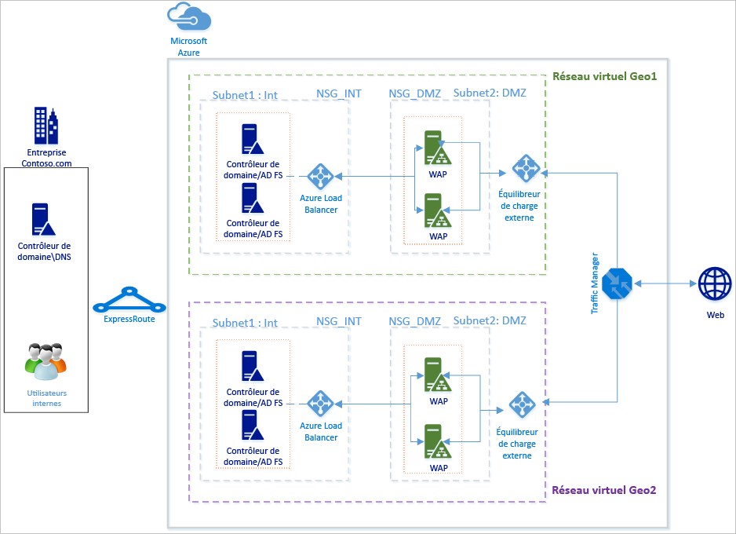
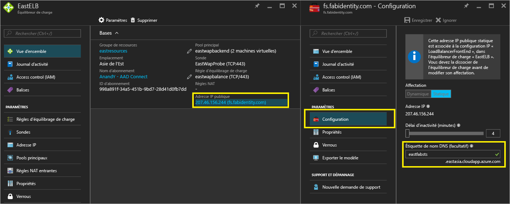
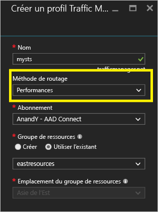
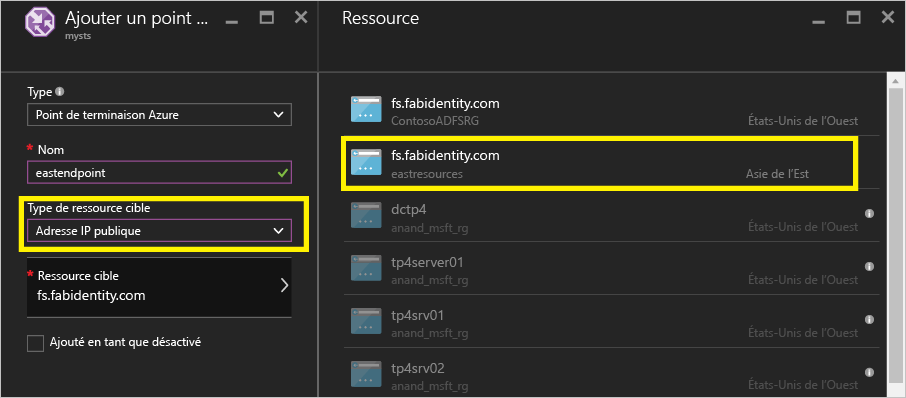
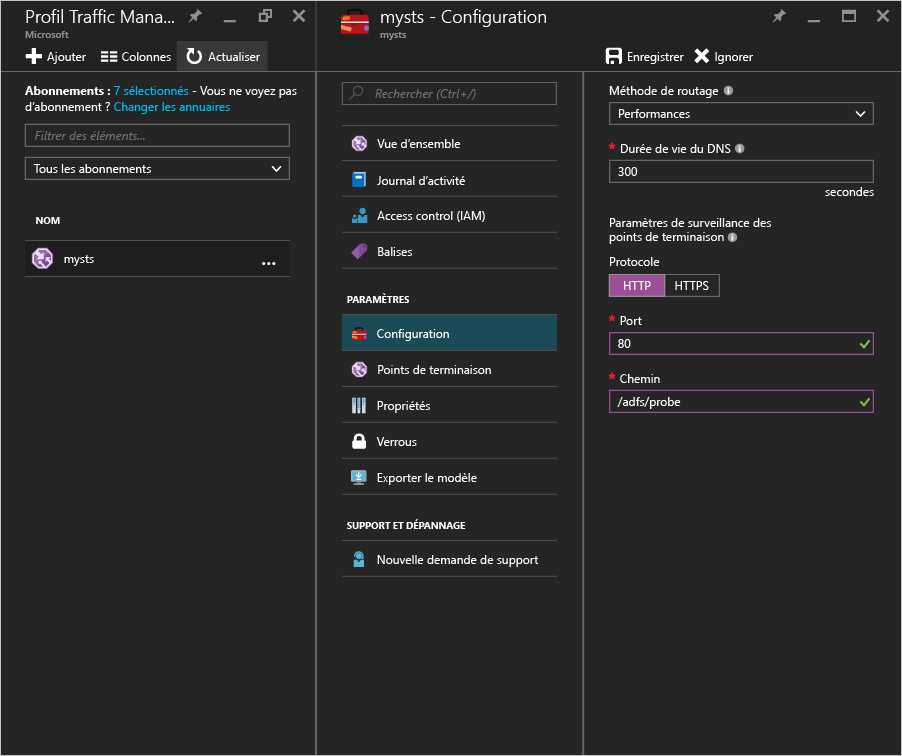
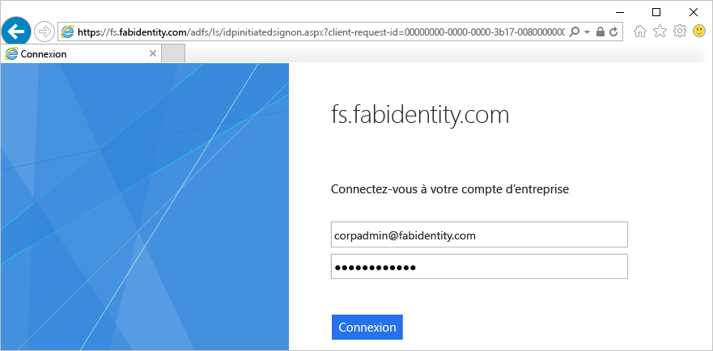
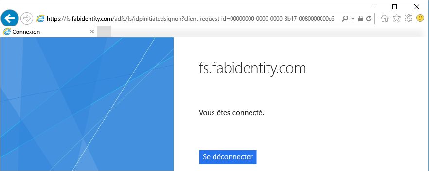

# Déploiement des services AD FS haute disponibilité par-delà les frontières dans Azure avec Azure Traffic Manager
[Déploiement des services AD FS dans Azure](active-directory-aadconnect-azure-adfs.md) fournit des instructions détaillées sur la façon dont vous pouvez déployer une infrastructure AD FS simple pour votre organisation dans Azure. Cet article indique les étapes suivantes permettant de créer un déploiement par-delà les frontières des services AD FS dans Azure à l’aide [d’Azure Traffic Manager](../traffic-manager/traffic-manager-overview.md). Azure Traffic Manager permet de créer une infrastructure AD FS à haute disponibilité et haute performance, répartie géographiquement pour votre organisation en utilisant les différentes méthodes de routage disponibles en fonction des besoins de l’infrastructure.

Une infrastructure AD FS hautement disponible et par-delà les frontières permet d’obtenir ce qui suit :

* **Élimination du point de défaillance unique :** les fonctionnalités de basculement d’Azure Traffic Manager vous permettent d’obtenir une infrastructure AD FS hautement disponible même en cas de panne de l’un des centres de données mondiaux.
* **Performances améliorées :** vous pouvez utiliser le déploiement suggéré dans cet article pour fournir une infrastructure AD FS haute performance qui peut aider les utilisateurs à s’authentifier plus rapidement. 

## Principes de conception

Les principes de conception de base sont identiques à ceux qui sont indiqués dans la section Principes de conception de l’article relatif au déploiement des services AD FS dans Azure. Le diagramme ci-dessus présente une extension simple du déploiement de base vers une autre région géographique. Voici quelques points à prendre en compte lors de l’extension de votre déploiement vers une nouvelle région géographique :

* **Réseau virtuel :** vous devez créer un réseau virtuel dans la région géographique où vous souhaitez déployer une infrastructure AD FS supplémentaire. Dans le diagramme ci-dessus, vous pouvez observer les deux réseaux virtuels Geo1 VNET et Geo2 VNET dans chaque région géographique.
* **Contrôleurs de domaine et serveurs AD FS dans le réseau virtuel de la nouvelle région géographique :** il est recommandé de déployer des contrôleurs de domaine dans la nouvelle région géographique afin que les serveurs AD FS de cette nouvelle région n’aient pas à contacter un contrôleur de domaine d’un autre réseau éloigné pour effectuer une authentification, ce qui améliore ainsi les performances.
* **Comptes de stockage :** les comptes de stockage sont associés à une région. Étant donné que vous déployez des machines dans une nouvelle région géographique, vous devez créer des comptes de stockage à utiliser dans la région.  
* **Groupes de sécurité réseau :** comme les comptes de stockage, les groupes de sécurité réseau créés dans une région ne peuvent pas être utilisés dans une autre région géographique. Vous devez donc créer des groupes de sécurité réseau semblables à ceux de la première région géographique pour les sous-réseaux INT et DMZ dans la nouvelle zone géographique.
* **Noms DNS des adresses IP publiques :** Azure Traffic Manager peut désigner des points de terminaison UNIQUEMENT via des noms DNS. Vous devez donc créer des noms DNS pour les adresses IP publiques des équilibreurs de charge externes.
* **Azure Traffic Manager :** Microsoft Azure Traffic Manager vous permet de contrôler la distribution du trafic utilisateur vers vos points de terminaison de service exécutés dans différents centres de données du monde entier. Azure Traffic Manager fonctionne au niveau du DNS. Il utilise les réponses DNS pour diriger le trafic de l’utilisateur final vers les points de terminaison globalement distribués. Les clients se connectent ensuite à ces points de terminaison directement. Avec les différentes options de routage Performances, Pondéré et Priorité, vous pouvez facilement choisir l’option de routage qui convient le mieux aux besoins de votre organisation. 
* **Connectivité réseau virtuel à réseau virtuel entre deux régions :** il est inutile de disposer d’une connectivité entre les réseaux virtuels proprement dits. Comme chaque réseau virtuel a accès aux contrôleurs de domaine et possède des serveurs AD FS et WAP, il peut fonctionner sans aucune connectivité entre les réseaux virtuels des différentes régions. 

## Procédure d’intégration d’Azure Traffic Manager
### Déployer les services AD FS dans la nouvelle région géographique
Suivez les étapes et les instructions décrites dans l’article [Déploiement des services AD FS dans Azure](active-directory-aadconnect-azure-adfs.md) pour déployer la même topologie dans la nouvelle région géographique.

### Noms DNS des adresses IP publiques des équilibreurs de charge accessibles sur Internet (publics)
Comme indiqué ci-dessus, Azure Traffic Manager ne peut faire référence aux points de terminaison qu’en utilisant des noms DNS. Il est donc important de créer des noms DNS pour les adresses IP publiques des équilibreurs de charge externes. La capture d’écran affichée ci-dessous vous indique comment configurer votre nom DNS pour l’adresse IP publique. 

### Déploiement d’Azure Traffic Manager
Suivez les étapes ci-dessous pour créer un profil Traffic Manager. Pour plus d’informations, vous pouvez également vous reporter à l’article [Gestion d’un profil Azure Traffic Manager](../traffic-manager/traffic-manager-manage-profiles.md).

1. **Créez un profil Traffic Manager :** donnez un nom unique à votre profil Traffic Manager. Ce nom de profil fait partie du nom DNS et sert de préfixe pour l’étiquette du nom de domaine Traffic Manager. Le nom/préfixe est ajouté à .trafficmanager.net pour créer le nom DNS de votre gestionnaire de trafic. La capture d’écran affichée ci-dessous illustre la définition du préfixe DNS du gestionnaire de trafic, mysts, et la création du nom DNS obtenu, mysts.trafficmanager.net. 
   
    
2. **Méthode de routage du trafic :** trois options de routage sont disponibles dans Traffic Manager :
   
   * Priorité 
   * Performances
   * Pondéré
     
     **Performancess** est recommandée pour obtenir une infrastructure AD FS hautement réactive. Toutefois, vous pouvez choisir une méthode de routage qui convient mieux à vos besoins de déploiement. L’option de routage sélectionnée n’a pas d’incidence sur les fonctionnalités des services AD FS. Pour plus d’informations, consultez l’article [Méthodes de routage du trafic de Traffic Manager](../traffic-manager/traffic-manager-routing-methods.md) . Dans l’exemple de capture d’écran ci-dessus, vous pouvez voir la méthode **Performances** sélectionnée.
3. **Configurez des points de terminaison :** dans la page Traffic Manager, cliquez sur des points de terminaison et sélectionnez Ajouter. Cette action permet d’ouvrir la page Ajouter un point de terminaison semblable à la capture d’écran ci-dessous.
   
   
   
   Pour les différentes entrées, suivez les recommandations ci-dessous :
   
   **Type :** sélectionnez Point de terminaison Azure, car nous allons pointer vers une adresse IP publique Azure.
   
   **Nom :** créez le nom que vous souhaitez associer au point de terminaison. Il ne s’agit pas du nom DNS et il n’a aucune incidence sur les enregistrements DNS.
   
   **Type de ressource cible :** sélectionnez Adresse IP publique comme valeur de cette propriété. 
   
   **Ressource cible :** vous pouvez choisir parmi les différents noms DNS dont vous disposez dans votre abonnement. Choisissez le nom DNS à attribuer.
   
   Ajoutez un point de terminaison pour chaque région géographique vers laquelle vous souhaitez qu’Azure Traffic Manager achemine le trafic.
   Pour plus d’informations et pour connaître les instructions détaillées pour ajouter/configurer des points de terminaison dans Traffic Manager, reportez-vous à l’article [Ajouter, désactiver, activer ou supprimer des points de terminaison](../traffic-manager/traffic-manager-endpoints.md)
4. **Configure probe (Configurer une analyse) :** dans la page Traffic Manager, cliquez sur Configuration. Dans la page de configuration, vous devez modifier les paramètres d’analyse pour analyser le port HTTP 80 et le chemin d’accès relatif /adfs/probe.
   
     
   
   > [!NOTE]
   > **Une fois la configuration terminée, assurez-vous que les points de terminaison ont bien l’état EN LIGNE**. Si tous les points de terminaison sont pourvus de l’état « Détérioré», Azure Traffic Manager s’efforce d’acheminer le trafic en supposant que le diagnostic est incorrect et que tous les points de terminaison sont accessibles.
   > 
   > 
5. **Modification des enregistrements DNS pour Azure Traffic Manager :** votre service de fédération doit être un enregistrement CNAME pour le nom DNS d’Azure Traffic Manager. Créez un enregistrement CNAME dans les enregistrements DNS publics afin que toute personne qui tente de contacter le service de fédération accède en fait à Azure Traffic Manager.
   
    Par exemple, pour pointer le service de fédération fs.fabidentity.com vers Traffic Manager, vous devez mettre à jour votre enregistrement de ressource DNS comme suit :
   
    <code>fs.fabidentity.com IN CNAME mysts.trafficmanager.net</code>

## Tester le routage et la connexion des services AD FS
### Test de routage
Un test très basique du routage consiste à effectuer un test Ping sur le nom DNS du service de fédération à partir d’une machine de chaque région géographique. Selon la méthode de routage choisie, le point de terminaison soumis réellement au test Ping est reflété dans l’affichage Ping. Par exemple, si vous avez sélectionné le routage de type Performances, le point de terminaison le plus proche de la région du client est atteint. L’instantané indiqué ci-dessous présente deux tests Ping à partir de deux machines clientes de différentes régions, l’une dans la région Asie de l’Est et l’autre dans la région États-Unis de l’Ouest. 

### Test de connexion des services AD FS
Le moyen le plus simple de tester AD FS est d’utiliser la page IdpInitiatedSignon.aspx. Pour cela, vous devez activer l’authentification IdpInitiatedSignOn sur les propriétés AD FS. Suivez les étapes ci-dessous pour vérifier votre configuration AD FS

1. À l’aide de PowerShell, exécutez l’applet de commande ci-dessous sur le serveur AD FS pour l’activer. 
   Set-AdfsProperties -EnableIdPInitiatedSignonPage $true
2. À partir d’une machine externe, accédez à https://<yourfederationservicedns>/adfs/ls/IdpInitiatedSignon.aspx
3. Vous devriez accéder à la page AD FS ci-dessous :
   
    
   
    En cas de connexion réussie, vous obtenez un message de réussite semblable à celui qui suit :
   
    

## Liens connexes
* [Déploiement des services AD FS dans Azure](active-directory-aadconnect-azure-adfs.md)
* [Qu’est-ce que Traffic Manager ?](../traffic-manager/traffic-manager-overview.md)
* [Méthodes de routage du trafic de Traffic Manager](../traffic-manager/traffic-manager-routing-methods.md)

## Étapes suivantes
* [Gestion d’un profil Azure Traffic Manager](../traffic-manager/traffic-manager-manage-profiles.md)
* [Ajouter, désactiver, activer ou supprimer des points de terminaison](../traffic-manager/traffic-manager-endpoints.md) 

<!---HONumber=Nov16_HO2-->

