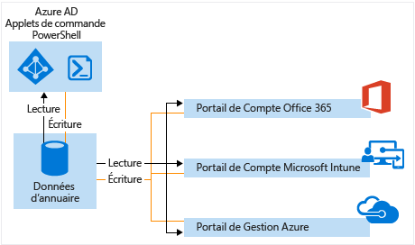

# Gérer votre annuaire Azure AD

## Qu'est-ce qu'un locataire Azure AD ?
Dans Azure Active Directory (Azure AD), un locataire est une instance dédiée d’un annuaire Azure AD que reçoit votre organisation quand elle s’inscrit à un service cloud Microsoft comme Azure ou Office 365. Chaque annuaire Azure AD est distinct et indépendant des autres annuaires Azure AD. De la même manière qu’un immeuble de bureaux d’entreprise est un élément d’actif sûr propre à votre organisation, un annuaire Azure AD est également conçu pour être un élément d’actif sûr pour les seuls besoins de votre organisation. L’architecture Azure AD isole les données du client et ses informations d’identité de façon à ce que les utilisateurs et les administrateurs d’un annuaire Azure AD ne puissent accéder accidentellement ou de façon malveillante aux données d’un autre annuaire.

## Comment puis-je obtenir un annuaire Azure AD ?
Azure AD fournit l’annuaire principal et les fonctionnalités de gestion d’identité qui existent derrière la plupart des services cloud Microsoft, y compris :

* Azure
* Microsoft Office 365
* Microsoft Dynamics CRM Online
* Microsoft Intune

Quand vous vous inscrivez à ces services cloud Microsoft, vous obtenez un annuaire Azure AD. Vous pouvez créer des annuaires supplémentaires en fonction des besoins. Par exemple, vous pouvez mettre à jour votre premier annuaire en tant qu’annuaire de production, puis créer un autre annuaire pour les tests ou l’environnement intermédiaire.

### Utilisation de l’annuaire Azure AD fourni avec un nouvel abonnement Azure

Nous vous recommandons d’utiliser le compte d’administrateur que vous avez utilisé pour votre premier service lorsque vous vous inscrivez à d’autres services Microsoft. Les informations que vous fournissez la première fois que vous vous inscrivez à un service Microsoft sont utilisées pour créer une nouvelle instance de l’annuaire Azure AD pour votre organisation. Si vous utilisez cet annuaire pour authentifier les tentatives de connexion lorsque vous vous abonnez à d’autres services Microsoft, ils peuvent utiliser les comptes d’utilisateur, les stratégies et paramètres existants, ou l’intégration de l’annuaire local que vous configurez dans votre annuaire par défaut.

Ainsi, le fait de s’inscrire à un abonnement Microsoft Intune et de synchroniser par la suite votre annuaire Active Directory local avec votre annuaire Azure AD vous permet de vous inscrire à un autre service Microsoft tel qu’Office 365 et de bénéficier facilement des mêmes avantages liés à l’intégration d’annuaire dont vous disposez avec Microsoft Intune.

Pour plus d’informations sur l’intégration de votre annuaire local à Azure AD, consultez [Intégration d’annuaires avec Azure AD Connect](active-directory-aadconnect.md).

### Associer un annuaire Azure AD à un nouvel abonnement Azure
Vous pouvez associer un nouvel abonnement Azure au même annuaire authentifiant les connexions d’un abonnement Office 365 ou Microsoft Intune existant. Pour plus d’informations sur ce scénario, consultez [Transférer la propriété d’un abonnement Azure à un autre compte](../billing/billing-subscription-transfer.md)

### Création d’un annuaire Azure AD en vous inscrivant à un service cloud Microsoft en tant qu’organisation
Si vous n’êtes pas encore abonné à un service cloud Microsoft, cliquez sur l’un des liens ci-dessous pour vous inscrire. Un annuaire Azure AD est créé automatiquement dès votre inscription à un premier service.

* [Microsoft Azure](https://account.azure.com/organization)
* [Office 365](http://products.office.com/business/compare-office-365-for-business-plans/)
* [Microsoft Intune](https://portal.office.com/Signup/Signup.aspx?OfferId=40BE278A-DFD1-470a-9EF7-9F2596EA7FF9&dl=INTUNE_A&ali=1#0%20)

### Comment changer l’annuaire par défaut d’un abonnement

1. Connectez-vous au [Centre des comptes Azure](https://account.azure.com/Subscriptions) avec un compte qui est l’administrateur du compte de l’abonnement pour transférer la propriété de l’abonnement.
2. Vérifiez que l’utilisateur dont vous voulez être le propriétaire de l’abonnement est dans l’annuaire cible.
3. Cliquez sur **Transférer la propriété de l’abonnement**.
4. Spécifiez le destinataire. Le destinataire reçoit automatiquement un e-mail contenant un lien d’acceptation.
5. Le destinataire clique sur le lien et suit les instructions, notamment pour la saisie des informations de paiement. Lorsque le destinataire a terminé, l’abonnement est transféré. 
6. L’annuaire par défaut de l’abonnement est remplacé par l’annuaire contenant l’utilisateur si le transfert de la propriété de l’abonnement a réussi.

Pour en savoir plus, consultez [Transfert de la propriété de l’abonnement Azure à un autre compte](../billing/billing-subscription-transfer.md).

### Gérer l’annuaire par défaut dans Azure
Lorsque vous vous inscrivez à Azure, un annuaire Azure AD par défaut est associé à votre abonnement. L’utilisation d’Azure AD n’engendre aucun coût et vos annuaires sont gratuits. Certains services Azure AD payants sont concédés sous licence distincte et fournissent des fonctionnalités supplémentaires telles que des logos à l’inscription et une réinitialisation de mot de passe en libre-service. Vous pouvez également créer un domaine personnalisé à l’aide d’un nom DNS que vous possédez à la place du domaine par défaut *. onmicrosoft.com.

## Comment puis-je gérer les données d’un annuaire ?
Pour administrer un ou plusieurs abonnements de service cloud Microsoft, vous pouvez utiliser le [centre d’administration Azure AD](https://aad.portal.azure.com), le portail de compte Microsoft Intune ou le [Centre d’administration Office 365](https://portal.office.com/) pour gérer les données d’annuaire de votre organisation. Vous pouvez également utiliser [les applets de commande Azure Active Directory PowerShell](https://docs.microsoft.com/powershell/azure/active-directory) pour vous aider à gérer les données stockées dans Azure AD.

À partir de ces portails (ou applets de commande), vous pouvez :

* Créer et gérer des comptes d’utilisateur et de groupe
* Gérer les services cloud associés des abonnements de votre organisation
* Configurer l’intégration locale avec les services d’identité et d’authentification Azure AD

Le centre d’administration Azure AD, le centre d’administration Office 365, le portail des comptes Microsoft Intune et les applets de commande Azure AD sont tous lus/écrits depuis/vers une seule instance partagée d’Azure AD qui est associée à l’annuaire de votre organisation. Chacun de ces outils agit comme une interface frontale qui extrait ou modifie vos données d’annuaire.

Lorsque vous modifiez les données de votre organisation à l’aide d’un des portails ou des applets de commande en étant connecté dans le contexte de l’un de ces services, les modifications sont également affichées dans les autres portails la prochaine fois que vous vous connectez. Ces données sont partagées entre les services cloud Microsoft auxquels vous êtes abonné.

Ainsi, le fait d’utiliser le centre d’administration Office 365 pour empêcher un utilisateur de se connecter empêche l’utilisateur de se connecter à tous les autres services auxquels votre organisation est abonnée. Si vous affichez le même compte d’utilisateur dans le portail de compte Microsoft Intune, vous constatez également que l’utilisateur est bloqué.

## Comment puis-je ajouter et gérer plusieurs annuaires ?
Vous pouvez [ajouter un annuaire Azure AD dans le portail Azure](https://portal.azure.com/#create/Microsoft.AzureActiveDirectory). Renseignez les informations et sélectionnez **Créer**.

Vous pouvez gérer chaque annuaire comme une ressource entièrement indépendante : chaque annuaire est un homologue complet et logiquement indépendant des autres annuaires que vous gérez ; il n’existe aucune relation parent-enfant entre les annuaires. Cette indépendance entre les annuaires vaut pour les ressources, l’administration et la synchronisation.

* **Indépendance des ressources**. Si vous créez ou supprimez une ressource dans un annuaire, cela est sans effet sur les ressources d’un autre annuaire, à l’exception partielle des utilisateurs externes. Si vous utilisez un domaine personnalisé (par exemple, « contoso.com ») pour un annuaire, il ne peut être utilisé avec aucun autre annuaire.
* **Indépendance de l’administration**.  Si un utilisateur, qui n’est pas administrateur de l’annuaire « Contoso », crée un annuaire de test « Test », alors :
  
  * Les administrateurs de l’annuaire « Contoso » n’ont pas de privilèges d’administration directs sur l’annuaire « Test », à moins qu’un administrateur de « Test » leur ait spécifiquement accordé ces privilèges. Les administrateurs de « Contoso » peuvent contrôler l’accès à l’annuaire « Test » en vertu du contrôle qu’ils exercent sur le compte d’utilisateur qui a créé « Test ».
    
  * Si vous assignez ou supprimez un rôle d’administrateur à un utilisateur dans un annuaire, la modification n’affecte pas le rôle d’administrateur que l’utilisateur peut avoir dans un autre annuaire.
* **Indépendance de la synchronisation**. Vous pouvez configurer chaque locataire Azure AD de manière indépendante de sorte que les données soient synchronisées à partir d’une même instance de l’outil de synchronisation d'annuaires Azure AD Connect.

Contrairement aux autres ressources Azure, vos annuaires ne sont pas des ressources enfants d’un abonnement Azure. Ainsi, si vous annulez votre abonnement ou si vous le laissez expirer, vous pouvez toujours accéder à vos données d’annuaire à l’aide d’Azure AD PowerShell, de l’API Graph Azure ou d’autres interfaces, telles que le Centre d’administration Office 365. Vous pouvez également associer un autre abonnement à l’annuaire.

## Comment préparer la suppression d’un annuaire Azure AD
Un administrateur général peut supprimer un annuaire Azure AD à partir du portail. Lorsqu’un annuaire est supprimé, toutes les ressources qui sont contenues dans cet annuaire sont également supprimées. Vérifiez que vous n’avez pas besoin de l’annuaire avant de le supprimer.

> [!NOTE]
> Si l’utilisateur s’est connecté avec un compte professionnel ou scolaire, il ne doit pas essayer de supprimer son annuaire de base. Par exemple, si l’utilisateur s’est connecté avec le compte joe@contoso.onmicrosoft.com, il ne peut pas supprimer l’annuaire dont le domaine par défaut est contoso.onmicrosoft.com.

Azure AD nécessite que certaines conditions soient remplies pour supprimer un annuaire. Cela limite le risque que la suppression d’un annuaire n’affecte négativement les utilisateurs ou les applications. La capacité des utilisateurs à se connecter à Office 365 ou à accéder à des ressources dans Azure en est un exemple. En cas de suppression involontaire d’un annuaire associé à un abonnement, les utilisateurs n’auraient par exemple plus accès aux ressources Azure de cet abonnement.

Les conditions à remplir sont les suivantes :

* Le seul utilisateur dans l’annuaire doit être l’administrateur général chargé de la suppression de l’annuaire. Tous les autres utilisateurs doivent être supprimés avant de pouvoir supprimer l’annuaire. Si les utilisateurs sont synchronisés en local, la synchronisation doit être désactivée et les utilisateurs doivent être supprimés dans l’annuaire cloud à l’aide du portail Azure ou des applets de commande Azure PowerShell. Il n’est pas nécessaire de supprimer des groupes ou des contacts, tels que les contacts ajoutés à partir du centre d’administration Office 365.
* Aucune application ne doit se trouver dans l’annuaire. Elles doivent toutes être supprimées avant de pouvoir supprimer l’annuaire.
* L’annuaire ne doit être lié à aucun fournisseur d’authentification multifacteur.
* L’annuaire ne doit être associé à aucun abonnement Microsoft Online Services, tel que Microsoft Azure, Office 365 ou Azure AD. Par exemple, si un annuaire par défaut a été créé pour vous dans Azure, vous ne pouvez pas le supprimer si votre abonnement Azure utilise toujours cet annuaire à des fins d’authentification. De même, vous ne pouvez pas supprimer un annuaire auquel un autre utilisateur a associé un abonnement. 

## Étapes suivantes
* [Forum Azure AD](https://social.msdn.microsoft.com/Forums/home?forum=WindowsAzureAD)
* [Forum Azure Multi-Factor Authentication](https://social.msdn.microsoft.com/Forums/home?forum=windowsazureactiveauthentication)
* [Questions relatives à Stack Overflow pour Azure](http://stackoverflow.com/questions/tagged/azure)
* [Azure Active Directory PowerShell](https://docs.microsoft.com/powershell/azure/active-directory)
* [Attribution de rôles d’administrateur dans Azure AD](active-directory-assign-admin-roles.md)

