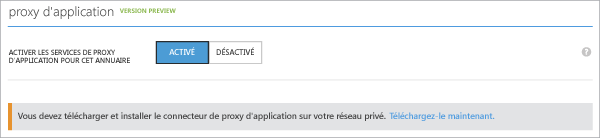

<properties
	pageTitle="Activation du proxy d’application Azure AD"
	description="Explique comment devenir opérationnel avec le proxy d’application Azure AD."
	services="active-directory"
	documentationCenter=""
	authors="rkarlin"
	manager="StevenPo"
	editor=""/>

<tags
	ms.service="active-directory"
	ms.workload="identity"
	ms.tgt_pltfrm="na"
	ms.devlang="na"
	ms.topic="article"
	ms.date="10/12/2015"
	ms.author="rkarlin"/>

# Activation du proxy d’application Azure AD
> [AZURE.NOTE]Le proxy d’application est une fonctionnalité qui n’est disponible que si vous effectuez une mise à niveau vers l’édition Premium ou De base d’Azure Active Directory. Pour plus d’informations, consultez la page [Éditions d’Azure Active Directory](active-directory-editions.md).

Le proxy d’application Microsoft Azure AD vous permet de publier des applications, telles que les sites SharePoint, Outlook Web Access et les applications IIS, à l’intérieur de votre réseau privé et offre un accès sécurisé aux utilisateurs en dehors de votre réseau. Les employés peuvent se connecter à vos applications depuis leur domicile, sur leurs propres appareils et s’authentifier via ce proxy cloud.

Cette section vous guide tout au long des procédures suivantes : l’activation du proxy d’application Microsoft Azure AD pour votre annuaire cloud dans Azure AD, l’installation du connecteur Proxy d’application sur votre réseau privé et l’inscription du connecteur avec votre abonnement de client Microsoft Azure AD.

##Conditions préalables pour le proxy d’application
Pour pouvoir activer et utiliser les services Proxy d’application, vous devez disposer des éléments suivants :

- Un compte d’administrateur Microsoft Azure. Si vous n’en avez pas, vous pouvez vous en procurer un ici.
- Un serveur exécutant Windows Server 2012 R2 ou Windows 8.1 ou version ultérieure sur lequel vous pouvez installer le connecteur Proxy d’application. Le serveur doit pouvoir envoyer des requêtes HTTPS aux services Proxy d’application dans le cloud et disposer d’une connexion HTTPS vers les applications que vous souhaitez publier. 
- S’il existe un pare-feu, assurez-vous qu’il autorise les requêtes HTTPS (TCP) qui vont du connecteur au proxy d’application. Le connecteur utilise ces ports avec des sous-domaines qui font partie du domaine de haut niveau : msappproxy.net. Veillez à ouvrir **tous** les ports suivants pour le trafic **sortant** :

Numéro de port | Description
--- | ---
80 | Active le trafic HTTP sortant pour valider la sécurité.
443 | Active l’authentification utilisateur auprès d’Azure AD (obligatoire uniquement pour le processus d’inscription du connecteur).
10100 - 10120 | Active les réponses HTTP LOB renvoyées au proxy.
9352, 5671 | Active la communication depuis le connecteur vers le service Azure pour les requêtes entrantes.
9350 | Facultatif. Permet de meilleures performances pour les requêtes entrantes.
8080 | Active la séquence de démarrage du connecteur et la mise à jour automatique du connecteur.
9090 | Active l’enregistrement du connecteur (obligatoire uniquement pour le processus d’inscription du connecteur).
9091 | Active le renouvellement automatique de certificat de confiance du connecteur.
 
Si votre pare-feu régule le trafic en fonction des utilisateurs d’origine, ouvrez ces ports au trafic provenant des services Windows exécutés en tant que service réseau. Assurez-vous également d’activer le port 8080 pour NT Authority\\System.

##Étape 1 : activer le proxy d’application dans Azure AD
1. Connectez-vous en tant qu’administrateur dans le portail de gestion Azure.
2. Accédez à Active Directory, puis sélectionnez l’annuaire dans lequel vous souhaitez activer le proxy d’application.
3. Cliquez sur Configurer, faites défiler l’écran jusqu’à Proxy d’application, puis faites passer Activer les services de proxy d’application pour ce répertoire en mode Activé.

	 

4. Cliquez sur Télécharger maintenant en bas de l’écran. Vous accédez alors à la page de téléchargement. Lisez et acceptez les termes du contrat de licence, puis cliquez sur Télécharger pour enregistrer le fichier Windows Installer (.exe) pour le connecteur Proxy d’application. 

##Étape 2 : installer et inscrire le connecteur
1. Exécutez AADApplicationProxyConnectorInstaller.exe sur le serveur que vous avez préparé (consultez Conditions préalables pour le proxy d’application).
2. Suivez les instructions de l’Assistant pour effectuer l’installation.
3. Au cours de l’installation, vous êtes invité à inscrire le connecteur en utilisant votre compte Proxy d’application actif.

Fournissez vos informations d’identification d’administrateur général Azure AD. Assurez-vous que l’administrateur qui inscrit le connecteur se trouve bien dans l’annuaire dans lequel vous avez activé le service Proxy d’application. Par exemple, si le domaine du client est contoso.com, l’administrateur doit être admin@contoso.com ou tout autre alias de ce domaine. De plus, vous devez être un administrateur général du client Azure AD. Votre client d’administrateur général peut être différent de vos informations d’identification Microsoft Azure. Si l’option Configuration de sécurité renforcée d’Internet Explorer a la valeur Activé sur le serveur sur lequel vous installez le connecteur Azure AD, l’écran d’inscription risque d’être bloqué. Si cela se produit, suivez les instructions du message d’erreur pour autoriser l’accès. Assurez-vous que la sécurité renforcée d’Internet Explorer est désactivée. En cas d’échec de l’inscription du connecteur, consultez Résolution des problèmes du proxy d’application.

4. À l’issue de l’installation, deux nouveaux services sont ajoutés à votre serveur, comme dans l’illustration ci-dessous. Il s’agit du service Connecteur, qui est chargé d’activer la connectivité, et d’un service de mise à jour automatisé, qui recherche périodiquement l’existence de nouvelles versions du connecteur et procède éventuellement à sa mise à jour. Cliquez sur Terminer dans la fenêtre d’installation pour terminer l’installation. 

5. Vous êtes maintenant prêt à publier des applications avec le proxy d’application.

Si vous souhaitez désinstaller le connecteur, après avoir désinstallé le service Connecteur et le service Mise à jour, veillez à redémarrer votre ordinateur pour supprimer complètement le service. 
Pour bénéficier d’une haute disponibilité, vous devez déployer au moins un connecteur supplémentaire. Pour déployer un connecteur supplémentaire, répétez les étapes 2 et 3 ci-dessus. Chaque connecteur doit être inscrit séparément.

## Voir aussi
Vous pouvez faire bien d’autres choses encore avec le Proxy d’application :

- [Publiez des applications avec le proxy d’application](active-directory-application-proxy-publish.md)
- [Publier des applications avec votre propre nom de domaine](active-directory-application-proxy-custom-domains.md)
- [Activer l’authentification unique](active-directory-application-proxy-sso-using-kcd.md)
- [Activer l’accès conditionnel](active-directory-application-proxy-conditional-access.md)
- [Utiliser des applications utilisant les revendications](active-directory-application-proxy-claims-aware-apps.md)
- [Résoudre les problèmes rencontrés avec le proxy d'application](active-directory-application-proxy-troubleshoot.md)

## En savoir plus sur le Proxy d’application
- [Consultez notre aide en ligne](active-directory-application-proxy-enable.md)
- [Consultez le blog sur le Proxy d’application](http://blogs.technet.com/b/applicationproxyblog/)
- [Regardez nos vidéos sur Channel 9](http://channel9.msdn.com/events/Ignite/2015/BRK3864)

## Ressources supplémentaires

* [Inscription à Azure en tant qu’organisation](..sign-up-organization.md)
* [Identité Azure](..fundamentals-identity.md)
* [Publier des applications avec le proxy d’application](active-directory-application-proxy-publish.md)

<!---HONumber=Oct15_HO3-->