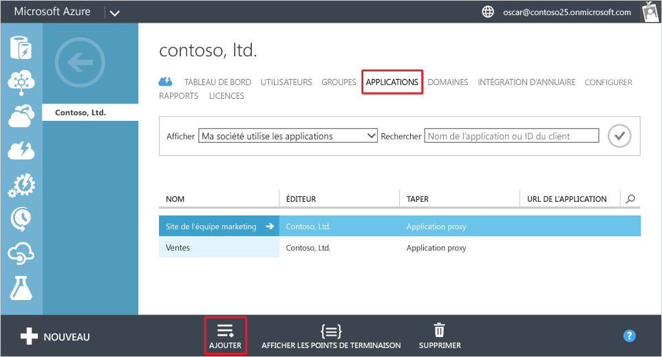
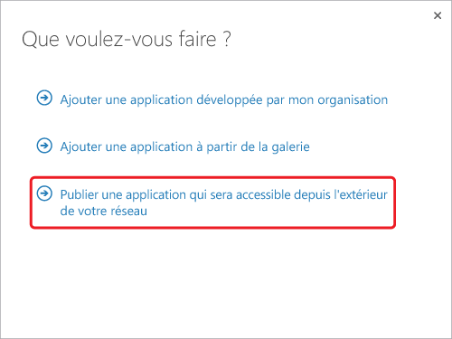
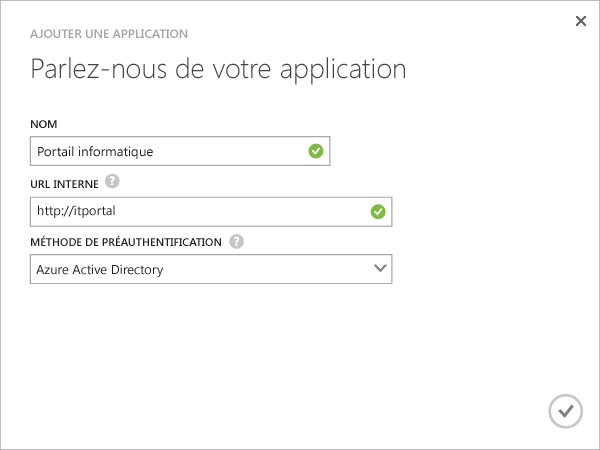
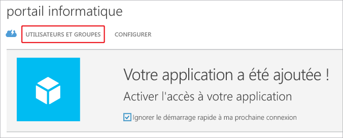
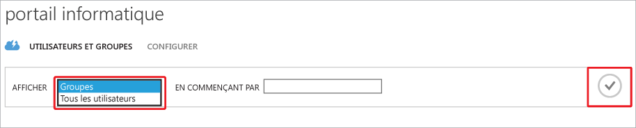
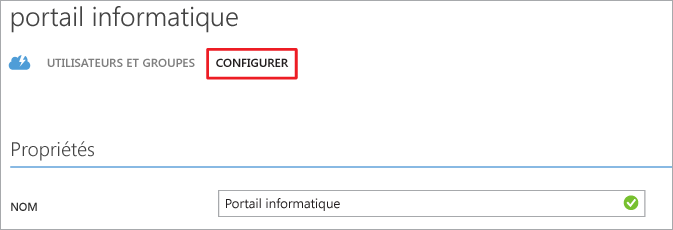

# Publier des applications avec le Proxy d’application Azure AD

> [!div class="op_single_selector"]
> * [Portail Azure](application-proxy-publish-azure-portal.md)
> * [Portail Azure Classic](active-directory-application-proxy-publish.md)

Le service Proxy d’application Azure AD vous aide à prendre en charge les personnes qui travaillent à distance en publiant des applications locales afin de les rendre accessibles sur Internet. À ce stade, vous devriez déjà avoir [activé le service Proxy d’application dans le Portail Azure Classic](active-directory-application-proxy-enable.md). Cet article vous guide tout au long de la procédure de publication d’applications exécutées sur votre réseau local et fournissant un accès à distance sécurisé hors de votre réseau. Après avoir terminé cet article, vous serez prêt à configurer l’application avec des exigences de sécurité ou des informations personnalisées.

> [!NOTE]
> Le proxy d’application est une fonctionnalité qui n’est disponible que si vous effectuez une mise à niveau vers l’édition Premium ou De base d’Azure Active Directory. Pour plus d’informations, consultez la page [Éditions d’Azure Active Directory](active-directory-editions.md). Si vous souhaitez utiliser le proxy d’application, vous pouvez [publier des applications dans le portail Azure](application-proxy-publish-azure-portal.md).

## Publier une application à l’aide de l’Assistant
1. Connectez-vous au [Portail Azure Classic](https://manage.windowsazure.com/)en tant qu’administrateur.
2. Accédez à Active Directory, puis sélectionnez l’annuaire dans lequel vous avez activé le proxy d’application.
   
    
3. Cliquez sur l’onglet **Applications**, puis sur le bouton **Ajouter** au bas de l’écran
   
    
4. Sélectionnez **Publier une application qui sera accessible depuis l’extérieur de votre réseau**.
   
    
5. Fournissez les informations suivantes sur votre application :
   
   * **Nom**: nom convivial de votre application. Il doit être unique au sein de votre annuaire.
   * **URL interne**: adresse utilisée par le connecteur du proxy d’application pour accéder à l’application à partir de votre réseau privé. Vous pouvez spécifier un chemin spécifique sur le serveur principal à publier, alors que le reste du serveur n’est pas publié. De cette façon, vous pouvez publier des sites différents sur le même serveur et donner à chacun d’eux son propre nom et ses propres règles d’accès.
     
     > [!TIP]
     > Si vous publiez un chemin d’accès, vérifiez qu’il inclut l’ensemble des images, des scripts et des feuilles de style nécessaires pour votre application. Par exemple, si votre application est sur https://yourapp/app et utilise des images situées dans https://yourapp/media, vous devez publier https://yourapp/ comme chemin d’accès.
     > 
     > 
   * **Méthode de préauthentification**: façon dont le service Proxy d’application vérifie les utilisateurs avant de leur donner accès à votre application. Choisissez l’une des options du menu contextuel.
     
     * Azure Active Directory : le proxy d’application redirige les utilisateurs pour la connexion à Azure AD, qui authentifie leurs autorisations pour le répertoire et l’application.
     * Direct : les utilisateurs n’ont pas besoin de s’authentifier pour accéder à l’application.
     
       
6. Pour terminer l’Assistant, cliquez sur la coche en bas de l’écran. L’application est maintenant définie dans Azure AD.

## Affecter des utilisateurs et des groupes à l’application
Pour que vos utilisateurs puissent accéder à votre application publiée, vous devez les affecter individuellement ou en groupes. (N’oubliez pas de vous affecter également un accès.) Chaque utilisateur assigné doit posséder une licence pour la version De base d’Azure ou versions ultérieures. Vous pouvez affecter des licences à des utilisateurs individuels ou à des groupes. Pour plus d’informations, consultez [Azure AD et applications : affectation d’utilisateurs à une application](active-directory-applications-guiding-developers-assigning-users.md). 

Pour les applications qui requièrent une préauthentification, le fait d’assigner un utilisateur permet d’accorder des autorisations pour utiliser l’application. Pour les applications qui ne nécessitent pas de préauthentification, l’assignation d’un utilisateur signifie que celui-ci peut accéder à l’application via le panneau d’accès.

1. Lorsque vous terminez l’Assistant Ajout d’application, la page Démarrage rapide pour votre application s’affiche. Pour gérer les utilisateurs ayant accès à l’application, sélectionnez **Utilisateurs et groupes**.
   
    
2. Recherchez des groupes spécifiques dans votre annuaire, ou affichez tous les utilisateurs. Pour afficher les résultats de recherche, cliquez sur la coche.
   
      
3. Sélectionnez chaque utilisateur ou groupe que vous souhaitez affecter à cette application, puis cliquez sur **Affecter**. Vous êtes invité à confirmer cette action.

> [!NOTE]
> Pour les applications avec authentification Windows intégrée, vous pouvez affecter uniquement les utilisateurs et les groupes qui ont été synchronisés à partir de votre Active Directory local. Il n’est pas possible d’affecter les utilisateurs qui se connectent à l’aide d’un compte Microsoft et les invités aux applications publiées avec le proxy d’application Azure Active Directory. Vérifiez que les utilisateurs se connectent avec des informations d’identification faisant partie du même domaine que l’application que vous publiez.
> 
> 

## Tester votre application publiée
Une fois que vous avez publié votre application, vous pouvez la tester en accédant à l’URL que vous avez publiée. Vérifiez que vous pouvez accéder à l’application, qu’elle s’affiche correctement et que tout fonctionne comme prévu. Si vous rencontrez un problème ou obtenez un message d’erreur, consultez le [guide de résolution des problèmes](active-directory-application-proxy-troubleshoot.md).

## Configuration de votre application
Vous pouvez modifier les applications publiées ou configurer les options avancées dans la page Configurer. Dans cette page, vous pouvez personnaliser votre application en modifiant son nom ou en chargeant un logo. Vous pouvez également gérer les règles d’accès, comme la méthode de préauthentification ou l’authentification multifacteur.

Une fois que vous avez publié des applications qui utilisent le Proxy d’application Azure Active Directory, elles apparaissent dans la liste des applications dans Azure AD et vous pouvez les gérer à partir de cet emplacement.

Si vous désactivez les services de proxy d’application après avoir publié des applications, celles-ci ne sont plus accessibles hors de votre réseau privé. Vos utilisateurs peuvent toujours accéder aux applications locales comme d’habitude.

Pour afficher une application et vous assurer qu’elle est accessible, double-cliquez sur son nom. Si le service Proxy d’application est désactivé et que l’application n’est pas disponible, un message d’avertissement s’affiche en haut de l’écran.

Pour supprimer une application, sélectionnez-la dans la liste, puis cliquez sur **Supprimer**.

## Étapes suivantes
* [Publier des applications avec votre propre nom de domaine](active-directory-application-proxy-custom-domains.md)
* [Activer l’authentification unique](active-directory-application-proxy-sso-using-kcd.md)
* [Activer l’accès conditionnel](active-directory-application-proxy-conditional-access.md)
* [Utiliser des applications utilisant les revendications](active-directory-application-proxy-claims-aware-apps.md)

Pour les dernières nouvelles et mises à jour, consultez le site [Application Proxy blog](http://blogs.technet.com/b/applicationproxyblog/)

