<properties
   pageTitle="Procédure détaillée de l'utilisation de l'aperçu de la collaboration B2B d'Azure Active Directory | Microsoft Azure"
   description="Azure Active Directory B2B Collaboration prend en charge les relations interentreprises en permettant aux partenaires commerciaux d’accéder de façon sélective à vos applications d’entreprise"
   services="active-directory"
   documentationCenter=""
   authors="viv-liu"
   manager="cliffdi"
   editor=""
   tags=""/>

<tags
   ms.service="active-directory"
   ms.devlang="NA"
   ms.topic="get-started-article"
   ms.tgt_pltfrm="NA"
   ms.workload="identity"
   ms.date="05/09/2016"
   ms.author="viviali"/>

# Version préliminaire d’Azure AD B2B Collaboration : procédure pas à pas

Cette procédure détaillée explique comment utiliser la collaboration B2B d'Azure AD. En tant qu'administrateur informatique de Contoso, nous voulons partager des applications avec les employés de trois sociétés partenaires. Les sociétés partenaires ne sont pas obligées de posséder Azure AD.

- Alice de Simple Partner Org
- Bob, de Medium Partner Org, a besoin d'accéder à un ensemble d'applications
- Carol, de Complex Partner Org, a besoin d'accéder à un ensemble d'applications et d'appartenir à des groupes de Contoso

Une fois les invitations aux utilisateurs partenaires envoyées, nous pouvons les configurer dans Azure AD pour accorder l'accès aux applications et l'appartenance aux groupes par le biais du portail Azure. Commençons par ajouter Alice.

## Ajout d’Alice à l’annuaire Contoso
1. Créez un fichier .csv avec les en-têtes indiqués, en remplissant uniquement les champs **Email**, **DisplayName** et **InviteContactUsUrl** pour Alice. **DisplayName** est le nom qui apparaît dans l’invitation et également le nom qui apparaît dans l’annuaire Azure AD Contoso. **InviteContactUsUrl** est un moyen pour Alice de contacter Contoso. Dans l’exemple suivant, InviteContactUsUrl spécifie le profil LinkedIn de Contoso. Il est important d’orthographier les étiquettes dans la première ligne du fichier .csv exactement comme spécifié dans la [référence du format de fichier CSV](active-directory-b2b-references-csv-file-format.md).  
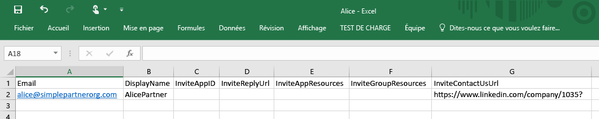

2. Dans le portail Azure, ajoutez un utilisateur dans l'annuaire Contoso (Active Directory > Contoso > Utilisateurs > Ajouter un utilisateur). Dans la liste déroulante « Type d'utilisateur », sélectionnez « Utilisateurs dans les sociétés partenaires ». Téléchargez le fichier .csv. Assurez-vous que le fichier .csv est fermé avant de le télécharger.  
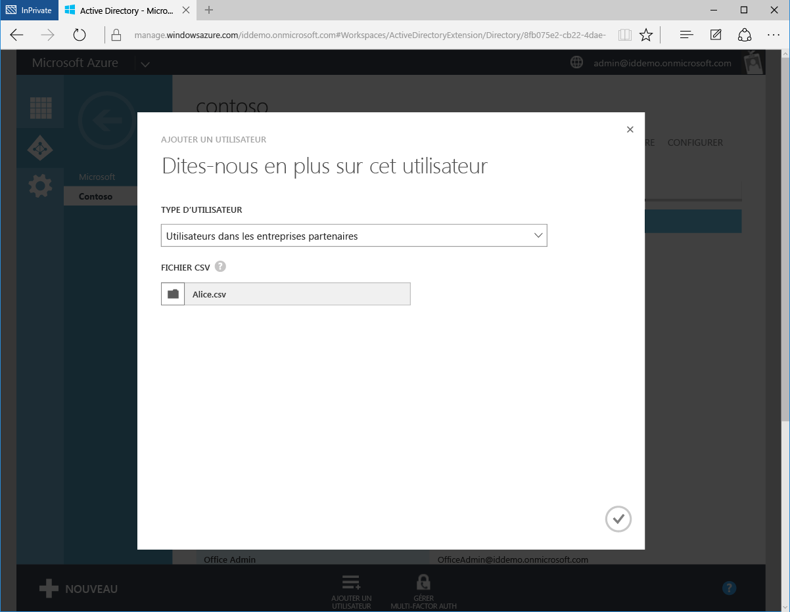

3. Alice est maintenant représentée comme un Utilisateur externe dans l’annuaire Azure AD Contoso.  
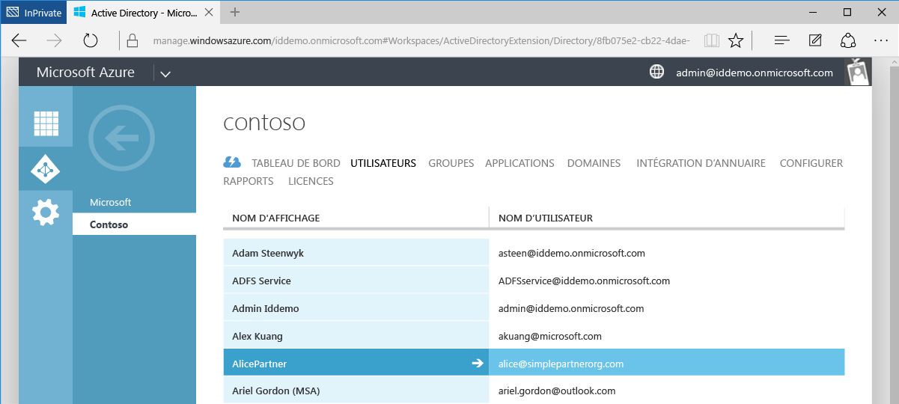

4. Alice reçoit l’e-mail suivant.  
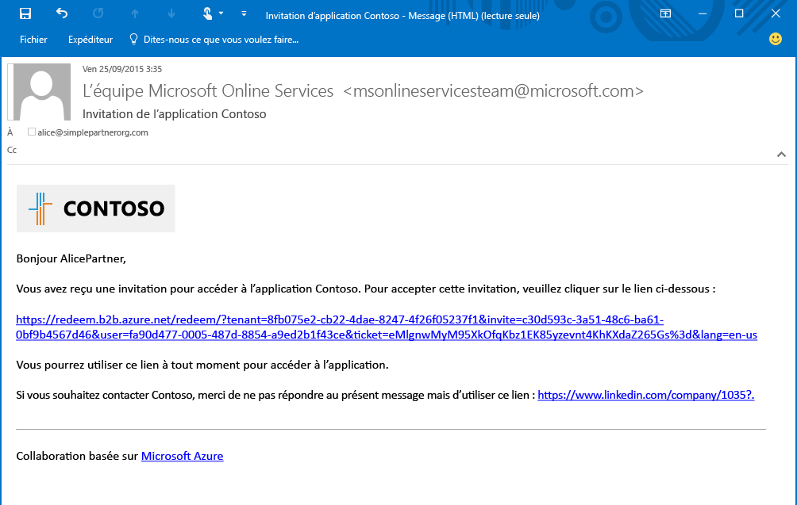

5. Alice clique sur le lien et elle est invitée à accepter l'invitation et à se connecter à l'aide de ses informations d'identification professionnelles. Si Alice n’est pas dans l’annuaire Azure AD, elle est invitée à s’inscrire.  
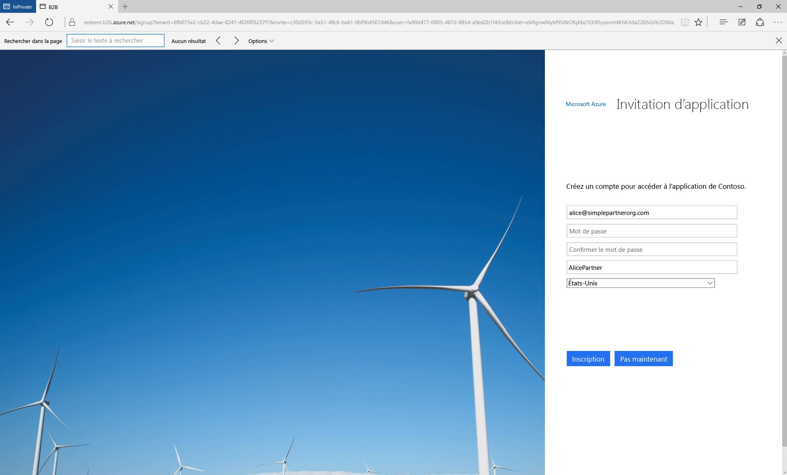

6. Alice est redirigée vers le volet d'accès à l'application, qui est vide jusqu'à ce qu'elle ait accès aux applications.  
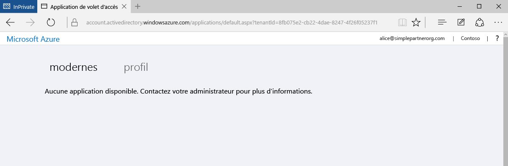

Cette procédure est la forme la plus simple de collaboration B2B. En tant qu’utilisateur dans l’annuaire Azure AD Contoso, Alice peut accéder aux applications et aux groupes via le Portail Azure. Maintenant nous allons ajouter Bob, qui a besoin d'accéder aux applications Moodle et Salesforce.

## Ajout de Bob à l’annuaire Contoso et accès aux applications
1. Utilisez Windows PowerShell avec le module Azure AD installé pour rechercher les ID d'applications de Moodle et Salesforce. Les ID peuvent être récupérés à l'aide de l'applet de commande : `Get-MsolServicePrincipal | fl DisplayName, AppPrincipalId` Ceci affiche une liste de toutes les applications disponibles dans Contoso et leurs AppPrincialIds.  

2. Créez un fichier .csv contenant les champs Email, DisplayName, **InviteAppID**, **InviteAppResources** et InviteContactUsUrl pour Bob. Remplissez **InviteAppResources** avec les valeurs AppPrincipalIds de Moodle et Salesforce provenant de PowerShell et séparées par un espace. Remplissez **InviteAppId** avec la même valeur AppPrincipalId de Moodle pour marquer les pages d’e-mail et de connexion avec un logo Moodle.  
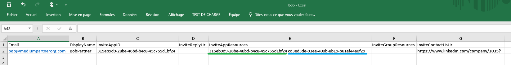

3. Téléchargez le fichier .csv par le biais du portail Azure comme cela a été fait pour Alice. Bob est maintenant un utilisateur externe dans l’annuaire Azure AD Contoso.

4. Bob reçoit l’e-mail suivant.  
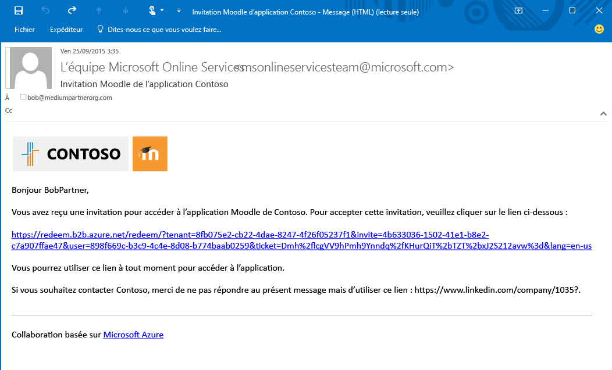

5. Bob clique sur le lien et est invité à accepter l'invitation. Une fois qu'il est connecté, il est dirigé vers le volet d'accès et peut déjà utiliser Moodle et Salesforce.  
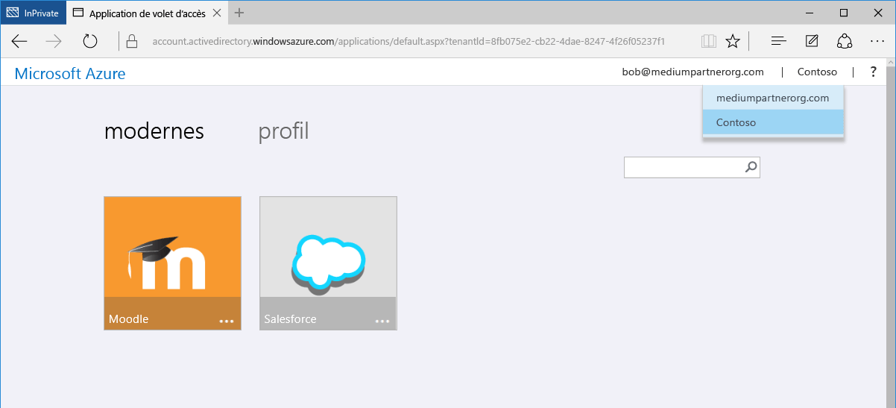

Nous allons ensuite ajouter Carol, qui a besoin d’accéder à des applications et d’appartenir à des groupes dans l’annuaire Contoso.

## Ajout de Carol à l’annuaire Contoso, accès aux applications et appartenance à un groupe

1. Utilisez Windows PowerShell avec le module Azure AD installé pour rechercher les ID d'applications et les ID de groupes au sein de Contoso.
 - Récupérez la valeur AppPrincipalId à l'aide de l'applet de commande `Get-MsolServicePrincipal | fl DisplayName, AppPrincipalId`, comme pour Bob.
 - Récupérer ObjectId pour les groupes à l’aide de l’applet de commande `Get-MsolGroup | fl DisplayName, ObjectId`. Ceci affiche une liste de tous les groupes de Contoso et leurs ObjectIds. Les ID de groupes peuvent également être récupérés sous la forme de l'ID d'objet dans l'onglet Propriétés du groupe dans le portail Azure.  

2. Créez le fichier .csv, en remplissant les champs Email, DisplayName, InviteAppID, InviteAppResources, **InviteGroupResources** et InviteContactUsUrl pour Carol. **InviteGroupResources** est rempli avec les valeurs ObjectIds des groupes MonGroupe1 et Externes, séparées par un espace.  
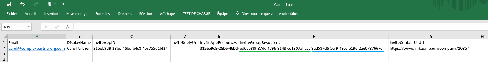

3. Téléchargez le fichier .csv par le biais du portail Azure.

4. Carol est un utilisateur dans l’annuaire Contoso et est également membre des groupes MonGroupe1 et Externes, comme illustré dans le Portail Azure.  
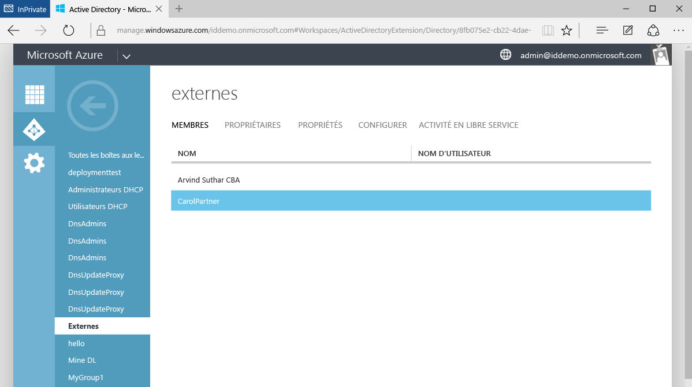

5. Carol reçoit un e-mail contenant un lien pour accepter l’invitation. Une fois connectée, elle est redirigée vers le volet d’accès à l’application pour accéder à Moodle et Salesforce.

C'est tout en ce qui concerne l'ajout d'utilisateurs de sociétés partenaires dans la collaboration B2B d'Azure AD. Cette procédure vous a montré comment ajouter des utilisateurs Alice, Bob et Carol à l’annuaire Contoso à l’aide de fichiers .csv séparés. Ce processus peut être facilité en condensant les fichiers .csv séparés en un seul fichier.  
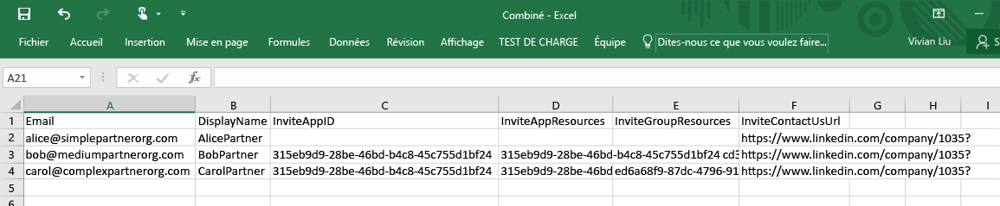

## Articles connexes
Consultez les autres articles sur la collaboration B2B d'Azure AD :

- [Qu'est-ce que la collaboration B2B d'Azure AD ?](active-directory-b2b-what-is-azure-ad-b2b.md)
- [Fonctionnement](active-directory-b2b-how-it-works.md)
- [Référence du format de fichier CSV](active-directory-b2b-references-csv-file-format.md)
- [Format du jeton utilisateur externe](active-directory-b2b-references-external-user-token-format.md)
- [Modifications de l’attribut d’objet utilisateur externe](active-directory-b2b-references-external-user-object-attribute-changes.md)
- [Limites actuelles de la version préliminaire](active-directory-b2b-current-preview-limitations.md)
- [Index d’articles pour la gestion des applications dans Azure Active Directory](active-directory-apps-index.md)

<!---HONumber=AcomDC_0511_2016-->
