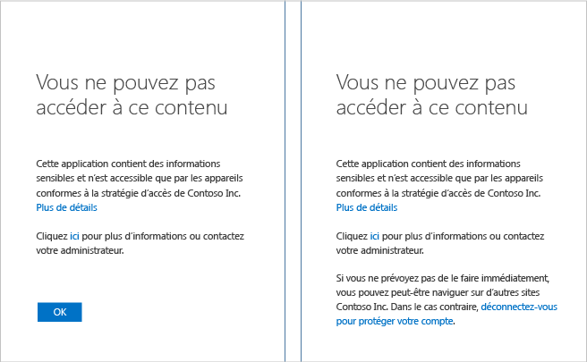
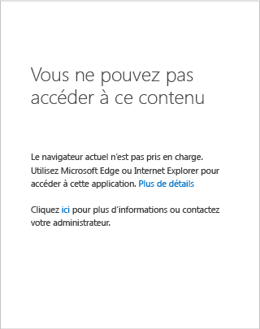

<properties
	pageTitle="Résolution des problèmes : Vous ne pouvez pas y accéder à partir d’ici | Microsoft Azure"
	description="Cette rubrique vous aide à déterminer la procédure permettant d’accéder à l’application que vous souhaitez utiliser."
	services="active-directory"
	keywords="accès conditionnel en fonction de l’appareil, inscription de l’appareil, activer l’inscription de l’appareil, inscription de l’appareil et GPM"
	documentationCenter=""
	authors="markusvi"
	manager="femila"
	editor=""/>

<tags
	ms.service="active-directory"
	ms.workload="identity"
	ms.tgt_pltfrm="na"
	ms.devlang="na"
	ms.topic="get-started-article"
	ms.date="08/23/2016"
	ms.author="markvi"/>

# Résolution des problèmes : Vous ne pouvez pas y accéder à partir d’ici

Une page d’accès refusé s’affiche lorsque vous accédez à une application telle que SharePoint Online. Que faire dans cette situation ?

Ce guide vous aide à déterminer la procédure de correction permettant d’accéder à l’application que vous souhaitez utiliser.

Sur quelle plateforme fonctionne votre appareil ? La réponse à cette question vous dirige vers l’une des sections suivantes :

-	Appareil Windows
-	Appareil iOS (iPhone ou iPad)
-	Appareil Android

## Accès à partir d’un appareil Windows

Si votre appareil exécute Windows 10, Windows 8.1, Windows 8.0, Windows 7, Windows Server 2016, Windows Server 2012 R2, Windows Server 2012 ou Windows Server 2008 R2, sélectionnez la cause appropriée en identifiant la page affichée lors de votre tentative d’accès à l’application.

### L’appareil n’est pas inscrit

Si votre appareil n’est pas inscrit auprès d’Azure Active Directory et que votre application est protégée à l’aide d’une stratégie d’appareil, une page présentant le contenu suivant peut s’afficher :

Si votre appareil appartient à un domaine lié à Active Directory dans votre organisation, vous pouvez appliquer la procédure suivante :

1.	Vérifiez que vous êtes connecté à Windows à l’aide de votre compte professionnel (compte Active Directory).
2.	Connectez-vous à votre réseau d’entreprise via un VPN ou DirectAccess.
3.	Une fois connecté, verrouillez votre session Windows à l’aide de la combinaison de touches Windows + L.
4.	Déverrouillez votre session Windows en saisissant les informations d’identification de votre compte de travail.
5.	Attendez une minute, puis essayez d’accéder à nouveau à l’application.
6.	Si la même page s’affiche, contactez votre administrateur, cliquez sur **More details (Plus d'informations)** et fournissez les informations demandées.

Si votre appareil n’appartient pas à un domaine et exécute Windows 10, deux possibilités s’offrent à vous :

- Exécutez Azure AD Join.
- Ajoutez votre compte professionnel ou scolaire à Windows.

Pour plus d’informations sur les différences entre les deux, consultez la section [Utilisation d’appareils Windows 10 sur votre lieu de travail](active-directory-azureadjoin-windows10-devices.md).

Pour exécuter Azure AD Join, exécutez la procédure suivante (indisponible dans Windows Phone) :

**Mise à jour Anniversaire de Windows 10**

1.	Ouvrez l’application **Paramètres**.
2.	Cliquez sur **Comptes** > **Access work or school (Accès professionnel ou scolaire)**.
3.	Cliquez sur **Connecter**.
4.	Cliquez sur **Join this device to Azure AD (Joindre cet appareil à Azure AD)** en bas de la page.
5.	Authentifiez-vous auprès de votre organisation, fournissez une preuve d’authentification multifacteur si nécessaire, et suivez la procédure jusqu’à la fin.
6.	Déconnectez-vous puis reconnectez-vous à l’aide de votre compte professionnel.
7.	Essayez d’accéder à nouveau à l’application.

**Mise à jour Windows 10 de novembre 2015**

1.	Ouvrez l’application **Paramètres**.
2.	Cliquez sur **Système** > **À propos de**.
3.	Cliquez sur **Joindre Azure AD**.
4.	Authentifiez-vous auprès de votre organisation, fournissez une preuve d’authentification multifacteur si nécessaire, et suivez la procédure jusqu’à la fin.
5.	Déconnectez-vous et reconnectez-vous à l’aide de votre compte professionnel (compte Azure AD).
6.	Essayez d’accéder à nouveau à l’application.

Pour ajouter votre compte professionnel ou scolaire, suivez la procédure suivante :

**Mise à jour Anniversaire de Windows 10**

1.	Ouvrez l’application **Paramètres**.
2.	Cliquez sur **Comptes** > **Access work or school (Accès professionnel ou scolaire)**.
3.	Cliquez sur **Connecter**.
4.	Authentifiez-vous auprès de votre organisation, fournissez une preuve d’authentification multifacteur si nécessaire, et suivez la procédure jusqu’à la fin.
5.	Essayez d’accéder à nouveau à l’application.

**Mise à jour Windows 10 de novembre 2015**

1.	Ouvrez l’application **Paramètres**.
2.	Cliquez sur **Comptes** > **Votre compte**.
3.	Cliquez sur **Ajouter un compte professionnel ou scolaire**.
4.	Authentifiez-vous auprès de votre organisation, fournissez une preuve d’authentification multifacteur si nécessaire, et suivez la procédure jusqu’à la fin.
5.	Essayez d’accéder à nouveau à l’application.

Si votre appareil n’est pas joint au domaine et exécute Windows 8.1, vous pouvez procéder à une jonction d’espace de travail et vous inscrire auprès de Microsoft Intune en appliquant la procédure suivante :

1.	Ouvrez **Paramètres du PC**.
2.	Cliquez sur **Réseau** > **Espace de travail**.
3.	Cliquez sur **Joindre**.
4.	Authentifiez-vous auprès de votre organisation, fournissez une preuve d’authentification multifacteur si nécessaire, et suivez la procédure jusqu’à la fin.
5.	Cliquez sur **Activer**.
6.	Patientez jusqu'à la fin.
7.	Essayez d’accéder à nouveau à l’application.

## Navigateur non pris en charge

Si vous accédez à l’application à partir des navigateurs suivants, une page similaire à celle ci-dessous s’affiche :

- Chrome, Firefox ou navigateur autre que Microsoft Edge ou Microsoft Internet Explorer dans Windows 10 ou Windows Server 2016.
- Firefox dans Windows 8.1, Windows 7, Windows Server 2012 R2, Windows Server 2012 ou Windows Server 2008 R2.

La seule possibilité consiste à utiliser un navigateur pris en charge par l’application sur la plateforme de votre appareil.

## Accéder à partir d’un appareil iOS
Revenez plus tard consulter les instructions pour iPhone ou iPad.

## Accéder à partir d’un appareil Android
Revenez plus tard consulter les instructions pour téléphones ou tablettes Android.

## Étapes suivantes

[Accès conditionnel Azure Active Directory](active-directory-conditional-access.md)

<!-----HONumber=AcomDC_0831_2016-->