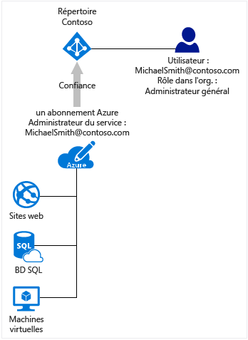

# Association des abonnements Azure avec Azure Active Directory
Cet article vous fournit des informations sur la relation entre un abonnement Azure et Azure Active Directory (Azure AD), et vous explique comment ajouter un abonnement existant à votre annuaire Azure AD.

## Relation de votre abonnement Azure à Azure AD
Votre abonnement Azure possède une relation d’approbation avec Azure AD, ce qui signifie qu’il fait confiance à l’annuaire pour authentifier les utilisateurs, les services et les appareils. Plusieurs abonnements peuvent faire confiance au même annuaire, mais un abonnement ne fait confiance qu’à un seul annuaire. 

La relation d’approbation dont dispose un abonnement avec un annuaire diffère de la relation qu’il possède avec d’autres ressources dans Azure (sites web, bases de données etc.). En cas d’expiration d’un abonnement, l’accès aux autres ressources associées à cet abonnement s’arrête également. En revanche, un annuaire Azure AD reste dans Azure. Vous pouvez associer un autre abonnement à cet annuaire et le gérer à l’aide d’un autre abonnement.

Tous les utilisateurs disposent d'un annuaire de base unique qui les authentifie, mais ils peuvent également être invités dans d'autres annuaires. Dans Azure AD, vous pouvez voir les annuaires dont votre compte d’utilisateur est membre ou invité.

## Azure AD et les abonnements de service cloud
Azure AD fournit l’annuaire principal et les fonctionnalités de gestion d’identité qui existent derrière la plupart des services cloud Microsoft, y compris :

* Azure
* Microsoft Office 365
* Microsoft Dynamics CRM Online
* Microsoft Intune

Quand vous vous inscrivez à ces services cloud Microsoft, vous obtenez gratuitement le service Azure AD. Il n’est possible d’ajouter un nouvel abonnement Azure à un annuaire Azure AD que si vous êtes connecté avec un compte Microsoft. Si vous êtes connecté à Azure avec un compte professionnel ou scolaire, il est impossible d’ajouter un abonnement Azure à un annuaire existant, car votre compte professionnel ou scolaire ne peut pas être authentifié directement par Azure. 

## Pour ajouter un abonnement existant à votre annuaire Azure AD
Vous devez vous connecter avec un compte qui existe à la fois dans l’annuaire actif auquel l’abonnement est associé et dans l’annuaire dans lequel vous souhaitez l’ajouter. 

1. Connectez-vous au [Centre des comptes Azure](https://account.azure.com/Subscriptions) avec un compte qui est l’administrateur du compte de l’abonnement et dont vous souhaitez transférer la propriété de l’abonnement.
2. Vérifiez que l’utilisateur dont vous voulez être le propriétaire de l’abonnement est dans l’annuaire cible.
3. Cliquez sur **Transférer la propriété de l’abonnement**.
4. Spécifiez le destinataire. Le destinataire reçoit automatiquement un e-mail contenant un lien d’acceptation.
5. Le destinataire clique sur le lien et suit les instructions, notamment pour la saisie des informations de paiement. Lorsque le destinataire a terminé, l’abonnement est transféré. 
6. L’annuaire par défaut de l’abonnement est modifié pour être remplacé par l’annuaire contenant l’utilisateur.

Pour en savoir plus, consultez [Transfert de la propriété de l’abonnement Azure à un autre compte](../billing/billing-subscription-transfer.md).

## Suggestions pour gérer un abonnement et un annuaire
Les rôles administratifs d’un abonnement Azure gèrent les ressources liées à l'abonnement Azure. Cette section explique les différences entre les administrateurs d’abonnements Azure et les administrateurs d’annuaires Azure AD. Les rôles d’administration et les autres suggestions permettant de les utiliser pour gérer votre abonnement sont expliqués dans [Attribution de rôles d’administrateur dans Azure Active Directory](active-directory-assign-admin-roles.md).

Le rôle d'administrateur de service vous est, par défaut, attribué dès lors que vous vous abonnez. Si d'autres personnes doivent se connecter et accéder aux services à l'aide de l'abonnement, vous pouvez les ajouter en tant que coadministrateurs. 

Azure AD dispose d’un autre ensemble de rôles administratifs qui permet de gérer l’annuaire et les fonctionnalités liées à l'identité. Par exemple, l'administrateur général d'un annuaire peut ajouter des utilisateurs et des groupes dans l’annuaire ou exiger l'authentification multifacteur des utilisateurs. Un utilisateur qui crée un annuaire est affecté au rôle d’administrateur général et peut attribuer des rôles d'administration à d'autres utilisateurs. Les rôles administratifs Azure AD sont également utilisés par d'autres services tels que Office 365 et Microsoft Intune. 

Les administrateurs d'abonnement Azure et les administrateurs d’annuaires Azure AD ont deux rôles bien différents. 
* Les administrateurs d’abonnement Azure peuvent gérer des ressources dans Azure et utiliser Azure AD dans le portail Azure (car le portail Azure est lui-même une ressource Azure). 
* Les administrateurs d’annuaires ne peuvent gérer des propriétés que dans l’annuaire Azure AD.

Une personne peut se voir attribuer deux rôles, mais ceci n'est en aucun cas obligatoire. Un administrateur général d’annuaires peut ne pas être administrateur de services ou coadministrateur d’un abonnement Azure, et inversement. L’utilisateur peut se connecter au portail Azure sans être un administrateur de l’abonnement, mais il ne peut pas gérer les annuaires de cet abonnement dans le portail. Toutefois, cet utilisateur peut gérer des annuaires à l’aide d’autres outils comme Azure AD PowerShell ou le Centre d’administration Office 365.

## Étapes suivantes
* Pour en savoir plus sur la façon de modifier les administrateurs d’un abonnement Azure, consultez [Transférer la propriété d’un abonnement Azure à un autre compte](../billing/billing-subscription-transfer.md)
* Pour plus d’informations sur la façon dont l’accès aux ressources est contrôlé dans Microsoft Azure, voir [Présentation de l’accès aux ressources dans Azure](active-directory-understanding-resource-access.md)
* Pour plus d’informations sur l’attribution des rôles dans Azure AD, voir [Attribution de rôles d’administrateur dans Azure Active Directory](active-directory-assign-admin-roles-azure-portal.md)

<!--Image references-->
[1]: ./media/active-directory-how-subscriptions-associated-directory/WAAD_PassThruAuth.png
[2]: ./media/active-directory-how-subscriptions-associated-directory/WAAD_OrgAccountSubscription.png
[3]: ./media/active-directory-how-subscriptions-associated-directory/WAAD_SignInDisambiguation.PNG

