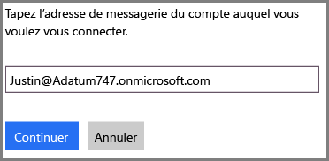
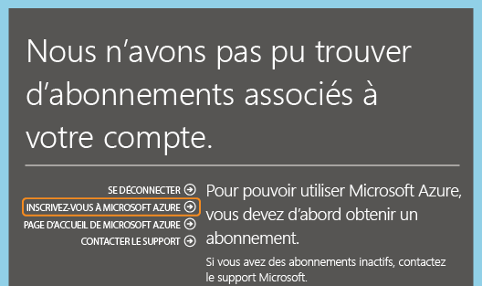

<properties
   pageTitle="Gestion du répertoire de l’abonnement Office 365 dans Azure | Microsoft Azure"
   description="Gestion d’un annuaire de comptes d’abonnements Office 365 à l’aide d’Azure Active Directory et du portail Azure Classic"
   services="active-directory"
   documentationCenter=""
   authors="curtand"
   manager="stevenpo"
   editor=""/>

<tags
   ms.service="active-directory"
   ms.devlang="na"
   ms.topic="article"
   ms.tgt_pltfrm="na"
   ms.workload="identity"
   ms.date="12/01/2015"
   ms.author="curtand"/>

#Gestion du répertoire de l’abonnement Office 365 dans Azure

Cet article décrit comment gérer un annuaire qui a été créé pour un abonnement à Office 365 dans le portail Azure Classic. Les étapes à effectuer diffèrent selon que vous ayez déjà ou non un abonnement Azure. Vous devez être un administrateur de service ou un co-administrateur d’un abonnement Azure pour vous connecter au portail Azure Classic.

Si vous n’avez pas d’abonnement Azure, il vous suffit de vous inscrire à l’aide du compte professionnel ou scolaire que vous utilisez pour vous connecter à Office 365.

Si aucun abonnement Azure correspondant n'est trouvé, vous pouvez cliquer sur **Inscription à Azure**. Les informations pertinentes du compte Office 365 sont alors préremplies dans le formulaire d'inscription. Ce même compte est affecté au rôle d'administrateur de service par défaut.

Une fois que vous êtes abonné à Azure, vous pouvez vous connecter au portail Azure Classic et accéder aux services Azure. Cliquez sur l'extension Active Directory pour gérer l'annuaire qui authentifie les utilisateurs Office 365.

Si vous avez déjà un abonnement Azure, le processus de gestion d’un annuaire supplémentaire est également simple. Le schéma suivant illustre le processus.

Dans cet exemple, Michael Smith dispose d'un abonnement Office 365 pour Contoso.com. Il possède un abonnement Azure obtenu via son compte Microsoft msmith@hotmail.com. Dans ce cas, il gère deux annuaires.

| Abonnement | Office 365 | Microsoft Azure |
|  -------------- | ------------- | ------------------------------- |
| Nom complet | Contoso | Annuaire par défaut |
| Nom de domaine | contoso.com | msmithhotmail.onmicrosoft.com |

Il souhaite gérer les identités des utilisateurs dans l'annuaire Contoso lorsqu'il est connecté à Azure via son compte Microsoft afin de pouvoir activer des fonctionnalités Azure AD telles que l'authentification multifacteur.

Dans ce cas, les deux annuaires sont indépendants l’un de l’autre.

##Pour gérer deux annuaires indépendants
Pour que Michael Smith puisse gérer les deux annuaires pendant qu'il est connecté à Azure en tant que msmith@hotmail.com, il a besoin d’effectuer les opérations suivantes :

> [AZURE.NOTE]Ces étapes ne peuvent être effectuées que lorsqu'un utilisateur est connecté via un compte Microsoft. Lorsque l'utilisateur est connecté à l’aide d’un compte professionnel ou scolaire, l'option **Utiliser un annuaire existant** est indisponible, car ce type de compte ne peut être authentifié qu’à l’aide d’un annuaire de base (autrement dit, l’annuaire du compte professionnel ou scolaire, qui est détenu par l’organisation ou l’établissement scolaire).

1.	Connectez-vous au portail Azure Classic en tant que msmith@hotmail.com.
2.	Cliquez sur **Nouveau** > **Services d’application** > **Active Directory** > **Répertoire** > **Création personnalisée**.
3.	Cliquez sur Utiliser un annuaire existant et sélectionnez la case **Je suis prêt à me déconnecter**.
4.	Connectez-vous au portail Azure Classic en tant qu’administrateur global de Contoso.onmicrosoft.com (par exemple, msmith@contoso.com)).
5.	Lorsque l’invite **Utiliser l’annuaire Contoso avec Azure ?** s’affiche, cliquez sur **Continuer**.
6.	Cliquez sur **Se déconnecter maintenant**.
7.	Connectez-vous au portail Azure Classic en tant que msmith@hotmail.com. L’annuaire Contoso et l’annuaire par défaut apparaissent dans l'extension Active Directory.

Après avoir effectué ces étapes, msmith@hotmail.com est un administrateur global dans l'annuaire Contoso.

##Pour gérer les ressources en tant qu’administrateur global
Supposons maintenant que John Doe doit se connecter au portail Azure Classic et administrer les sites web et ressources de base de données associés à l’abonnement Azure de msmith@hotmail.com. Pour cela, Michael Smith a besoin effectuer ces étapes supplémentaires :

1.	Connectez-vous au portail Azure Classic en utilisant le compte d’administrateur de service de l’abonnement Azure (dans cet exemple, msmith@hotmail.com)).
2.	Transférez l'abonnement à l'annuaire Contoso : cliquez sur **Paramètres** > **Abonnements** > sélectionnez l'abonnement > **Modifier l'annuaire** > sélectionnez **Contoso (Contoso.com)**. Dans le cadre du transfert, les comptes professionnels ou scolaires qui sont des co-administrateurs de l'abonnement sont supprimés.
3.	Ajoutez John Doe en tant que co-administrateur de l’abonnement : cliquez sur **Paramètres** > **Administrateurs** > sélectionnez l’abonnement > **Ajouter** > tapez ****JohnDoe@Contoso.com**.

##Étapes suivantes
Pour plus d'informations sur la relation entre les annuaires et les abonnements, consultez [Association des abonnements Azure avec Azure AD](active-directory-how-subscriptions-associated-directory.md).

<!---HONumber=AcomDC_1203_2015-->