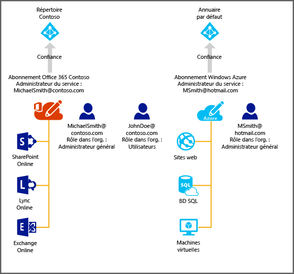

# Gestion du répertoire de l’abonnement Office 365 dans Azure
Cet article décrit comment gérer un répertoire créé pour un abonnement Office 365 dans le portail Azure Classic. Vous devez être l’administrateur du service ou un co-administrateur d’un abonnement Azure pour vous connecter au portail Azure Classic. Si vous n’avez pas d’abonnement Azure, vous pouvez vous inscrire pour une [période d’essai gratuite de 30 jours](https://azure.microsoft.com/trial/get-started-active-directory/) , puis déployer votre première solution cloud en moins de 5 minutes à l’aide de ce lien. Veillez à utiliser le compte professionnel ou scolaire que vous utilisez pour vous connecter à Office 365.

Une fois que vous êtes abonné à Azure, vous pouvez vous connecter au portail Azure Classic et accéder aux services Azure. Cliquez sur l’extension Active Directory pour gérer l’annuaire qui authentifie les utilisateurs Office 365.

Si vous avez un abonnement Azure, le processus de gestion d’un répertoire supplémentaire est également simple. Par exemple, Michael Smith a un abonnement Office 365 pour Contoso.com. Il a également un abonnement Azure obtenu via son compte Microsoft msmith@hotmail.com. Dans ce cas, il gère deux annuaires.

| Abonnement | Office 365 | Les tables Azure |
| --- | --- | --- |
|   Nom complet |Contoso |Répertoire Azure Active Directory (Azure AD) par défaut |
|   Nom de domaine |contoso.com |msmithhotmail.onmicrosoft.com |

Il souhaite gérer les identités des utilisateurs dans le répertoire Contoso lorsqu’il est connecté à Azure via son compte Microsoft afin de pouvoir activer des fonctionnalités Azure AD telles que l’authentification multifacteur. Le schéma suivant illustre le processus.

Dans ce cas, les deux annuaires sont indépendants l’un de l’autre.

## Pour gérer deux annuaires indépendants
Pour que Michael Smith puisse gérer les deux répertoires alors qu’il est connecté à Azure en tant que msmith@hotmail.com,, il doit effectuer les opérations suivantes :

> [!NOTE]
> Ces étapes ne peuvent être effectuées que lorsqu'un utilisateur est connecté via un compte Microsoft. Si l’utilisateur est connecté avec un compte professionnel ou scolaire, l’option **Utiliser un annuaire existant** n’est pas disponible. Un compte professionnel ou scolaire peut être authentifié uniquement par son répertoire de base (autrement dit, le répertoire où se trouve le compte professionnel ou scolaire et appartenant à l’entreprise ou à l’école).
>
>

1. Connectez-vous au [portail Azure Classic](https://manage.windowsazure.com) en tant que msmith@hotmail.com.
2. Cliquez sur **Nouveau** > **App Services** > **Active Directory** > **Répertoire** > **Création personnalisée**.
3. Cliquez sur Utiliser un annuaire existant et sélectionnez la case **Je suis prêt à me déconnecter** .
4. Connectez-vous au portail Azure Classic en tant qu’administrateur global de Contoso.onmicrosoft.com (par exemple, msmith@contoso.com).
5. Lorsque l’invite **Utiliser l’annuaire Contoso avec Azure ?** s’affiche, cliquez sur **Continuer**.
6. Cliquez sur **Se déconnecter maintenant**.
7. Connectez-vous au portail Azure Classic en tant que msmith@hotmail.com. L’annuaire Contoso et l’annuaire par défaut apparaissent dans l'extension Active Directory.

Après avoir effectué ces étapes, msmith@hotmail.com est un administrateur global dans l'annuaire Contoso.

## Pour gérer les ressources en tant qu’administrateur global
Supposons maintenant que Jane Doe doive administrer les sites web et les ressources de base de données associés à l’abonnement Azure de msmith@hotmail.com. Pour cela, Michael Smith a besoin d’effectuer ces étapes supplémentaires :

1. Connectez-vous au [portail Azure Classic](https://manage.windowsazure.com) en utilisant le compte d’administrateur de service de l’abonnement Azure (dans cet exemple, msmith@hotmail.com).
2. Transférez l’abonnement au répertoire Contoso : cliquez sur **Paramètres** > **Abonnements** > sélectionnez l’abonnement > **Modifier l’annuaire** > sélectionnez **Contoso (Contoso.com)**. Dans le cadre du transfert, les comptes professionnels ou scolaires qui sont co-administrateurs de l’abonnement sont supprimés.
3. Ajoutez Jane Doe comme co-administrateur de l’abonnement : cliquez sur **Paramètres** > **Administrateurs** > sélectionnez l’abonnement > **Ajouter** > tapez **JohnDoe@Contoso.com**.

## Étapes suivantes
Pour plus d’informations sur la relation entre les répertoires et les abonnements, consultez [Association des abonnements Azure avec Azure Active Directory](active-directory-how-subscriptions-associated-directory.md).

<!--HONumber=Nov16_HO2-->

