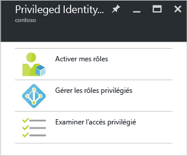

<properties
   pageTitle="Prise en main d’Azure AD Privileged Identity Management | Microsoft Azure"
   description="Découvrez comment gérer des identités privilégiées avec l’application Azure Active Directory Privileged Identity Management dans le portail Azure."
   services="active-directory"
   documentationCenter=""
   authors="kgremban"
   manager="femila"
   editor=""/>

<tags
   ms.service="active-directory"
   ms.devlang="na"
   ms.topic="get-started-article"
   ms.tgt_pltfrm="na"
   ms.workload="identity"
   ms.date="09/16/2016"
   ms.author="kgremban"/>

# Prise en main d’Azure AD Privileged Identity Management

Avec Azure Active Directory (AD) Privileged Identity Management, vous pouvez gérer, contrôler et surveiller l’accès au sein de votre organisation. Cela inclut l’accès aux ressources dans Azure AD et d’autres services en ligne Microsoft comme Office 365 ou Microsoft Intune.

Cet article vous indique comment ajouter l'application Azure AD PIM à votre tableau de bord du portail Azure.

## Ajout de l’application Privileged Identity Management

Avant d'utiliser Azure AD Privileged Identity Management, vous devez ajouter l'application à votre tableau de bord du portail Azure.

1. Connectez-vous au [portail Azure](https://portal.azure.com/) en tant qu’administrateur général de votre répertoire.
2. Si votre organisation possède plusieurs répertoires, sélectionnez votre nom d’utilisateur dans le coin supérieur droit du portail Azure. Sélectionnez le répertoire dans lequel vous allez utiliser PIM.
3. Sélectionnez **Plus de services** et utilisez la zone de texte Filtre pour rechercher **Azure AD Privileged Identity Management**.
4. Cochez **Épingler au tableau de bord**, puis cliquez sur **Créer**. L’application Privileged Identity Management s’ouvre.

Si vous êtes la première personne à utiliser Azure AD Privileged Identity Management dans votre répertoire, l’[Assistant Sécurité](active-directory-privileged-identity-management-security-wizard.md) vous guide tout au long de la procédure d’attribution initiale. Vous deviendrez alors automatiquement le premier **administrateur de la sécurité** et **administrateur de rôle privilégié** du répertoire. Seul un administrateur de rôle privilégié peut accéder à cette application pour gérer l’accès des autres administrateurs.

## Accédez à vos tâches

Une fois Azure AD Privileged Identity Management configuré, le panneau de navigation s’affichera chaque fois que vous ouvrirez l’application. Utilisez ce panneau pour accomplir vos tâches de gestion des identités.

- **Activer mes rôles** vous permet d’accéder à la liste des rôles qui vous sont assignés. C’est là que vous activerez tous les rôles auquel vous êtes éligible.

- **Gérer les rôles privilégiés** est le tableau de bord utilisé par les administrateurs de rôles privilégiés pour gérer les affectations de rôle, modifier les paramètres d’activation de rôle, réaliser les révisions d’accès et bien plus encore. Les options de ce tableau de bord sont désactivées pour toutes les personnes qui ne sont pas des administrateurs de rôle privilégié.

- **Réviser un accès privilégié** vous permet d’accéder aux révisions d’accès en attente que vous devez effectuer pour vous-même ou pour un tiers.

<!--Every topic should have next steps and links to the next logical set of content to keep the customer engaged-->
## Étapes suivantes

La [vue d’ensemble Azure AD Privileged Identity Management](active-directory-privileged-identity-management-configure.md) inclut plus de détails sur la manière de gérer un accès administrateur dans votre organisation.

[AZURE.INCLUDE [active-directory-privileged-identity-management-toc](../../includes/active-directory-privileged-identity-management-toc.md)]

<!--Image references-->

[1]: ./media/active-directory-privileged-identity-management-configure/PIM_EnablePim.png

<!---HONumber=AcomDC_0921_2016-->