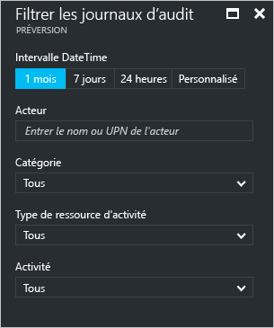
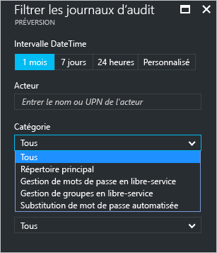
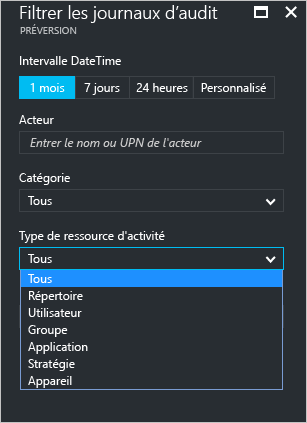
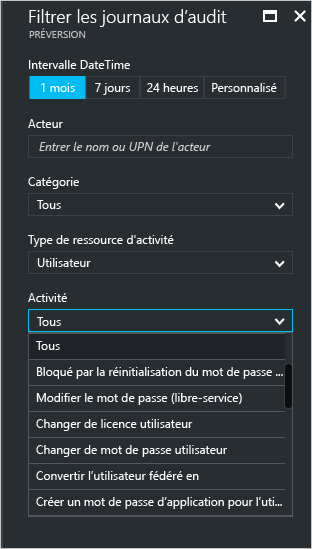
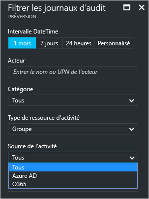

# Rapports d’activité d’audit dans le portail Azure Active Directory - version préliminaire

Dans la [version préliminaire](active-directory-preview-explainer.md) d’Azure Active Directory, la création de rapports vous permet d’obtenir toutes les informations dont vous avez besoin pour déterminer quel est l’état de votre environnement.

L’architecture de création de rapports dans Azure Active Directory comprend les composants suivants :

- **Activité** 
    - **Activités de connexion** – Informations sur l’utilisation des applications gérées et les activités de connexion des utilisateurs
    - **Activités du système** – Informations sur les activités du système liées aux utilisateurs et à la gestion des groupes, à vos applications gérées et aux activités de répertoire.
- **Sécurité** 
    - **Connexions risquées** : une connexion risquée est une tentative de connexion susceptible de provenir d’un utilisateur autre que le propriétaire légitime d’un compte d’utilisateur. Pour en savoir plus, consultez Connexions risquées.
    - **Utilisateurs avec indicateur de risque** : il s’agit d’un compte d’utilisateur susceptible d’être compromis. Pour en savoir plus, consultez Utilisateurs avec indicateur de risque.

Cette rubrique vous donne une vue d’ensemble des activités d’audit.
 
## Journaux d’audit

Les journaux d’audit dans Azure Active Directory fournissent des enregistrements des activités du système pour la conformité.

Dans le portail Azure, les activités connexes à l’audit portent sur trois catégories principales :

- Utilisateurs et groupes   

- applications

- Répertoire   

Pour obtenir une liste complète des activités de rapport d’audit, consultez la [liste des événements de rapport d’audit](active-directory-reporting-audit-events.md#list-of-audit-report-events).

Les **Journaux d’audit** dans la section **Activité** **d’Azure Active Directory** constituent votre point d’entrée pour toutes les données d’audit.

Un journal d’audit comporte un affichage de liste qui montre les acteurs (*qui*), les activités (*quoi*) et les cibles.

En cliquant sur un élément dans l’affichage de liste, vous pouvez obtenir plus d’informations sur cet élément.

## Journaux d’audit des utilisateurs et des groupes

Les rapports d’audit basés sur les utilisateurs et les groupes vous permettent d’obtenir des réponses aux questions telles que :

- Quels types de mises à jour ont été appliquées aux utilisateurs ?

- Combien d’utilisateurs ont été modifiés ?

- Combien de mots de passe ont été modifiés ?

- Qu’a fait un administrateur dans un répertoire ?

- Quels sont les groupes qui ont été ajoutés ?

- Existe-t-il des groupes comportant des modifications d’adhésion ?

- Les propriétaires de groupe ont-ils été modifiés ?

- Quelles licences ont été attribuées à un groupe ou un utilisateur ?

Si vous souhaitez simplement consulter les données d’audit connexes aux utilisateurs et aux groupes, vous pouvez trouver une vue filtrée sous **Journaux d’audit** dans la section **Activité** de **Utilisateurs et groupes**.

## Journaux d’audit des applications
Les rapports d’audit basés sur les applications vous permettent d’obtenir des réponses aux questions telles que :

* Quelles applications ont été ajoutées ou mises à jour ?
* Quelles applications ont été supprimées ?
* Le principal du service d’une application a-t-il été modifié ?
* Les noms des applications ont-ils été modifiés ?
* Qui a donné son consentement à une application ?

Si vous souhaitez simplement consulter les données d’audit connexes aux applications, vous pouvez trouver une vue filtrée sous **Journaux d’audit** dans la section **Activité** de **Applications d’entreprise**.

## Filtrage des journaux d’audit
Vous pouvez filtrer les connexions pour limiter la quantité de données affichées en utilisant les champs suivants :

- Date et heure

- Nom d’utilisateur principal de l’acteur

- Catégorie

- Type de ressource d’activité

- Activité

Le filtre **Catégorie** vous permet de limiter l’étendue de votre rapport d’audit selon les catégories suivantes :

- Annuaire principal

- Gestion des mots de passe en libre-service

- Gestion des groupes en libre-service

- Substitution de mot de passe automatique 

Le contenu de la liste **Type de ressource d’activité** est lié à votre point d’entrée pour ce panneau.  
Si votre point d’entrée est Azure Active Directory, cette liste contient tous les types d’activités possibles :

- Répertoire

- Utilisateur

- Groupe 

- Application 

- Stratégie

- Appareil

Les activités répertoriées sont limitées par type d’activité.
Par exemple, si **Utilisateur** est sélectionné comme **Type d’activité**, la liste **Activité** contient uniquement le groupe des activités associées.   

Si vous sélectionnez **Groupe** en tant que **Type de ressource d’activité**, vous obtenez une autre option de filtrage qui vous permet également de filtrer en fonction des **Sources d’activité** suivantes :

- Azure AD

- O365

Une autre méthode de filtrage des entrées d’un journal d’audit consiste à rechercher des entrées spécifiques.

## Étapes suivantes
Consultez le [Guide Azure Active Directory Reporting Guide](active-directory-reporting-guide.md).

