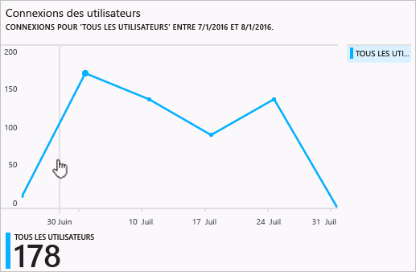
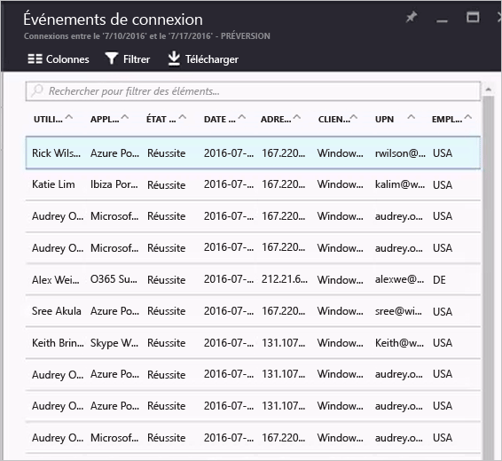

# Rapports d’activité de connexion dans le portail Azure Active Directory - version préliminaire

Dans la [version préliminaire](active-directory-preview-explainer.md) d’Azure Active Directory, la création de rapports vous permet d’obtenir toutes les informations dont vous avez besoin pour déterminer quel est l’état de votre environnement.

L’architecture de création de rapports dans Azure Active Directory comprend les composants suivants :

- **Activité** 
    - **Activités de connexion** – Informations sur l’utilisation des applications gérées et les activités de connexion des utilisateurs
    - **Activités du système** – Informations sur les activités du système liées aux utilisateurs et à la gestion des groupes, à vos applications gérées et aux activités de répertoire.
- **Sécurité** 
    - **Connexions risquées** : une connexion risquée est une tentative de connexion susceptible de provenir d’un utilisateur autre que le propriétaire légitime d’un compte d’utilisateur. Pour en savoir plus, consultez Connexions risquées.
    - **Utilisateurs avec indicateur de risque** : il s’agit d’un compte d’utilisateur susceptible d’être compromis. Pour en savoir plus, consultez Utilisateurs avec indicateur de risque.

Cette rubrique vous donne une vue d’ensemble des activités de connexion.

## Activités de connexion

Avec les informations fournies par le rapport sur les connexions des utilisateurs, trouvez des réponses aux questions telles que :

* Quel est le modèle de connexion d’un utilisateur ?
* Combien d’utilisateurs se sont connectés au cours d’une semaine ?
* Quel est l’état de ces connexions ?

Votre point d’entrée pour ces données est le graphique des connexions des utilisateurs dans la section **Overview** (Vue d’ensemble) sous **Utilisateurs et groupes**.

 

Le graphique des connexions des utilisateurs affiche les agrégations hebdomadaires des connexions de tous les utilisateurs au cours d’une période donnée. La valeur par défaut de cette période est de 30 jours.

Lorsque vous cliquez sur un jour dans le graphique des connexions, vous obtenez une liste détaillée des activités de connexion.

Chaque ligne dans la liste des activités de connexion vous fournit des informations détaillées sur la connexion sélectionnée, par exemple :

* Qui s’est connecté ?
* Qui a l’UPN associé ?
* Quelle application a été la cible de la connexion ?
* Quelle est l’adresse IP de la connexion ?
* Quel est l’état de la connexion ?

## Utilisation des applications gérées

En disposant d’une vue centrée sur les applications de vos données de connexion, vous pouvez répondre aux questions telles que :

* Qui utilise mes applications ?
* Quelles sont les 3 principales applications dans votre organisation ?
* J’ai récemment déployé une application. Comment se comporte-t-elle ?

Les 3 principales applications de votre organisation dans le rapport sur les 30 derniers jours apparaissant dans la section **Vue d’ensemble** sous **Enterprise applications** (Applications d’entreprise) constituent votre point d’entrée.

 

Le graphique d’utilisation des applications affiche les agrégations hebdomadaires des connexions pour vos 3 principales applications au cours d’une période donnée. La valeur par défaut de cette période est de 30 jours.

Si vous le souhaitez, vous pouvez définir la focalisation sur une application spécifique.

Lorsque vous cliquez sur un jour dans le graphique d’utilisation des applications, vous obtenez une liste détaillée des activités de connexion.

L’option **Connexions** vous fournit une vue d’ensemble complète de tous les événements de connexion à vos applications.

En utilisant le sélecteur de colonne, vous pouvez sélectionner les champs de données que vous souhaitez afficher.

## Filtrage des connexions
Vous pouvez filtrer les connexions pour limiter la quantité de données affichées en utilisant les champs suivants :

* Date et heure 
* Nom d’utilisateur principal de l’utilisateur
* Nom de l’application
* Nom du client
* État de la connexion

Une autre méthode de filtrage des entrées des activités de connexion consiste à rechercher des entrées spécifiques.
La méthode de recherche vous permet de centrer les connexions sur des **utilisateurs**, des **groupes** ou des **applications** spécifiques.

## Étapes suivantes
Consultez le [Guide Azure Active Directory Reporting Guide](active-directory-reporting-guide.md).

