---

title: "Création de rapports Azure Active Directory | Microsoft Docs"
description: "Répertorie les différents rapports disponibles pour Azure Active Directory"
services: active-directory
documentationcenter: 
author: MarkusVi
manager: femila
editor: 
ms.assetid: 6141a333-38db-478a-927e-526f1e7614f4
ms.service: active-directory
ms.devlang: na
ms.topic: get-started-article
ms.tgt_pltfrm: na
ms.workload: identity
ms.date: 04/06/2017
ms.author: markvi
ms.translationtype: Human Translation
ms.sourcegitcommit: 2db2ba16c06f49fd851581a1088df21f5a87a911
ms.openlocfilehash: c7fe995f097c72ab5275249538fe2bb65efac256
ms.contentlocale: fr-fr
ms.lasthandoff: 05/08/2017

---
# Création de rapports Active Directory

*Cette documentation fait partie du guide [Azure Active Directory Reporting Guide](active-directory-reporting-guide.md).*

Dans Azure Active Directory (Azure AD), vous pouvez obtenir toutes les informations dont vous avez besoin pour évaluer l’état de votre environnement.

La création de rapports couvre principalement deux domaines :

* **Activités de connexion** – Informations sur l’utilisation des applications gérées et les activités de connexion des utilisateurs
* **Activités du système** – Informations sur les activités du système liées aux utilisateurs et à la gestion des groupes, à vos applications gérées et aux activités de répertoire

Selon l’étendue des données que vous recherchez, vous pouvez accéder à ces rapports en cliquant sur **Utilisateurs et groupes** ou **Applications d’entreprise** dans la liste des services au sein du [portail Azure](https://portal.azure.com).

## Activités de connexion
### Activités de connexion des utilisateurs
Avec les informations fournies par le rapport sur les connexions des utilisateurs, trouvez des réponses aux questions telles que :

* Quel est le modèle de connexion d’un utilisateur ?
* Combien d’utilisateurs se sont connectés au cours d’une semaine ?
* Quel est l’état de ces connexions ?

Votre point d’entrée pour ces données est le graphique des connexions des utilisateurs dans la section **Overview** (Vue d’ensemble) sous **Utilisateurs et groupes**.

 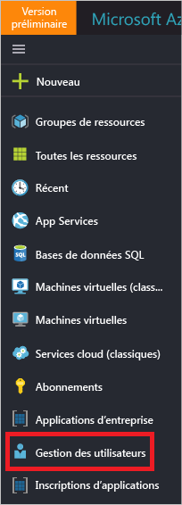

Le graphique des connexions des utilisateurs affiche les agrégations hebdomadaires des connexions de tous les utilisateurs au cours d’une période donnée. La valeur par défaut de cette période est de 30 jours.

Lorsque vous cliquez sur un jour dans le graphique des connexions, vous obtenez une liste détaillée des activités de connexion.

Chaque ligne dans la liste des activités de connexion vous fournit des informations détaillées sur la connexion sélectionnée, par exemple :

* Qui s’est connecté ?
* Qui a l’UPN associé ?
* Quelle application a été la cible de la connexion ?
* Quelle est l’adresse IP de la connexion ?
* Quel est l’état de la connexion ?

### Utilisation des applications gérées
En disposant d’une vue centrée sur les applications de vos données de connexion, vous pouvez répondre aux questions telles que :

* Qui utilise mes applications ?
* Quelles sont les 3 principales applications dans votre organisation ?
* J’ai récemment déployé une application. Comment se comporte-t-elle ?

Les 3 principales applications de votre organisation dans le rapport sur les 30 derniers jours apparaissant dans la section **Vue d’ensemble** sous **Enterprise applications** (Applications d’entreprise) constituent votre point d’entrée.

 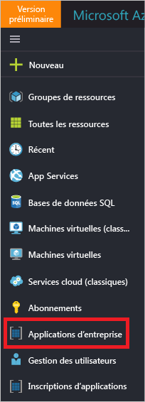

Le graphique d’utilisation des applications affiche les agrégations hebdomadaires des connexions pour vos 3 principales applications au cours d’une période donnée. La valeur par défaut de cette période est de 30 jours.

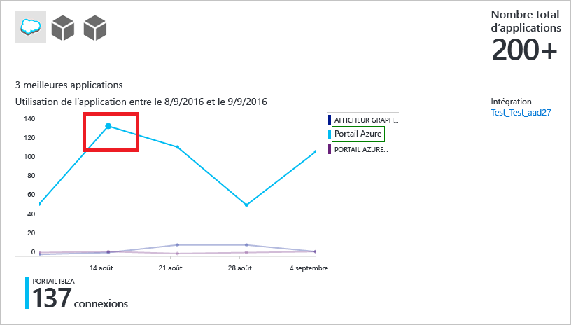

Si vous le souhaitez, vous pouvez définir la focalisation sur une application spécifique.

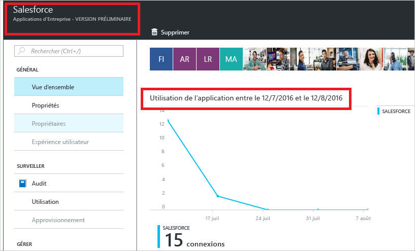

Lorsque vous cliquez sur un jour dans le graphique d’utilisation des applications, vous obtenez une liste détaillée des activités de connexion.

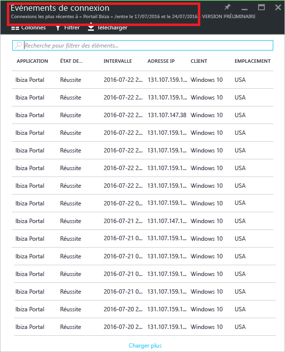

L’option **Connexions** vous fournit une vue d’ensemble complète de tous les événements de connexion à vos applications.

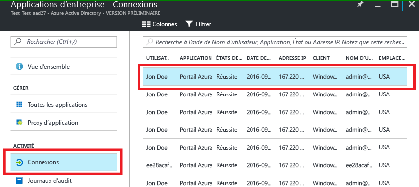

En utilisant le sélecteur de colonne, vous pouvez sélectionner les champs de données que vous souhaitez afficher.

### Filtrage des connexions
Vous pouvez filtrer les connexions pour limiter la quantité de données affichées en utilisant les champs suivants :

* Date et heure 
* Nom d’utilisateur principal de l’utilisateur
* Nom de l’application
* Nom du client
* État de la connexion

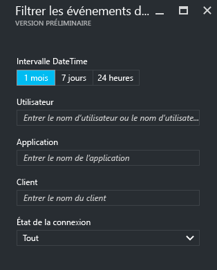

Une autre méthode de filtrage des entrées des activités de connexion consiste à rechercher des entrées spécifiques.
La méthode de recherche vous permet de centrer les connexions sur des **utilisateurs**, des **groupes** ou des **applications** spécifiques.

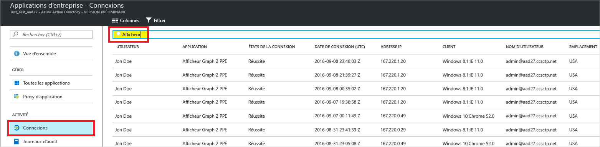

## Journaux d’audit
Les journaux d’audit dans Azure Active Directory fournissent des enregistrements des activités du système pour la conformité.

Dans le portail Azure, les activités connexes à l’audit portent sur trois catégories principales :

* Utilisateurs et groupes   
* applications
* Répertoire   

Pour obtenir une liste complète des activités de rapport d’audit, consultez la [liste des événements de rapport d’audit](active-directory-reporting-audit-events.md#list-of-audit-report-events).

Les **Journaux d’audit** dans la section **Activité** **d’Azure Active Directory** constituent votre point d’entrée pour toutes les données d’audit.

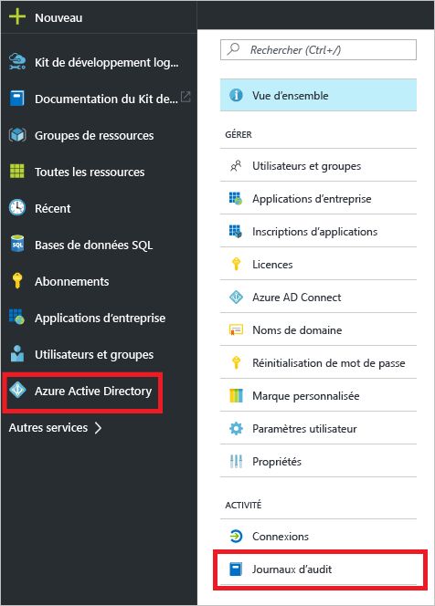

Un journal d’audit comporte un affichage de liste qui montre les acteurs (qui), les activités (quoi) et les cibles.

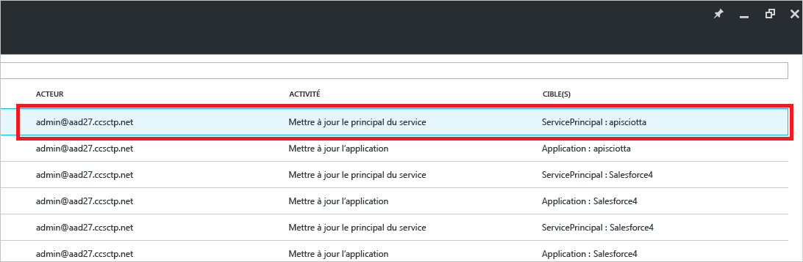

En cliquant sur un élément dans l’affichage de liste, vous pouvez obtenir plus d’informations sur cet élément.

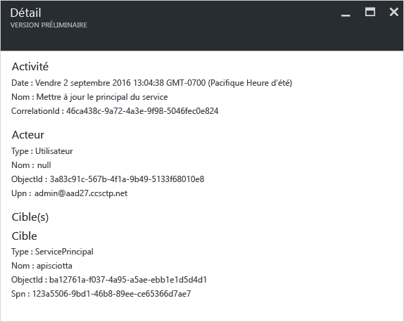

### Journaux d’audit des utilisateurs et des groupes
Les rapports d’audit basés sur les utilisateurs et les groupes vous permettent d’obtenir des réponses aux questions telles que :

* Quels types de mises à jour ont été appliquées aux utilisateurs ?
* Combien d’utilisateurs ont été modifiés ?
* Combien de mots de passe ont été modifiés ?
* Qu’a fait un administrateur dans un répertoire ?
* Quels sont les groupes qui ont été ajoutés ?
* Existe-t-il des groupes comportant des modifications d’adhésion ?
* Les propriétaires de groupe ont-ils été modifiés ?
* Quelles licences ont été attribuées à un groupe ou un utilisateur ?

Si vous souhaitez simplement consulter les données d’audit connexes aux utilisateurs et aux groupes, vous pouvez trouver une vue filtrée sous **Journaux d’audit** dans la section **Activité** de **Utilisateurs et groupes**.

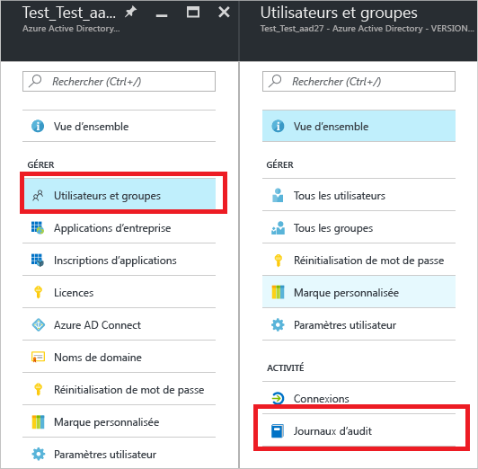

### Journaux d’audit des applications
Les rapports d’audit basés sur les applications vous permettent d’obtenir des réponses aux questions telles que :

* Quelles applications ont été ajoutées ou mises à jour ?
* Quelles applications ont été supprimées ?
* Le principal du service d’une application a-t-il été modifié ?
* Les noms des applications ont-ils été modifiés ?
* Qui a donné son consentement à une application ?

Si vous souhaitez simplement consulter les données d’audit connexes aux applications, vous pouvez trouver une vue filtrée sous **Journaux d’audit** dans la section **Activité** de **Applications d’entreprise**.

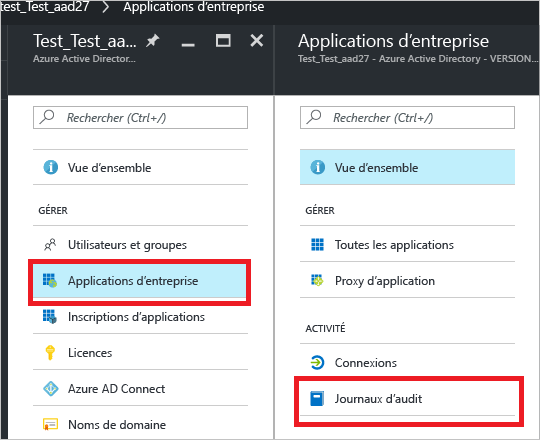

### Filtrage des journaux d’audit
Vous pouvez filtrer les connexions pour limiter la quantité de données affichées en utilisant les champs suivants :

* Date et heure
* Nom d’utilisateur principal de l’acteur
* Type d’activité
* Activité

Le contenu de la liste **Type d’activité** est lié à votre point d’entrée pour ce panneau.  
Si votre point d’entrée est Azure Active Directory, cette liste contient tous les types d’activités possibles :

* Application 
* Groupe 
* Utilisateur
* Appareil
* Répertoire
* Stratégie
* Autres

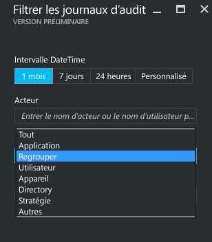

Les activités répertoriées sont limitées par type d’activité.
Par exemple, si vous avez **groupe** sélectionné comme **Type d’activité**, la liste **Activité** contient uniquement le groupe des activités associées.   

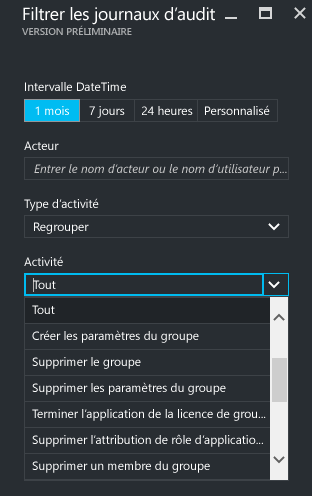

Une autre méthode de filtrage des entrées d’un journal d’audit consiste à rechercher des entrées spécifiques.

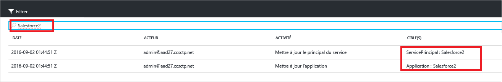

## Étapes suivantes
Consultez le [Guide Azure Active Directory Reporting Guide](active-directory-reporting-guide.md).

