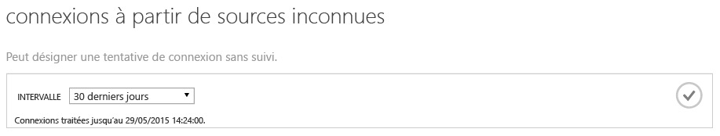
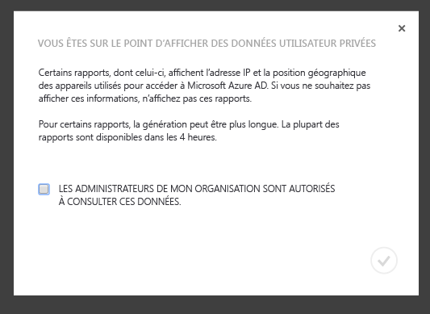
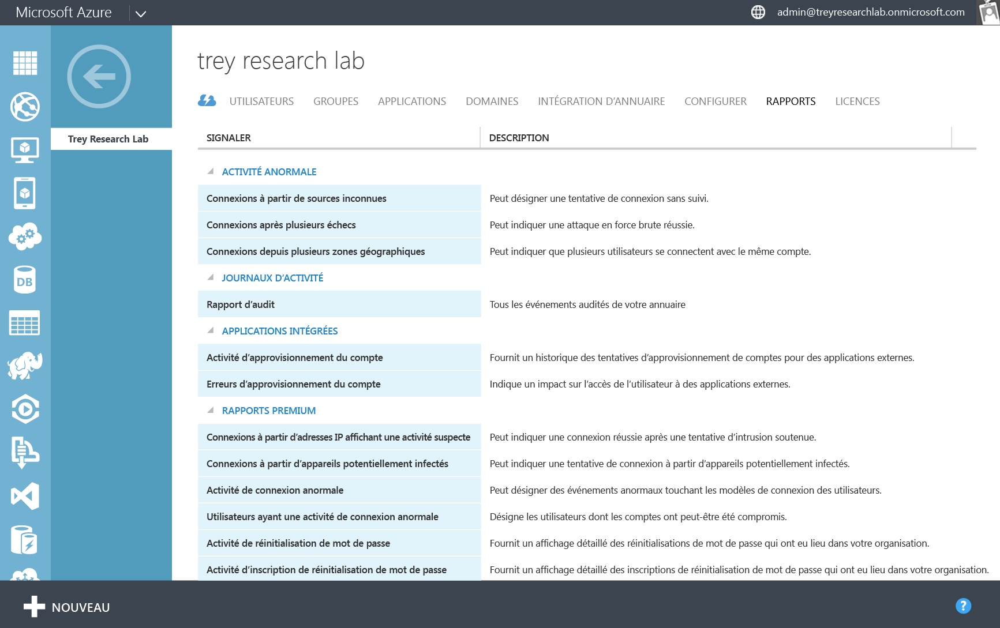
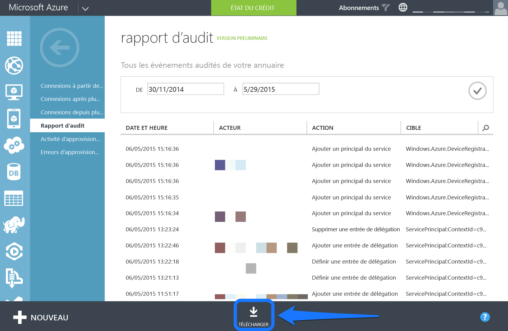
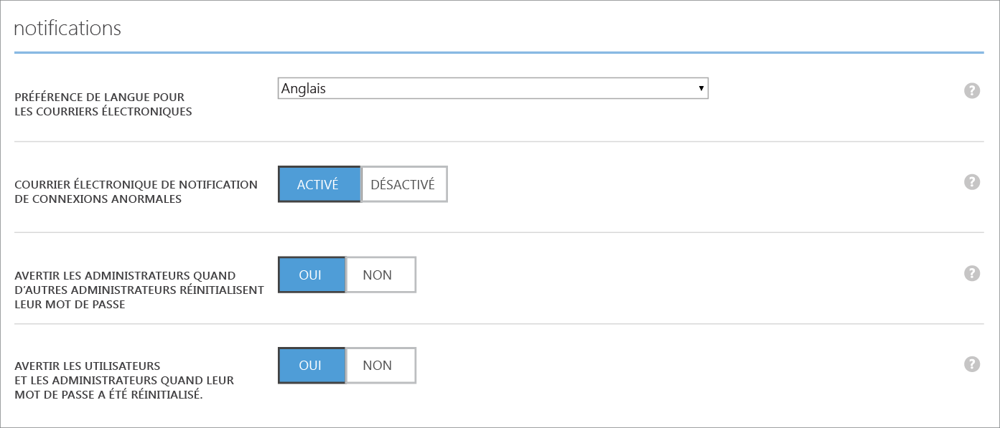
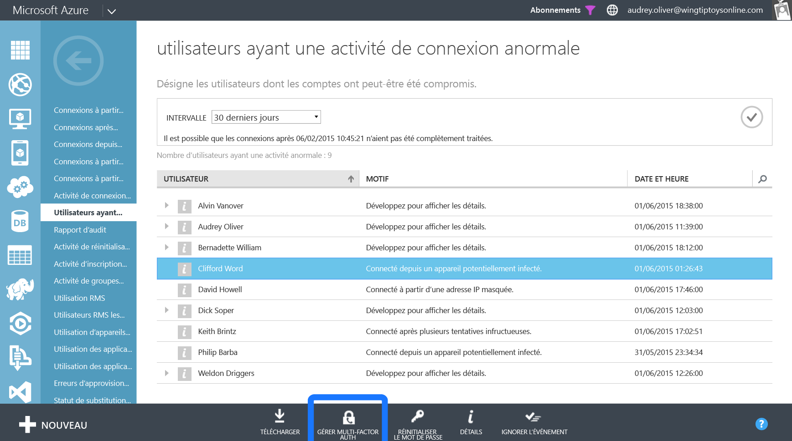

<properties
   pageTitle="Création de rapports Azure Active Directory : Prise en main | Microsoft Azure"
   description="Répertorie les différents rapports disponibles dans le rapport d'Azure Active Directory"
   services="active-directory"
   documentationCenter=""
   authors="dhanyahk"
   manager="stevenpo"
   editor=""/>

<tags
   ms.service="active-directory"
   ms.devlang="na"
   ms.topic="get-started-article"
   ms.tgt_pltfrm="na"
   ms.workload="identity"
   ms.date="03/07/2016"
   ms.author="dhanyahk"/>

# Prise en main de la création de rapports Azure Active Directory

## Présentation

Azure Active Directory (Azure AD) comprend des rapports sur la sécurité, les activités et l’audit concernant votre annuaire. Voici une liste des rapports fournis :

### Rapports de sécurité

- Connexions à partir de sources inconnues
- Connexions après plusieurs échecs
- Connexions depuis plusieurs zones géographiques
- Connexions depuis des adresses IP avec des activités suspectes
- Activité de connexion anormale
- Connexions à partir d’appareils potentiellement infectés
- Utilisateurs ayant une activité de connexion anormale

### Rapports d’activité

- Utilisation des applications : résumé
- Utilisation des applications : présentation détaillée
- Tableau de bord de l’application
- Erreurs de configuration de compte
- Appareils des utilisateur individuels
- Activité des utilisateurs individuels
- Rapport d'activité de groupes
- Rapport d’activité de l’enregistrement de la réinitialisation de mot de passe
- Activité de réinitialisation de mot de passe

### Rapport d’audit

- Rapport d’audit d’annuaire

> [AZURE.TIP] Pour plus d’informations sur la création de rapports Azure AD, consultez la page [Affichage de vos rapports d’accès et d’utilisation](active-directory-view-access-usage-reports.md).

## Fonctionnement

### Pipeline de création de rapports

Le pipeline de création de rapports se compose de trois étapes principales. Chaque fois qu’un utilisateur se connecte ou qu’une authentification est effectuée, voici ce qui se produit :

- Tout d’abord, l’utilisateur est authentifié (ou non) et le résultat est stocké dans les bases de données du service Azure Active Directory.
- À intervalles réguliers, toutes les connexions récentes sont traitées. À ce stade, nos algorithmes de sécurité et de surveillance des activités anormales recherchent toute activité suspecte dans les connexions récentes.
- Après traitement, les rapports sont écrits, mis en cache et placés dans le portail Azure Classic.

### Durée de génération des rapports

En raison du volume important d’authentifications et de connexions traitées par la plateforme Azure AD, les connexions traitées les plus récentes datent en moyenne d’une heure. Dans de rares cas, il peut s’écouler jusqu’à 8 heures avant le traitement des connexions les plus récentes.

Vous trouverez la dernière connexion traitée en examinant le texte d’aide en haut de chaque rapport.

> [AZURE.TIP] Pour plus d’informations sur la création de rapports Azure AD, consultez la page [Affichage de vos rapports d’accès et d’utilisation](active-directory-view-access-usage-reports.md).

## Prise en main

### Connectez-vous au portail Azure Classic

Tout d’abord, vous devez vous connecter au [portail Azure Classic](https://manage.windowsazure.com) en tant qu’administrateur global ou administrateur de conformité. Vous devez également être administrateur ou coadministrateur de service d’abonnement Azure ou utiliser l’abonnement Azure « Accès à Azure AD ».

### Accès aux rapports

Pour afficher les rapports, accédez à l’onglet Rapports en haut de votre annuaire.

Si c’est la première fois que vous consultez les rapports, vous devez valider une boîte de dialogue avant de pouvoir les afficher. Il s’agit de vérifier qu’il est acceptable pour les administrateurs de votre organisation de consulter ces données, qui peuvent être considérées comme des informations privées dans certains pays.

### Explorer chaque rapport

Naviguez dans chaque rapport pour voir les données collectées et les connexions traitées. Vous trouverez une [liste de tous les rapports ici](active-directory-reporting-guide.md).

### Télécharger les rapports au format CSV

Chaque rapport peut être téléchargé dans un fichier CSV (valeurs séparées par des virgules). Vous pouvez utiliser ces fichiers dans Excel, PowerBI ou un autre programme d’analyse pour analyser vos données.

Pour télécharger un rapport au format CSV, accédez au rapport et cliquez sur Télécharger en bas.

> [AZURE.TIP] Pour plus d’informations sur la création de rapports Azure AD, consultez la page [Affichage de vos rapports d’accès et d’utilisation](active-directory-view-access-usage-reports.md).

## Étapes suivantes

### Personnalisation des alertes d’activité anormale dans les connexions

Accédez à l’onglet Configuration de votre annuaire.

Accédez à la section Notifications.

Activez ou désactivez la section Notification par courrier électronique des anomalies de connexion.

### Intégration avec l’API de création de rapports d’Azure AD

Consultez la rubrique [Prise en main de l’API de création de rapports](active-directory-reporting-api-getting-started.md).

### Application de l’authentification multifacteur aux utilisateurs

Sélectionnez un utilisateur dans un rapport.

Cliquez sur le bouton Activer l’authentification multifacteur en bas de l’écran.

> [AZURE.TIP] Pour plus d’informations sur la création de rapports Azure AD, consultez la page [Affichage de vos rapports d’accès et d’utilisation](active-directory-view-access-usage-reports.md).

## En savoir plus

### Événements d'audit

En savoir plus sur les événements audités dans l’annuaire dans les [Événements de rapport d'audit d'Azure Active Directory](active-directory-reporting-audit-events.md).

### Intégration de l’API

Consultez la rubrique [Prise en main de l’API de création de rapports](active-directory-reporting-api-getting-started.md) et la [documentation de référence de l’API](https://msdn.microsoft.com/library/azure/mt126081.aspx).

### Prendre contact

Envoyez un message à [aadreportinghelp@microsoft.com](mailto:aadreportinghelp@microsoft.com) pour faire part de vos commentaires, obtenir de l’aide ou poser une question.

> [AZURE.TIP] Pour plus d’informations sur la création de rapports Azure AD, consultez la page [Affichage de vos rapports d’accès et d’utilisation](active-directory-view-access-usage-reports.md).

<!---HONumber=AcomDC_0309_2016-->