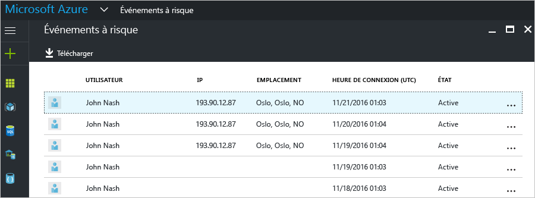
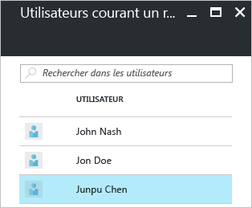
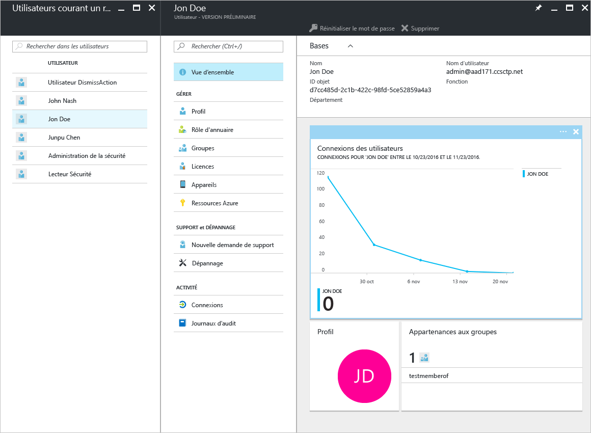

# Reporting sur la sécurité dans l’édition gratuite et l’édition de base Microsoft Active Directory (version préliminaire)

Grâce aux fonctions de création de rapports sur la sécurité que propose la [version préliminaire](active-directory-preview-explainer.md) d’Azure Active Directory, vous pouvez obtenir des informations sur les risques de compromission des comptes d’utilisateur au sein de votre environnement. 

Azure Active Directory détecte les actions suspectes liées aux comptes des utilisateurs. Pour chaque action détectée, un enregistrement appelé *événement à risque* est créé. Pour en savoir plus, voir [Événements à risque dans Azure Active Directory](active-directory-identity-protection-risk-events.md). 

Les événements à risque détectés sont utilisés pour déterminer les valeurs suivantes :

- **Connexions risquées** : une connexion risquée est une tentative de connexion susceptible de provenir d’un utilisateur autre que le propriétaire légitime d’un compte d’utilisateur. Pour en savoir plus, voir [Connexions risquées](active-directory-identityprotection.md#risky-sign-ins). 

- **Utilisateurs avec indicateur de risque** : il s’agit d’un compte d’utilisateur susceptible d’être compromis. Pour en savoir plus, voir [Utilisateurs avec indicateur de risque](active-directory-identityprotection.md#users-flagged-for-risk).  

## Rapports sur les connexions risquées

La version gratuite et la version de base d’Azure Active Directory proposent une fonction de création de listes des connexions risquées qui ont été détectées et signalées pour les utilisateurs. Un rapport sur les événements à risque fournit les informations suivantes :

- **Utilisateur** : nom d’utilisateur qui a été utilisé pendant l’opération de connexion.
- **IP** : adresse IP du périphérique qui a été utilisé pour la connexion à Azure Active Directory.
- **Emplacement** : emplacement utilisé pour la connexion à Azure Active Directory.
- **Heure de connexion** : heure à laquelle la connexion a été effectuée.
- **État** : état de la connexion.

Ce rapport vous offre la possibilité de télécharger les données qu’il inclut.

Selon votre analyse de la connexion à risque, vous pouvez envoyer des commentaires à Azure Active Directory par l’intermédiaire des actions suivantes :

- Résoudre
- Marquer comme faux positif
- Ignorer
- Réactiver

Pour en savoir plus, voir [Fermeture manuelle des événements à risque](active-directory-identityprotection.md#closing-risk-events-manually).

## Rapports sur les utilisateurs à risque

L’édition gratuite d’Azure Active Directory fournit une liste de comptes d’utilisateurs qui ont été compromis. 

Cliquez sur un utilisateur de la liste pour ouvrir le panneau de données correspondant.
Vérifiez l’historique des connexions d’un utilisateur à risque et réinitialisez son mot de passe, le cas échéant.

## Étapes suivantes

- Si vous souhaitez en savoir plus sur le reporting dans Azure Active Directory, consultez le [guide Azure Active Directory Reporting Guide](active-directory-reporting-guide.md).
- Pour en savoir plus sur Azure Active Directory Identity Protection, voir [Protection de l’identité Azure Active Directory](active-directory-identityprotection.md).

<!--HONumber=Jan17_HO3-->

