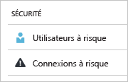
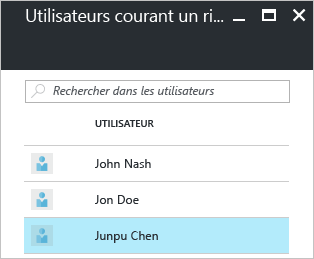
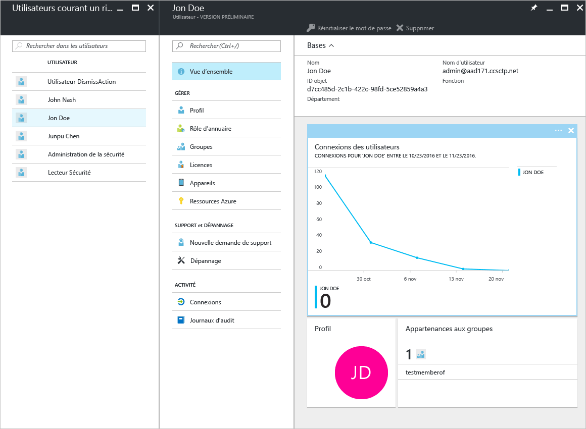
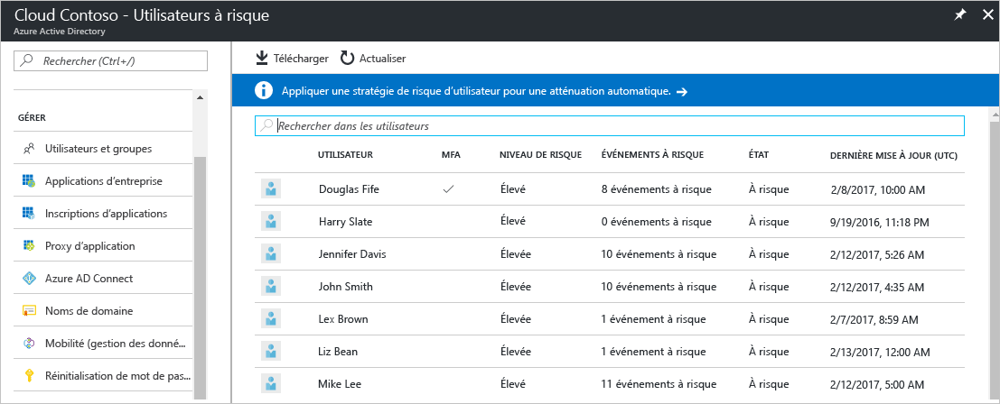
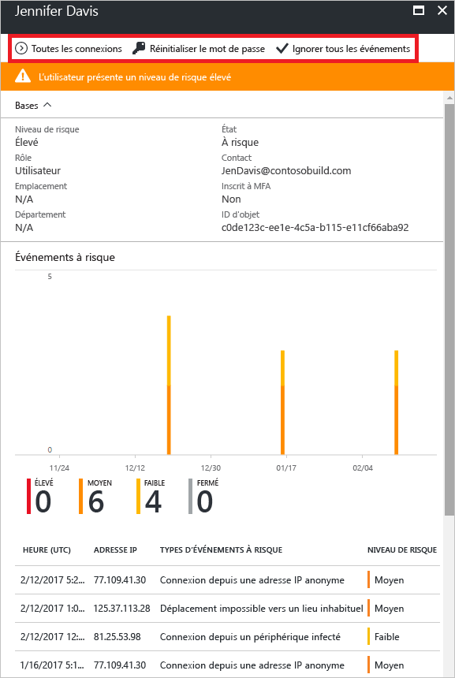
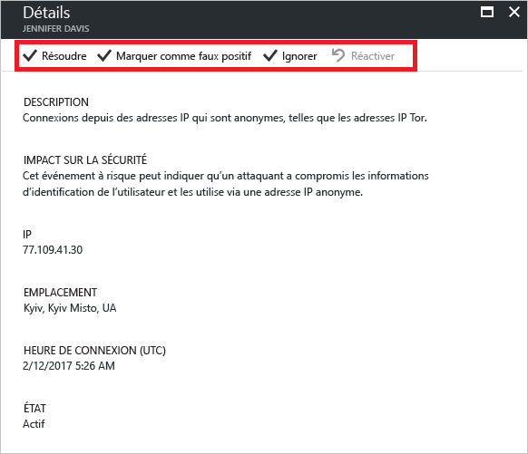

# Rapport sur la sécurité des utilisateurs courant un risque dans le portail Azure Active Directory

Grâce aux rapports sur la sécurité dans Azure Active Directory (Azure AD), vous pouvez obtenir des informations sur les risques de compromission des comptes d’utilisateur au sein de votre environnement. 

Azure Active Directory détecte les actions suspectes liées aux comptes des utilisateurs. Pour chaque action détectée, un enregistrement appelé *événement à risque* est créé. Pour en savoir plus, voir [Événements à risque dans Azure Active Directory](active-directory-identity-protection-risk-events.md). 

Les événements à risque détectés sont utilisés pour déterminer les valeurs suivantes :

- **Connexions risquées** : une connexion risquée est une tentative de connexion susceptible de provenir d’un utilisateur autre que le propriétaire légitime d’un compte d’utilisateur. Pour en savoir plus, voir [Connexions risquées](active-directory-identityprotection.md#risky-sign-ins). 

- **Utilisateurs avec indicateur de risque** : il s’agit d’un compte d’utilisateur susceptible d’être compromis. Pour en savoir plus, voir [Utilisateurs avec indicateur de risque](active-directory-identityprotection.md#users-flagged-for-risk).  

Dans le portail Azure, vous trouverez les rapports de sécurité dans le panneau **Azure Active Directory** dans la section **Sécurité**.  

## De quelle licence Azure AD avez-vous besoin pour accéder à un rapport de sécurité ?  

Toutes les éditions d’Azure Active Directory vous indiquent les rapports d’utilisateurs associés à un indicateur de risque.  
Toutefois, le niveau de granularité d’un rapport varie entre les éditions : 

- Dans les **éditions Azure Active Directory Free et Basic**, vous obtenez déjà la liste des utilisateurs associés à un indicateur de risque. 

- L’édition **Azure Active Directory Premium 1** étend ce modèle en vous permettant également d’examiner certains événements à risque sous-jacent qui ont été détectés pour chaque rapport. 

- L’édition **Azure Active Directory Premium 2** vous fournit les informations les plus détaillées sur les événements à risque sous-jacent. Elle vous permet également de configurer des stratégies de sécurité répondant automatiquement aux niveaux de risque configurés.

## Édition Azure Active Directory gratuite et de base

Le rapport sur les utilisateurs courant un risque dans les éditions gratuite et de base d’Azure Active Directory vous fournit une liste de comptes d’utilisateurs qui ont peut-être été compromis. 

La sélection d’un utilisateur ouvre le panneau des données utilisateur correspondant.
Vous pouvez vérifier l’historique des connexions d’un utilisateur à risque et réinitialiser son mot de passe, le cas échéant.

## Éditions Premium d’Azure Active Directory

Le rapport des utilisateurs courant un risque dans les éditions Premium d’Azure Active Directory vous fournit les informations suivantes :

- Une [liste des comptes d’utilisateurs](active-directory-identityprotection.md#users-flagged-for-risk) qui ont peut-être été compromis 

- Informations agrégées sur les [types d’événements à risque](active-directory-identity-protection-risk-events.md) qui ont été détectés

- Une option pour télécharger le rapport

- Une option pour configurer une [stratégie de résolution du risque utilisateur](active-directory-identityprotection.md#user-risk-security-policy)  

Lorsque vous sélectionnez un utilisateur, vous obtenez une vue de rapport détaillé pour cet utilisateur qui vous permet d’effectuer les opérations suivantes :

- Ouvrir la vue Toutes les connexions

- Réinitialisez le mot de passe de l'utilisateur.

- Ignorer tous les événements

- Analysez les événements à risque signalés pour l’utilisateur. 

Pour analyser un événement à risque, sélectionnez-en un dans la liste.  
Cette opération ouvre le panneau **Détails** pour cet événement à risque. Dans le panneau **Détails**, vous avez le choix entre [fermer manuelle un événement à risque](active-directory-identityprotection.md#closing-risk-events-manually) ou réactiver un événement à risque fermé manuellement. 

## Étapes suivantes

- Pour en savoir plus sur Azure Active Directory Identity Protection, voir [Protection de l’identité Azure Active Directory](active-directory-identityprotection.md).

