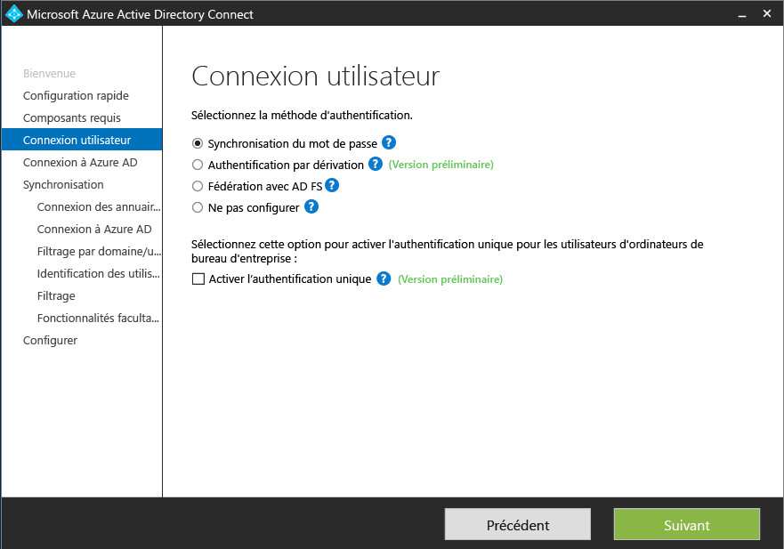
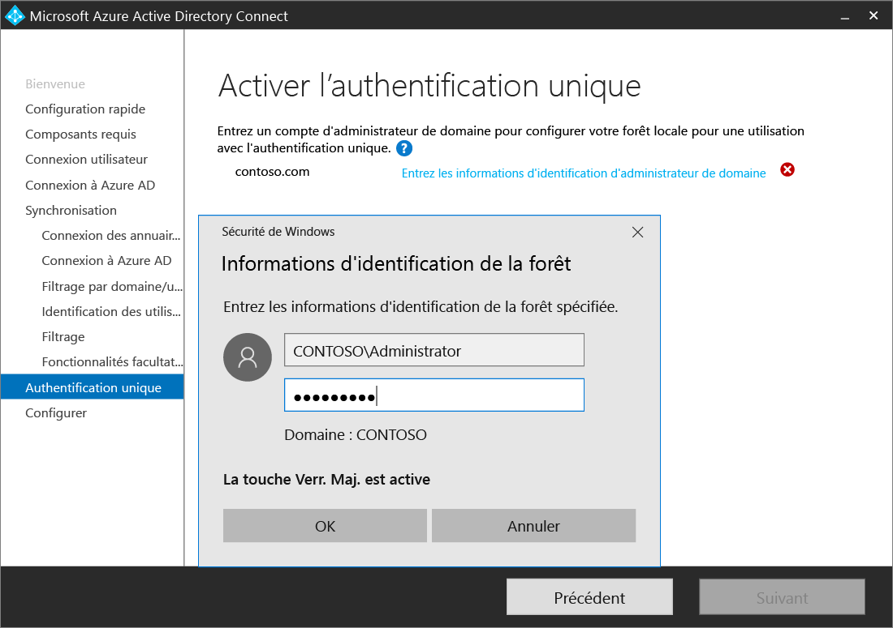
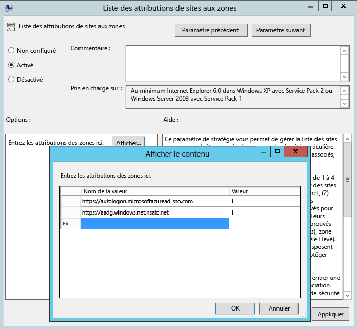

# Installation personnalisée d’Azure AD Connect
Les **paramètres personnalisés** Azure AD Connect sont utilisés lorsque vous souhaitez davantage d’options d’installation. Ils sont utiles si vous disposez de plusieurs forêts ou si vous voulez configurer des fonctionnalités facultatives que l’installation rapide ne propose pas. Ils sont utilisés dans tous les cas où l’option d’[**installation rapide**](active-directory-aadconnect-get-started-express.md) ne convient pas à votre déploiement ou à votre topologie.

Avant de commencer l’installation d’Azure AD Connect, veillez à [télécharger Azure AD Connect](http://go.microsoft.com/fwlink/?LinkId=615771) et effectuer les étapes préalables décrites dans [Azure AD Connect : matériel et conditions préalables](active-directory-aadconnect-prerequisites.md). Assurez-vous également de disposer des comptes comme décrit dans [Autorisations et comptes Azure AD Connect](active-directory-aadconnect-accounts-permissions.md).

Si les paramètres personnalisés ne correspondent pas à votre topologie, pour mettre à niveau DirSync, par exemple, consultez la [documentation connexe](#related-documentation) pour d’autres scénarios.

## Installation des paramètres personnalisés d’Azure AD Connect
### Paramètres Express
Dans cette page, cliquez sur **Personnaliser** pour démarrer une installation des paramètres personnalisés.

### Installation des composants requis
Lorsque vous installez les services de synchronisation, vous pouvez laisser la section de configuration facultative de côté. Azure AD Connect configure toutes les options automatiquement. Ce logiciel configure une instance de SQL Server 2012 Express LocalDB et crée les groupes appropriés, en attribuant des autorisations. Si vous souhaitez modifier les valeurs par défaut, vous pouvez utiliser le tableau ci-après pour comprendre les différentes options de configuration facultatives à votre disposition.

| Configuration facultative | Description |
| --- | --- |
| Utiliser un serveur SQL Server existant |Permet de spécifier le nom du serveur SQL et le nom de l’instance. Choisissez cette option si vous souhaitez utiliser un serveur de base de données existant. Si la navigation n’est pas activée sur votre serveur SQL Server, saisissez le nom de l’instance dans la zone **Nom de l’instance** , suivi d’une virgule et du numéro de port. |
| Utiliser un compte de service existant |Par défaut, Azure AD Connect crée un compte de service local, que les services de synchronisation doivent utiliser. Le mot de passe est généré automatiquement et n’est pas connu de la personne qui installe Azure AD Connect. Si vous utilisez un serveur SQL Server distant ou un proxy qui requiert une authentification, vous avez besoin d’un compte de service dans le domaine et devez connaître le mot de passe. Dans ce cas, entrez le compte de service à utiliser. Assurez-vous que l’utilisateur qui exécute l’installation est une association de sécurité dans SQL pour qu’il soit possible de créer une session pour le compte de service. Consultez [Autorisations et comptes Azure AD Connect](active-directory-aadconnect-accounts-permissions.md#custom-settings-installation) |
| Spécifier des groupes de synchronisation personnalisés |Par défaut, Azure AD Connect crée quatre groupes locaux sur le serveur lorsque les services de synchronisation sont installés. Ces groupes sont Administrateurs, Opérateurs, Parcourir et Réinitialisation du mot de passe. Vous pouvez spécifier vos propres groupes ici. Les groupes doivent être locaux sur le serveur et ne peuvent pas être situés dans le domaine. |

### Connexion de l’utilisateur
Après avoir installé les composants requis, vous êtes invité à sélectionner la méthode d’authentification unique de vos utilisateurs. Le tableau ci-après fournit une brève description des options disponibles. Pour une description complète des méthodes de connexion, consultez [Connexion de l’utilisateur](active-directory-aadconnect-user-signin.md).

| Option d’authentification unique | Description |
| --- | --- |
| Synchronisation de mot de passe |Les utilisateurs peuvent se connecter aux services cloud Microsoft, comme Office 365, à l’aide du mot de passe qu’ils utilisent dans leur réseau local. Les mots de passe des utilisateurs sont synchronisés sur Azure, via un hachage de mot de passe, et l’authentification est effectuée dans le cloud. Pour plus d’informations, consultez [Synchronisation de mot de passe](active-directory-aadconnectsync-implement-password-synchronization.md) . |
|Authentification directe (version préliminaire)|Les utilisateurs peuvent se connecter aux services cloud Microsoft, comme Office 365, à l’aide du mot de passe qu’ils utilisent dans leur réseau local.  Le mot de passe de l’utilisateur est ensuite transmis vers le contrôleur Active Directory local à valider.
| Fédération avec AD FS |Les utilisateurs peuvent se connecter aux services cloud Microsoft, comme Office 365, à l’aide du mot de passe qu’ils utilisent dans leur réseau local.  Ils sont redirigés vers leur instance AD FS locale, la connexion et l’authentification étant effectuées en local. |
| Ne pas configurer |Aucune fonctionnalité n’est installée ni configurée. Choisissez cette option si vous disposez déjà d’un serveur de fédération tiers ou d’une autre solution. |
|Activer l'authentification unique|Cette option est disponible avec la synchronisation de mot de passe et l’authentification directe, et fournit une expérience d’authentification unique pour les utilisateurs du réseau d’entreprise.  Pour plus d’informations, consultez [Authentification unique](active-directory-aadconnect-sso.md).  Notez que pour les clients AD FS, cette option n’est pas disponible car AD FS offre déjà le même niveau d’authentification unique. (si PTA n’est pas disponible en même temps)
|Option d’authentification|Cette option est disponible pour les clients de synchronisation de mot de passe et fournit une expérience d’authentification unique pour les utilisateurs du réseau d’entreprise.   Pour plus d’informations, consultez [Authentification unique](active-directory-aadconnect-sso.md).  Notez que pour les clients AD FS, cette option n’est pas disponible car AD FS offre déjà le même niveau d’authentification unique.

### Se connecter à Azure AD
Sur l’écran Connexion à Azure AD, entrez un compte et un mot de passe d’administrateur général. Si vous avez sélectionné l’option **Fédération avec AD FS** sur la page précédente, ne vous connectez pas avec un compte dans un domaine que vous envisagez d’activer pour la fédération. Il est recommandé d’utiliser un compte du domaine **onmicrosoft.com** par défaut, qui est fourni avec votre annuaire Azure AD.

Ce compte est uniquement utilisé pour créer un compte de service dans Azure AD et n’est plus utilisé une fois l’assistant terminé.  

Si la fonction MFA est activée sur votre compte d’administrateur global, vous devez à nouveau fournir le mot de passe dans la fenêtre contextuelle de connexion et passer le test MFA. Ce test peut consister à fournir un code de vérification ou à passer un appel téléphonique.  

[Privileged Identity Management](../active-directory-privileged-identity-management-getting-started.md) peut aussi être activé sur le compte d’administrateur global.

Si vous recevez une erreur et que vous avez des problèmes de connectivité, consultez [Résoudre les problèmes de connectivité liés à Azure AD Connect](active-directory-aadconnect-troubleshoot-connectivity.md).

## Pages de la section Synchronisation

### Connexion de vos annuaires
Pour vous connecter à votre service de domaine Active Directory, Azure AD Connect a besoin des informations d’identification d’un compte doté d’autorisations suffisantes. Vous pouvez saisir la partie domaine au format NetBios ou nom de domaine complet, par exemple, FABRIKAM\syncuser ou fabrikam.com\syncuser. Ce compte peut être un compte d’utilisateur normal, car seules des autorisations de lecture par défaut sont nécessaires. Toutefois, selon votre scénario, vous pouvez avoir besoin d’autorisations supplémentaires. Pour en savoir plus, voir [Autorisations et comptes Azure AD Connect](active-directory-aadconnect-accounts-permissions.md#create-the-ad-ds-account)

### Configuration de connexion AD Azure
Cette page permet d’examiner les domaines UPN présents dans les services de domaine AD locaux et qui ont été vérifiés dans Azure AD. Cette page vous permet également de configurer l’attribut à utiliser pour userPrincipalName.

  
Passez en revue chaque domaine marqué **Non ajouté** et **Non vérifié**. Assurez-vous que les domaines que vous utilisez ont été vérifiés dans Azure AD. Cliquez sur le symbole d’actualisation dès que vous avez vérifié vos domaines. Pour plus d’informations, consultez [Ajouter et vérifier le domaine](../active-directory-add-domain.md)

**UserPrincipalName** : cet attribut est utilisé par les utilisateurs lorsqu’ils se connectent à Azure AD et Office 365. Les domaines utilisés, également nommés « Suffixe UPN » doivent être vérifiés dans Azure AD avant la synchronisation des utilisateurs. Microsoft recommande de conserver la valeur d’attribut userPrincipalName par défaut. Si cet attribut ne peut pas être acheminé ni vérifié, vous pouvez sélectionner un autre attribut. Par exemple, vous pouvez choisir une adresse de messagerie électronique comme attribut contenant l’ID de connexion. Tout attribut utilisé à la place de l’élément userPrincipalName est qualifié d’ **ID secondaire**. La valeur de l’attribut ID secondaire doit suivre la norme RFC822. Un ID secondaire peut être utilisé avec la fédération et la synchronisation de mots de passe.

>[!NOTE]
> Lorsque vous activez l’authentification directe, vous devez disposer d’au moins un domaine vérifié pour pouvoir continuer l’assistant.

> [!WARNING]
> L’utilisation d’un ID secondaire n’est pas compatible avec toutes les charges de travail Office 365. Pour plus d’informations, consultez [Configuration d’un ID secondaire de connexion](https://technet.microsoft.com/library/dn659436.aspx).
>
>

### Filtrage domaine et unité organisationnelle
Par défaut, tous les domaines et unités d’organisation sont synchronisés. S’il existe des domaines ou des unités d’organisation que vous ne souhaitez pas synchroniser avec Azure AD, vous pouvez les désélectionner.  
 Cette page de l’Assistant porte sur la configuration du filtrage basé sur le domaine et l’unité d’organisation. Pour en savoir plus, voir [Filtrage basé sur le domaine](active-directory-aadconnectsync-configure-filtering.md#domain-based-filtering) et [Filtrage basé sur l’unité d’organisation](active-directory-aadconnectsync-configure-filtering.md#organizational-unitbased-filtering). Si vous utilisez le filtrage basé sur l’unité d’organisation, les nouvelles unités d’organisation ajoutées par la suite sont synchronisées par défaut. Si vous souhaitez que les nouvelles unités d’organisation ne soient pas synchronisées, vous pouvez configurer la synchronisation une fois que l’Assistant a terminé le [filtrage basé sur l’unité d’organisation](active-directory-aadconnectsync-configure-filtering.md#organizational-unitbased-filtering).

Si vous prévoyez d’utiliser le [filtrage basé sur le groupe](#sync-filtering-based-on-groups), assurez-vous que l’unité d’organisation avec le groupe est incluse, et non filtrée à l’aide du filtrage basé sur l’unité d’organisation. Le filtrage basé sur l’unité d’organisation est évalué avant le filtrage basé sur le groupe.

Il est également possible que certains domaines ne soient pas accessibles en raison de restrictions de pare-feu. Ces domaines sont désélectionnés par défaut et présentent un avertissement.  
  
S’il s’affiche, vérifiez que ces domaines sont effectivement inaccessibles et que ce message est normal.

### Identification unique de vos utilisateurs
La fonctionnalité Correspondance entre les forêts vous permet de définir la méthode de représentation des utilisateurs de vos forêts AD DS dans Azure AD. Il est possible de représenter seulement une fois chaque utilisateur entre toutes les forêts, ou de présenter une combinaison des comptes activés et désactivés. L’utilisateur peut également être représenté en tant que contact dans certaines forêts.

| Paramètre | Description |
| --- | --- |
| [Les utilisateurs ne sont représentés qu’une seule fois à travers toutes les forêts](active-directory-aadconnect-topologies.md#multiple-forests-single-azure-ad-tenant) |Tous les utilisateurs sont créés en tant qu’objets individuels dans Azure AD. Les objets ne sont pas associés dans le métaverse. |
| [Attribut de messagerie](active-directory-aadconnect-topologies.md#multiple-forests-single-azure-ad-tenant) |Cette option associe des utilisateurs et des contacts si l’attribut de messagerie a la même valeur dans des forêts différentes. Utilisez cette option si vos contacts ont été créés avec GALSync. |
| [ObjectSID et msExchangeMasterAccountSID/ msRTCSIP-OriginatorSid](active-directory-aadconnect-topologies.md#multiple-forests-single-azure-ad-tenant) |Cette option associe un utilisateur activé dans une forêt de comptes à un utilisateur désactivé dans une forêt de ressources. Dans Exchange, cette configuration est connue en tant que « boîte aux lettres liée ». Cette option peut également être utilisée si vous utilisez uniquement Lync et si Exchange n’est pas présent dans la forêt de ressources. |
| sAMAccountName et MailNickName |Cette option associe des attributs où l’ID de connexion est requis pour rechercher l’utilisateur. |
| Un attribut spécifique |Cette option vous permet de sélectionner votre propre attribut. **Limitation :** assurez-vous de sélectionner un attribut qui existe déjà dans le métaverse. Si vous sélectionnez un attribut personnalisé (non présent dans le métaverse), l’assistant échoue. |

**Ancre source** : l’attribut sourceAnchor ne varie pas pendant la durée de vie d’un objet utilisateur. Il s’agit de la clé primaire liant l’utilisateur local avec l’utilisateur dans Azure AD. Comme l’attribut ne peut pas être modifié, vous devez prévoir l’attribut adéquat à utiliser. Pour cela, nous vous recommandons objectGUID. Cet attribut ne change pas, sauf si le compte d’utilisateur est déplacé entre les forêts/domaines. Dans un environnement à plusieurs forêts où vous déplacez des comptes entre des forêts, vous devez utiliser un autre attribut, comme un attribut avec l’employeeID. Évitez les attributs susceptibles de changer si une personne se marie ou si son affectation est modifiée. Vous ne pouvez pas utiliser d’attributs avec @-sign,, donc les adresses de messagerie et userPrincipalName ne peuvent pas être utilisées. Par ailleurs, l’attribut respecte la casse ; si vous déplacez un objet entre des forêts, veillez à conserver ses minuscules/majuscules. Les attributs binaires sont codés en base 64, mais les autres types d’attributs restent à l’état non codé. Dans les scénarios de fédération et dans certaines interfaces Azure AD, cet attribut est également appelé « immutableID ». Vous trouverez plus d’informations sur l’ancre source dans les [principes de conception](active-directory-aadconnect-design-concepts.md#sourceanchor).

### Filtrage de synchronisation basé sur les groupes
Le filtrage sur la fonctionnalité de groupes vous permet de synchroniser uniquement un petit sous-ensemble d’objets pour un pilote. Pour pouvoir utiliser cette fonctionnalité, créez un groupe à cette fin dans votre répertoire Active Directory local. Ensuite, ajoutez les utilisateurs et groupes qui doivent être synchronisés sur Azure AD en tant que membres directs. Vous pouvez ajouter et supprimer ultérieurement des utilisateurs à ce groupe pour tenir à jour la liste des objets présents dans Azure AD. Les objets que vous voulez synchroniser doivent tous être un membre direct du groupe. Les utilisateurs, les groupes, les contacts et les ordinateurs/appareils doivent tous être des membres directs. L’appartenance à un groupe imbriqué n’est pas résolue. Lorsque vous ajoutez un groupe en tant que membre, seul le groupe est ajouté ; ses membres ne le sont pas.

> [!WARNING]
> Cette fonctionnalité est uniquement destinée à prendre en charge un déploiement pilote. Ne l’utilisez pas dans un environnement de production complet.
>
>

Dans un déploiement de production complet, il est difficile de maintenir un seul groupe avec tous les objets à synchroniser. Nous vous recommandons plutôt d’utiliser l’une des méthodes décrites dans la section [Configurer le filtrage](active-directory-aadconnectsync-configure-filtering.md).

### Fonctionnalités facultatives
Cet écran vous permet de sélectionner des fonctionnalités facultatives pour vos scénarios spécifiques.

> [!WARNING]
> Si DirSync ou Azure AD Sync sont actuellement actifs, n’activez aucune des fonctionnalités d’écriture différée dans Azure AD Connect.
>
>

| Fonctionnalités facultatives | Description |
| --- | --- |
| Déploiement Exchange hybride |La fonctionnalité de déploiement Exchange hybride permet la coexistence de boîtes aux lettres Exchange en local et dans Office 365. Azure AD Connect synchronise un ensemble spécifique d’[attributs](active-directory-aadconnectsync-attributes-synchronized.md#exchange-hybrid-writeback) d’Azure AD dans votre annuaire local. |
| Application Azure AD et filtrage des attributs |En activant le filtrage des attributs et l’application Azure AD, vous pouvez adapter l’ensemble des attributs synchronisés. Cette option ajoute deux autres pages de configuration dans l’Assistant. Pour en savoir plus, voir [Application Azure AD et filtrage des attributs](#azure-ad-app-and-attribute-filtering). |
| Synchronisation de mot de passe |Si vous avez sélectionné la fédération comme solution de connexion, vous pouvez activer cette option. La synchronisation de mot de passe peut ensuite servir d’option de sauvegarde. Pour en savoir plus, voir [Synchronisation de mot de passe](active-directory-aadconnectsync-implement-password-synchronization.md).   Si vous avez sélectionné l’authentification directe, cette option est activée par défaut pour assurer la prise en charge pour les clients hérités et servir d’option de sauvegarde. Pour en savoir plus, voir [Synchronisation de mot de passe](active-directory-aadconnectsync-implement-password-synchronization.md).|
| Écriture différée du mot de passe |Lorsque vous activez l’écriture différée du mot de passe, les modifications de mot de passe provenant d’Azure AD sont réécrites dans votre répertoire local. Pour en savoir plus, voir [Prise en main de la gestion de mot de passe](../active-directory-passwords-getting-started.md). |
| Écriture différée de groupe |Si vous utilisez la fonctionnalité **Groupes dans Office 365** , ces groupes peuvent être représentés dans votre annuaire Active Directory local. Cette option n’est disponible que si Exchange est présent dans votre annuaire Active Directory local. Pour en savoir plus, voir [Écriture différée de groupe](active-directory-aadconnect-feature-preview.md#group-writeback). |
| Écriture différée des appareils |Permet d’écrire de façon différée des objets d’appareil dans Azure AD, au sein de l’annuaire Active Directory local, dans le cadre de scénarios à accès conditionnel. Pour en savoir plus, voir [Azure AD Connect : Activation de l’écriture différée des appareils](active-directory-aadconnect-feature-device-writeback.md). |
| Synchronisation des attributs des extensions d’annuaire |Si vous activez la synchronisation des attributs des extensions de répertoire, les attributs spécifiés seront synchronisés avec Azure AD. Pour en savoir plus, voir [Extensions d’annuaire](active-directory-aadconnectsync-feature-directory-extensions.md). |

### Application Azure AD et filtrage des attributs
Si vous souhaitez limiter les attributs à synchroniser dans Azure AD, commencez par sélectionner les services que vous utilisez. Si vous apportez des modifications de configuration sur cette page, vous devez sélectionner un nouveau service de manière explicite, en exécutant à nouveau l’Assistant d’installation.

Selon les services sélectionnés à l’étape précédente, cette page affiche tous les attributs synchronisés. Cette liste est une combinaison de tous les types d’objet en cours de synchronisation. Si certains attributs ne doivent pas être synchronisés, vous pouvez les désélectionner.

> [!WARNING]
> La suppression d’attributs peut affecter la fonctionnalité. Pour consulter des recommandations et meilleures pratiques, voir [Attributs synchronisés](active-directory-aadconnectsync-attributes-synchronized.md#attributes-to-synchronize).
>
>

### Synchronisation des attributs des extensions d’annuaire
Vous pouvez étendre le schéma dans Azure AD en utilisant des attributs personnalisés ajoutés par votre organisation ou d’autres attributs dans Active Directory. Pour utiliser cette fonctionnalité, sélectionnez **Synchronisation des attributs des extensions d’annuaire** dans la page **Fonctionnalités facultatives**. Sur cette page, vous pouvez sélectionner d’autres attributs à synchroniser.

Pour en savoir plus, voir [Extensions d’annuaire](active-directory-aadconnectsync-feature-directory-extensions.md).

### Activation de l’authentification unique (SSO)
La configuration de l’authentification unique pour une utilisation avec la synchronisation des mots de passe ou l’authentification directe est un processus simple que vous n’avez à effectuer qu’une fois par forêt synchronisée avec Azure AD. La configuration implique les deux étapes suivantes :

1.  création du compte d’ordinateur nécessaire dans votre annuaire Active Directory local ;
2.  configuration de la zone intranet des ordinateurs clients pour prendre en charge l’authentification unique.

#### Créer le compte d’ordinateur dans Active Directory
Pour chaque forêt ajoutée à l’aide d’Azure AD Connect, vous devez fournir les informations d’identification de l’administrateur de domaine afin que le compte d’ordinateur puisse être créé dans chaque forêt. Les informations d’identification sont utilisées uniquement pour créer le compte et ne sont pas stockées ni utilisées pour d’autres opérations. Ajoutez simplement les informations d’identification sur la page **Activer l’authentification unique** de l’Assistant Azure AD Connect, comme indiqué ci-dessous :

>[!NOTE]
>Vous pouvez ignorer une forêt particulière si vous ne souhaitez pas utiliser l’authentification unique avec celle-ci.

#### Configurer la zone intranet pour les ordinateurs clients
Pour vous assurer que le client se connecte automatiquement dans la zone intranet, vous devez vous assurer que deux URL font partie de la zone intranet. Cela garantit que l’ordinateur joint au domaine envoie automatiquement un ticket Kerberos à Azure AD lorsqu’il est connecté au réseau d’entreprise.
Sur un ordinateur qui possède les outils de gestion de stratégie de groupe.

1.  Ouvrir les outils de gestion de stratégie de groupe
2.  Modifiez la stratégie de groupe qui sera appliquée à tous les utilisateurs. Par exemple, la stratégie de domaine par défaut.
3.  Accédez à **Configuration utilisateur\Modèles d’administration\Composants Windows\Internet Explorer\Panneau de configuration Internet\Page de sécurité** et sélectionnez **Liste des attributions de sites aux zones**, comme sur l’image ci-dessous.
4.  Activez la stratégie, puis entrez les deux éléments suivants dans la boîte de dialogue.

        Value: `https://autologon.microsoftazuread-sso.com`  
        Data: 1  
        Value: `https://aadg.windows.net.nsatc.net`  
        Data: 1

5.  Le résultat doit être semblable à ce qui suit :  

6.  Cliquez sur **OK** deux fois.

## Configuration de la fédération avec AD FS
La configuration d’AD FS avec Azure AD Connect s’effectue simplement en quelques clics. Pour pouvoir procéder à la configuration, vous devez disposer des éléments suivants.

* Un serveur Windows Server 2012 R2 pour le serveur de fédération avec la gestion distante activée
* Un serveur Windows Server 2012 R2 pour le serveur proxy d’application web avec la gestion distante activée
* Un certificat SSL pour le nom de service de fédération que vous prévoyez d’utiliser (par exemple, sts.contoso.com)

### Conditions préalables à la configuration AD FS
Pour configurer votre batterie AD FS avec Azure AD Connect, vérifiez que WinRM est activé sur les serveurs distants. En outre, passez en revue les exigences en matière de ports répertoriées dans le [Tableau 3 : Azure AD Connect et serveurs de fédération/WAP](active-directory-aadconnect-ports.md#table-3---azure-ad-connect-and-ad-fs-federation-serverswap).

### Création d’une batterie de serveurs AD FS ou utilisation d’une batterie de serveurs AD FS existante
Vous pouvez utiliser une batterie de serveurs AD FS existante ou en créer une. Si vous choisissez de créer une batterie de serveurs, vous devez fournir le certificat SSL. Si ce dernier est protégé par un mot de passe, vous devez fournir ce mot de passe.

Si vous choisissez d’utiliser une batterie de serveurs AD FS existante, vous êtes dirigé directement vers l’écran de configuration de la relation d’approbation entre AD FS et Azure AD.

### Spécification des serveurs AD FS
Indiquez les serveurs sur lesquels vous souhaitez installer AD FS. Vous pouvez ajouter un ou plusieurs serveurs selon vos besoins de planification de capacité. Joignez tous les serveurs à Active Directory avant d’effectuer cette configuration. Microsoft recommande d’installer un seul serveur AD FS pour les déploiements de test et pilote. Ensuite, ajoutez et déployez d’autres serveurs pour répondre à vos besoins de mise à l’échelle en réexécutant Azure AD Connect après la configuration initiale.

> [!NOTE]
> Avant d’effectuer cette configuration, assurez-vous que tous les serveurs sont joints à un domaine Active Directory.
>
>

### Spécification des serveurs proxy d’application web
Indiquez les serveurs spécifiques que vous souhaitez utiliser en tant que serveurs proxy d’application web. Les serveurs proxy d’application web sont déployés dans votre DMZ (accès extranet) et prennent en charge les demandes d’authentification provenant de l’extranet. Vous pouvez ajouter un ou plusieurs serveurs selon vos besoins de planification de capacité. Microsoft recommande d’installer un serveur proxy d’application web unique pour un déploiement de test ou pilote. Ensuite, ajoutez et déployez d’autres serveurs pour répondre à vos besoins de mise à l’échelle en réexécutant Azure AD Connect après la configuration initiale. Nous vous recommandons de prévoir un nombre suffisant de serveurs proxy pour répondre aux demandes d’authentification à partir de l’intranet.

> [!NOTE]
> <li> Si le compte que vous utilisez n’est pas un compte d’administrateur local sur les serveurs AD FS, vous êtes invité à saisir les informations d’identification de l’administrateur.</li>
> <li> Vérifiez la connectivité HTTP/HTTPS entre le serveur Azure AD Connect et le serveur proxy d’application web avant d’effectuer cette étape.</li>
> <li> Assurez-vous qu’il existe une connectivité HTTP/HTTPS entre le serveur d’applications web et le serveur AD FS pour autoriser les transmissions de demandes d’authentification.</li>
>

Vous êtes invité à saisir des informations d’identification afin que le serveur d’application web puisse établir une connexion sécurisée avec le serveur AD FS. Cette connexion doit utiliser des informations d’identification de compte d’administrateur local sur le serveur AD FS.

### Spécification du compte de service pour le service AD FS
Le service AD FS requiert un compte de service de domaine pour authentifier les utilisateurs et rechercher les informations utilisateur dans Active Directory. Il prend en charge 2 types de compte de service :

* **Compte de service géré de groupe** : il a été introduit dans les services de domaine Active Directory avec Windows Server 2012. Ce type de compte fournit des services tels qu’AD FS, ainsi qu’un compte unique, sans qu’il soit nécessaire de mettre régulièrement à jour le mode de passe du compte. Utilisez cette option s’il existe déjà des contrôleurs de domaine Windows Server 2012 dans le domaine auquel appartiennent vos serveurs AD FS.
* **Compte d’utilisateur de domaine** : ce type de compte requiert un mot de passe, ainsi que des mises à jour régulières à chaque modification ou expiration du mot de passe. Utilisez cette option uniquement s’il n’y a aucun contrôleur de domaine Windows Server 2012 dans le domaine auquel appartiennent vos serveurs AD FS.

Si vous avez sélectionné le compte de service géré de groupe et que cette fonctionnalité n’a jamais été utilisée dans Active Directory, vous êtes invité à saisir des informations d’identification d’administrateur d’entreprise. Ces informations serviront à initialiser le magasin de clés et à activer la fonctionnalité dans Active Directory.

### Sélection du domaine Azure AD à fédérer
Cette opération permet de configurer la relation de fédération entre AD FS et Azure AD. Il s’agit de configurer AD FS pour émettre des jetons de sécurité pour Azure AD et de configurer Azure AD pour approuver les jetons de cette instance d’AD FS spécifique. Durant l’installation initiale, cette page vous permet de configurer un seul domaine. Vous pouvez configurer ultérieurement des domaines supplémentaires en réexécutant Azure AD Connect.

### Vérification du domaine Azure AD sélectionné pour la fédération
Lorsque vous sélectionnez le domaine à fédérer, Azure AD Connect vous fournit les informations nécessaires pour vérifier un domaine non vérifié. Pour savoir comment utiliser ces informations, voir [Ajouter et vérifier le domaine](../active-directory-add-domain.md) .

> [!NOTE]
> Azure AD Connect tente de vérifier le domaine pendant l’étape de configuration. Si vous poursuivez la configuration sans ajouter les enregistrements DNS requis, l’Assistant n’est pas en mesure d’effectuer la configuration.
>
>

## Pages de configuration et de vérification
La configuration se produit sur cette page.

> [!NOTE]
> Avant de poursuivre l’installation, si vous avez configuré la fédération, vérifiez que vous avez défini la fonction de [résolution de noms pour les serveurs de fédération](active-directory-aadconnect-prerequisites.md#name-resolution-for-federation-servers).
>
>

### Mode intermédiaire
Vous pouvez configurer un nouveau serveur de synchronisation en parallèle avec le mode intermédiaire. Le système prend en charge une seule exportation directe de serveur de synchronisation vers un seul annuaire dans le cloud. Mais si vous voulez procéder à un déplacement à partir d’un autre serveur (par exemple, un serveur exécutant DirSync), vous pouvez activer Azure AD Connect en mode intermédiaire. Lorsqu’il est activé, le moteur de synchronisation importe et synchronise les données comme d’habitude, mais n’exporte aucune information vers Azure AD ou AD. En mode intermédiaire, les fonctionnalités de synchronisation/d’écriture différée du mot de passe sont désactivées.

En mode intermédiaire, vous pouvez modifier le moteur de synchronisation selon vos besoins et examiner ce qui doit être exporté. Lorsque la configuration vous convient, réexécutez l’Assistant Installation et désactivez le mode intermédiaire. Les données sont désormais exportées vers Azure AD à partir de ce serveur. Veillez à désactiver l’autre serveur en même temps, pour qu’un seul serveur puisse exporter de manière active.

Pour en savoir plus, voir [Mode intermédiaire](active-directory-aadconnectsync-operations.md#staging-mode).

### Vérification de votre configuration de fédération
Lorsque vous cliquez sur le bouton Vérifier, Azure AD Connect vérifie la configuration DNS pour vous.

Veuillez également vérifier les points suivants :

* Validez la connexion du navigateur à partir d’un ordinateur joint au domaine sur l’intranet : connectez-vous à https://myapps.microsoft.com et vérifiez la connexion avec votre compte connecté. Le compte d’administrateur AD DS intégré n’est pas synchronisé et ne peut pas être utilisé pour la vérification.
* Vérifiez que vous pouvez vous connecter à partir d’un appareil, depuis l’extranet. Sur un ordinateur personnel ou un appareil mobile, connectez-vous à https://myapps.microsoft.com et fournissez vos informations d’identification.
* Valider la connexion à un client complet. Pour cela, connectez-vous à https://testconnectivity.microsoft.com, sélectionnez l’onglet **Office 365**, puis **Test d’authentification unique dans Office 365**.

## Étapes suivantes
Une fois l’installation terminée, déconnectez-vous puis reconnectez-vous à Windows avant d’utiliser le gestionnaire Synchronization Service Manager ou l’éditeur de règles de synchronisation.

Azure AD Connect étant installé, vous pouvez passer à [Vérification de l’installation et affectation des licences](active-directory-aadconnect-whats-next.md).

Pour en savoir plus sur ces fonctionnalités, activées lors de l’installation, consultez les pages [Azure AD Connect Sync : Prévention des suppressions accidentelles](active-directory-aadconnectsync-feature-prevent-accidental-deletes.md) et [Utilisation d’Azure AD Connect Health pour la synchronisation](../connect-health/active-directory-aadconnect-health-sync.md).

Pour en savoir plus sur ces sujets courants, consultez l’article [Planificateur Azure AD Connect Sync](active-directory-aadconnectsync-feature-scheduler.md).

En savoir plus sur l’ [intégration de vos identités locales avec Azure Active Directory](active-directory-aadconnect.md).

<!--HONumber=Jan17_HO2-->

