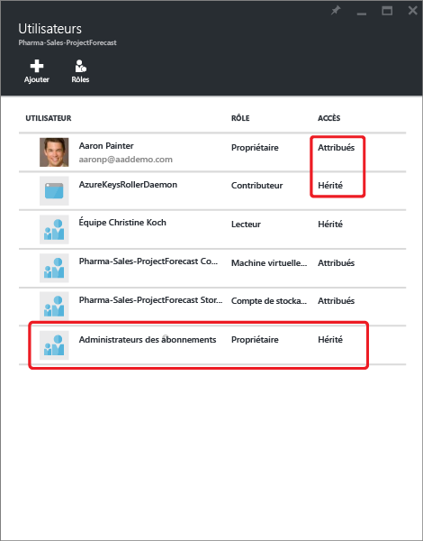
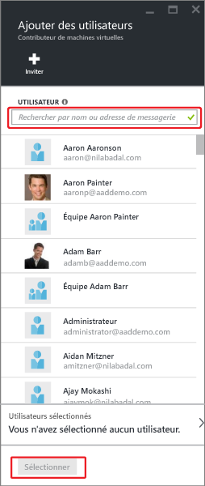
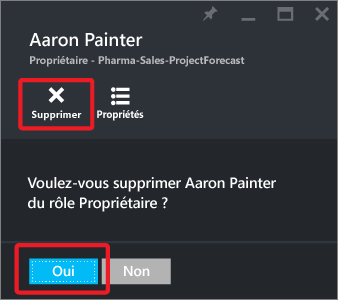

<properties
	pageTitle="Utiliser le Contrôle d’accès en fonction du rôle dans le portail Azure | Microsoft Azure"
	description="Découvrez la gestion de l’accès avec le contrôle d’accès en fonction du rôle dans le portail Azure. Utilisez des attributions de rôle pour attribuer des autorisations dans votre répertoire."
	services="active-directory"
	documentationCenter=""
	authors="kgremban"
	manager="stevenpo"
	editor=""/>

<tags
	ms.service="active-directory"
	ms.devlang="na"
	ms.topic="get-started-article"
	ms.tgt_pltfrm="na"
	ms.workload="identity"
	ms.date="05/03/2016"
	ms.author="kgremban"/>

# Utiliser les attributions de rôle pour gérer l’accès à vos ressources Azure Active Directory

Le contrôle d’accès en fonction du rôle (RBAC) Azure permet une gestion précise de l’accès pour Azure. L’utilisation de RBAC vous permet de n’accorder que les droits d’accès dont les utilisateurs ont besoin pour effectuer leur travail. Cet article vous aide à utiliser RBAC dans le portail Azure. Si vous souhaitez plus d’informations sur la gestion des droits d’accès avec RBAC, consultez [Prise en main de la gestion des accès dans le portail Azure](role-based-access-control-what-is.md).

## Voir l’accès
Vous pouvez voir qui a accès à une ressource, un groupe de ressources ou un abonnement dans son panneau principal du [portail Azure](https://portal.azure.com). Par exemple, nous voulons voir qui a accès à l’un de nos groupes de ressources :

1. Sélectionnez **Groupe de ressources** dans la barre de navigation de gauche. 
2. Sélectionnez le nom du groupe de ressources dans le panneau **Groupes de ressources**.
3. Sélectionnez **Utilisateurs** en haut à droite du panneau du groupe de ressources. 
4. Le panneau **Utilisateurs** répertorie l’ensemble des utilisateurs, groupes et applications qui ont accès au groupe de ressources.  

	

Notez que les utilisateurs ont soit un accès **Attribué** soit un accès **Hérité**. L’accès est attribué spécifiquement au groupe de ressources ou hérité d’une affectation à l’abonnement parent.

> [AZURE.NOTE] Les administrateurs et coadministrateurs d’abonnement classiques sont considérés comme propriétaires de l’abonnement dans le nouveau modèle RBAC.

## Ajout d’un accès
Vous accordez l’accès à partir de la ressource, du groupe de ressources ou de l’abonnement qui correspond à l’étendue de l’attribution du rôle.

1. Sélectionnez **Ajouter** dans le panneau **Utilisateurs**.   
2. Sélectionnez le rôle que vous souhaitez attribuer, dans le panneau **Sélectionner un rôle**.
3. Sélectionnez l’utilisateur, le groupe ou l’application de votre répertoire auquel vous voulez accorder l’accès. Dans le répertoire, vous pouvez rechercher des noms d’affichage, des adresses de messagerie et des identificateurs d’objet.  

	

4. Sélectionnez **OK** pour créer l’attribution. La fenêtre **Ajout d’utilisateur** indique l’état d’avancement. 

Une fois l’attribution de rôle ajoutée, elle apparaît dans le panneau **Utilisateurs**.

## Supprimer un accès

1. Sélectionnez l’attribution de rôle dans le panneau **Utilisateurs**.
2. Sélectionnez **Supprimer** dans le panneau de détails de l’attribution. 
3. Sélectionnez **Oui** pour confirmer la suppression. 

Les attributions héritées ne peuvent pas être supprimées. Dans l’image ci-dessous, notez que le bouton Supprimer apparaît grisé. Surtout, examinez l’information **Affecté au niveau de**. Accédez à la ressource indiquée pour supprimer l’attribution de rôle.

## Autres outils pour gérer l’accès
Vous pouvez attribuer des rôles et gérer l’accès avec les commandes RBAC Azure dans des outils autres que le portail Azure. Suivez les liens pour en savoir plus sur les conditions préalables et pour vous familiariser avec les commandes RBAC Azure.

- [Azure PowerShell](role-based-access-control-manage-access-powershell.md)
- [Interface de ligne de commande Azure](role-based-access-control-manage-access-azure-cli.md)
- [API REST](role-based-access-control-manage-access-rest.md)

## Étapes suivantes
- [Créer un rapport d’historique des modifications d’accès](role-based-access-control-access-change-history-report.md)
- Consulter les [rôles RBAC intégrés](role-based-access-built-in-roles.md)
- Définir vos propres [rôles personnalisés dans Azure RBAC](role-based-access-control-custom-roles.md)

<!---HONumber=AcomDC_0504_2016-->