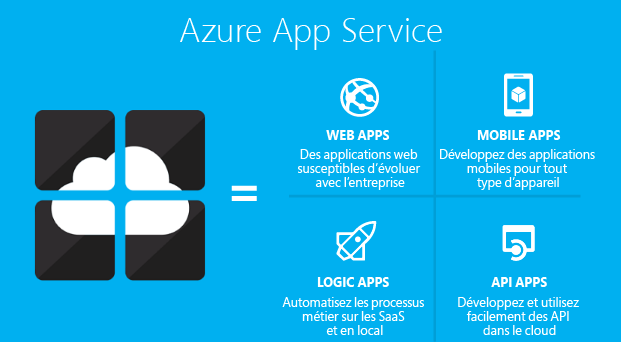
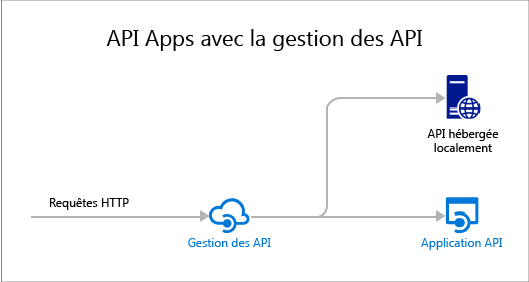

<properties 
	pageTitle="Vue d’ensemble d’API Apps | Microsoft Azure" 
	description="Découvrez comment Azure App Service vous aide à développer, héberger et utiliser des API RESTful." 
	services="app-service\api" 
	documentationCenter=".net" 
	authors="tdykstra" 
	manager="wpickett" 
	editor=""/>

<tags 
	ms.service="app-service-api" 
	ms.workload="web" 
	ms.tgt_pltfrm="na" 
	ms.devlang="na" 
	ms.topic="get-started-article" 
	ms.date="05/03/2016" 
	ms.author="tdykstra"/>

# Vue d'ensemble d'API Apps

API Apps dans Azure App Service fournit des fonctionnalités qui facilitent le développement, l’hébergement et l’utilisation des API dans le cloud et en local. Avec API Apps, vous bénéficiez d’une sécurité de classe entreprise, d’un contrôle d’accès simple, d’une connectivité hybride, de la génération automatique du kit de développement logiciel (SDK) et d’une intégration transparente dans [Logic Apps](../app-service-logic/app-service-logic-what-are-logic-apps.md).

[Azure App Service](../app-service/app-service-value-prop-what-is.md) est une plateforme entièrement gérée conçue pour les scénarios web et mobiles ainsi que pour les scénarios d’intégration. API Apps est l'un des quatre types d'application proposés par l'[Azure App Service](../app-service/app-service-value-prop-what-is.md).

## Pourquoi utiliser API Apps ?

Voici les principales fonctionnalités d'API Apps :

- **Insérez votre API existante en l’état** : vous n’avez pas besoin de modifier le code de vos API existantes pour tirer parti d’API Apps. Il vous suffit de déployer votre code dans une application API. Votre API peut utiliser n’importe quel langage ou framework pris en charge par App Service, notamment ASP.NET, C#, Java, PHP, Node.js et Python.

- **Utilisation facile** : le support intégré des [métadonnées d'API Swagger](http://swagger.io/) facilite l'utilisation de vos API par un certain nombre de clients. Générez automatiquement le code client de vos API dans divers langages, par exemple C#, Java et Javascript. Configurez facilement [CORS](app-service-api-cors-consume-javascript.md) sans modifier votre code. Pour plus d'informations, consultez [Les métadonnées d'App Service API Apps pour la détection d'API et la création de code](app-service-api-metadata.md) et [Consommer une application API à partir de JavaScript à l'aide de CORS](app-service-api-cors-consume-javascript.md).

- **Contrôle d'accès simple** : protégez une application API de tout accès non authentifié sans apporter de modification à votre code. Des services d'authentification intégrés sécurisent les API contre tout accès par d'autres services ou par des clients représentant des utilisateurs. Les fournisseurs d’identité pris en charge incluent Azure Active Directory, Facebook, Twitter, Google et Microsoft Account. Les clients peuvent utiliser l'Active Directory Authentication Library (ADAL) ou le kit de développement logiciel d'applications mobiles. Pour plus d’informations, consultez la page [Authentification et autorisation pour API Apps dans Azure App Service](app-service-api-authentication.md).

- **Intégration Visual Studio** : les outils dédiés de Visual Studio rationalisent le travail de création, de déploiement, de consommation, de débogage et de gestion des applications API. Pour en savoir plus, consultez [Annonce du Kit de développement logiciel (SDK) Microsoft Azure version 2.8.1 pour .NET](/blog/announcing-azure-sdk-2-8-1-for-net/).

- **Intégration dans Logic Apps** : les applications API que vous créez peuvent être utilisées par [App Service Logic Apps](../app-service-logic/app-service-logic-what-are-logic-apps.md). Pour plus d’informations, consultez [Utilisation de votre API personnalisée hébergée sur App Service avec Logic Apps](../app-service-logic/app-service-logic-custom-hosted-api.md) et [Nouvelle version de schéma 2015-08-01-preview](../app-service-logic/app-service-logic-schema-2015-08-01.md).

Une application API peut également tirer parti des fonctionnalités offertes par [Web Apps](../app-service-web/app-service-web-overview.md) et [Mobile Apps](../app-service-mobile/app-service-mobile-value-prop.md). L’inverse est également vrai : si vous utilisez une application web ou une application mobile pour héberger une API, elle peut exploiter des fonctionnalités d’API Apps, telles que les métadonnées Swagger pour la génération de code client et CORS pour l’accès entre domaines via un navigateur. La seule différence entre les trois types d’applications (API, web, mobiles) est qu’elles s’affichent avec un nom et une icône différents dans le portail Azure.

## Quelle est la différence entre API Apps et Gestion des API Azure ?

API Apps et [Gestion des API Azure](../api-management/api-management-key-concepts.md) sont des services complémentaires :

* Le service Gestion des API est conçu pour gérer les API. Vous pouvez placer un composant frontal de Gestion des API sur une API pour surveiller et limiter l’utilisation, manipuler l’entrée et la sortie, unifier plusieurs API en un seul point de terminaison, etc. Les API gérées peuvent être hébergées n’importe où.
* Le service API Apps est conçu pour l’hébergement des API. Il comprend des fonctionnalités qui facilitent le développement et l’utilisation des API, mais à la différence du service Gestion des API, il ne permet pas de surveiller, de limiter, de manipuler ou d’unifier les API. Si vous n’avez pas besoin des fonctionnalités de gestion des API, vous pouvez héberger des API dans API Apps sans utiliser Gestion des API.

Voici un diagramme qui illustre la fonctionnalité Gestion des API utilisée pour les API hébergées dans API Apps et ailleurs.

Certaines fonctionnalités de Gestion des API et API Apps présentent des fonctions similaires. Par exemple, les deux services permettent d’automatiser la prise en charge de CORS. Si vous les utilisez ensemble, vous devez utiliser Gestion des API pour CORS, car il joue le rôle de composant frontal de vos applications API.

## Prise en main

Pour prendre en main API Apps en y déployant un exemple de code, consultez le didacticiel relatif à l’infrastructure de votre choix :

* [ASP.NET](app-service-api-dotnet-get-started.md) 
* [Node.JS](app-service-api-nodejs-api-app.md) 
* [Java](app-service-api-java-api-app.md) 

Pour poser des questions sur les applications API, démarrez un fil de discussion dans le [forum API Apps](https://social.msdn.microsoft.com/Forums/fr-FR/home?forum=AzureAPIApps).

<!------HONumber=AcomDC_0511_2016-->