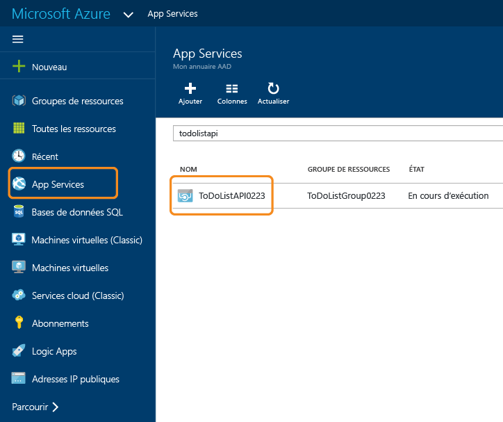
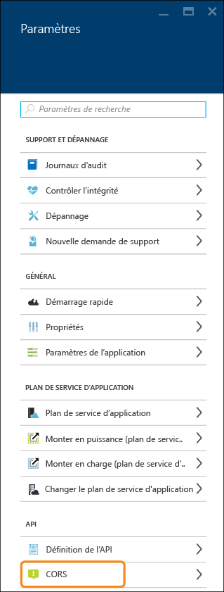
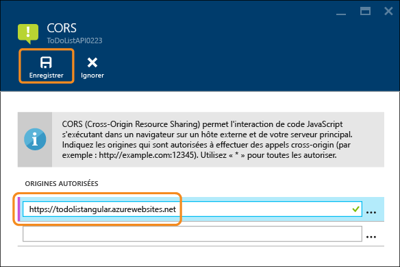
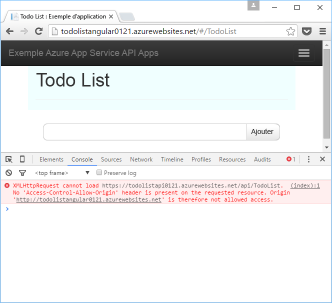
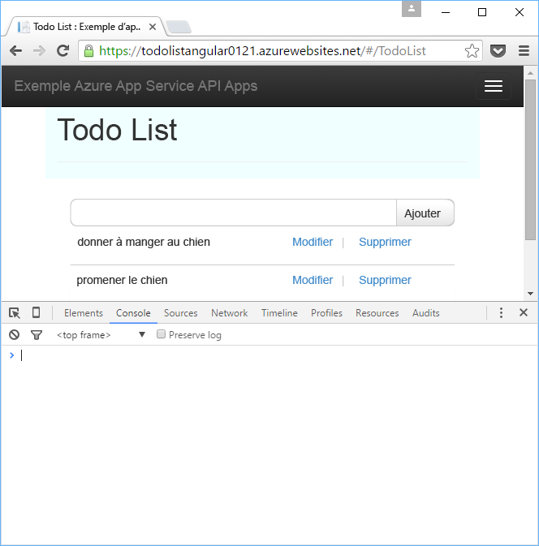

<properties
	pageTitle="Prise en charge de CORS dans App Service | Microsoft Azure"
	description="Découvrez comment utiliser la prise en charge de CORS dans Azure App Service."
	services="app-service\api"
	documentationCenter=".net"
	authors="tdykstra"
	manager="wpickett"
	editor=""/>

<tags
	ms.service="app-service-api"
	ms.workload="na"
	ms.tgt_pltfrm="dotnet"
	ms.devlang="na"
	ms.topic="get-started-article"
	ms.date="03/31/2016"
	ms.author="tdykstra"/>

# Consommer une application API à partir de JavaScript à l’aide de CORS

## Vue d'ensemble

App Service prend en charge CORS (Cross Origin Resource Sharing), ce qui permet aux clients JavaScript d’effectuer des appels entre domaines vers des API hébergées dans API Apps, Web Apps ou Mobile Apps. Cette fonctionnalité d’App Service vous permet de tirer parti de CORS sans avoir à écrire de code dans votre API.

[CORS](https://en.wikipedia.org/wiki/Cross-origin_resource_sharing) est un protocole Internet qui vous permet d’effectuer des appels API à partir de JavaScript vers un domaine différent de celui que le navigateur a chargé à partir de JavaScript. Sans CORS, vous pouvez effectuer un appel à partir d’une page web de contoso.com vers un point de terminaison d’API contoso.com, mais pas vers un point de terminaison fabrikam.com.

Cet article contient deux sections :

* La section [Configuration de CORS](#corsconfig) explique de façon générale comment configurer CORS pour toute application API, application web ou application mobile. Cette section s’applique également à toutes les infrastructures prises en charge par App Service, y compris .NET, Node.js et Java. 

* À partir de la section [Suite des didacticiels dédiés à la prise en main de .NET](#tutorialstart), cet article sous forme de didacticiel démontre la prise en charge de CORS en s’appuyant sur la procédure que vous avez suivie dans le [premier didacticiel dédié à la prise en main d’API Apps](app-service-api-dotnet-get-started.md).

##  Configuration de CORS dans Azure App Service

Vous pouvez configurer CORS dans le portail Azure ou à l’aide des outils [Azure Resource Manager](../resource-group-overview.md).

#### Configuration de CORS dans le portail Azure

8. Dans votre navigateur, accédez au [portail Azure](https://portal.azure.com/).

2. Cliquez sur **App Services**, puis sur le nom de votre application API.

	

10. Dans le panneau **Paramètres** qui s’ouvre à droite du panneau **application API**, recherchez la section **API**, puis cliquez sur **CORS**.

	

11. Dans la zone de texte, saisissez la ou les URL depuis laquelle/lesquelles vous souhaitez autoriser les appels JavaScript.

	Par exemple, si vous avez déployé votre application JavaScript sur une application web nommée todolistangular, saisissez « https://todolistangular.azurewebsites.net ». Vous pouvez également saisir un astérisque (*) pour indiquer que tous les domaines d’origine sont acceptés.

13. Cliquez sur **Enregistrer**.

	

	Lorsque vous cliquez sur **Enregistrer**, l’application API accepte les appels JavaScript depuis les URL spécifiées.

#### Configurer CORS à l’aide des outils Azure Resource Manager

Vous pouvez également configurer CORS pour une application API à l’aide des [modèles Azure Resource Manager](../resource-group-authoring-templates.md) dans les outils de ligne de commande, par exemple [Azure PowerShell](../powershell-install-configure.md) et l’[interface de ligne de commande Azure](../xplat-cli-install.md).

Pour obtenir un exemple de modèle Azure Resource Manager qui définit la propriété CORS, ouvrez le [fichier azuredeploy.json dans le référentiel correspondant à l’exemple d’application de ce didacticiel](https://github.com/azure-samples/app-service-api-dotnet-todo-list/blob/master/azuredeploy.json). Recherchez la section du modèle qui ressemble à l’exemple suivant :

		"cors": {
		    "allowedOrigins": [
		        "todolistangular.azurewebsites.net"
		    ]
		}

##  Suite du didacticiel dédié à la prise en main de .NET

Si vous suivez la série dédiée à la prise en main de Node.js ou Java pour les applications API, passez à l’article suivant, intitulé [Authentification et autorisation pour API Apps dans Azure App Service](app-service-api-authentication.md).

Le reste de cet article, qui s’inscrit dans le prolongement de la série dédiée à la prise en main de .NET, suppose que vous avez correctement exécuté [le premier didacticiel](app-service-api-dotnet-get-started.md).

## Déployer le projet ToDoListAngular dans une nouvelle application web

Dans [le premier didacticiel](app-service-api-dotnet-get-started.md), vous avez créé une application API de niveau intermédiaire ainsi qu’une application API de la couche Données. Dans ce didacticiel, vous allez créer une application web monopage (SPA) qui appelle l’API de niveau intermédiaire. Pour que cette application puisse fonctionner, vous devez activer CORS sur l’application API de niveau intermédiaire.

Dans l’[exemple d’application ToDoList](https://github.com/Azure-Samples/app-service-api-dotnet-todo-list), le projet ToDoListAngular est un client AngularJS simple qui appelle le projet web d’API ToDoListAPI de niveau intermédiaire. Le code JavaScript du fichier *app/scripts/todoListSvc.js* appelle l’API à l’aide du fournisseur HTTP AngularJS.

		angular.module('todoApp')
		.factory('todoListSvc', ['$http', function ($http) {
		    var apiEndpoint = "http://localhost:46439";
		
		    $http.defaults.useXDomain = true;
		    delete $http.defaults.headers.common['X-Requested-With']; 
		
		    return {
		        getItems : function(){
		            return $http.get(apiEndpoint + '/api/TodoList');
		        },

		        /* Get by ID, Put, and Delete methods not shown */

		        postItem : function(item){
		            return $http.post(apiEndpoint + '/api/TodoList', item);
		        }
		    };
		}]);

### Créer une application web pour le projet ToDoListAngular

La procédure de création d’une application web et de déploiement d’un projet dans cette application est identique à celle que vous avez vue dans le premier didacticiel de cette série, à ceci près que le type d’application est **application web** au lieu d’**application API**.

1. Dans l’**Explorateur de solutions**, cliquez avec le bouton droit sur le projet ToDoListAngular, puis cliquez sur **Publier**.

3.  Sous l’onglet **Profil** de l’Assistant **Publier le site web**, cliquez sur **Microsoft Azure App Service**.

5. Dans la boîte de dialogue **App Service**, cliquez sur **Nouveau**.

3. Sous l’onglet **Hébergement** de la boîte de dialogue **Créer App Service**, entrez un **Nom de l’application web** unique dans le domaine *azurewebsites.net*.

5. Choisissez l’**Abonnement** Azure souhaité.

6. Dans la liste déroulante **Groupe de ressources**, choisissez le groupe de ressources créé précédemment.

4. Dans la liste déroulante **Plan App Service**, choisissez le plan créé précédemment.

7. Cliquez sur **Create**.

	Visual Studio crée l’application web, crée un profil de publication pour elle et affiche l’étape **Connexion** de l’Assistant **Publier le site web**.

	Attendez encore avant de cliquer sur **Publier**. Dans la section suivante, vous allez configurer la nouvelle application web de manière à appeler l’application API de niveau intermédiaire exécutée dans App Service.

### Définir l’URL de niveau intermédiaire dans les paramètres de l’application web

1. Dans le [portail Azure](https://portal.azure.com/), accédez au panneau **application web** de l’application web que vous avez créée pour héberger le projet TodoListAngular (frontal).

2. Cliquez sur **Paramètres > Paramètres de l'application**.

3. Dans la section **Paramètres de l’application**, ajoutez la clé et la valeur suivantes :

	|Clé|Valeur|Exemple
	|---|---|---|
	|toDoListAPIURL|https://{your nom de votre application API de niveau intermédiaire}.azurewebsites.net|https://todolistapi0121.azurewebsites.net|

4. Cliquez sur **Enregistrer**.

	Une fois le code exécuté dans Azure, cette valeur remplace l’URL de l’hôte local qui se trouve dans le fichier *Web.config*.

	Le code permettant d’obtenir la valeur du paramètre se trouve dans le fichier *index.cshtml* :

		
		

	Le code du fichier *todoListSvc.js* utilise le paramètre :

		return {
		    getItems : function(){
		        return $http.get(apiEndpoint + '/api/TodoList');
		    },
		    getItem : function(id){
		        return $http.get(apiEndpoint + '/api/TodoList/' + id);
		    },
		    postItem : function(item){
		        return $http.post(apiEndpoint + '/api/TodoList', item);
		    },
		    putItem : function(item){
		        return $http.put(apiEndpoint + '/api/TodoList/', item);
		    },
		    deleteItem : function(id){
		        return $http({
		            method: 'DELETE',
		            url: apiEndpoint + '/api/TodoList/' + id
		        });
		    }
		};

### Déployer le projet web ToDoListAngular dans la nouvelle application web

*  Dans Visual Studio, à l’étape **Connexion** de l’Assistant **Publier le site web**, cliquez sur **Publier**.

	Visual Studio déploie le projet ToDoListAngular dans la nouvelle application web et ouvre un navigateur à l’URL de l’application web.

### Tester l’application sans activer CORS 

2. Dans les outils de développement de votre navigateur, ouvrez la fenêtre de Console.

3. Dans la fenêtre de navigateur qui affiche l’interface utilisateur AngularJS, cliquez sur le lien **Todo List**.

	Le code JavaScript essaie d’appeler l’application API de niveau intermédiaire, mais l’appel échoue car le serveur frontal est en cours d’exécution dans un autre domaine que le serveur principal. La fenêtre de Console des outils de développement du navigateur affiche un message d’erreur cross-origin.

	

## Configurer CORS pour l’application API de niveau intermédiaire

Dans cette section, vous allez configurer l’application API ToDoListAPI pour autoriser les appels JavaScript à partir de l’application web que vous avez créée pour le projet ToDoListAngular.
 
8. Dans votre navigateur, accédez au [portail Azure](https://portal.azure.com/).

2. Cliquez sur **App Services**, puis sur l’application API (niveau intermédiaire) ToDoListAPI.

	

10. Dans le panneau **Paramètres** qui s’ouvre à droite du panneau **application API**, recherchez la section **API**, puis cliquez sur **CORS**.

	

12. Dans la zone de texte, saisissez l’URL de l’application web ToDoListAngular (frontale). Par exemple, si vous avez déployé le projet ToDoListAngular pour une application web nommée todolistangular0121, autorisez les appels en provenance de l’URL `https://todolistangular0121.azurewebsites.net`.

	Vous pouvez également saisir un astérisque (*) pour indiquer que tous les domaines d’origine sont acceptés.

13. Cliquez sur **Enregistrer**.

	

	Lorsque vous cliquez sur **Enregistrer**, l’application API accepte les appels JavaScript depuis l’URL spécifiée. Dans cette capture d’écran, l’application API ToDoListAPI0223 accepte les appels de client JavaScript à partir de l’application web ToDoListAngular.

### Tester l’application en activant CORS

* Dans un navigateur, accédez à l’URL HTTPS de l’application web. 

	L’application vous permet cette fois d’afficher, ajouter, modifier et supprimer des éléments d’action.

	

## Service d’application CORS et API web CORS

Dans un projet d’API web, vous pouvez installer le package NuGet [Microsoft.AspNet.WebApi.Cors](https://www.nuget.org/packages/Microsoft.AspNet.WebApi.Cors/) pour spécifier dans le code les domaines à partir desquels votre API accepte des appels JavaScript.
 
La prise en charge de CORS dans l’API web est plus flexible que celle offerte par App Service. Par exemple : dans le code, vous pouvez spécifier différentes origines acceptées pour différentes méthodes d’action, tandis que dans App Service, vous spécifiez un ensemble d’origines acceptées pour toutes les méthodes d’une application API.

> [AZURE.NOTE] N’essayez pas d’utiliser le protocole CORS de l’API web et le protocole CORS d’App Service dans une même application API. Le protocole CORS d’App Service est prioritaire (CORS dans l’API web n’aura aucun effet). Par exemple, si vous activez un domaine d’origine dans App Service et activez tous les domaines d’origine dans votre code API Web, votre application API Azure accepte uniquement les appels en provenance du domaine spécifié dans Azure.

### Comment activer CORS dans le code de l’API web

Les étapes suivantes résument le processus d’activation de la prise en charge de CORS dans l’API web. Pour plus d’informations, consultez le didacticiel [Enabling Cross-Origin Requests in ASP.NET Web API 2](http://www.asp.net/web-api/overview/security/enabling-cross-origin-requests-in-web-api) (Activation des demandes multi-origines dans l’API Web ASP.NET).

1. Dans un projet d’API web, installez le package NuGet [Microsoft.AspNet.WebApi.Cors](https://www.nuget.org/packages/Microsoft.AspNet.WebApi.Cors/).

1. Incluez une ligne de code `config.EnableCors()` dans la méthode **Register** de la classe **WebApiConfig**, comme dans l’exemple suivant.

		public static class WebApiConfig
		{
		    public static void Register(HttpConfiguration config)
		    {
		        // Web API configuration and services
	            
		        // The following line enables you to control CORS by using Web API code
		        config.EnableCors();
	
		        // Web API routes
		        config.MapHttpAttributeRoutes();
	
		        config.Routes.MapHttpRoute(
		            name: "DefaultApi",
		            routeTemplate: "api/{controller}/{id}",
		            defaults: new { id = RouteParameter.Optional }
		        );
		    }
		}

1. Dans votre contrôleur d’API web, ajoutez une instruction `using` pour l’espace de noms `System.Web.Http.Cors` et ajoutez l’attribut `EnableCors` à la classe de contrôleur ou aux méthodes d’action individuelles. Dans l’exemple qui suit, la prise en charge de CORS s’applique à l’ensemble du contrôleur.

		namespace ToDoListAPI.Controllers 
		{
		    [HttpOperationExceptionFilterAttribute]
		    [EnableCors(origins:"https://todolistangular0121.azurewebsites.net", headers:"accept,content-type,origin,x-my-header", methods: "get,post")]
		    public class ToDoListController : ApiController
 
## Résolution de problèmes

Si vous rencontrez un problème pendant que vous progressez dans ce didacticiel, assurez-vous que vous utilisez la dernière version du kit de développement logiciel Azure pour .NET. Le moyen le plus simple pour ce faire consiste à [télécharger le kit de développement logiciel (SDK) Azure pour Visual Studio 2015](http://go.microsoft.com/fwlink/?linkid=518003). Si la version actuelle est installée, le programme d’installation de la plateforme web vous informe qu’aucune installation n’est nécessaire.

Si vous continuez à recevoir des messages d’erreur CORS après avoir défini une URL dans le panneau CORS du portail, vérifiez que vous avez correctement appliqué vos modifications aux endroits appropriés. Par exemple :

* Assurez-vous que vous avez correctement entré le protocole (`https`, et non `http`) et assurez-vous que vous utilisez `https` pour exécuter l’application web frontale.
* Assurez-vous que vous avez entré le paramètre CORS dans l’application API de niveau intermédiaire, et non dans l’application web frontale.

Si vous configurez CORS dans le code d’application et dans Azure App Service, notez que le paramètre CORS d’App Service remplacera tous les éléments contenus dans le code d’application.

Pour en savoir plus sur les fonctionnalités de Visual Studio conçues pour faciliter la résolution des problèmes, consultez l’article [Dépanner une application web dans le Service d’application Microsoft Azure à l’aide de Visual Studio](../app-service-web/web-sites-dotnet-troubleshoot-visual-studio.md).

## Étapes suivantes 

Dans cet article, vous avez vu deux façons d’activer la prise en charge de CORS afin que le code JavaScript client puisse appeler une API dans un autre domaine. Dans l’article suivant de la série dédiée à la prise en main d’API Apps, vous allez découvrir l’[authentification d’App Service API Apps](app-service-api-authentication.md).

<!---HONumber=AcomDC_0413_2016-->