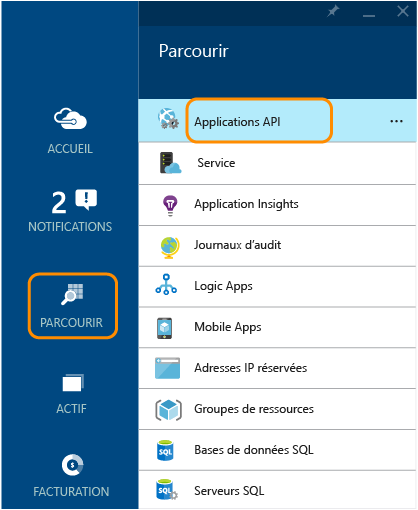
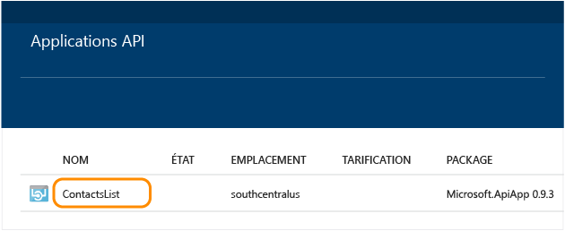
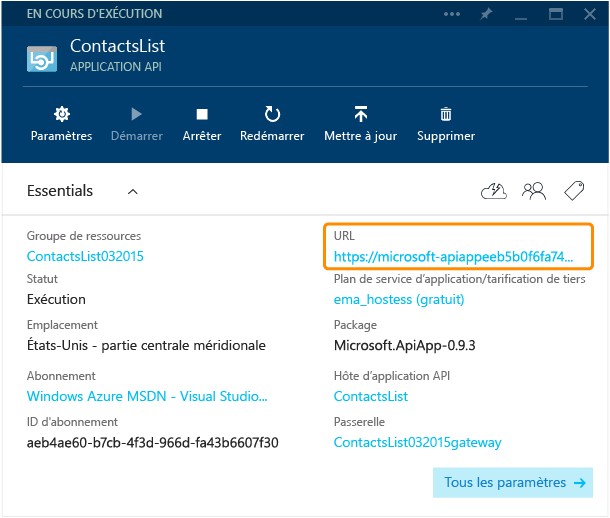
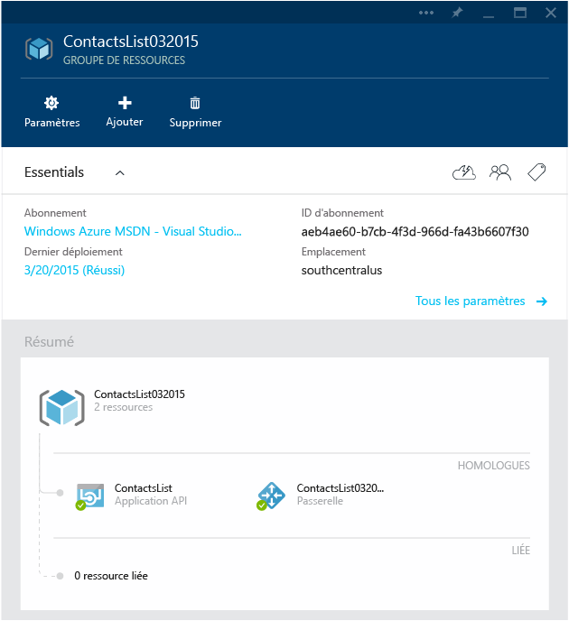
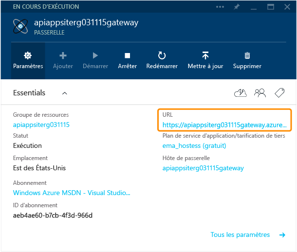
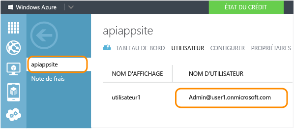
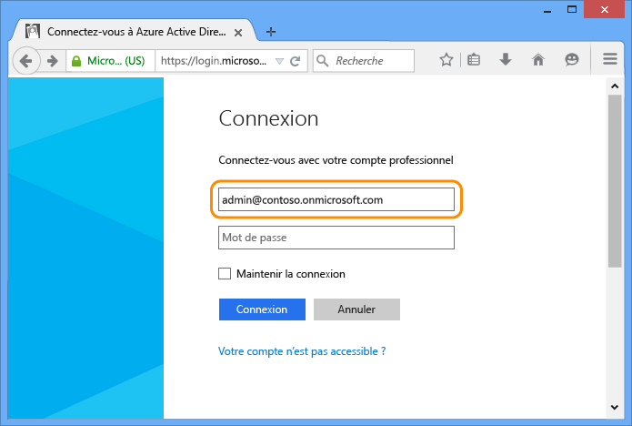
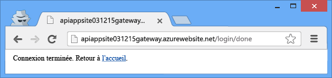

<properties 
	pageTitle="Protéger une application API Azure" 
	description="Découvrez comment protéger une application API Azure à l’aide de Visual Studio." 
	services="app-service\api" 
	documentationCenter=".net" 
	authors="tdykstra" 
	manager="wpickett" 
	editor="jimbe"/>

<tags 
	ms.service="app-service-api" 
	ms.workload="web" 
	ms.tgt_pltfrm="dotnet" 
	ms.devlang="na" 
	ms.topic="article" 
	ms.date="03/24/2015" 
	ms.author="tdykstra"/>

# Protéger une application API : ajouter une authentification de fournisseur de réseau social ou Azure Active Directory

## Vue d’ensemble

Ce didacticiel explique comment protéger une application API afin que seuls les utilisateurs authentifiés puissent y accéder. Ce didacticiel affiche le code que vous pouvez utiliser dans une application API ASP.NET pour récupérer des informations sur l’utilisateur connecté.

Vous allez effectuer les étapes suivantes :

- appeler l’application API pour vérifier qu’elle fonctionne ;
- appliquer les règles d’authentification à l’application API ;
- appeler une nouvelle fois l’application API pour vérifier qu’elle rejette les demandes non authentifiées ;
- établir une connexion au fournisseur configuré ;
- appeler une nouvelle fois l’application API pour vérifier que l’accès authentifié fonctionne ;
- écrire et tester le code qui extrait les revendications de l’utilisateur connecté.

## Composants requis

Ce didacticiel fonctionne avec l’application API que vous avez créée dans [Créer une application API](app-service-dotnet-create-api-app.md) et déployée dans [Déployer une application API](app-service-dotnet-deploy-api-app.md).

## Utiliser le navigateur pour appeler l’application API 

Le moyen le plus simple de vérifier que votre application API est publiquement accessible consiste à l’appeler à partir d’un navigateur.

1. Dans votre navigateur, accédez au [portail Azure en version préliminaire].

3. Dans la page d’accueil, cliquez sur **Parcourir > Applications API**, puis sur le nom de l’application API à protéger.

	

	

3. Dans le panneau **Application API**, cliquez sur l’**URL** pour ouvrir une fenêtre de navigateur qui appelle votre application API.

	

2. Ajoutez `/api/contacts/get/` à l’URL dans la barre d’adresse du navigateur.

	Par exemple, si l’URL de l’application API est :

    	https://microsoft-apiappeeb5bdsasd744e188be7fa26f239bd4b.azurewebsites.net/

	L’URL complète serait :

    	https://microsoft-apiappeeb5bdsasd744e188be7fa26f239bd4b.azurewebsites.net/api/contacts/get/

	Des navigateurs différents gèrent les appels d’API différemment. L’image montre un appel réussi à partir d’un navigateur Chrome.

	

2. Enregistrez l’URL que vous avez utilisée ; vous l’utiliserez de nouveau plus tard dans le didacticiel.

## Protéger l’application API

Quand vous avez déployé votre application API, vous l’avez déployée dans un groupe de ressources. Vous pouvez ajouter des applications web et d’autres applications API au même groupe de ressources, et chaque application API du groupe de ressources peut avoir l’un des trois paramètres d’accessibilité suivants : <!--todo: diagram showing different accessibility settings-->

- **Public (anonyme)** : tout le monde peut appeler l’application API en dehors du groupe de ressources sans être connecté.
- **Public (authentifié)** : seuls les utilisateurs authentifiés sont autorisés à appeler l’application API en dehors du groupe de ressources.
- **Interne** : seules d’autres applications API ou web du même groupe de ressources sont autorisées à appeler l’application API. (Les appels à partir d’applications web sont considérés comme des appels externes, même si les applications web sont dans le même groupe de ressources.)

Quand Visual Studio a créé le groupe de ressources pour vous, il a également créé une *passerelle*. Une passerelle est une application web spéciale qui gère toutes les demandes destinées aux applications API dans le groupe de ressources.

Quand vous accédez au panneau du groupe de ressources dans le [portail Azure en version préliminaire], vous pouvez voir l’application API et la passerelle dans le diagramme.

### Configurer l’application API afin d’exiger une authentification

Pour configurer votre application API pour accepter uniquement les demandes authentifiées, vous devez définir le paramètre d’accessibilité **Public (authentifié)** et configurer la passerelle pour exiger l’authentification auprès d’un fournisseur comme Azure Active Directory, Google ou Facebook.

1. Revenez au panneau **Application API** pour l’application API à protéger.

2. Dans le panneau **Application API**, cliquez sur **Paramètres**, puis sur **Paramètres de l’application**.

	

	

3. Dans le panneau **Paramètres de l’application**, remplacez le **Niveau d’accès** par **Public (authentifié)**, puis cliquez sur **Enregistrer**.

	

	Vous avez maintenant protégé l’application API contre tout accès non authentifié. Vous devez ensuite configurer la passerelle pour spécifier le fournisseur d’authentification à utiliser.

### Configurer la passerelle pour utiliser un fournisseur d’authentification

4. Faites défiler l’écran vers la gauche pour revenir au panneau **Application API**, puis cliquez sur le lien vers la passerelle.

	

7. Dans le panneau **Passerelle**, cliquez sur **Paramètres**, puis sur **Identité**.

	

	

	Dans le panneau **Identité**, vous pouvez accéder à différents panneaux pour configurer l’authentification avec Azure Active Directory et plusieurs autres fournisseurs.

	
  
3. Choisissez le fournisseur d’identité à utiliser et suivez les étapes de l’article correspondant pour configurer votre application API avec ce fournisseur. Ces articles ont été écrits pour des applications mobiles, mais les procédures sont les mêmes pour les applications API. Certaines des procédures vous demandent d’utiliser le [portail Azure].

 - [Compte Microsoft](../app-service-mobile/app-service-mobile-how-to-configure-microsoft-authentication-preview.md)
 - [Connexion Facebook](../app-service-mobile/app-service-mobile-how-to-configure-facebook-authentication-preview.md)
 - [Connexion Twitter](../app-service-mobile/app-service-mobile-how-to-configure-twitter-authentication-preview.md)
 - [Connexion Google](../app-service-mobile/app-service-mobile-how-to-configure-google-authentication-preview.md)
 - [Azure Active Directory](../app-service-mobile/app-service-mobile-how-to-configure-active-directory-authentication-preview.md)

À titre d’exemple, les captures d’écran suivantes montrent ce que vous devriez voir dans les pages du [portail Azure] et les panneaux du [portail Azure en version préliminaire] une fois que vous avez configuré l’authentification Azure Active Directory.

Dans le portail Azure en version préliminaire, le panneau **Azure Active Directory** a un **ID client** qui provient de l’application que vous avez créée sous l’onglet Azure Active Directory du portail Azure et **Clients autorisés** contient votre client Azure Active Directory (par exemple, « contoso.onmicrosoft.com »).

Dans le portail Azure, l’onglet **Configurer** de l’application créée sous l’onglet **Azure Active Directory** contient l’**URL de connexion**, l’**URI ID d’application** et l’**URL de réponse** qui proviennent du panneau **Azure Active Directory** du portail Azure en version préliminaire.

(L’URL de réponse dans l’image montre deux fois la même URL, une fois avec `http:` et une fois avec `https:`.)

## Vérifier que l’authentification fonctionne

**Remarque :** si vous avez un problème de connexion lorsque vous effectuez les étapes suivantes, essayez d’ouvrir une fenêtre privée ou incognito.
 
1. Ouvrez une fenêtre de navigateur et, dans la barre d’adresse, entrez l’URL qui appelle la méthode `Get` de votre application API, comme vous l’avez fait précédemment.

	Cette fois, la tentative d’accès à l’application API génère un message d’erreur.

	

2. Dans le navigateur, accédez à l’URL de connexion. L’URL suit ce modèle :

    	http://[gatewayurl]/login/[providername]

	Vous pouvez obtenir l’URL de la passerelle dans le panneau **Passerelle** du [portail Azure en version préliminaire]. (Pour accéder au panneau **Passerelle**, cliquez sur la passerelle dans le diagramme illustré dans le panneau **Groupe de ressources**.)

	

	La valeur du paramètre [Providername] doit être l’une des suivantes :
	
	* "microsoftaccount"
	* "facebook"
	* "twitter"
	* "google"
	* "aad"

	Voici un exemple d’URL de connexion pour Azure Active Directory :

		https://dropboxrgaeb4ae60b7cb4f3d966dfa43.azurewebsites.net/login/aad/

	Notez que, contrairement à l’URL précédente, celle-ci n’inclut pas le nom de votre application API : la passerelle sert à vous authentifier et non à authentifier l’application API. La passerelle gère l’authentification de toutes les applications API dans le groupe de ressources.

3. Entrez vos informations d’identification quand le navigateur affiche une page de connexion.
 
	Si vous avez configuré la connexion Azure Active Directory, employez l’un des utilisateurs répertoriés sous l’onglet **Utilisateurs** pour l’application que vous avez créée sous l’onglet Azure Active Directory du [portail Azure], comme admin@contoso.onmicrosoft.com.

	

	

4. Quand le message « Connexion terminée » s’affiche, entrez à nouveau l’URL à la méthode Get de votre application API.

	Cette fois, l’appel réussit, car vous êtes authentifié. La passerelle reconnaît que vous êtes un utilisateur authentifié et transmet votre demande à votre application API.

	

	

## Utiliser Postman pour envoyer une demande Post

Quand vous vous connectez à la passerelle, la passerelle renvoie un jeton d’authentification. Ce jeton doit être inclus avec toutes les demandes provenant de sources externes qui passent par la passerelle. Quand vous accédez à une API avec un navigateur, le navigateur stocke généralement le jeton dans un cookie et l’envoie avec tous les appels ultérieurs à l’API.

Afin de voir ce qui se passe en arrière-plan, vous utilisez dans cette section du didacticiel un outil de navigateur pour créer et soumettre une demande Post, vous obtenez le jeton d’autorisation du cookie et l’incluez dans un en-tête HTTP. Cette section est facultative : dans la section précédente, vous avez déjà vérifié que l’application API accepte uniquement les accès authentifiés.

Ces instructions indiquent comment utiliser l’outil Postman dans le navigateur Chrome, mais vous pouvez effectuer la même opération avec n’importe quel outil client REST et outil de développement de navigateur.

1. Dans une fenêtre de navigateur Chrome, effectuez les étapes indiquées dans la section précédente pour vous authentifier et ouvrez les Outils de développement (F12).

	

3. Sous l’onglet **Ressources** des Outils de développement Chrome, recherchez les cookies pour votre passerelle, puis cliquez trois fois sur la valeur du cookie **x-zumo-auth** pour le sélectionner en entier.

	**Remarque** : assurez-vous que vous copiez bien l’intégralité de la valeur du cookie. Si vous double-cliquez, vous risquez de ne récupérer que la première partie.

5. Cliquez avec le bouton droit sur la **Valeur** du cookie **x-zumo-auth**, puis cliquez sur **Copier**.

	

4. Installez l’extension Postman dans votre navigateur Chrome si ce n’est pas déjà fait.

6. Ouvrez l’extension Postman.

7. Dans le champ URL de la demande, entrez l’URL à la méthode Get de votre application API que vous avez utilisée précédemment, mais sans `get/` à la fin.
 
		http://[apiappurl]/api/contacts
    
8. Cliquez sur **En-têtes**, puis ajoutez un en-tête *x-zumo-auth*. Collez la valeur du jeton du Presse-papiers dans le champ **Valeur**.

9. Ajoutez un en-tête *Content-Type* avec la valeur *application/json*.

10. Cliquez sur **form-data**, puis ajoutez une clé *contact* avec la valeur suivante :

		{   "Id": 0,   "Name": "Li Yan",   "EmailAddress": "yan@contoso.com" }

11. Cliquez sur Envoyer.

	L’application API retourne une réponse *201 Créé*.

	

12. Pour vérifier que cette demande ne fonctionnerait pas sans le jeton d’authentification, supprimez l’en-tête d’authentification et cliquez à nouveau sur Envoyer.

	Vous obtenez une réponse *403 Interdit*.

	

## Obtenir des informations sur l’utilisateur connecté

Dans cette section, vous allez modifier le code de l’application API ContactsList afin qu’il récupère et renvoie l’adresse e-mail et le nom de l’utilisateur connecté.

1. Dans Visual Studio, ouvrez le projet d’application API que vous avez déployé dans [Déployer une application API](app-service-dotnet-deploy-api-app.md) et que vous avez appelé pour les besoins de ce didacticiel.

3. Ouvrez le fichier apiapp.json et ajoutez une ligne indiquant que l’application API utilise l’authentification Microsoft Azure Active Directory.

		"authentication": [{"type": "aad"}]

	Le fichier apiapp.json final ressemblera à ce qui suit :

		{
		    "$schema": "http://json-schema.org/schemas/2014-11-01/apiapp.json#",
		    "id": "ContactsList",
		    "namespace": "microsoft.com",
		    "gateway": "2015-01-14",
		    "version": "1.0.0",
		    "title": "ContactsList",
		    "summary": "",
		    "author": "",
		    "endpoints": {
		        "apiDefinition": "/swagger/docs/v1",
		        "status": null
		    },
		    "authentication": [{"type": "aad"}]
		}

	Ce didacticiel utilise Azure Active Directory à titre d’exemple. Si vous utilisez un autre fournisseur, indiquez l’identificateur approprié. Voici les valeurs valides :

	* "aad"
	* "microsoftaccount"
	* "google"
	* "twitter"
	* "facebook" 

2. Dans le fichier *ContactsController.cs*, remplacez le code de la méthode `Get` par le code suivant.

		var runtime = Runtime.FromAppSettings(Request);
		var user = runtime.CurrentUser;
		TokenResult token = await user.GetRawTokenAsync("aad");
		var name = (string)token.Claims["name"];
		var email = (string)token.Claims["http://schemas.xmlsoap.org/ws/2005/05/identity/claims/upn"];
		return new Contact[]
		{
		    new Contact { Id = 1, EmailAddress = email, Name = name }
		};

	Au lieu des trois exemples de contact, le code renvoie les informations de contact associées à l’utilisateur connecté.

	Cet exemple de code utilise Azure Active Directory. Si vous utilisez un autre fournisseur, indiquez le nom de jeton et l’identificateur de revendication appropriés, comme indiqué à l’étape précédente.

	Pour en savoir plus sur les revendications Microsoft Azure Active Directory disponibles, voir [Types de jetons et de revendications pris en charge](https://msdn.microsoft.com/library/dn195587.aspx).

3. Ajoutez une instruction pour l’élément `Microsoft.Azure.AppService.ApiApps.Service`.

		using Microsoft.Azure.AppService.ApiApps.Service;

3. Redéployez le projet.

	Visual Studio enregistre les paramètres appliqués lorsque vous avez déployé le projet en suivant le didacticiel [Déployer](app-service-dotnet-deploy-api-app.md). Cliquez avec le bouton droit de la souris sur le projet, puis sélectionnez **Publier**. Ensuite, cliquez sur **Publier** dans la boîte de dialogue **Publier sur le site web**.

6. Suivez la procédure précédemment effectuée pour envoyer une demande Get à l’application API protégée.

	Le message de réponse indique le nom et l’ID de l’identité que vous avez utilisée pour vous connecter.

	

## Étapes suivantes

Vous avez vu comment protéger une application API Azure en exigeant une authentification de fournisseur de réseau social ou Azure Active Directory. Pour plus d’informations, consultez [Que sont les applications API](app-service-api-apps-why-best-platform.md).

[portail Azure]: https://manage.windowsazure.com/
[portail Azure en version préliminaire]: https://portal.azure.com/

 

<!---HONumber=62-->