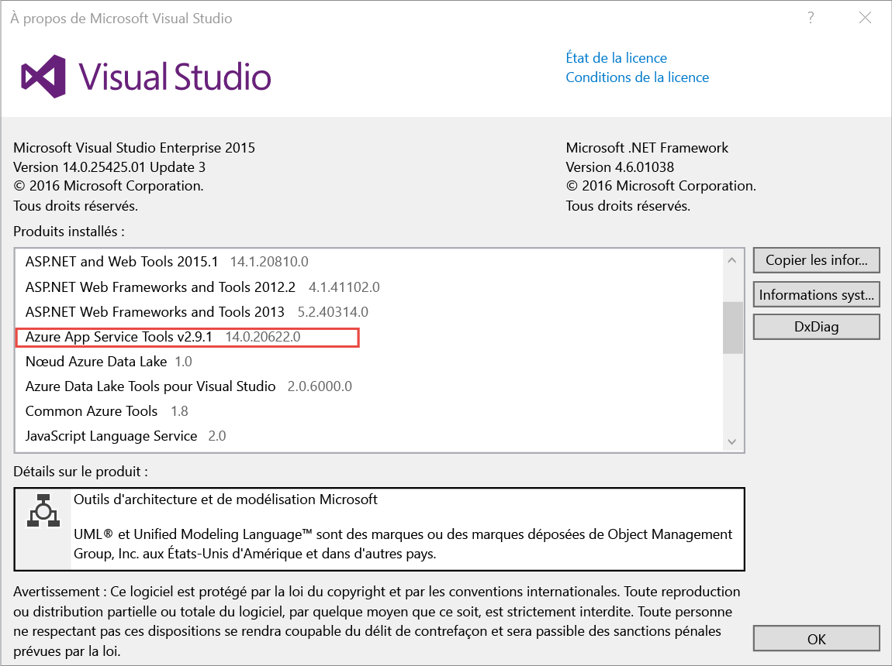
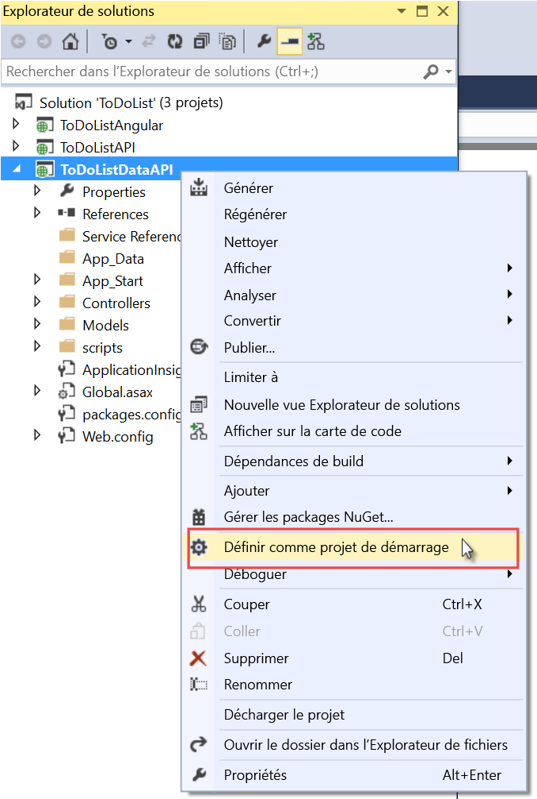

# Prise en main d’API Apps, d’ASP.NET et de Swagger dans Azure App Service
[!INCLUDE [sélecteur](../../includes/app-service-api-get-started-selector.md)]

Ce premier didacticiel de la série explique comment utiliser les fonctionnalités d’Azure App Service pour le développement et l’hébergement d’API RESTful : Ce didacticiel décrit la prise en charge des métadonnées des API au format Swagger.

Vous apprendrez ce qui suit :

* Créer et déployer des [applications API](app-service-api-apps-why-best-platform.md) dans Azure App Service à l’aide des outils intégrés à Visual Studio 2015
* Automatiser la découverte d’API en utilisant le package Swashbuckle NuGet pour générer de manière des métadonnées d’API Swagger
* Utiliser des métadonnées d’API Swagger pour générer automatiquement un code client pour une application API.

## Vue d’ensemble de l’exemple d’application
Dans ce didacticiel, vous travaillez avec un exemple d’application de liste des tâches simples. L’application contient un composant frontal d’application monopage (SPA), une couche intermédiaire d’API web ASP.NET et une couche de données d’API web ASP.NET.

Voici une capture d’écran du composant frontal [AngularJS](https://angularjs.org/).

La solution Visual Studio inclut trois projets :

* **ToDoListAngular** (composant frontal) : application monopage AngularJS qui appelle la couche intermédiaire.
* **ToDoListAPI** (couche intermédiaire) : projet API web ASP.NET qui appelle la couche Données pour effectuer des opérations CRUD sur les éléments de tâche.
* **ToDoListAPI** (couche Données) : un projet API web ASP.NET qui exécute les opérations CRUD sur les éléments de tâche.

L’architecture à trois niveaux est une des nombreuses architectures que vous pouvez implémenter à l’aide d’API Apps et est utilisée ici uniquement à des fins de démonstration. Le code de chaque niveau est aussi simple que possible de manière à illustrer les fonctionnalités API Apps ; par exemple, la couche Données utilise la mémoire du serveur plutôt qu’une base de données comme mécanisme de persistance.

À la fin de ce didacticiel, les deux projets d’API web seront opérationnels dans le cloud dans App Service API Apps.

Le didacticiel suivant de la série déploie le serveur principal SPA sur le cloud.

## Composants requis
* API web ASP.NET : les instructions du didacticiel supposent que vous ayez une connaissance de base de l’utilisation de l’[API web 2](http://www.asp.net/web-api/overview/getting-started-with-aspnet-web-api/tutorial-your-first-web-api) ASP.NET dans Visual Studio.
* Compte Azure : vous pouvez [ouvrir un compte Azure gratuit](/pricing/free-trial/?WT.mc_id=A261C142F) ou [activer les avantages de l’abonnement à Visual Studio](/pricing/member-offers/msdn-benefits-details/?WT.mc_id=A261C142F).
  
    Si vous souhaitez commencer à utiliser Azure App Service avant d’ouvrir un compte Azure, accédez à [Essayer App Service](http://go.microsoft.com/fwlink/?LinkId=523751). De là, vous pouvez créer immédiatement une première application temporaire dans App Service. **Aucune carte de crédit** ni aucun engagement ne sont nécessaires.
* Visual Studio 2015 avec le [kit de développement logiciel (SDK) Azure pour .NET](https://azure.microsoft.com/downloads/archive-net-downloads/) : le Kit de développement logiciel (SDK) installe automatiquement Visual Studio 2015 si vous ne l’avez pas encore.
  
  * Dans Visual Studio, cliquez sur Aide -> À propos de Microsoft Visual Studio et vérifiez que « Azure App Service Tools v2.9.1 » ou ultérieur est installé.
    
    
    
    > [!NOTE]
    > en fonction du nombre de dépendances du Kit de développement logiciel (SDK) qui se trouvent déjà sur votre ordinateur, l'installation du SDK peut prendre un certain temps (de plusieurs minutes à une demi-heure, voire plus).
    > 
    > 

## Téléchargement de l'exemple d'application
1. Téléchargez le référentiel [Azure-Samples/app-service-api-dotnet-to-do-list](https://github.com/Azure-Samples/app-service-api-dotnet-todo-list).
   
    Vous pouvez cliquer sur le bouton **Download ZIP (Télécharger le zip)** ou cloner le référentiel sur votre ordinateur local.
2. Ouvrez la solution ToDoList dans Visual Studio 2015 ou 2013.
   
   1. Vous devrez approuver chaque solution. 
3. Générez la solution (CTRL + MAJ + B) pour restaurer les packages NuGet.
   
    Si vous souhaitez voir l’application fonctionner avant de la déployer, vous pouvez l’exécuter localement. Assurez-vous que ToDoListDataAPI est votre projet de démarrage et exécutez la solution. Votre navigateur devrait afficher l’erreur HTTP 403.

## Utiliser l’interface utilisateur et les métadonnées d’API Swagger
La prise en charge des métadonnées d’API [Swagger](http://swagger.io/) 2.0 est intégrée aux applications API App Service. Chaque application API peut définir un point de terminaison d’URL qui renvoie à l’API des métadonnées au format JSON Swagger. Les métadonnées retournées à partir de ce point de terminaison peuvent être utilisées pour générer le code client.

Un projet d’API web ASP.NET peut générer dynamiquement des métadonnées Swagger à l’aide du package NuGet [Swashbuckle](https://www.nuget.org/packages/Swashbuckle). Le package NuGet Swashbuckle est déjà installé dans les projets ToDoListDataAPI et ToDoListAPI que vous avez téléchargés.

Dans cette section du didacticiel, nous allons examiner les métadonnées Swagger 2.0 générées, puis essayer une interface utilisateur test basée sur les métadonnées Swagger.

1. Définissez le projet ToDoListDataAPI (**et non** le projet ToDoListAPI) comme projet de démarrage.
   
    
2. Appuyez sur F5 ou cliquez sur **Déboguer > Démarrer le débogage** pour exécuter le projet en mode débogage.
   
    Le navigateur s’ouvre et affiche la page d’erreur HTTP 403.
3. Dans la barre d’adresses de votre navigateur, ajoutez `swagger/docs/v1` à la fin de la ligne, puis appuyez sur Retour. (L’URL est `http://localhost:45914/swagger/docs/v1`.)
   
    Il s’agit de l’URL par défaut utilisée par Swashbuckle pour retourner les métadonnées JSON Swagger 2.0 pour l’API.
   
    Si vous utilisez Internet Explorer, le navigateur vous invite à télécharger un fichier *v1.json*.
   
    
   
    Si vous utilisez Chrome, Firefox ou Edge, le navigateur affiche le fichier JSON dans la fenêtre du navigateur. La gestion du fichier JSON diffère selon les navigateurs, et il se peut que la fenêtre de votre navigateur ne se présente pas exactement comme dans l’exemple.
   
    
   
    L’exemple suivant montre la première section de métadonnées Swagger de l’API, avec la définition de la méthode Get. Ce sont ces métadonnées qui pilotent l’interface utilisateur Swagger que vous allez utiliser dans les étapes suivantes, et vous les utiliserez dans une section ultérieure de ce didacticiel pour générer automatiquement le code client.
   
        {
          "swagger": "2.0",
          "info": {
            "version": "v1",
            "title": "ToDoListDataAPI"
          },
          "host": "localhost:45914",
          "schemes": [ "http" ],
          "paths": {
            "/api/ToDoList": {
              "get": {
                "tags": [ "ToDoList" ],
                "operationId": "ToDoList_GetByOwner",
                "consumes": [ ],
                "produces": [ "application/json", "text/json", "application/xml", "text/xml" ],
                "parameters": [
                  {
                    "name": "owner",
                    "in": "query",
                    "required": true,
                    "type": "string"
                  }
                ],
                "responses": {
                  "200": {
                    "description": "OK",
                    "schema": {
                      "type": "array",
                      "items": { "$ref": "#/definitions/ToDoItem" }
                    }
                  }
                },
                "deprecated": false
              },
4. Fermez le navigateur et arrêtez le débogage de Visual Studio.
5. Dans le projet ToDoListDataAPI, dans l’**Explorateur de solutions**, ouvrez le fichier *App\_Start\\SwaggerConfig.cs*, puis faites défiler la page jusqu’à la ligne 174 et supprimez les marques de commentaire.
   
        /*
            })
        .EnableSwaggerUi(c =>
            {
        */
   
    Le fichier *SwaggerConfig.cs* est créé quand vous installez le package Swashbuckle dans un projet. Ce fichier permet de configurer Swashbuckle de différentes manières.
   
    Le code dont vous avez supprimé les marques de commentaire active l’interface utilisateur Swagger que vous utiliserez lors des étapes suivantes. Lorsque vous créez un projet d’API Web à l’aide du modèle de projet Application API, ce code est commenté par défaut par mesure de sécurité.
6. Réexécutez le projet.
7. Dans la barre d’adresses de votre navigateur, ajoutez `swagger` à la fin de la ligne, puis appuyez sur Retour. (L’URL est `http://localhost:45914/swagger`.)
8. Quand l’interface utilisateur Swagger apparaît, cliquez sur **ToDoList** pour voir les méthodes disponibles.
   
    
9. Cliquez sur le premier bouton **Obtenir** de la liste.
10. Dans la section **Paramètres**, entrez un astérisque comme valeur du paramètre `owner`, puis cliquez sur **Faites un essai**.
    
    Lorsque vous ajouterez l’authentification dans les autres didacticiels, la couche intermédiaire fournira l’ID d’utilisateur à la couche de données. Pour l’instant, toutes les tâches ont un astérisque comme ID de leur propriétaire tandis que l’application s’exécute sans que l’authentification ne soit activée.
    
    
    
    L’interface utilisateur de Swagger appelle la méthode Get de TodoList et affiche le code de réponse et les résultats JSON.
    
    
11. Cliquez sur **Post**, puis cochez la case sous **Model Schema**.
    
    Quand vous cliquez sur le schéma de modèle, la zone de texte est préremplie automatiquement. Vous pouvez y spécifier la valeur du paramètre de la méthode Post. (Si cela ne fonctionne pas dans Internet Explorer, utilisez un autre navigateur ou entrez la valeur du paramètre manuellement à l’étape suivante.)
    
    
12. Modifiez le fichier JSON dans la zone d’entrée de paramètre `todo` pour obtenir un résultat similaire à l’exemple suivant, ou insérez votre propre texte descriptif :
    
        {
          "ID": 2,
          "Description": "buy the dog a toy",
          "Owner": "*"
        }
13. Cliquez sur **Try it out**.
    
    L’API ToDoList retourne un code de réponse HTTP 204 indiquant que le processus a réussi.
14. Cliquez sur le premier bouton **Obtenir**, puis, dans cette section de la page, cliquez sur le bouton **Faites un essai**.
    
    La réponse de la méthode Get inclut désormais le nouvel élément de tâche.
15. Facultatif : essayez également les méthodes Put, Delete et Get by ID.
16. Fermez le navigateur et arrêtez le débogage de Visual Studio.

Swashbuckle fonctionne avec n’importe quel projet d’API Web ASP.NET. Si vous souhaitez ajouter la génération de métadonnées Swagger à un projet existant, il suffit d’installer le package Swashbuckle.

> [!NOTE]
> Les métadonnées Swagger incluent un ID unique pour chaque opération d’API. Par défaut, Swashbuckle peut générer des ID d’opération Swagger en double pour vos méthodes de contrôleur d’API web. Cela se produit si les méthodes HTTP du contrôleur sont surchargées, par exemple `Get()` et `Get(id)`. Pour plus d’informations sur la gestion des surcharges, consultez [Personnaliser les définitions d’API générées par Swashbuckle](app-service-api-dotnet-swashbuckle-customize.md). Si vous créez un projet d’API web dans Visual Studio en utilisant le modèle d’application API Azure, le code qui génère les ID d’opération uniques est automatiquement ajouté au fichier *SwaggerConfig.cs*.
> 
> 

##  Créer une application API dans Azure et y déployer du code
Dans cette section, vous allez utiliser les outils Azure intégrés à l’Assistant **Publier le site web** de Visual Studio pour créer une application API dans Azure. Ensuite, vous déploierez le projet ToDoListDataAPI vers la nouvelle application API et vous appellerez l’API en exécutant l’interface utilisateur Swagger.

1. Dans l’**Explorateur de solutions**, cliquez avec le bouton droit sur le projet ToDoListDataAPI, puis cliquez sur **Publier**.
   
    
2. À l’étape **Profil** de l’Assistant **Publier le site web**, cliquez sur **Microsoft Azure App Service**.
   
   
3. Connectez-vous à votre compte Azure si ce n’est déjà fait, ou actualisez vos informations d’identification si elles ont expiré.
4. Dans la boîte de dialogue App Service, choisissez l’**abonnement** Azure que vous souhaitez utiliser, puis cliquez sur **Nouveau**.
   
    
   
    L’onglet **Hébergement** de la boîte de dialogue **Créer App Service** s’affiche.
   
    Étant donné que vous déployez un projet d’API web dans lequel Swashbuckle est installé, Visual Studio part du principe que vous souhaitez créer une application API. Cela est indiqué par le titre **Nom de l’application API** et par le fait que la liste déroulante **Modifier le type** est définie sur **Application API**.
   
    
5. Entrez un **Nom de l’application API** unique dans le domaine *azurewebsites.net*. Vous pouvez accepter le nom par défaut proposé par Visual Studio.
   
    Si vous entrez un nom déjà utilisé par un autre utilisateur, un point d’exclamation rouge s’affiche à droite.
   
    L’URL de l’API sera `{API app name}.azurewebsites.net`.
6. Dans la liste déroulante **Groupe de ressources**, cliquez sur **Nouveau**, puis entrez « ToDoListGroup » ou un autre nom si vous préférez.
   
    Un groupe de ressources est une collection de ressources Azure telles que des applications API, des bases de données, des machines virtuelles, etc. Pour ce didacticiel, il est préférable de créer un groupe de ressources, car cela facilite la suppression en une étape de toutes les ressources Azure que vous créez pour le didacticiel.
   
    Cette zone vous permet de sélectionner un [groupe de ressources](../resource-group-overview.md) ou d’en créer un avec un nom différent de ceux qui existent déjà dans votre abonnement.
7. Cliquez sur le bouton **Nouveau** situé en regard de la liste déroulante **Plan App Service**.
   
    La capture d’écran montre des exemples de valeur pour **Nom de l’application API**, **Abonnement** et **Groupe de ressources**. Vos valeurs seront différentes.
   
    
   
    Au cours des étapes suivantes, vous allez créer un plan de service d’application pour le nouveau groupe de ressources. Un plan de service d’application spécifie les ressources de calcul sur lesquelles votre application API s’exécute. Par exemple, si vous choisissez le niveau Gratuit, votre application API s’exécute sur des machines virtuelles partagées, tandis que pour certains niveaux payants, elle s’exécute sur des machines virtuelles dédiées. Pour plus d’informations sur les plans App Service, consultez [Présentation des plans App Service](../app-service/azure-web-sites-web-hosting-plans-in-depth-overview.md).
8. Dans la boîte de dialogue **Configurer le plan App Service**, entrez « ToDoListPlan » ou un autre nom si vous préférez.
9. Dans la liste déroulante **Emplacement**, sélectionnez le lieu le plus proche de vous.
   
    Ce paramètre indique le centre de données Azure dans lequel votre application sera exécutée. Choisissez un emplacement proche de vous afin de réduire la [latence](http://www.bing.com/search?q=web%20latency%20introduction&qs=n&form=QBRE&pq=web%20latency%20introduction&sc=1-24&sp=-1&sk=&cvid=eefff99dfc864d25a75a83740f1e0090).
10. Dans la liste déroulante **Taille**, cliquez sur **Gratuit**.
    
    Pour ce didacticiel, le niveau tarifaire Gratuit fournit des performances suffisantes.
11. Dans la boîte de dialogue **Configurer le plan App Service**, cliquez sur **OK**.
    
    
12. Dans la boîte de dialogue **Créer App Service**, cliquez sur **Créer**.
    
    
    
    Visual Studio crée l’application API et un profil de publication qui comporte tous les paramètres nécessaires pour l’application API. Puis, il ouvre l’Assistant **Publier le site web** que vous utiliserez pour déployer le projet.
    
    L’Assistant **Publier le site web** s’ouvre dans l’onglet **Connexion** (illustré ci-dessous).
    
    Dans l’onglet **Connexion**, les paramètres **Serveur** et **Nom du site** pointent vers votre application API. Le **nom d’utilisateur** et le **mot de passe** sont les informations d’identification de déploiement créées pour vous par Azure. Après le déploiement, Visual Studio ouvre un navigateur sur l’**URL de destination** (c’est le seul objectif de l’**URL de destination**).
13. Cliquez sur **Next**.
    
    
    
    L’onglet suivant est l’onglet **Paramètres** (illustré ci-dessous). Vous pouvez y modifier l’onglet Configuration de build pour déployer un build de débogage pour le [débogage à distance](../app-service-web/web-sites-dotnet-troubleshoot-visual-studio.md#remotedebug). L’onglet offre également plusieurs **Options de publication des fichiers** :
    
    * Supprimer les fichiers supplémentaires de la destination
    * Précompiler durant la publication
    * Exclure les fichiers du dossier App\_Data
    
    Pour ce didacticiel, vous n’avez besoin d’aucune de ces options. Pour obtenir des explications détaillées sur leur action, consultez la rubrique [Déploiement d’un projet web à l’aide de la publication en un clic dans Visual Studio](https://msdn.microsoft.com/library/dd465337.aspx).
14. Cliquez sur **Next**.
    
    
    
    Vient ensuite l’onglet **Aperçu** (illustré ci-dessous), qui vous permet de voir les fichiers qui vont être copiés de votre projet vers l’application API. Lorsque vous déployez un projet vers une application API vers laquelle vous avez déjà déployé auparavant le projet, seuls les fichiers modifiés sont copiés. Si vous souhaitez afficher la liste de ce qui sera copié, vous pouvez cliquer sur le bouton **Démarrer l’aperçu**.
15. Cliquez sur **Publier**.
    
    
    
    Visual Studio déploie le projet ToDoListDataAPI vers la nouvelle application API. La fenêtre **Sortie** consigne le déploiement réussi, et la page « Créé avec succès » s’affiche dans une fenêtre du navigateur ouverte sur l’URL de l’application API.
    
    
    
    
16. Ajoutez « swagger » à l’URL dans la barre d’adresses du navigateur, puis appuyez sur Entrée. (L’URL est `http://{apiappname}.azurewebsites.net/swagger`.)
    
    Le navigateur affiche la même interface utilisateur de Swagger que précédemment, mais elle s’exécute désormais dans le cloud. La méthode Get vous ramène aux 2 éléments d’action par défaut. Les modifications apportées précédemment ont été enregistrées dans la mémoire de l’ordinateur local.
17. Ouvrez le [portail Azure](https://portal.azure.com/).
    
    Le portail Azure est une interface web permettant de gérer les ressources Azure telles que les applications API.
18. Cliquez sur **Plus de services > App Services**.
    
    
19. Dans le panneau **App Services**, recherchez votre nouvelle application API et cliquez dessus. (Dans le portail Azure, les fenêtres qui s’ouvrent sur la droite sont appelées des *panneaux*.)
    
    
    
    Deux panneaux s’ouvrent. L’un présentant une vue d’ensemble de l’application API et l’autre contenant une longue liste des paramètres que vous pouvez afficher et modifier.
20. Dans le panneau **Paramètres**, recherchez la section **API**, puis cliquez sur **Définition de l’API**.
    
    
    
    Le panneau **Définition de l’API** vous permet de spécifier l’URL qui renvoie les métadonnées Swagger 2.0 au format JSON. Quand Visual Studio crée l’application API, il définit l’URL de définition de l’API, à savoir l’URL de base de l’application API plus `/swagger/docs/v1` sur la valeur par défaut des métadonnées générées par Swashbuckle que vous avez vues précédemment.
    
    
    
    Quand vous sélectionnez une application API pour laquelle générer le code client, Visual Studio extrait les métadonnées à partir de cette URL.

##  Générer le code client pour la couche Données
L’un des avantages de l’intégration de Swagger dans les applications API Azure est la génération de code automatique. Les classes de client générées facilitent l’écriture du code qui appelle une application API.

Le projet ToDoListAPI comporte déjà le code client généré, mais vous allez le supprimer et le régénérer lors des étapes suivantes pour voir comment procéder.

1. Dans l’**Explorateur de solutions** de Visual Studio, dans le projet ToDoListAPI, supprimez le dossier *ToDoListDataAPI*. **Attention : supprimez uniquement le dossier, et non le projet ToDoListDataAPI.**
   
    
   
    Ce dossier a été créé à l’aide du processus de génération de code que vous allez aborder.
2. Cliquez avec le bouton droit sur le projet ToDoListAPI, puis cliquez sur **Ajouter > Client d’API REST**.
   
    
3. Dans la boîte de dialogue **Ajouter un client d’API REST**, cliquez sur **URL Swagger**, puis sur **Sélectionner une ressource Azure**.
   
    
4. Dans la boîte de dialogue **App Service**, développez le groupe de ressources que vous utilisez pour ce didacticiel, sélectionnez votre application API, puis cliquez sur **OK**.
   
    
   
    Notez que lorsque vous revenez à la boîte de dialogue **Client API REST**, la zone de texte a été remplie avec la valeur de l’URL de définition d’API que vous avez vue précédemment dans le portail.
   
    
   
   > [!TIP]
   > Pour obtenir les métadonnées nécessaires à la génération du code, vous pouvez également saisir l’URL directement au lieu de passer par la boîte de dialogue. Ou, si vous souhaitez générer le code client avant le déploiement vers Azure, vous pouvez exécuter localement le projet d’API web, accéder à l’URL qui fournit le fichier JSON Swagger, enregistrer le fichier et utiliser l’option **Sélectionner un fichier de métadonnées Swagger existant**.
   > 
   > 
5. Dans la boîte de dialogue **Ajouter un client API REST**, cliquez sur **OK**.
   
    Visual Studio crée un dossier nommé d’après l’application API et il génère des classes de client.
   
    
6. Dans le projet ToDoListAPI, ouvrez *Controllers\\ToDoListController.cs* pour afficher le code de la ligne 40 qui appelle l’API à l’aide du client généré.
   
    L’extrait de code suivant montre comment instancier l’objet client et appeler la méthode Get.
   
        private static ToDoListDataAPI NewDataAPIClient()
        {
            var client = new ToDoListDataAPI(new Uri(ConfigurationManager.AppSettings["toDoListDataAPIURL"]));
            return client;
        }
   
        public async Task<IEnumerable<ToDoItem>> Get()
        {
            using (var client = NewDataAPIClient())
            {
                var results = await client.ToDoList.GetByOwnerAsync(owner);
                return results.Select(m => new ToDoItem
                {
                    Description = m.Description,
                    ID = (int)m.ID,
                    Owner = m.Owner
                });
            }
        }
   
    Le paramètre de constructeur obtient l’URL de point de terminaison à partir du paramètre d’application `toDoListDataAPIURL`. Dans le fichier Web.config, cette valeur est définie sur l’URL IIS Express locale du projet d’API pour vous permettre d’exécuter l’application localement. Si vous omettez le paramètre de constructeur, le point de terminaison par défaut est l’URL à partir de laquelle vous avez généré le code.
7. Votre classe client est générée avec un nom différent selon le nom de votre application API. Modifiez ce code dans *Controllers\\ToDoListController.cs* pour que le nom de type corresponde à ce qui a été généré dans votre projet. Par exemple, si vous avez nommé votre application API ToDoListDataAPI071316, vous modifieriez ce code :
   
        private static ToDoListDataAPI NewDataAPIClient()
        {
            var client = new ToDoListDataAPI(new Uri(ConfigurationManager.AppSettings["toDoListDataAPIURL"]));

De la manière suivante :

        private static ToDoListDataAPI071316 NewDataAPIClient()
        {
            var client = new ToDoListDataAPI071316(new Uri(ConfigurationManager.AppSettings["toDoListDataAPIURL"]));

## Créer une application API pour héberger la couche intermédiaire
Vous avez [créé l’application API de la couche Données et déployé du code dans celle-ci](#createapiapp). Maintenant vous suivez la même procédure pour l’application API de niveau intermédiaire.

1. Dans l’**Explorateur de solutions**, cliquez avec le bouton droit sur le projet ToDoListAPI de la couche intermédiaire (et non sur le projet ToDoListDataAPI), puis sur **Publier**.
   
    
2. Sous l’onglet **Profil** de l’Assistant **Publier le site web**, cliquez sur **Microsoft Azure App Service**.
3. Dans la boîte de dialogue **App Service**, cliquez sur **Nouveau**.
4. Dans l’onglet **Hébergement** de la boîte de dialogue **Créer App Service**, acceptez le **nom d’application API** par défaut ou entrez un nom unique dans le domaine *azurewebsites.net*.
5. Choisissez l’**abonnement** Azure que vous avez utilisé.
6. Dans la liste déroulante **Groupe de ressources**, choisissez le groupe de ressources créé précédemment.
7. Dans la liste déroulante **Plan App Service**, choisissez le plan créé précédemment. Il est défini par défaut sur cette valeur.
8. Cliquez sur **Create**.
   
    Visual Studio crée l’application API et un profil de publication pour celle-ci, puis affiche l’étape **Connexion** de l’Assistant **Publier le site web**.
9. À l’étape **Connexion** de l’Assistant **Publier le site web**, cliquez sur **Publier**.
   
   Visual Studio déploie le projet ToDoListAPI vers la nouvelle application API et ouvre un navigateur à l’URL de l’application API. Une page s’affiche pour confirmer la création.

## Configurer la couche intermédiaire pour appeler la couche Données
Si vous appelez maintenant l’application API de la couche intermédiaire, elle essaie d’appeler la couche Données à l’aide de l’URL d’hôte local qui figure toujours dans le fichier Web.config. Dans cette section, vous entrez l’URL de l’application API de la couche Données dans un paramètre d’environnement de l’application API de la couche intermédiaire. Lorsque le code de l’application API de la couche intermédiaire récupère le paramètre d’URL de la couche Données, le paramètre d’environnement remplace ce qui figure dans le fichier Web.config.

1. Dans le [portail Azure](https://portal.azure.com/), accédez au panneau **Application API** de l’application API que vous avez créée pour héberger le projet TodoListAPI (de la couche intermédiaire).
2. Dans le panneau **Paramètres** de l’application API, cliquez sur **Paramètres de l’application**.
3. Dans le panneau **Paramètres de l’application** de l’application API, faites défiler l’écran jusqu’à la section **Paramètres de l’application** et ajoutez la clé et la valeur suivantes. La valeur sera l’URL de la première application API que vous avez publiée dans ce didacticiel.
   
   | **Clé** | toDoListDataAPIURL |
   | --- | --- |
   | **Valeur** |https://{your nom de votre application API de la couche Données}.azurewebsites.net |
   | **Exemple** |https://todolistdataapi.azurewebsites.net |
4. Cliquez sur **Enregistrer**.
   
    
   
    Lorsque le code sera exécuté dans Azure, cette valeur remplacera dès lors l’URL de l’hôte local qui se trouve dans le fichier Web.config.

## Test
1. Dans une fenêtre de navigateur, accédez à l’URL de la nouvelle application API de la couche intermédiaire que vous venez de créer pour ToDoListAPI. Vous pouvez y accéder en cliquant dans le portail sur l’URL se trouvant dans le volet principal de l’application API.
2. Ajoutez « swagger » à l’URL dans la barre d’adresses du navigateur, puis appuyez sur Entrée. (L’URL est `http://{apiappname}.azurewebsites.net/swagger`.)
   
    Le navigateur affiche la même interface utilisateur de Swagger que vous avez vue précédemment pour ToDoListDataAPI, mais `owner` n’est pas un champ obligatoire pour l’opération Get, car l’application API de la couche intermédiaire envoie automatiquement cette valeur à l’application API de la couche Données. (Lorsque vous effectuez les didacticiels d’authentification, la couche intermédiaire envoie les ID utilisateur réels pour le paramètre `owner`. Pour le moment, elle code un astérisque de manière irréversible.)
3. Essayez la méthode Get ainsi que d’autres méthodes pour confirmer que l’application API de couche intermédiaire appelle correctement l’application API de la couche de données.
   
    

## Résolution des problèmes
Si vous rencontrez un problème tout au long de ce didacticiel, voici quelques suggestions de dépannage :

* Assurez-vous que vous disposez de la version la plus récente du [Kit de développement logiciel (SDK) Azure pour . NET](http://go.microsoft.com/fwlink/?linkid=518003).
* Deux des noms de projet sont similaires (ToDoListAPI et ToDoListDataAPI). Si les éléments ne s’affichent pas comme décrit dans les instructions lorsque vous travaillez sur un projet, assurez-vous d’avoir ouvert le projet approprié.
* Si vous vous trouvez sur un réseau d’entreprise et que vous essayez d’exécuter un déploiement au-delà d’un pare-feu dans Azure App Service, assurez-vous que les ports 443 et 8172 sont ouverts pour le déploiement Web. Si vous ne pouvez pas ouvrir ces ports, vous pouvez utiliser d’autres méthodes de déploiement. Voir [Déploiement de votre application dans Azure App Service](../app-service-web/web-sites-deploy.md)
* Erreurs de type « Les noms d’itinéraires doivent être uniques » : ces erreurs peuvent s’afficher si vous déployez accidentellement le projet incorrect dans une application API, puis déployez ultérieurement le projet correct. Pour corriger cette erreur, redéployez le projet correct dans l’application API, puis dans l’onglet **Paramètres** de l’Assistant **Publier le site web**, sélectionnez **Supprimer les fichiers supplémentaires à la destination**.

Une fois que vous aurez configuré votre application web ASP.NET dans Azure App Service, vous souhaiterez peut-être en savoir plus sur les fonctionnalités de Visual Studio qui simplifient la résolution des problèmes. Pour plus d’informations sur la journalisation, le débogage à distance, etc. consultez la section [Troubleshooting Azure App Service apps in Visual Studio](../app-service-web/web-sites-dotnet-troubleshoot-visual-studio.md) (Résolution des problèmes des applications web Azure App Service dans Visual Studio).

## Étapes suivantes
Vous avez vu comment déployer des projets d’API web existants sur des applications API, générer du code client pour les applications API et utiliser des applications API à partir de clients .NET. Le didacticiel suivant de cette série montre comment [utiliser CORS pour utiliser des applications API à partir de clients JavaScript](app-service-api-cors-consume-javascript.md).

Pour plus d’informations sur la génération de code client, reportez-vous au référentiel [Azure/AutoRest](https://github.com/azure/autorest) sur GitHub.com. Pour obtenir de l’aide à la résolution de problèmes relatifs au client généré, signalez le [problème dans le référentiel AutoRest](https://github.com/azure/autorest/issues).

Si vous souhaitez créer des projets d’application API à partir de zéro, utilisez le modèle d’**Application API Azure**.

Choisir le modèle de projet d’**Application API Azure** revient à sélectionner le modèle ASP.NET 4.5.2 **Vide**, à cocher la case pour ajouter la prise en charge d’API web et à installer le package NuGet Swashbuckle. En outre, le modèle ajoute du code de configuration Swashbuckle conçu pour empêcher la création d’ID d’opération Swagger en double. Une fois le projet d’application API créé, vous pouvez le déployer dans une application API en procédant comme indiqué dans le didacticiel.

<!---HONumber=AcomDC_0921_2016-->