<properties
	pageTitle="Prise en main d’API Apps et d’ASP.NET dans Azure App Service | Microsoft Azure"
	description="Découvrez comment créer, déployer et consommer une application API ASP.NET dans Azure App Service avec Visual Studio 2015."
	services="app-service\api"
	documentationCenter=".net"
	authors="tdykstra"
	manager="wpickett"
	editor=""/>

<tags
	ms.service="app-service-api"
	ms.workload="na"
	ms.tgt_pltfrm="dotnet"
	ms.devlang="na"
	ms.topic="hero-article"
	ms.date="03/09/2016"
	ms.author="tdykstra"/>

# Prise en main d’API Apps et d’ASP.NET dans Azure App Service

[AZURE.INCLUDE [sélecteur](../../includes/app-service-api-get-started-selector.md)]

## Vue d’ensemble

Ce premier didacticiel de la série explique comment utiliser les fonctionnalités d’Azure App Service pour le développement et l’hébergement d’API RESTful :

* la prise en charge intégrée des métadonnées de l’API
* la prise en charge [Partage des ressources cross-origin (CORS)](https://en.wikipedia.org/wiki/Cross-origin_resource_sharing)
* la prise en charge de l’authentification et de l’autorisation

Vous allez déployer un exemple d’application sur deux [applications API](app-service-api-apps-why-best-platform.md) et une application web dans Azure App Service. L’exemple d’application se présente sous la forme d’une liste de tâches contenant un composant frontal d’application monopage (SPA), une couche intermédiaire d’API web ASP.NET et une couche de données d’API web ASP.NET. Le composant frontal SPA est basé sur le framework [AngularJS](https://angularjs.org/).

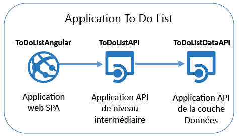

Voici une capture d’écran du composant frontal SPA.

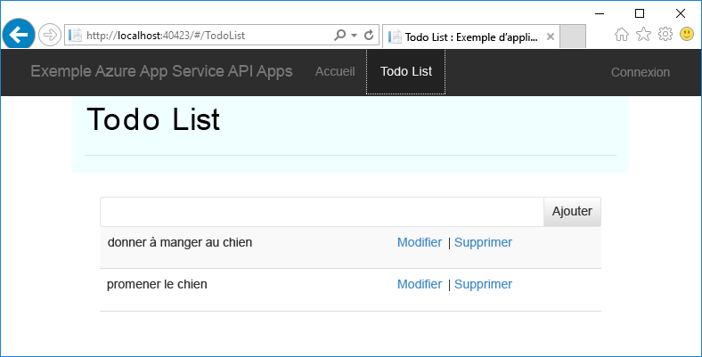

À la fin de ce didacticiel, vous obtiendrez deux API web capables de fonctionner dans les applications API App Service. Lorsque vous aurez terminé le didacticiel suivant, l’application s’exécutera entièrement dans le cloud, avec votre application SPA intégrée dans une application web App Service. Les autres didacticiels vous permettront d’ajouter des composants d’authentification et d’autorisation.

## Ce que vous allez apprendre

Ce didacticiel vous apprendra à effectuer les opérations suivantes :

* Utiliser des applications API et des applications web dans Azure App Service à l’aide des outils intégrés à Visual Studio 2015
* Automatiser la découverte d’API en utilisant le package Swashbuckle NuGet pour générer de manière dynamique le fichier JSON de définition d’API Swagger
* Utiliser du code client généré automatiquement pour consommer une application API à partir d’un client .NET
* Utiliser le portail Azure pour configurer le point de terminaison pour les métadonnées d’application API

## Composants requis

[AZURE.INCLUDE [configuration requise](../../includes/app-service-api-dotnet-get-started-prereqs.md)]

## Téléchargement de l'exemple d'application 

1. Téléchargez le référentiel [Azure-Samples/app-service-api-dotnet-to-do-list](https://github.com/Azure-Samples/app-service-api-dotnet-todo-list).

	Vous pouvez cliquer sur le bouton **Télécharger le fichier .zip** ou cloner le référentiel sur votre ordinateur local.

2. Ouvrez la solution ToDoList dans Visual Studio 2015 ou 2013.

	La solution Visual Studio est un exemple d’application qui fonctionne avec des éléments de tâche simples comprenant une description et un propriétaire. La solution inclut trois projets :

	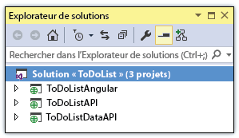

	* **ToDoListAngular** (composant frontal) : application monopage AngularJS qui appelle la couche intermédiaire. 

	* **ToDoListAPI** (couche intermédiaire) : projet API web ASP.NET qui appelle la couche Données pour effectuer des opérations CRUD sur les éléments de tâche.

	* **ToDoListAPI** (couche Données) : un projet API web ASP.NET qui exécute les opérations CRUD sur les éléments de tâche.

	L’architecture à trois niveaux est typique dans de nombreuses applications, mais elle n’est pas adaptée à tous les scénarios. Ici, elle est principalement utilisée pour illustrer les fonctionnalités d’API Apps et le code dans chaque niveau est simplifié dans ce but. Contrairement à une application réelle, la couche intermédiaire n’a aucune logique métier significative. Et la couche Données utilise la mémoire du serveur plutôt qu’une base de données comme mécanisme de persistance, ce qui signifie que toutes les modifications sont perdues à chaque redémarrage de l’application.

2. Générez la solution pour restaurer les packages NuGet.

## Facultatif : exécuter l’application localement

Dans cette section, vous allez vérifier que vous pouvez exécuter le client localement et que vous pouvez appeler l’API pendant qu’elle s’exécute localement.

**Remarque :** ces instructions s’appliquent aux navigateurs Internet Explorer et Edge, car ils prennent en charge les appels JavaScript cross-origin depuis et vers les URL `http://localhost`. Si vous utilisez Chrome, démarrez le navigateur avec le commutateur `--disable-web-security`. Si vous utilisez Firefox, ignorez cette section.

1. Définissez les trois projets comme projets de démarrage, en commençant par ToDoListDataAPI, suivi de ToDoListAPI et de ToDoListAngular.

	a. Dans l’**Explorateur de solutions**, cliquez avec le bouton droit sur la solution, puis cliquez sur **Propriétés**.

	b. Sélectionnez **Plusieurs projets de démarrage**, puis placez les projets dans l’ordre correct.

	c. Définissez **Action** sur **Démarrer** pour chaque projet.

2. Appuyez sur F5 ou cliquez sur **Déboguer > Démarrer le débogage** pour démarrer les projets en mode débogage.

	Trois fenêtres du navigateur s’ouvrent. Deux fenêtres du navigateur affichent les pages d’erreur HTTP 403 (exploration des répertoires non autorisée), ce qui est normal pour les projets d’API web. La troisième fenêtre du navigateur affiche l’interface utilisateur de l’application AngularJS.

	Dans certains navigateurs, des boîtes de dialogue s’affichent pour indiquer que le projet est configuré pour utiliser SSL. Si vous voulez

3. Dans la fenêtre qui affiche l’interface utilisateur AngularJS, cliquez sur l’onglet **Liste des tâches**.

	L’interface utilisateur affiche par défaut deux éléments d’action.

	

4. Ajoutez, modifiez et supprimez des éléments d’action pour voir comment fonctionne l’application.

	Toutes les modifications que vous apportez sont stockées en mémoire et sont perdues lors du redémarrage de l’application.

3. Fermez les fenêtres du navigateur et arrêtez le débogage de Visual Studio.

## Utiliser l’interface utilisateur et les métadonnées Swagger

La prise en charge des métadonnées d’API [Swagger](http://swagger.io/) 2.0 est intégrée aux applications API App Service. Chaque application API peut définir un point de terminaison d’URL qui renvoie à l’API des métadonnées au format JSON Swagger. Les métadonnées retournées à partir de ce point de terminaison peuvent être utilisées pour générer le code client.

Un projet d’API web ASP.NET peut générer dynamiquement des métadonnées Swagger à l’aide du package NuGet [Swashbuckle](https://www.nuget.org/packages/Swashbuckle). Le package NuGet Swashbuckle est déjà installé dans les projets ToDoListDataAPI et ToDoListAPI que vous avez téléchargés.

Dans cette section du didacticiel, nous allons examiner les métadonnées Swagger 2.0 générées, puis essayer une interface utilisateur test basée sur les métadonnées Swagger.

2. Définissez le projet ToDoListDataAPI (**et non** le projet ToDoListAPI) comme projet de démarrage. 
 
4. Appuyez sur F5 ou cliquez sur **Déboguer > Démarrer le débogage** pour exécuter le projet en mode débogage.

	Le navigateur s’ouvre et affiche la page d’erreur HTTP 403.

12. Dans la barre d’adresses de votre navigateur, ajoutez `swagger/docs/v1` à la fin de la ligne, puis appuyez sur Retour. (L’URL est `http://localhost:45914/swagger/docs/v1`.)

	Il s’agit de l’URL par défaut utilisée par Swashbuckle pour retourner les métadonnées JSON Swagger 2.0 pour l’API.

	Si vous utilisez Internet Explorer, le navigateur vous invite à télécharger un fichier *v1.json*.

	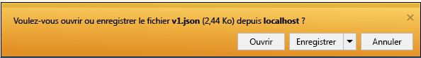

	Si vous utilisez Chrome, Firefox ou Edge, le navigateur affiche le fichier JSON dans la fenêtre du navigateur.

	

	L’exemple suivant montre la première section de métadonnées Swagger de l’API, avec la définition de la méthode Get. Ce sont ces métadonnées qui pilotent l’interface utilisateur Swagger que vous allez utiliser dans les étapes suivantes, et vous les utiliserez dans une section ultérieure de ce didacticiel pour générer automatiquement le code client.

		{
		  "swagger": "2.0",
		  "info": {
		    "version": "v1",
		    "title": "ToDoListDataAPI"
		  },
		  "host": "localhost:45914",
		  "schemes": [ "http" ],
		  "paths": {
		    "/api/ToDoList": {
		      "get": {
		        "tags": [ "ToDoList" ],
		        "operationId": "ToDoList_GetByOwner",
		        "consumes": [ ],
		        "produces": [ "application/json", "text/json", "application/xml", "text/xml" ],
		        "parameters": [
		          {
		            "name": "owner",
		            "in": "query",
		            "required": true,
		            "type": "string"
		          }
		        ],
		        "responses": {
		          "200": {
		            "description": "OK",
		            "schema": {
		              "type": "array",
		              "items": { "$ref": "#/definitions/ToDoItem" }
		            }
		          }
		        },
		        "deprecated": false
		      },

1. Fermez le navigateur et arrêtez le débogage de Visual Studio.

3. Dans le projet ToDoListDataAPI, dans l’**Explorateur de solutions**, ouvrez le fichier *App\_Start\\SwaggerConfig.cs*, puis faites défiler la page jusqu’au code suivant et supprimez les marques de commentaire.

		/*
		    })
		.EnableSwaggerUi(c =>
		    {
		*/

	Le fichier *SwaggerConfig.cs* est créé quand vous installez le package Swashbuckle dans un projet. Ce fichier permet de configurer Swashbuckle de différentes manières.

	Le code dont vous avez supprimé les marques de commentaire active l’interface utilisateur Swagger que vous utiliserez lors des étapes suivantes. Lorsque vous créez un projet d’API Web à l’aide du modèle de projet Application API, ce code est commenté par défaut par mesure de sécurité.

5. Réexécutez le projet.

3. Dans la barre d’adresses de votre navigateur, ajoutez `swagger` à la fin de la ligne, puis appuyez sur Retour. (L’URL est `http://localhost:45914/swagger`.)

4. Quand l’interface utilisateur Swagger apparaît, cliquez sur **ToDoList** pour voir les méthodes disponibles.

	

5. Cliquez sur le premier bouton **Obtenir** de la liste.

6. Entrez un astérisque comme valeur du paramètre `owner`, puis cliquez sur **Essayer**.

	Lorsque vous ajouterez l’authentification dans les autres didacticiels, la couche intermédiaire fournira l’ID d’utilisateur à la couche de données. Pour l’instant, toutes les tâches ont un astérisque comme ID de leur propriétaire tandis que l’application s’exécute sans que l’authentification ne soit activée.

	

	L’interface utilisateur de Swagger appelle la méthode Get de TodoList et affiche le code de réponse et les résultats JSON.

	

6. Cliquez sur **Post**, puis cochez la case sous **Model Schema**.

	Quand vous cliquez sur le schéma de modèle, la zone de texte est préremplie automatiquement. Vous pouvez y spécifier la valeur du paramètre de la méthode Post. (Si cela ne fonctionne pas dans Internet Explorer, utilisez un autre navigateur ou entrez la valeur du paramètre manuellement à l’étape suivante.)

	

7. Modifiez le fichier JSON dans la zone d’entrée de paramètre `todo` pour obtenir un résultat similaire à l’exemple suivant, ou insérez votre propre texte descriptif :

		{
		  "ID": 2,
		  "Description": "buy the dog a toy",
		  "Owner": "*"
		}

10. Cliquez sur **Try it out**.

	L’API ToDoList retourne un code de réponse HTTP 204 indiquant que le processus a réussi.

11. Cliquez sur le premier bouton **Obtenir**, puis, dans cette section de la page, cliquez sur le bouton **Faire un essai**.

	La réponse de la méthode Get inclut désormais le nouvel élément de tâche.

12. Facultatif : essayez également les méthodes Put, Delete et Get by ID.

14. Fermez le navigateur et arrêtez le débogage de Visual Studio.

Swashbuckle fonctionne avec n’importe quel projet d’API Web ASP.NET. Si vous souhaitez ajouter la génération de métadonnées Swagger à un projet existant, il suffit d’installer le package Swashbuckle.

**Remarque :** les métadonnées Swagger incluent un ID unique pour chaque opération d’API. Par défaut, Swashbuckle peut générer des ID d’opération Swagger en double pour vos méthodes de contrôleur d’API web. Cela se produit si les méthodes HTTP du contrôleur sont surchargées, par exemple `Get()` et `Get(id)`. Pour plus d’informations sur la gestion des surcharges, consultez [Personnaliser les définitions d’API générées par Swashbuckle](app-service-api-dotnet-swashbuckle-customize.md). Si vous créez un projet d’API web dans Visual Studio en utilisant le modèle d’application API Azure, le code qui génère les ID d’opération uniques est automatiquement ajouté au fichier *SwaggerConfig.cs*.

## Créer une application API dans Azure et y déployer le projet ToDoListAPI

Dans cette section, vous allez utiliser les outils Azure intégrés à l’Assistant **Publier le site web** de Visual Studio pour créer une application API dans Azure. Ensuite, vous déploierez le projet ToDoListDataAPI vers la nouvelle application API et vous appellerez l’API en réexécutant l’interface utilisateur Swagger, cette fois-ci pendant son exécution dans le cloud.

1. Dans l’**Explorateur de solutions**, cliquez avec le bouton droit sur le projet ToDoListDataAPI, puis cliquez sur **Publier**.

	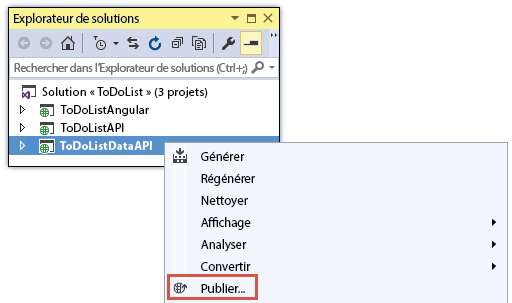

3.  À l’étape **Profil** de l’Assistant **Publier le site web**, cliquez sur **Microsoft Azure App Service**.

	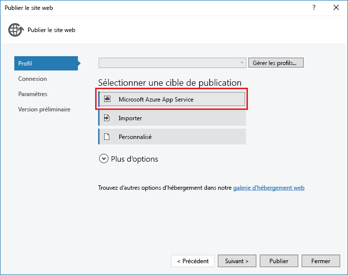

4. Connectez-vous à votre compte Azure si ce n’est déjà fait, ou actualisez vos informations d’identification si elles ont expiré.

4. Dans la boîte de dialogue App Service, choisissez l’**Abonnement** Azure que vous souhaitez utiliser, puis cliquez sur **Nouveau**.

	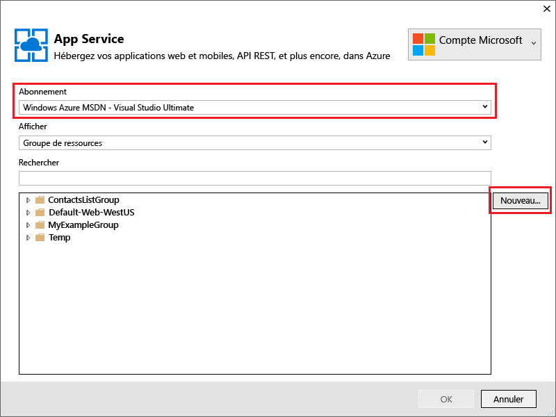

	L’onglet **Hébergement** de la boîte de dialogue **Créer App Service** s’affiche.

	Étant donné que vous déployez un projet d’API web dans lequel Swashbuckle est installé, Visual Studio part du principe que vous souhaitez créer une application API. Cela est indiqué par le titre **Nom de l’application API** et par le fait que la liste déroulante **Modifier le type** est définie sur **Application API**.

	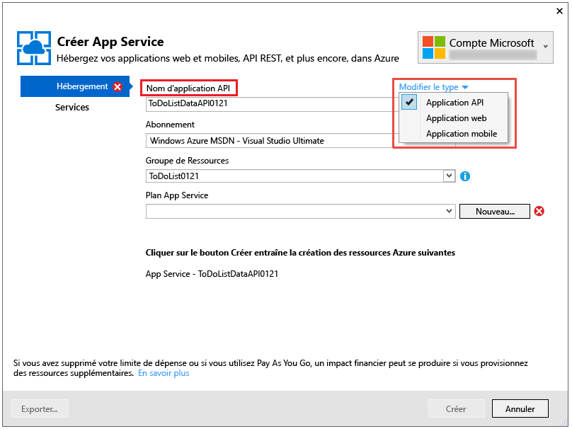

	Le type d’application ne détermine pas les fonctionnalités qui seront disponibles dans la nouvelle application API, web ou mobile. Toutes les fonctionnalités d’application API présentées dans ces didacticiels sont disponibles pour les trois types d’application. La seule différence réside dans l’icône et dans le texte affichés par le portail Azure pour identifier le type d’application et dans l’ordre dans lequel les fonctionnalités sont répertoriées sur certaines pages du portail. Vous verrez le portail Azure plus loin dans le didacticiel. Il s’agit d’une interface web permettant de gérer les ressources Azure.

	Le SPA frontal s’exécute dans une application web pour ces didacticiels et chaque API web frontale s’exécute dans une application API. Le fonctionnement serait identique si les trois types d’application étaient des applications web ou des applications API. En outre, une seule application API ou application web peut héberger simultanément le SPA frontal et l’application intermédiaire.

4. Entrez un **Nom d’application API** unique dans le domaine *azurewebsites.net*. Par exemple, ajoutez un nombre à ToDoListDataAPI pour le rendre unique.

	Visual Studio propose un nom unique en ajoutant une chaîne date-heure au nom du projet. Vous pouvez accepter ce nom si vous le souhaitez.

	Si vous entrez un nom qu’une autre personne a déjà utilisé, un point d’exclamation rouge s’affiche à droite au lieu d’une coche verte, et vous devez entrer un autre nom.

	Azure utilise ce nom comme préfixe de l’URL de votre application. L’URL complète se compose de ce nom, suivi de *. azurewebsites.net*. Par exemple, si le nom est `ToDoListDataAPI`, l’URL est `todolistdataapi.azurewebsites.net`.

6. Dans la liste déroulante **Groupe de ressources**, cliquez sur **Nouveau**, puis entrez « ToDoListGroup » ou un autre nom si vous préférez.

	Un groupe de ressources est une collection de ressources Azure telles que des applications API, des bases de données, des machines virtuelles, etc. Pour ce didacticiel, il est préférable de créer un groupe de ressources, car cela facilite la suppression en une étape de toutes les ressources Azure que vous créez pour le didacticiel.

	Cette zone vous permet de sélectionner un [groupe de ressources](../azure-portal/resource-group-portal.md) existant ou d’en créer un en tapant un nom différent des groupes de ressources existants de votre abonnement.

4. Cliquez sur le bouton **Nouveau** situé en regard de la liste déroulante **Plan App Service**.

	La capture d’écran montre des exemples de valeur pour **Nom de l’application API**, **Abonnement** et **Groupe de ressources** ; vos valeurs seront différentes.

	

	Au cours des étapes suivantes, vous allez créer un plan de service d’application pour le nouveau groupe de ressources. Un plan de service d’application spécifie les ressources de calcul sur lesquelles votre application API s’exécute. Par exemple, si vous choisissez le niveau Gratuit, votre application API s’exécute sur des machines virtuelles partagées, tandis que pour certains niveaux payants, elle s’exécute sur des machines virtuelles dédiées. Pour plus d’informations sur les plans App Service, consultez [Présentation des plans App Service](../app-service/azure-web-sites-web-hosting-plans-in-depth-overview.md).

5. Dans la boîte de dialogue **Configurer le plan de service d’application**, entrez « ToDoListPlan » ou un autre nom si vous préférez.

5. Dans la liste déroulante **Emplacement**, sélectionnez le lieu le plus proche de vous.

	Ce paramètre indique le centre de données Azure dans lequel votre application sera exécutée. Pour les besoins de ce didacticiel, vous pouvez sélectionner n’importe quelle région : la différence ne sera pas sensible. Toutefois, pour une application de production, votre serveur doit être le plus proche possible des clients qui y accèdent, afin de minimiser la [latence](http://www.bing.com/search?q=web%20latency%20introduction&qs=n&form=QBRE&pq=web%20latency%20introduction&sc=1-24&sp=-1&sk=&cvid=eefff99dfc864d25a75a83740f1e0090).

5. Dans la liste déroulante **Taille**, cliquez sur **Gratuit**.

	Pour ce didacticiel, le niveau tarifaire Gratuit fournit des performances suffisantes.

6. Dans la boîte de dialogue **Configurer le plan App Service**, cliquez sur **OK**.

	

7. Dans la boîte de dialogue **Créer App Service**, cliquez sur **Créer**.

	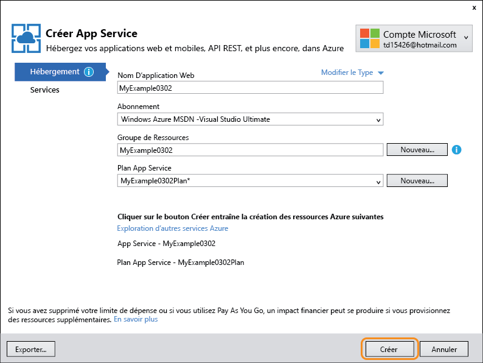

	Visual Studio crée l’application API et un profil de publication qui comporte tous les paramètres nécessaires pour l’application API. Puis il ouvre l’Assistant **Publier le site web** que vous utiliserez pour déployer le projet.

	**Remarque :** Il existe d’autres façons de créer des applications API dans Azure App Service. Par exemple, dans Visual Studio, lorsque vous créez un projet, vous pouvez lui créer des ressources Azure de la même façon que ce que vous avez vu pour un projet existant. Vous pouvez aussi créer des applications API en utilisant le [portail Azure](https://portal.azure.com/), des [applets de commande Azure pour Windows PowerShell](../powershell-install-configure.md) ou l’[interface de ligne de commande multiplateforme](../xplat-cli.md).

	L’Assistant **Publier le site web** s’ouvre dans l’onglet **Connexion** (illustré ci-dessous).

	Dans l’onglet **Connexion**, les paramètres **Serveur** et **Nom du site** pointent vers votre application API. Le **nom d’utilisateur** et le **mot de passe** sont les informations d’identification de déploiement créées pour vous par Azure. Après le déploiement, Visual Studio ouvre un navigateur sur l’**URL de destination** (c’est le seul objectif de l’**URL de destination**).

8. Cliquez sur **Next**.

	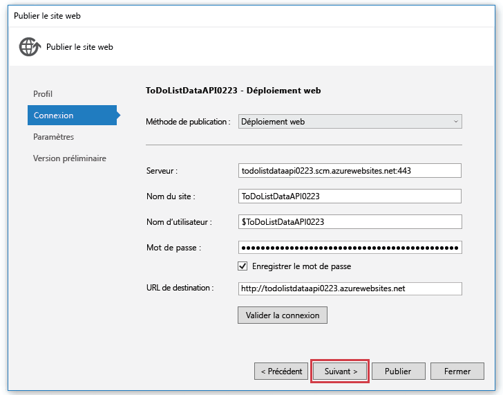

	L’onglet suivant est l’onglet **Paramètres** (illustré ci-dessous). Vous pouvez y modifier l’onglet Configuration de build pour déployer un build de débogage pour le [débogage à distance](../app-service-web/web-sites-dotnet-troubleshoot-visual-studio.md#remotedebug). L’onglet offre également plusieurs **Options de publication des fichiers** :

	* Supprimer les fichiers supplémentaires de la destination
	* Précompiler durant la publication
	* Exclure les fichiers du dossier App\_Data

	Pour ce didacticiel, vous n’avez besoin d’aucune de ces options. Pour obtenir des explications détaillées sur leur action, consultez la rubrique [Déploiement d’un projet web à l’aide de la publication en un clic dans Visual Studio](https://msdn.microsoft.com/library/dd465337.aspx).

14. Cliquez sur **Next**.

	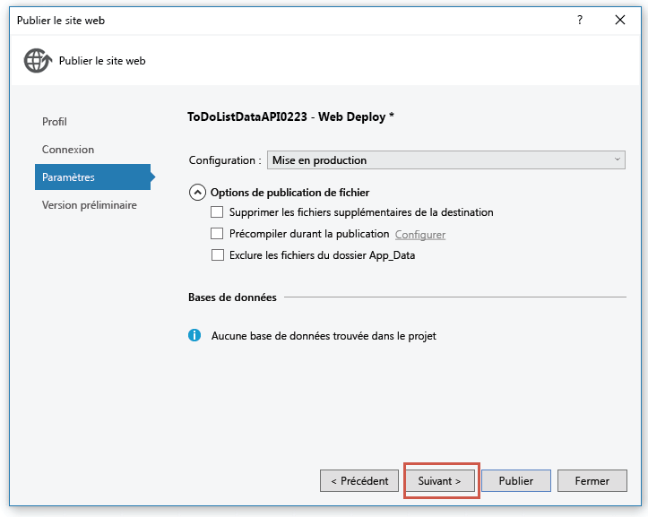

	Vient ensuite l’onglet **Aperçu** (illustré ci-dessous), qui vous permet de voir les fichiers qui vont être copiés de votre projet vers l’application API. Lorsque vous déployez un projet vers une application API vers laquelle vous avez déjà déployé auparavant le projet, seuls les fichiers modifiés sont copiés. Si vous souhaitez afficher la liste de ce qui sera copié, vous pouvez cliquer sur le bouton **Démarrer l’aperçu**.

15. Cliquez sur **Publier**.

	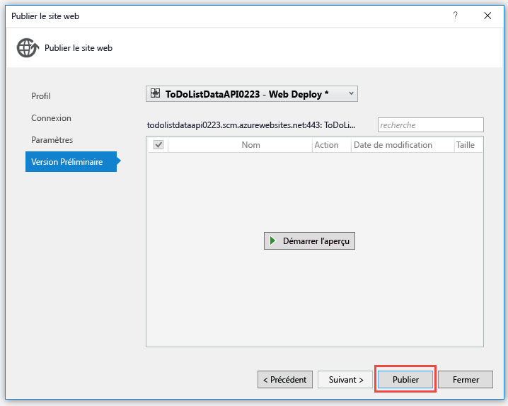

	Visual Studio déploie le projet ToDoListDataAPI vers la nouvelle application API. La fenêtre **Sortie** consigne le déploiement réussi, et la page « Créé avec succès » s’affiche dans une fenêtre du navigateur ouverte sur l’URL de l’application API.

	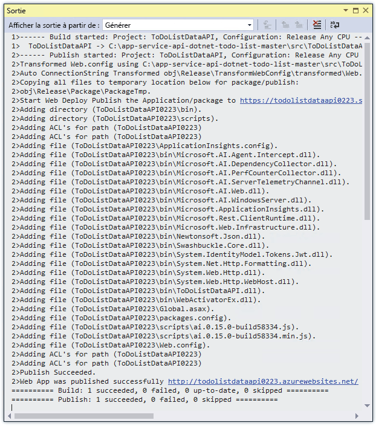

	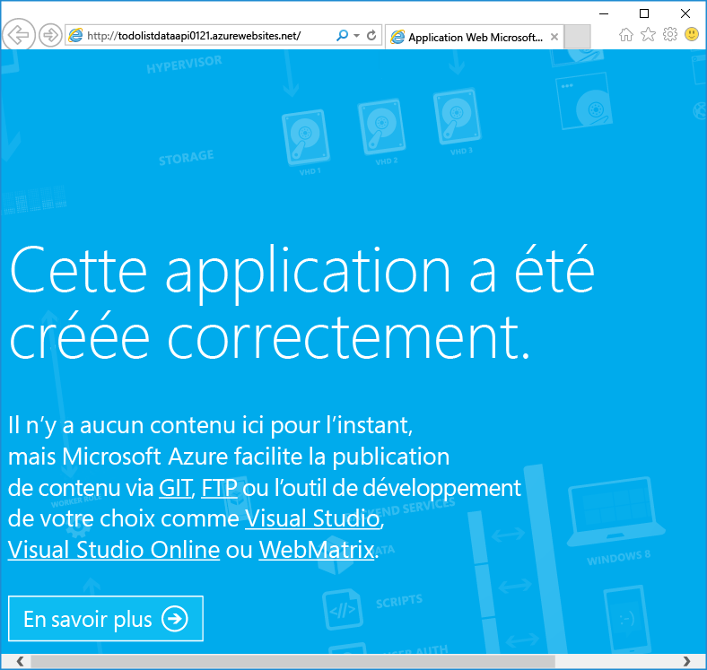

11. Ajoutez « swagger » à l’URL dans la barre d’adresses du navigateur, puis appuyez sur Entrée. (L’URL est `http://{apiappname}.azurewebsites.net/swagger`.)

	Le navigateur affiche la même interface utilisateur de Swagger que précédemment, mais elle s’exécute désormais dans le cloud. La méthode Get vous ramène aux 2 éléments d’action par défaut. Les modifications apportées précédemment ont été enregistrées dans la mémoire de l’ordinateur local.

12. Ouvrez le [portail Azure](https://portal.azure.com/).

	Le portail Azure est une interface web permettant de gérer les ressources Azure telles que les applications API.
 
14. Cliquez sur **Parcourir > App Services**.

	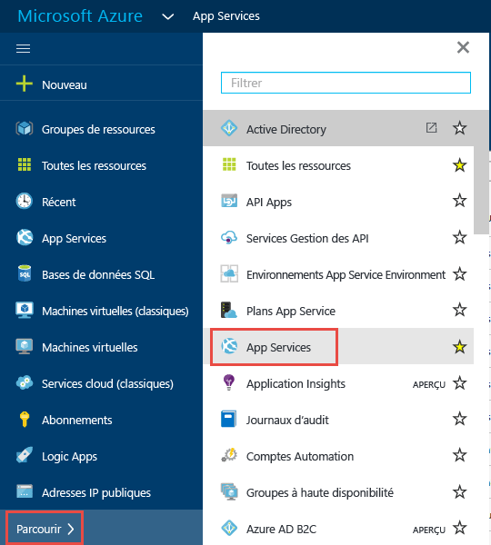

15. Dans le panneau **App Services**, recherchez votre nouvelle application API et cliquez dessus. (Dans le portail Azure, les fenêtres qui s’ouvrent sur la droite sont appelées des *panneaux*.)

	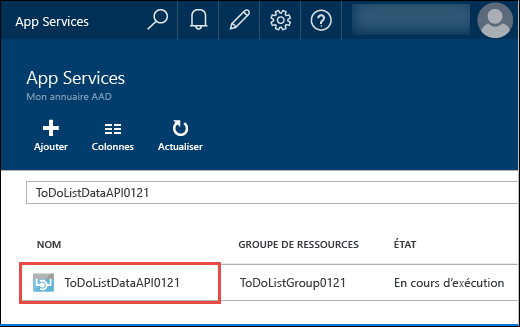

	Deux panneaux s’ouvrent. L’un présentant une vue d’ensemble de l’application API et l’autre contenant une longue liste des paramètres que vous pouvez afficher et modifier.

16. Dans le panneau **Paramètres**, recherchez la section **API**, puis cliquez sur **Définition de l’API**.

	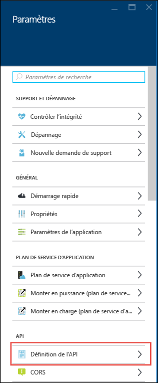

	Le panneau **Définition de l’API** vous permet de spécifier l’URL qui retourne les métadonnées Swagger 2.0 au format JSON. Quand Visual Studio crée l’application API, il définit l’URL de définition de l’API, à savoir l’URL de base de l’application API plus `/swagger/docs/v1` sur la valeur par défaut des métadonnées générées par Swashbuckle que vous avez vues précédemment.

	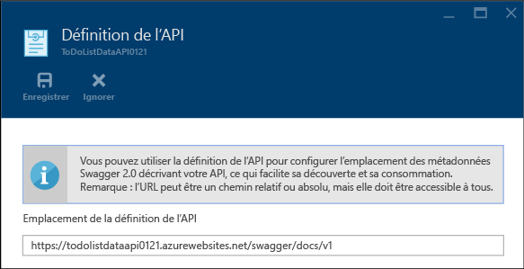

	Quand vous sélectionnez une application API pour laquelle générer le code client, Visual Studio extrait les métadonnées à partir de cette URL.

##  Consommer l’application API à l’aide du code client généré

L’un des avantages de l’intégration de Swagger dans les applications API Azure est la génération de code automatique. Les classes de client générées facilitent l’écriture du code qui appelle une application API.

Dans cette section, vous allez découvrir comment consommer une application API à partir d’un code d’API web ASP.NET.

### Générer du code client

Vous pouvez générer du code client pour une application API à l’aide de Visual Studio ou à partir de la ligne de commande. Dans ce didacticiel, vous allez utiliser Visual Studio. Pour plus d’informations sur la façon de procéder à partir de la ligne de commande, consultez le fichier Lisez-moi du référentiel [Azure/autorest](https://github.com/azure/autorest) sur GitHub.com.

Le projet ToDoListAPI comporte déjà le code client généré, mais vous allez le supprimer et le régénérer pour voir le processus.

1. Dans l’**Explorateur de solutions** de Visual Studio, dans le projet ToDoListAPI, supprimez le dossier *ToDoListDataAPI*.

	Ce dossier a été créé à l’aide du processus de génération de code que vous allez aborder.

	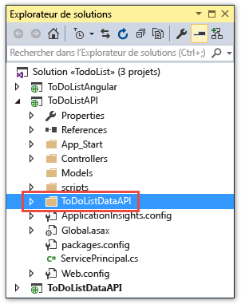

2. Cliquez avec le bouton droit sur le projet ToDoListAPI, puis cliquez sur **Ajouter > Client d’API REST**.

	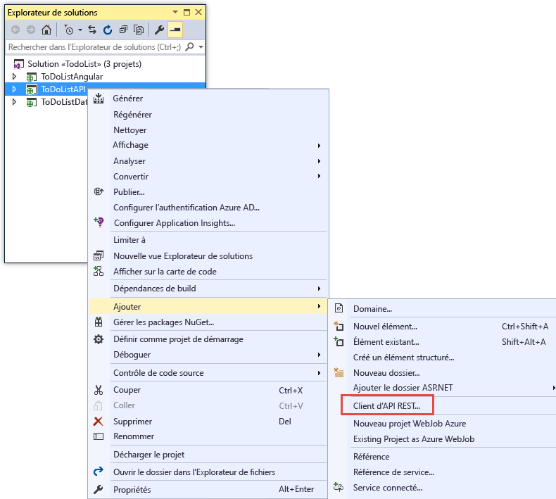

3. Dans la boîte de dialogue **Ajouter un client d’API REST**, cliquez sur **URL Swagger**, puis sur **Sélectionner une ressource Azure**.

	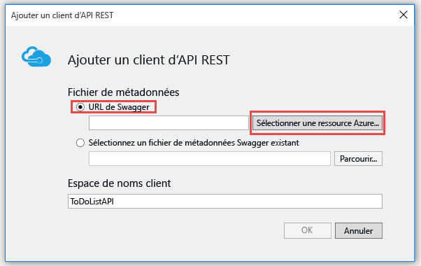

8. Dans la boîte de dialogue **App Service**, développez le groupe de ressources que vous utilisez pour ce didacticiel, sélectionnez votre application API, puis cliquez sur **OK**.

	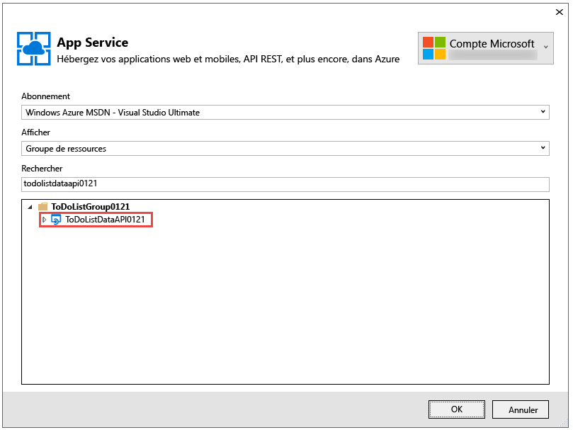

	Cette boîte de dialogue offre plusieurs manières d’organiser les applications API dans la liste, au cas où il y en aurait trop à faire défiler. Elle vous permet également d’entrer une chaîne de recherche pour filtrer les applications API par nom.

	Notez que lorsque vous revenez à la boîte de dialogue **Client API REST**, la zone de texte a été remplie avec la valeur de l’URL de définition d’API que vous avez vue précédemment dans le portail.

	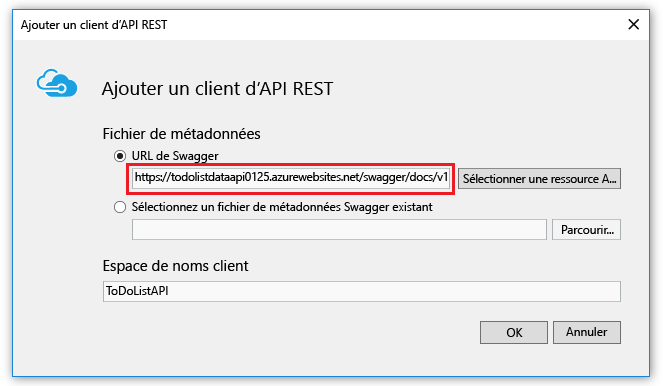

	Pour obtenir les métadonnées nécessaires à la génération du code, vous pouvez également saisir l’URL directement au lieu de passer par la boîte de dialogue. Une autre solution consiste à utiliser l’option **Sélectionner un fichier de métadonnées Swagger existant**. Par exemple, si vous souhaitez générer le code client avant le déploiement vers Azure, vous pouvez exécuter localement le projet d’API web, accéder à l’URL qui fournit le fichier JSON Swagger, enregistrer le fichier et le sélectionner ici.

9. Dans la boîte de dialogue **Ajouter un client API REST**, cliquez sur **OK**.

	Visual Studio crée un dossier nommé d’après l’application API et il génère des classes de client.

	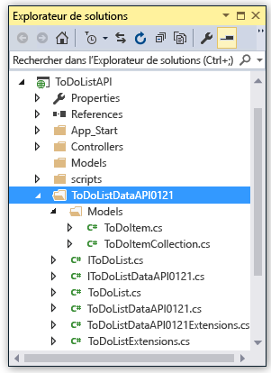

5. Dans le projet ToDoListAPI, ouvrez *Controllers\\ToDoListController.cs* pour afficher le code qui appelle l’API à l’aide du client généré.

	L’extrait de code suivant montre comment instancier l’objet client et appeler la méthode Get.

		private static ToDoListDataAPI NewDataAPIClient()
		{
		    var client = new ToDoListDataAPI(new Uri(ConfigurationManager.AppSettings["toDoListDataAPIURL"]));
		    return client;
		}
		
		public async Task<IEnumerable<ToDoItem>> Get()
		{
		    using (var client = NewDataAPIClient())
		    {
		        var results = await client.ToDoList.GetByOwnerAsync(owner);
		        return results.Select(m => new ToDoItem
		        {
		            Description = m.Description,
		            ID = (int)m.ID,
		            Owner = m.Owner
		        });
		    }
		}

	Le paramètre de constructeur obtient l’URL de point de terminaison à partir du paramètre d’application `toDoListDataAPIURL`. Dans le fichier Web.config, cette valeur est définie sur l’URL IIS Express locale du projet d’API pour vous permettre d’exécuter l’application localement. Si vous omettez le paramètre de constructeur, le point de terminaison par défaut est l’URL à partir de laquelle vous avez généré le code.

6. Votre classe client est générée avec un nom différent selon le nom de votre application API. Modifiez ce code dans *Controllers\\ToDoListController.cs* pour que le nom de type corresponde à ce qui a été généré dans votre projet. Par exemple, si vous avez nommé votre application API ToDoListDataAPI0121, le code se présente comme suit :

		private static ToDoListDataAPI0121 NewDataAPIClient()
		{
		    var client = new ToDoListDataAPI0121(new Uri(ConfigurationManager.AppSettings["toDoListDataAPIURL"]));

### Créer une application API pour héberger la couche intermédiaire

1. Dans l’**Explorateur de solutions**, cliquez avec le bouton droit sur le projet ToDoListAPI (et non sur le projet ToDoListDataAPI), puis cliquez sur **Publier**.

3.  Sous l’onglet **Profil** de l’Assistant **Publier le site web**, cliquez sur **Microsoft Azure App Service**.

5. Dans la boîte de dialogue **App Service**, cliquez sur **Nouveau**.

3. Dans l’onglet **Hébergement** de la boîte de dialogue **Créer App Service**, entrez un **Nom de l’application API** unique dans le domaine *azurewebsites.net*.

5. Choisissez l’**Abonnement** Azure souhaité.

6. Dans la liste déroulante **Groupe de ressources**, choisissez le groupe de ressources créé précédemment.

4. Dans la liste déroulante **Plan App Service**, choisissez le plan créé précédemment. Il est défini par défaut sur cette valeur.

7. Cliquez sur **Create**.

	Visual Studio crée l’application API et un profil de publication pour celle-ci, puis affiche l’étape **Connexion** de l’Assistant **Publier le site web**.

3.  À l’étape **Connexion** de l’Assistant **Publier le site web**, cliquez sur **Publier**.

	Visual Studio déploie le projet ToDoListAPI vers la nouvelle application API et ouvre un navigateur à l’URL de l’application API. Une page s’affiche pour confirmer la création.

### Définir l’URL de l’application API de la couche Données dans l’application API de la couche intermédiaire

Si vous appelez maintenant l’application API de la couche intermédiaire, elle essaie d’appeler la couche Données à l’aide de l’URL d’hôte local qui figure toujours dans le fichier Web.config. Dans cette section, vous entrez l’URL de l’application API de la couche Données dans un paramètre d’environnement de l’application API de la couche intermédiaire. Lorsque le code de l’application API de la couche intermédiaire récupère le paramètre d’URL de la couche Données, le paramètre d’environnement remplace ce qui figure dans le fichier Web.config.
 
1. Dans le [portail Azure](https://portal.azure.com/), accédez au panneau **Application API** de l’application API que vous avez créée pour héberger le projet TodoListAPI (de la couche intermédiaire).

2. Dans le panneau **Paramètres** de l’application API, cliquez sur **Paramètres de l’application**.
 
4. Dans le panneau **Paramètres de l’application** de l’application API, faites défiler l’écran jusqu’à la section **Paramètres de l’application** et ajoutez la clé et la valeur suivantes :

	| **Clé** | toDoListDataAPIURL |
	|---|---|
	| **Valeur** | https://{your nom de votre application API de la couche Données}.azurewebsites.net |
	| **Exemple** | https://todolistdataapi0121.azurewebsites.net |

4. Cliquez sur **Enregistrer**.

	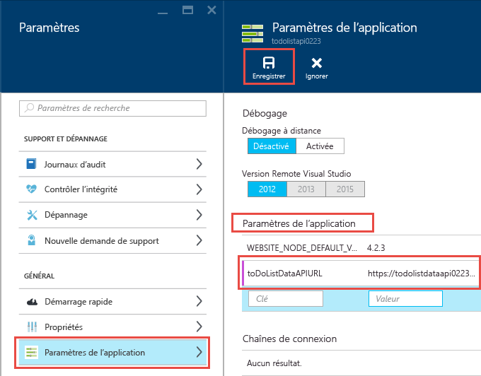

	Lorsque le code sera exécuté dans Azure, cette valeur remplacera dès lors l’URL de l’hôte local qui se trouve dans le fichier Web.config.

### Test permettant de vérifier que ToDoListAPI appelle ToDoListDataAPI

11. Dans une fenêtre du navigateur, accédez à l’URL de la nouvelle application API de la couche intermédiaire que vous venez de créer (vous pouvez y accéder en cliquant sur l’URL dans le panneau principal de l’application API dans le portail).

13. Ajoutez « swagger » à l’URL dans la barre d’adresses du navigateur, puis appuyez sur Entrée. (L’URL est `http://{apiappname}.azurewebsites.net/swagger`.)

	Le navigateur affiche la même interface utilisateur de Swagger que vous avez vue précédemment pour ToDoListDataAPI, mais `owner` n’est pas un champ obligatoire pour l’opération Get, car l’application API de la couche intermédiaire envoie automatiquement cette valeur à l’application API de la couche Données. (Lorsque vous effectuez les didacticiels d’authentification, la couche intermédiaire envoie les ID utilisateur réels pour le paramètre `owner`. Pour le moment, elle code un astérisque de manière irréversible.)

12. Essayez la méthode Get ainsi que d’autres méthodes pour confirmer que l’application API de couche intermédiaire appelle correctement l’application API de la couche de données.

	

Pour plus d’informations sur le client généré, consultez le [référentiel AutoRest sur GitHub](https://github.com/azure/autorest). Pour obtenir de l’aide à la résolution de problèmes en utilisant le client généré, signalez le [problème dans le référentiel AutoRest](https://github.com/azure/autorest/issues).

##  Facultatif : création d’un projet d’application API depuis le début

Dans ce didacticiel, vous téléchargez des projets d’API web ASP.NET à déployer vers App Service au lieu de créer des projets depuis le début. Pour créer un projet que vous envisagez de déployer vers une application API, vous pouvez créer un projet d’API web standard et installer le package Swashbuckle. Vous pouvez également utiliser le modèle de nouveau projet d’**Application API Azure**. Pour utiliser ce modèle, cliquez sur **Fichier > Nouveau > Projet > Application web ASP.NET > Application API Azure**.

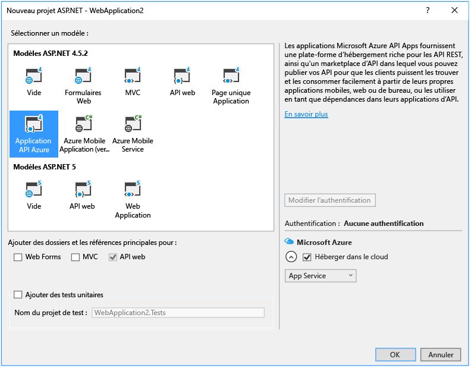

Choisir le modèle de projet d’**Application API Azure** revient à sélectionner le modèle ASP.NET 4.5.2 **Vide**, à cocher la case pour ajouter la prise en charge d’API web et à installer le package Swashbuckle. En outre, le modèle ajoute du code de configuration Swashbuckle conçu pour empêcher la création d’ID d’opération Swagger en double.

## Facultatif : URL de définition d’API dans les modèles Azure Resource Manager

Dans ce didacticiel, vous avez vu l’URL de définition d’API dans Visual Studio et dans le portail Azure. Vous pouvez également configurer l’URL de définition d’API pour une application API à l’aide des [modèles Azure Resource Manager](../resource-group-authoring-templates.md) dans les outils en ligne de commande, par exemple [Azure PowerShell](../powershell-install-configure.md) et l’[interface de ligne de commande Azure](../xplat-cli-install.md).

Pour obtenir un exemple de modèle Azure Resource Manager qui définit la propriété de définition d’API, ouvrez le [fichier azuredeploy.json dans le référentiel correspondant à l’exemple d’application de ce didacticiel](https://github.com/azure-samples/app-service-api-dotnet-todo-list/blob/master/azuredeploy.json). Recherchez la section du modèle qui ressemble à l’exemple suivant :

		"apiDefinition": {
		  "url": "https://todolistdataapi.azurewebsites.net/swagger/docs/v1"
		}

## Résolution des problèmes

Si vous rencontrez un problème pendant que vous progressez dans ce didacticiel, assurez-vous que vous utilisez la dernière version du kit de développement logiciel Azure pour .NET. Le moyen le plus simple pour ce faire consiste à [télécharger le kit de développement logiciel (SDK) Azure pour Visual Studio 2015](http://go.microsoft.com/fwlink/?linkid=518003). Si la version actuelle est installée, le programme d’installation de la plateforme web vous informe qu’aucune installation n’est nécessaire.

Deux des noms de projet sont similaires (ToDoListAPI et ToDoListDataAPI). Si les éléments ne s’affichent pas comme décrit dans les instructions lorsque vous travaillez sur un projet, assurez-vous d’avoir ouvert le projet approprié.

Si vous vous trouvez sur un réseau d’entreprise et que vous essayez d’exécuter un déploiement au-delà d’un pare-feu dans Azure App Service, assurez-vous que les ports 443 et 8172 sont ouverts pour le déploiement Web. Si vous ne pouvez pas ouvrir ces ports, consultez la section Étapes suivantes pour connaître les autres options de déploiement.

Si vous déployez accidentellement le projet incorrect dans une application API, puis déployez ultérieurement le projet correct, des erreurs de type « Les noms d’itinéraires doivent être uniques » peuvent s’afficher. Pour corriger cette erreur, redéployez le projet dans l’application API, puis dans l’onglet **Paramètres** de l’Assistant **Publier le site web**, sélectionnez **Supprimer les fichiers supplémentaires à la destination**.

Une fois que vous aurez configuré votre application web ASP.NET dans Azure App Service, vous souhaiterez peut-être en savoir plus sur les fonctionnalités de Visual Studio qui simplifient la résolution des problèmes. Pour plus d’informations sur la journalisation, le débogage à distance, etc. consultez la section [Résolution des problèmes des applications web Azure dans Visual Studio](../app-service-web/web-sites-dotnet-troubleshoot-visual-studio.md).

## Étapes suivantes

Dans ce didacticiel, vous avez vu comment créer des applications API, y déployer du code, y générer du code client et les consommer à partir de clients .NET. Le didacticiel suivant montre comment [consommer des applications API à partir de clients JavaScript à l’aide de CORS](app-service-api-cors-consume-javascript.md). Les didacticiels ultérieurs montrent comment implémenter l’authentification et l’autorisation.

<!---HONumber=AcomDC_0518_2016-->