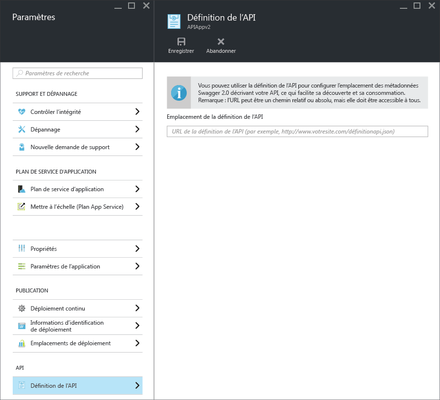

<properties
	pageTitle="Métadonnées d’App Service API Apps pour la détection d’API et la création de code | Microsoft Azure"
	description="Découvrez comment les applications API dans Azure App Service utilisent des métadonnées Swagger pour faciliter la détection d’API et la génération de code."
	services="app-service\api"
	documentationCenter=".net"
	authors="tdykstra"
	manager="wpickett"
	editor=""/>

<tags
	ms.service="app-service-api"
	ms.workload="na"
	ms.tgt_pltfrm="na"
	ms.devlang="na"
	ms.topic="get-started-article"
	ms.date="02/16/2016"
	ms.author="tdykstra"/>

# Les métadonnées d’App Service API Apps pour la détection d’API et la création de code 

La prise en charge des métadonnées d’API [Swagger 2.0](http://swagger.io/) est intégrée aux applications API App Service. Vous n’êtes pas obligé d’utiliser Swagger, mais si vous le faites, vous pouvez tirer parti des fonctionnalités d’applications API qui facilitent la détection et la consommation.

## Point de terminaison Swagger

Vous pouvez spécifier un point de terminaison qui fournit les métadonnées de JSON Swagger 2.0 pour une application API dans une propriété de l’application API. Le point de terminaison peut être associé à l’URL de base de l’application API ou une URL absolue. Les URL absolues peuvent pointer hors de l’application API.

Pour de nombreux clients en aval (par exemple, génération de code Visual Studio et flux d’ajout d’API de PowerApps), l’URL doit être accessible publiquement (c’est-à-dire non protégée par une authentification de l’utilisateur ou du service). Autrement dit, si vous utilisez l’authentification App Service et que vous souhaitez exposer la définition d’API depuis votre application, vous devez utiliser l’option d’authentification qui permet au trafic anonyme d’atteindre votre API. Pour plus d’informations, consultez la page [Authentification et autorisation pour les applications d’API dans Azure App Service](app-service-api-authentication.md).

### Panneau du portail

Dans le [portail Azure](https://portal.azure.com/), l’URL du point de terminaison peut être vue et modifiée sur le panneau **Définition d’API**.

### Propriété d’Azure Resource Manager

Vous pouvez également configurer l’URL de définition d’API pour une application API à l’aide d’outils tels qu’Azure PowerShell, l’interface de ligne de commande ou l’[Explorateur de ressources](https://resources.azure.com/).

Définissez la propriété `apiDefinition` du type de ressource Microsoft.Web/sites/config pour votre ressource <site name>/web. Par exemple, dans **Explorateur de ressources**, accédez à **abonnements > {votre abonnement} > resourceGroups > {votre groupe de ressources} > fournisseurs > Microsoft.Web > sites > {votre site} > config > web**, et vous verrez la propriété cors :

		"apiDefinition": {
		  "url": "https://contactslistapi.azurewebsites.net/swagger/docs/v1"
		}

### Valeur par défaut

Lorsque vous utilisez Visual Studio pour créer une application API, le point de terminaison de définition d’API est automatiquement défini sur l’URL de base de l’application API plus `/swagger/docs/v1`. Il s’agit de l’URL par défaut que le package [Swashbuckle](https://www.nuget.org/packages/Swashbuckle) NuGet utilise pour distribuer des métadonnées Swagger générées de façon dynamique pour un projet d’API Web ASP.NET.

## Génération de code

Un des avantages de l’intégration de Swagger dans Azure API apps est la génération de code automatique. Les classes de client générées facilitent l’écriture du code qui appelle une application API.

Vous pouvez générer du code client pour une application API en utilisant Visual Studio ou à partir de la ligne de commande. Pour plus d’informations sur la génération des classes client dans Visual Studio pour un projet d’API Web ASP.NET, consultez [Prise en main des applications API et d’ASP.NET](app-service-api-dotnet-get-started.md#codegen). Pour plus d’informations sur la façon de le faire à partir de la ligne de commande pour toutes les langues prises en charge, consultez le fichier Lisezmoi du référentiel [Azure/autorest](https://github.com/azure/autorest) dans GitHub.com.
 
## Étapes suivantes

Pour obtenir un didacticiel qui vous guide dans la création, le déploiement et l’utilisation d’une application API, consultez [Prise en main des applications API dans Azure App Service](app-service-api-dotnet-get-started.md).

<!---HONumber=AcomDC_0218_2016-->