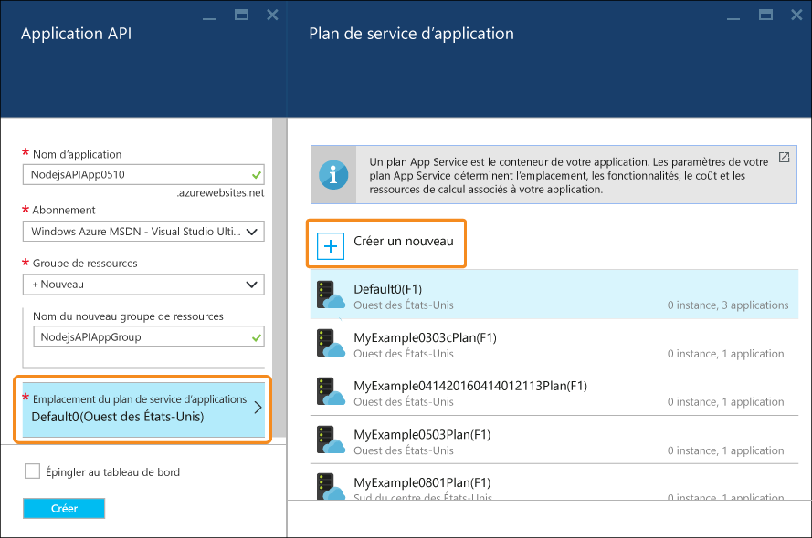
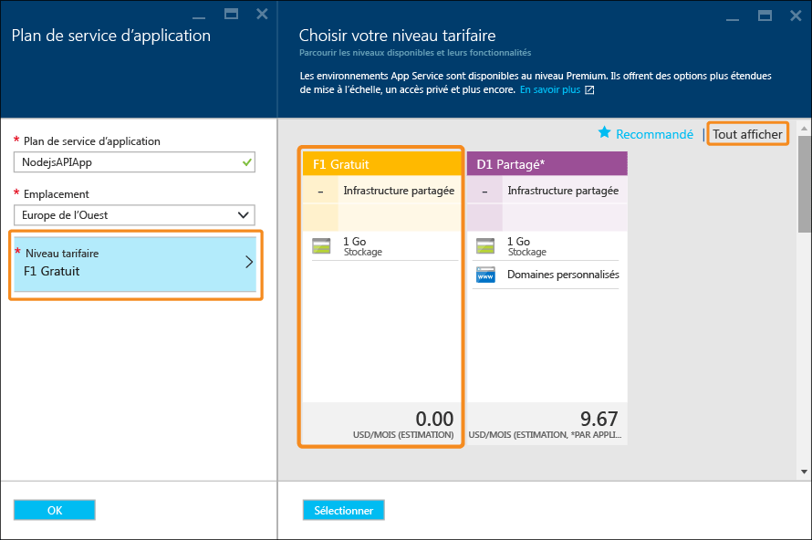

# Créer une API RESTful Node.js et la déployer vers une application API dans Azure
[!INCLUDE [app-service-api-get-started-selector](../../includes/app-service-api-get-started-selector.md)]

Ce didacticiel vous explique comment créer une API [Node.js](http://nodejs.org) simple et la déployer vers une [application API](app-service-api-apps-why-best-platform.md) dans [Azure App Service](../app-service/app-service-value-prop-what-is.md) à l’aide de [Git](http://git-scm.com). Vous pouvez utiliser n’importe quel système d’exploitation capable d’exécuter Node.js. Vous suivrez toutes les étapes en utilisant les outils de ligne de commande tels que cmd.exe ou bash.

## Composants requis
1. Compte Microsoft Azure ([ouvrir un compte gratuit ici](https://azure.microsoft.com/pricing/free-trial/))
2. [Node.js](http://nodejs.org) installé (cet exemple suppose que vous disposez de Node.js version 4.2.2)
3. [Git](https://git-scm.com/) installé
4. [GitHub](https://github.com/) 

Bien qu’App Service prenne en charge de nombreuses façons de déployer votre code vers une application API, ce didacticiel présente la méthode Git et suppose que vous avez une connaissance élémentaire du fonctionnement de Git. Pour en savoir plus sur les autres options de déploiement, voir [Déploiement de votre application dans Azure App Service](../app-service-web/web-sites-deploy.md).

## Obtention de l'exemple de code
1. Ouvrez une interface de ligne de commande pouvant exécuter des commandes Node.js et Git.
2. Accédez à un dossier que vous pouvez utiliser pour un référentiel Git et clonez le [référentiel GitHub contenant l’exemple de code](https://github.com/Azure-Samples/app-service-api-node-contact-list).
   
        git clone https://github.com/Azure-Samples/app-service-api-node-contact-list.git
   
    L’exemple d’API fournit deux points de terminaison : une requête Get vers `/contacts` renvoie une liste de noms et des adresses e-mail au format JSON, tandis que `/contacts/{id}` renvoie uniquement le contact sélectionné.

## Structurer (générer automatiquement) le code Node.js en fonction des métadonnées Swagger
[Swagger](http://swagger.io/) est un format de fichier JSON pour métadonnées qui décrit une API RESTful. Azure App Service [intègre la prise en charge des métadonnées Swagger](app-service-api-metadata.md). Cette section du didacticiel modélise un workflow de développement d’API dans lequel vous créez d’abord les métadonnées Swagger, puis les utilisez pour structurer (auto-générer) le code serveur pour l’API. 

> [!NOTE]
> Vous pouvez ignorer cette section si vous ne souhaitez pas savoir comment structurer le code Node.js à partir d’un fichier de métadonnées Swagger. Si vous souhaitez simplement déployer un exemple de code vers une nouvelle application API, passez directement à la section [Créer une application API dans Azure](#createapiapp) .
> 
> 

### Installer et exécuter Swaggerize
1. Exécutez les commandes suivantes pour installer les modules NPM **yo** et **generator-swaggerize** globalement.
   
        npm install -g yo
        npm install -g generator-swaggerize
   
    Swaggerize est un outil qui génère le code du serveur pour une API décrite par un fichier de métadonnées Swagger. Le fichier Swagger que vous allez utiliser est nommé *api.json* et se trouve dans le dossier *start* (démarrer) du référentiel que vous avez cloné.
2. Accédez au dossier *start* (démarrer), puis exécutez la commande `yo swaggerize`. Swaggerize posera une série de questions.  Pour **what to call this project** (comment appeler ce projet), entrez « contactlist », pour **path to swagger document** (chemin d’accès au document swagger), entrez « api.json », et pour **Express, Hapi, or Restify** (Express, Hapi ou Restify), entrez « express ».
   
        yo swaggerize
   
    
   
    **Remarque**: si vous rencontrez une erreur au cours de cette étape, l’étape suivante explique comment résoudre le problème.
   
    Swaggerize crée un dossier d’application, structure les gestionnaires et les fichiers de configuration, et génère un fichier **package.json** . Le moteur d’affichage express est utilisé pour générer la page d’aide de Swagger.  
3. Si la commande `swaggerize` échoue avec une erreur « jeton inattendu » ou « séquence d’échappement non valide », corrigez la cause de l’erreur en modifiant le fichier *package.json* . Dans la ligne `regenerate` sous `scripts`, changez la barre oblique inverse qui précède *api.json* en barre oblique, de manière à ce que la ligne ressemble à l’exemple suivant :
   
         "regenerate": "yo swaggerize --only=handlers,models,tests --framework express --apiPath config/api.json"
4. Accédez au dossier contenant le code structuré (ici, le sous-dossier */start/ContactList*).
5. Exécutez `npm install`.
   
        npm install
6. Installez le module NPM **jsonpath** . 
   
        npm install --save jsonpath
   
    
7. Installez le module NPM **swaggerize-ui** . 
   
        npm install --save swaggerize-ui
   
    

### Personnaliser le code structuré
1. Copiez le dossier **lib** du dossier **start** (démarrer) vers le dossier **ContactList** créé par la génération de modèles automatique. 
2. Remplacez le code dans le fichier **handlers/contacts.js** par le code suivant. 
   
    Ce code utilise les données JSON stockées dans le fichier **lib/contacts.json** fourni par **lib/contactRepository.js**. Le nouveau code contacts.js répondra aux requêtes HTTP pour obtenir tous les contacts et les renvoyer en tant que charge utile JSON. 
   
        'use strict';
   
        var repository = require('../lib/contactRepository');
   
        module.exports = {
            get: function contacts_get(req, res) {
                res.json(repository.all())
            }
        };
3. Remplacez le code dans le fichier **handlers/contacts/{id}.js** par le code suivant. 
   
        'use strict';
   
        var repository = require('../../lib/contactRepository');
   
        module.exports = {
            get: function contacts_get(req, res) {
                res.json(repository.get(req.params['id']));
            }    
        };
4. Remplacez le code dans le fichier **server.js** par le code suivant. 
   
    Les modifications apportées au fichier server.js sont indiquées à l’aide de commentaires pour que vous puissiez voir les modifications apportées. 
   
        'use strict';
   
        var port = process.env.PORT || 8000; // first change
   
        var http = require('http');
        var express = require('express');
        var bodyParser = require('body-parser');
        var swaggerize = require('swaggerize-express');
        var swaggerUi = require('swaggerize-ui'); // second change
        var path = require('path');
   
        var app = express();
   
        var server = http.createServer(app);
   
        app.use(bodyParser.json());
   
        app.use(swaggerize({
            api: path.resolve('./config/swagger.json'), // third change
            handlers: path.resolve('./handlers'),
            docspath: '/swagger' // fourth change
        }));
   
        // change four
        app.use('/docs', swaggerUi({
          docs: '/swagger'  
        }));
   
        server.listen(port, function () { // fifth and final change
        });

### Test avec l’API exécutée en local
1. Activez le serveur à l’aide de l’exécutable en ligne de commande Node.js. 
   
        node server.js
2. Quand vous accédez à **http://localhost:8000/contacts**, vous pouvez voir la sortie JSON de la liste de contacts (ou vous êtes invité à la télécharger, en fonction de votre navigateur). 
   
    
3. Quand vous accédez à **http://localhost:8000/contacts/2**, vous pouvez voir le contact représenté par cette valeur d’ID.
   
    
4. Les données JSON Swagger sont fournies par le biais du point de terminaison **/swagger** :
   
    
5. L’interface utilisateur Swagger est fournie par le biais du point de terminaison **/docs** . Dans l’interface utilisateur Swagger, vous pouvez utiliser les fonctionnalités de client HTML enrichies pour tester votre API.
   
    

##  Créer une nouvelle API App
Dans cette section, vous utilisez le portail Azure pour créer une application API dans Azure. Cette application API représente les ressources de calcul que fournit Azure pour exécuter votre code. Dans les sections suivantes, vous déploierez votre code vers la nouvelle application API.

1. Accédez au [Portail Azure](https://portal.azure.com/). 
2. Cliquez sur **Nouveau > Web + Mobile > Application API**. 
   
    
3. Entrez un **Nom d’application** unique dans le domaine *azurewebsites.net*. Par exemple, ajoutez un nombre à NodejsAPIApp pour le rendre unique. 
   
    Par exemple, si le nom du site est `NodejsAPIApp`, l’URL sera `nodejsapiapp.azurewebsites.net`.
   
    Si vous entrez un nom déjà utilisé par un autre utilisateur, un point d’exclamation rouge s’affiche à droite.
4. Dans la liste déroulante **Groupe de ressources**, cliquez sur **Nouveau**, puis dans **Nouveau nom du groupe de ressources** entrez « NodejsAPIAppGroup » ou un autre nom si vous préférez. 
   
    Un [groupe de ressources](../azure-resource-manager/resource-group-overview.md) est une collection de ressources Azure telles que des applications API, des bases de données, des machines virtuelles. Pour ce didacticiel, il est préférable de créer un groupe de ressources, car cela facilite la suppression en une étape de toutes les ressources Azure que vous créez pour le didacticiel.
5. Cliquez sur **Plan/emplacement App Service**, puis cliquez sur **Créer**.
   
    
   
    Au cours des étapes suivantes, vous allez créer un plan de service d’application pour le nouveau groupe de ressources. Un plan de service d’application spécifie les ressources de calcul sur lesquelles votre application API s’exécute. Par exemple, si vous choisissez le niveau Gratuit, votre application API s’exécute sur des machines virtuelles partagées, tandis que pour certains niveaux payants, elle s’exécute sur des machines virtuelles dédiées. Pour plus d’informations sur les plans App Service, consultez [Présentation des plans App Service](../app-service/azure-web-sites-web-hosting-plans-in-depth-overview.md).
6. Dans le panneau **Plan App Service** , entrez « NodejsAPIAppPlan » ou un autre nom si vous le souhaitez.
7. Dans la liste déroulante **Emplacement** , sélectionnez le lieu le plus proche de vous.
   
    Ce paramètre indique le centre de données Azure dans lequel votre application sera exécutée. Pour les besoins de ce didacticiel, vous pouvez sélectionner n’importe quelle région : la différence ne sera pas sensible. Toutefois, pour une application de production, votre serveur doit être aussi proche que possible des clients qui y accèdent, afin de minimiser la [latence](http://www.bing.com/search?q=web%20latency%20introduction&qs=n&form=QBRE&pq=web%20latency%20introduction&sc=1-24&sp=-1&sk=&cvid=eefff99dfc864d25a75a83740f1e0090).
8. Cliquez sur **Niveau tarifaire > Afficher tout > F1 Gratuit**.
   
    Pour ce didacticiel, le niveau tarifaire Gratuit fournit des performances suffisantes.
   
    
9. Dans le panneau **Plan App Service**, cliquez sur **OK**.
10. Dans le panneau **Application API**, cliquez sur **Créer**.

## Configurer votre nouvelle application API pour le déploiement Git
Vous allez déployer votre code vers l’application API, en envoyant des validations vers un référentiel dans Azure App Service. Dans cette section du didacticiel, vous allez créer les informations d’identification et le référentiel Git dans Azure que vous utiliserez pour le déploiement.  

1. Une fois votre application API créée, cliquez sur **App Services > {votre application API}** à partir de la page d’accueil du portail. 
   
    Le portail affiche les panneaux **Application API** et **Paramètres**.
   
    
2. Dans le panneau **Paramètres**, faites défiler l’écran jusqu’à la section **Publication**, puis cliquez sur **Informations d’identification de déploiement**.
3. Dans le panneau **Informations d’identification de déploiement**, entrez un nom d’utilisateur et un mot de passe, puis cliquez sur **Enregistrer**.
   
    Vous utiliserez ces informations d’identification pour publier votre code Node.js vers votre application API. 
   
    
4. Dans le panneau **Paramètres**, cliquez sur **Source de déploiement > Choisir une source > Référentiel Git local**, puis cliquez sur **OK**.
   
    
5. Une fois votre référentiel Git créé, le panneau change et montre vos déploiements actifs. Comme il s’agit d’un nouveau référentiel, vous n’avez aucun déploiement actif dans la liste. 
   
    
6. Copiez l’URL du référentiel Git. Pour cela, accédez au panneau de votre nouvelle application API et examinez la section **Bases** . Vous remarquerez **URL de clonage Git** dans la section **Bases**. Lorsque vous pointerez sur cette URL, vous verrez une icône à droite qui copiera l’URL dans le Presse-papiers. Cliquez sur cette icône pour copier l’URL.
   
    
   
    **Remarque** : vous aurez besoin de l’URL de clonage Git dans la section suivante. Enregistrez-la quelque part pour le moment.

À présent que vous disposez d’une application API dont la sauvegarde est assurée par un référentiel Git, vous pouvez pousser du code dans ce référentiel afin de déployer le code vers l’application API. 

## Déployer votre code API vers Azure
Dans cette section, vous créerez un référentiel qui contient le code de votre serveur pour l’API, puis, à partir de ce référentiel, vous transmettrez le code vers le référentiel Azure créé précédemment.

1. Copiez le dossier `ContactList` vers un emplacement que vous pouvez utiliser pour un nouveau référentiel Git local. Si vous avez complété la première partie du didacticiel, copiez `ContactList` à partir du dossier `start` ; sinon, copiez `ContactList` à partir du dossier `end`.
2. Dans votre outil de ligne de commande, accédez au nouveau dossier, puis exécutez la commande suivante pour créer un nouveau référentiel Git local. 
   
        git init
   
     
3. Si vous avez fait la première partie de ce didacticiel et que vous avez copié le dossier `ContactList`, la copie se trouve probablement dans le dossier `node_modules`. Il n’est pas nécessaire d’inclure le dossier `node_modules` dans le contrôle de code source, car il est créé lors du processus de déploiement via le fichier `package.json` et `npm install`. Par conséquent, ajoutez un fichier `.gitignore` en exécutant la commande suivante à la racine du répertoire de votre projet.

         touch .gitignore
      
   Ouvrez le fichier .gitignore et ajoutez `node_modules` à la première ligne du fichier. Vous pouvez confirmer que le dossier `node_modules` doit être ignoré par le contrôle de code source si vous exécutez `git status` et que vous ne voyez pas le répertoire dans la liste. Il existe un (projet GitHub) [https://github.com/github/gitignore/blob/master/Node.gitignore] pour les fichiers à ignorer dans un projet NodeJS si vous souhaitez ajouter d’autres règles.
 
4. Exécutez la commande suivante pour ajouter un Git distant pour le référentiel de votre application API. 
   
        git remote add azure YOUR_GIT_CLONE_URL_HERE
   
    **Remarque** : remplacez la chaîne « YOUR_GIT_CLONE_URL_HERE » par votre propre URL de clone Git, que vous avez copiée précédemment. 
5. Exécutez les commandes suivantes pour créer une validation contenant l’ensemble de votre code. 
   
        git add .
        git commit -m "initial revision"
   
    
6. Exécutez la commande pour envoyer votre code vers Azure. Lorsque vous êtes invité à entrer un mot de passe, entrez celui que vous avez créé précédemment dans le Portail Azure.
   
        git push azure master
   
    Vous déclencherez ainsi le déploiement vers votre application API.  
7. Dans votre navigateur, accédez de nouveau au panneau **Déploiements** de votre application API, et vous constaterez que le déploiement se produit. 
   
    
   
    Simultanément, l’interface de ligne de commande reflète l’état de votre déploiement pendant qu’il a lieu. 
   
    
   
    Une fois le déploiement terminé, le panneau **Déploiements** indique la réussite du déploiement de vos modifications de code vers votre application API. 

## Test avec l’API exécutée dans Azure
1. Copiez l’**URL** mentionnée dans la section **Bases** du panneau de votre application API. 
   
    
2. À l’aide d’un client d’API REST tel que Postman ou Fiddler (ou votre navigateur web), spécifiez l’URL de votre appel d’API de contacts, qui est le point de terminaison `/contacts` de votre application API. L’URL est `https://{your API app name}.azurewebsites.net/contacts`
   
    Lorsque vous émettez une requête GET vers ce point de terminaison, vous obtenez la sortie JSON de votre application API.
   
    
3. Dans un navigateur, accédez au point de terminaison `/docs` pour tester l’interface utilisateur Swagger pendant qu’elle s’exécute dans Azure.

Maintenant que vous avez activé la livraison en continu, vous pouvez apporter des modifications au code et les déployer vers Azure en envoyant simplement des validations vers votre référentiel Git Azure.

## Étapes suivantes
À ce stade, vous avez créé une application API et déployé une application API Node.js vers cette dernière. Le didacticiel suivant montre comment [consommer des applications API à partir de clients JavaScript à l’aide de CORS](app-service-api-cors-consume-javascript.md).

