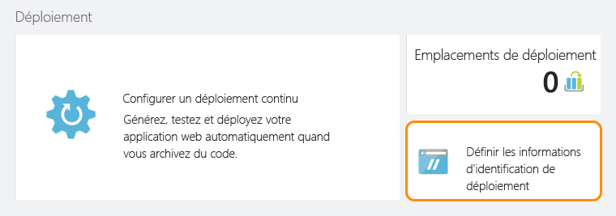

<properties
	pageTitle="Créer et déployer une application API Node.js dans Azure App Service"
	description="Découvrez comment créer un package d’application API Node.js et le déployer sur Microsoft Azure App Service."
	services="app-service\api"
	documentationCenter="node"
	authors="bradygaster"
	manager="mohisri" 
	editor="tdykstra "/>

<tags
	ms.service="app-service-api"
	ms.workload="web"
	ms.tgt_pltfrm="na"
	ms.devlang="node"
	ms.topic="get-started-article"
	ms.date="02/25/2015"
	ms.author="bradygaster"/>

# Créer et déployer une application API Node.js dans Azure App Service

[AZURE.INCLUDE [app-service-api-get-started-selector](../../includes/app-service-api-get-started-selector.md)]

## Composants requis
1. [Node.js](http://nodejs.org) en cours d’exécution sur l’ordinateur de développement (cet exemple part du principe que Node.js version 4.2.2 est installé)
1. Compte [GitHub](https://github.com/)
1. [Compte d’essai gratuit](https://azure.microsoft.com/pricing/free-trial/) Microsoft Azure
1. Git installé sur votre station de travail de développement locale

## Instructions d’installation
Vous devez exécuter les commandes ci-dessous à l’aide de la ligne de commande Node.js. En utilisant le Générateur Swaggerize Yo, vous pouvez structurer le code Node.js de ligne de base dont vous aurez besoin pour répondre aux requêtes HTTP définies dans un fichier JSON Swagger.
 
1. Installez **yo** et les modules NPM **generator-swaggerize** globalement.

        npm install -g yo
	    npm install -g generator-swaggerize
		
1. Clonez le [dépôt GitHub contenant l’exemple de code](https://github.com/Azure-Samples/app-service-api-node-contact-list).

		git clone https://github.com/Azure-Samples/app-service-api-node-contact-list.git
				
1. Exécutez la commande pour structurer l’API en fonction du fichier **api.json** fourni avec le code source. Le fichier **api.json** est un fichier Swagger représentant l’API réelle que vous structurerez à l’aide de la commande « yo swaggerize » à l’étape suivante.

        yo swaggerize
        
    **Remarque :** API.json est différent du fichier *apiapp.json* du calendrier Preview API Apps.

1. Swaggerize structure les gestionnaires et la configuration pour les métadonnées Swagger incluses dans **api.json**. Pendant le processus de génération de modèles automatique, plusieurs questions vous seront posées, notamment votre nom d’utilisateur GitHub et votre adresse électronique. Ces informations permettent de générer le fichier **package.json** dans le dossier de votre application. Parmi toutes les questions posées pendant le processus de génération de modèles automatique, la plus importante concerne l’option **express**. Vous devez sélectionner cette option quand vous y êtes invité, car cet exemple utilise le moteur de vue express pour générer la page d’aide Swagger ultérieurement quand votre application API s’exécute dans Azure (ou localement).

	
    
1. Accédez au dossier contenant le code généré automatiquement (ici, le sous-dossier *ContactList*). Ensuite, installez le module NPM **jsonpath**.

        npm install --save jsonpath
        
    L’environnement de ligne de commande affiche les résultats de l’installation.

    

1. Installez le module NPM **swaggerize-ui**.

        npm install --save swaggerize-ui
        
    L’environnement de ligne de commande affiche les résultats de l’installation.

    

1. Copiez le dossier **lib** du dossier **Démarrer** vers le dossier **ContactList** créé par la génération de modèles automatique.

1. Remplacez le code dans le fichier **handlers/contacts.js** par le code ci-dessous. Ce code utilise les données JSON stockées dans le fichier **lib/contacts.json** fourni par **lib/contactRepository.js**. Le nouveau code contacts.js ci-dessous répond aux requêtes HTTP pour obtenir tous les contacts à l’aide de ce code.

        'use strict';
        
        var repository = require('../lib/contactRepository');
        
        module.exports = {
            get: function contacts_get(req, res) {
                res.json(repository.all())
            }
        };

1. Remplacez le code dans le fichier **handlers/contacts/{id}.js** par le code ci-dessous, qui utilise **lib/contactRepository.js** pour obtenir le contact demandé par la requête HTTP et le retourner comme charge utile JSON.

        'use strict';

        var repository = require('../../lib/contactRepository');
        
        module.exports = {
            get: function contacts_get(req, res) {
                res.json(repository.get(req.params['id']));
            }    
        };

1. Remplacez le code dans le fichier **server.js** par le code ci-dessous. Notez que les modifications apportées au fichier server.js sont soulignées à l’aide de commentaires, pour que vous puissiez voir les modifications apportées.

        'use strict';

        var port = process.env.PORT || 8000; // first change

        var http = require('http');
        var express = require('express');
        var bodyParser = require('body-parser');
        var swaggerize = require('swaggerize-express');
        var swaggerUi = require('swaggerize-ui'); // second change
        var path = require('path');

        var app = express();

        var server = http.createServer(app);

        app.use(bodyParser.json());

        app.use(swaggerize({
            api: path.resolve('./config/api.json'), // third change
            handlers: path.resolve('./handlers'),
            docspath: '/swagger' // fourth change
        }));

        // change four
        app.use('/docs', swaggerUi({
          docs: '/swagger'  
        }));

        server.listen(port, function () { // fifth change
            app.setHost(undefined); // sixth and final change
        });

1. Activez le serveur à l’aide de l’exécutable en ligne de commande Node.js.

        node server.js

    L’exécution de cette commande démarre le serveur HTTP Node.js et lance le traitement de votre API.

1. Quand vous accédez à ****http://localhost:8000/contacts**, vous pouvez voir la sortie JSON de la liste de contacts (ou vous êtes invité à la télécharger, en fonction de votre navigateur).

    

1. Quand vous accédez à ****http://localhost:8000/contacts/2**, vous pouvez voir le contact représenté par cette valeur d’ID.

    

1. Les données JSON Swagger sont fournies par le biais du point de terminaison **/swagger** :

    

1. L’interface utilisateur Swagger est fournie par le biais du point de terminaison **/docs**. Dans l’interface utilisateur Swagger, vous pouvez utiliser les fonctionnalités de client HTML enrichies pour tester votre API.

    

## Créer une application API dans le portail Azure
Dans cette section, nous allons examiner le processus de création d’une application API vide dans Azure. Ensuite, nous raccorderons l’application à un dépôt Git pour pouvoir activer la remise continue des modifications de code.

Le dépôt GitHub à partir duquel vous avez cloné le code source n’est pas le même que celui où vous pousserez le code pour le déploiement. L’exemple de dépôt GitHub contenait l’état de « Démarrage » du code, et maintenant que vous avez généré automatiquement l’état de « Fin » du code, vous devrez pousser ce code uniquement dans le dépôt Git associé à votre application API. La première étape consiste à créer votre application API à l’aide du portail Azure.

1. Accédez au [Portail Azure](https://portal.azure.com/). 

1. Créez une application API.

    

1. Vous pouvez ajouter votre nouvelle application API à un groupe de ressources et/ou un plan App Service existant, ou vous pouvez créer un groupe de ressources et un plan App Service, comme illustré dans la capture d’écran ci-dessous.

    

1. Une fois votre application API créée dans le portail, accédez au panneau contenant ses paramètres, comme indiqué ci-dessous.

    

1. Cliquez sur l’élément de navigation **Informations d’identification de déploiement** dans le menu Paramètres. Une fois le panneau ouvert, ajoutez un nom d’utilisateur et un mot de passe que vous utiliserez pour publier votre code Node.js vers votre application API. Ensuite, cliquez sur le bouton **Enregistrer** dans le panneau **Informations d’identification de déploiement** .

    

1. Une fois vos informations d’identification de déploiement définies, vous pouvez créer un dépôt Git associé à votre App Service. Chaque fois que vous poussez du code dans ce dépôt, Azure App Service déploie vos modifications directement vers votre instance d’application API. Pour créer un dépôt Git à associer à votre site, cliquez sur l’élément de menu **Déploiement continu** dans le panneau de menu Paramètres, comme indiqué ci-dessous. Ensuite, sélectionnez l’option **Référentiel Git local** dans le panneau **Choisir une source**. Ensuite, cliquez sur le bouton OK pour créer votre dépôt Git.

    

1. Une fois votre dépôt Git créé, le panneau change et montre vos déploiements actifs. Comme il s’agit d’un nouveau dépôt, il ne devrait y avoir aucun déploiement actif dans la liste.

    

1. La dernière étape consiste à copier l’URL du dépôt Git à partir du portail. Pour cela, accédez au panneau de votre nouvelle application API et examinez la section **Bases**. Elle doit indiquer l’**URL de clonage Git**. À côté figure une icône qui permet de copier l’URL dans le Presse-papiers. Cliquez sur cette icône pour copier l’URL (le bouton s’affiche quand vous placez la souris sur l’URL) ou sélectionnez l’URL entière et copiez-la dans le Presse-papiers.

    

    **Remarque** : Vous aurez besoin de l’URL de clonage Git à l’étape suivante. Enregistrez-la quelque part pour le moment.

Maintenant que vous avez une nouvelle application API et un dépôt Git associé, vous pouvez pousser du code dans ce dépôt et utiliser les fonctionnalités de déploiement continu d’Azure pour déployer automatiquement vos modifications.

## Déployer votre code d’application API vers Azure
Grâce aux fonctionnalités intégrées de remise continue fournies par Azure App Service, vous pouvez tout simplement valider votre code dans un dépôt Git associé à votre App Service, et Azure déploiera automatiquement votre code source vers votre application API.

1. Copiez le dossier **fin/src/ContactList** créé par la génération de modèles automatique swaggerize sur votre Bureau ou dans un autre dossier. Vous allez créer un nouveau dépôt Git local pour le code qui doit résider en dehors du dépôt principal que vous avez cloné à partir de GitHub, contenant le code de mise en route. 

1. Utilisez la ligne de commande Node.js pour accéder au nouveau dossier. Exécutez la commande suivante pour créer un dépôt Git local.

        git init

    Un message de confirmation indique que votre nouveau dépôt a été initialisé.

    

1. Utilisez la ligne de commande Node.js pour exécuter la commande suivante et ajouter un dépôt Git distant à votre dépôt local. Le dépôt distant sera celui que vous venez de créer et il sera associé à votre application API exécutée dans Azure.

        git remote add azure YOUR_GIT_CLONE_URL_HERE

    **Remarque** : Vous devez remplacer la chaîne « YOUR\_GIT\_CLONE\_URL\_HERE » ci-dessus par votre propre URL de clone Git, que vous avez copiée précédemment.

1. Ensuite, exécutez les deux commandes ci-dessous à partir de la ligne de commande Node.js.

        git add .
        git commit -m "initial revision"

    Une fois ces deux commandes exécutées, la fenêtre de ligne de commande doit ressembler à la capture d’écran ci-dessous.

    

1. Pour pousser votre code vers Azure et déclencher un déploiement vers votre application API, exécutez la commande suivante sur la ligne de commande Node.js. Quand vous êtes invité à fournir un mot de passe, utilisez celui que vous avez utilisé précédemment lors de la création de vos informations d’identification de déploiement dans le portail Azure.

        git push azure master

1. Si vous revenez au panneau **Déploiement continu** de votre application API, vous constaterez que le déploiement se produit.

    

    Simultanément, la ligne de commande Node.js reflète l’état de votre déploiement pendant qu’il a lieu.

    

1. Une fois le déploiement terminé, le panneau **Déploiement continu** indique la réussite du déploiement de vos modifications de code vers votre application API. Copiez l’**URL** mentionnée dans la section **Bases** du panneau de votre application API.

    

1. À l’aide d’un client d’API REST tel que Postman ou Fiddler (ou votre navigateur web), spécifiez l’URL de votre appel d’API de contacts, qui doit être le point de terminaison **/contacts** de votre application API.

    **Remarque :** L’URL ressemblera à http://myapiapp.azurewebsites.net/contacts

    Lorsque vous émettez une requête GET à ce point de terminaison, vous devez voir la sortie JSON de votre application API.

    

## Étapes suivantes

À ce stade, vous avez créé et déployé votre première application API à l’aide de Node.js. Le didacticiel suivant de la série de prise en main d’API Apps montre comment [consommer des applications API à partir de clients JavaScript à l’aide de CORS](app-service-api-cors-consume-javascript.md).

À partir de cet exemple, vous pourriez ajouter du code aux gestionnaires pour stocker vos données dans une base de données ou sur le disque de votre instance d’application API. Maintenant que le déploiement continu est configuré, pour étendre ou changer les fonctionnalités de votre application API, il vous suffit de modifier et de pousser votre code vers votre dépôt Git.

<!---HONumber=AcomDC_0302_2016-->