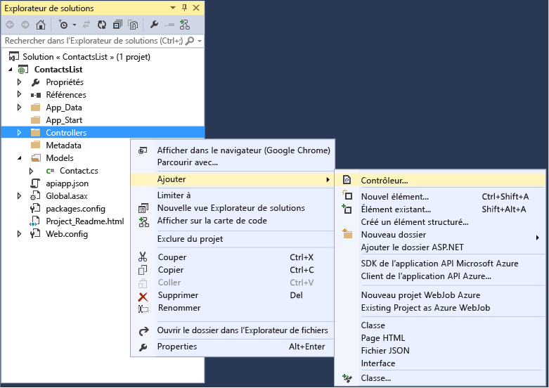
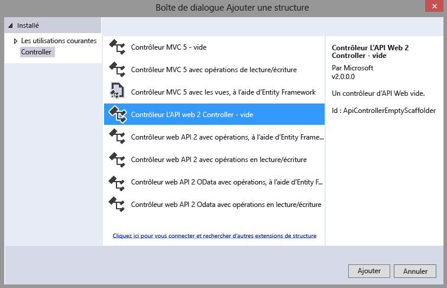
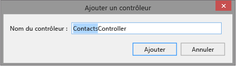
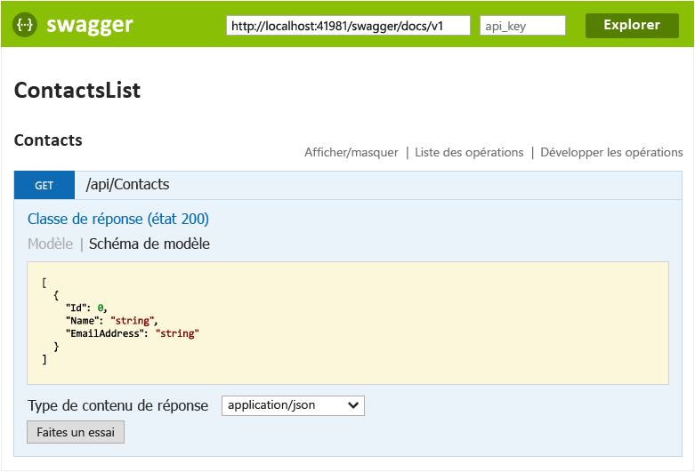
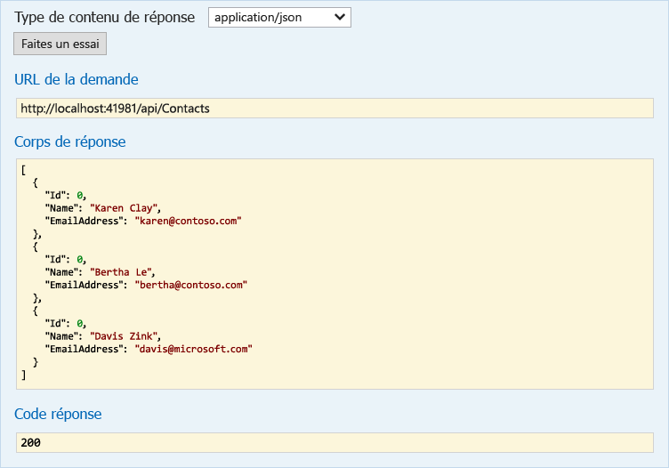

<properties 
	pageTitle="Créer une application API ASP.NET dans Azure App Service avec Visual Studio 2015" 
	description="Découvrez comment créer une application API ASP.NET dans Azure App Service avec Visual Studio 2015" 
	services="app-service\api" 
	documentationCenter=".net" 
	authors="tdykstra" 
	manager="wpickett" 
	editor="jimbe"/>

<tags 
	ms.service="app-service-api" 
	ms.workload="web" 
	ms.tgt_pltfrm="dotnet" 
	ms.devlang="na" 
	ms.topic="article" 
	ms.date="05/19/2015" 
	ms.author="tdykstra"/>

# Créer une application API ASP.NET dans Azure App Service avec Visual Studio 2015

> [AZURE.SELECTOR]
- [Visual Studio 2013](app-service-dotnet-create-api-app.md)
- [Visual Studio 2015 RC](app-service-dotnet-create-api-app-vs2015.md)

## Vue d'ensemble

Dans ce didacticiel, vous allez apprendre à créer un projet d’API Web ASP.NET 2 avec Visual Studio 2015 et à le configurer pour le déployer dans le cloud en tant qu’[application API](app-service-api-apps-why-best-platform.md) dans [Azure App Service](../app-service/app-service-value-prop-what-is.md). Vous apprendrez également à déployer le projet dans Azure. À la fin du didacticiel, vous aurez une application API qui s’exécutera dans le cloud Azure.

Ce didacticiel suppose que vous savez utiliser les fichiers et les dossiers dans l’**Explorateur de solutions** de Visual Studio.

Le didacticiel fonctionne avec la version actuelle disponible de l’API Web ASP.NET. Pour plus d’informations sur la création d’une application API ASP.NET MVC 6, consultez ce billet de blog : [https://alexanderzeitler.com/articles/Deploying-a-ASP-NET-MVC-6-API-as-Azure-API-App-in-Azure-App-Services/](https://alexanderzeitler.com/articles/Deploying-a-ASP-NET-MVC-6-API-as-Azure-API-App-in-Azure-App-Services/ "Déploiement d’une API ASP.NET MVC 6 en tant qu’application API Azure dans Azure App Service").

[AZURE.INCLUDE [install-sdk-2015-only](../../includes/install-sdk-2015-only.md)]

Ce didacticiel requiert la version 2.6 ou ultérieure du Kit de développement logiciel (SDK) Azure pour .NET.

## Créer un projet d’application API 

Visual Studio 2015 RC n’a pas encore de modèle de projet d’application API. Pour créer un projet d’application API, vous devez donc commencer avec le modèle de projet d’API Web.

1. Ouvrez Visual Studio 2015 RC.

2. Cliquez sur **Fichier > Nouveau Projet**.

3. Sous **Modèles**, cliquez sur **Web**, puis sur le modèle **Application Web ASP.NET**.

4. Nommez ce projet *ContactsList*

	

5. Cliquez sur **OK**.

6. Dans la boîte de dialogue **Nouveau projet ASP.NET** sous  **Modèles ASP.NET 4.6**, sélectionnez le modèle de projet **Vide**.

7. Activez la case à cocher **API Web**.

8. Désactivez la case à cocher **Héberger sur le cloud**.

	

7. Cliquez sur **OK**.

## Ajouter des packages NuGet

Par défaut, les projets d’application API sont activés avec la génération automatique des métadonnées [Swagger](http://swagger.io/ "Informations officielles relatives à Swagger"), qui est fournie par un package NuGet Swashbuckle. Lorsque vous installez le package, une page de test de l’API est également activée par défaut.

1. Cliquez sur **Outils > Gestionnaire de package NuGet > Console du gestionnaire de package**.

2. Dans la fenêtre **Console du gestionnaire de package**, entrez la commande suivante :

		install-package Swashbuckle

	Vous devrez peut-être attendre quelques minutes lorsque la console du gestionnaire de package affiche le message indiquant qu’il vérifie les dépendances.

## Ajouter des fichiers de métadonnées d’une application API

Les métadonnées qui permettent à un projet API Web d’être déployé comme application API se trouvent dans un fichier *apiapp.json* et un dossier *Metadata* avec ses sous-dossiers et fichiers. Au cours des étapes suivantes, vous ajouterez ces fichiers avec les valeurs par défaut.

La section [Métadonnées d’une application API](#api-app-metadata) plus loin dans ce didacticiel explique comment personnaliser ces métadonnées.

1. Dans le dossier du projet, créez un fichier *.json* nommé apiapp.json et remplacez son contenu par le texte JSON suivant.

		{
		    "$schema": "http://json-schema.org/schemas/2014-11-01/apiapp.json#",
		    "id": "ContactsList",
		    "namespace": "microsoft.com",
		    "gateway": "2015-01-14",
		    "version": "1.0.0",
		    "title": "ContactsListTitle",
		    "summary": "Summary",
		    "author": "Author",
		    "endpoints": {
		        "apiDefinition": "/swagger/docs/v1",
		        "status": null
		    }
		}

3. Dans le dossier du projet, créez un dossier nommé *Metadata*, et dans le dossier *Metadata*, créez un dossier nommé *deploymentTemplates*.

5. Dans le dossier *deploymentTemplates*, créez un fichier *.json* nommé *apiappconfig.azureresource.json*, puis remplacez son contenu par le texte JSON suivant :

		{
		  "$schema": "http://schemas.management.azure.com/schemas/2014-04-01-preview/deploymentTemplate.json#",
		  "contentVersion": "1.0.0.0",
		  "parameters": {
		    "$system": {
		      "type": "Object"
		    }
		  },
		  "resources": []
		}

## Ajouter le code de l’API web

Dans les étapes suivantes, vous ajoutez du code pour une méthode HTTP Get simple qui retourne une liste codée de contacts codée en dur.

1. Dans le dossier du projet, créez un dossier *Models*.

2. Ajoutez un fichier de classe nommé *Contact.cs*, et remplacez le contenu du fichier par le code suivant.

		namespace ContactsList.Models
		{
			public class Contact
			{
				public int Id { get; set; }
				public string Name { get; set; }
				public string EmailAddress { get; set; }
			}
		}

5. Cliquez avec le bouton droit sur le dossier **Contrôleurs** et sélectionnez **Ajouter > Contrôleur**.

	

6. Dans la boîte de dialogue **Ajouter une génération de modèles automatique**, sélectionnez l’option **Contrôleur d’API web 2 - Vide** et cliquez sur **Ajouter**.

	

7. Nommez le contrôleur **ContactsController** et cliquez sur **Ajouter**.

	

8. Une fois le fichier *ContactsController.cs* créé, remplacez son contenu par le code suivant.

		using ContactsList.Models;
		using System;
		using System.Collections.Generic;
		using System.Linq;
		using System.Net;
		using System.Net.Http;
		using System.Threading.Tasks;
		using System.Web.Http;
		
		namespace ContactsList.Controllers
		{
		    public class ContactsController : ApiController
		    {
		        [HttpGet]
		        public IEnumerable<Contact> Get()
		        {
		            return new Contact[]{
						new Contact { Id = 1, EmailAddress = "barney@contoso.com", Name = "Barney Poland"},
						new Contact { Id = 2, EmailAddress = "lacy@contoso.com", Name = "Lacy Barrera"},
	                	new Contact { Id = 3, EmailAddress = "lora@microsoft.com", Name = "Lora Riggs"}
		            };
		        }
		    }
		}

## Tester l’API web

Pour afficher la page de test des API, procédez comme suit.

1. Exécutez l’application localement (Ctrl+F5) et accédez à `/swagger`. 

	

2. Cliquez sur **Contacts > Obtenir > Essayez-le**. Vous constatez que l’API fonctionne et retourne le résultat attendu.

	

## Créer une application API dans Azure

1. Créer une application API dans [le portail Azure en version préliminaire](https://portal.azure.com). 

	* Cliquez sur **Nouveau > Web + Mobile > Application API**.

		

	* Dans le champ **Nom**, entrez ContactsList.

	* Dans **Plan App Service**, cliquez sur **Créer un nouveau plan** et entrez un nom, par exemple : **ContactsList**.

		Pour plus d’informations sur les plans Azure App Service, consultez la rubrique [Présentation détaillée des plans d’Azure App Service](azure-web-sites-web-hosting-plans-in-depth-overview.md).

	* Cliquez sur **Niveau de tarification** pour obtenir une liste d’options, puis sur **Afficher tout**. Enfin, sélectionnez le niveau de tarification **Gratuit**.

		Vous pouvez utiliser un niveau de tarification payant, mais il n’est pas nécessaire pour ce didacticiel.

	* Dans **Groupe de ressources**, cliquez sur **Créer un nouveau groupe** puis entrez un nom, par exemple : ContactsList.

		Pour plus d’informations sur les groupes de ressources, consultez la rubrique [Utilisation des groupes de ressources pour gérer vos ressources Azure](resource-group-overview.md).

	* Si vous avez plusieurs abonnements, sélectionnez celui que vous souhaitez utiliser.

	* Choisissez un emplacement proche de vous.

	* Cliquez sur **Create**.

		

2. Lorsqu’Azure a terminé la création de l’application API (voir **Notifications** sur le côté gauche de la page), choisissez **Public (anonyme)** comme niveau d’accès de l’application API.

	* Cliquez sur **Parcourir > Groupes de ressources > [le groupe de ressources que vous avez créé] > [l’application API que vous avez créée]**.

	* Cliquez sur **Paramètres > Paramètres de l’application**.

	* Définissez le **Niveau d’accès** sur **Public (anonyme)**.

		
	
2. Notez le nom de l’application Web sous-jacente qui héberge l’application API. Vous en aurez besoin lors du déploiement du projet Visual Studio.

	* Sous **hôte d’application API** cliquez sur **ContactsList**.

		

	* Le nom figure dans le titre du panneau **hôte d’application API**.

		

## Déployer le projet API Web vers la nouvelle application API dans Azure
 
Les applications API sont essentiellement des applications web pour lesquelles Azure fournit des fonctionnalités supplémentaires pour les fonctionnalités de service Web. Dans Visual Studio 2015 RC, vous publiez vers l’application web sous-jacente de l’application API, car l’assistant de publication Web ne permet pas d’effectuer une sélection particulière pour les applications API.

2. Dans l’**Explorateur de solutions** de Visual Studio, cliquez avec le bouton droit sur le projet, puis, dans le menu contextuel, sur **Publier**.

3. À l’étape **Profil** de l’Assistant **Publier le site Web**, cliquez sur **Applications web Microsoft Azure**.

	

4. Dans la liste déroulante **Applications web existantes**, sélectionnez l’entrée à l’aide du nom de l’application API que vous avez noté précédemment.

	

5. Cliquez sur **Publier**.

	Votre navigateur s’ouvre sur l’URL d’application web et affiche une page indiquant que «  l’application API a été créée ».

6. Dans la barre d’adresse du navigateur, ajoutez « swagger/ » à la fin de l’URL, par exemple :

		https://microsoft-apiappb001b62a9033493a33748332233fca2.azurewebsites.net/swagger/

	Vous voyez la même interface utilisateur Swagger que celle qui s’exécutait localement et que vous avez vue précédemment, mais maintenant elle s’exécute dans le cloud.

2. Cliquez sur **Contacts > Obtenir > Essayez-le**. Vous constatez que l’API fonctionne et retourne le résultat attendu.

	

[AZURE.INCLUDE [app-service-api-direct-deploy-metadata](../../includes/app-service-api-direct-deploy-metadata.md)]

## Étapes suivantes

Vous avez maintenant créé et déployé une application API à l’aide de Visual Studio 2015 RC. Pour plus d’informations sur les applications API, consultez les entrées dans le volet de navigation qui s’affiche sur le côté gauche de la page (pour les grandes fenêtres de navigateur) ou en haut de la page (pour les fenêtres de navigateur étroites). La plupart des documents relatifs aux applications API font actuellement référence à Visual Studio 2013, mais la plus grande partie peut être utilisée avec Visual Studio 2015, car l’interface utilisateur est similaire, le code que vous écrivez est le même et l’interface utilisateur du portail est identique.

<!---HONumber=58--> 