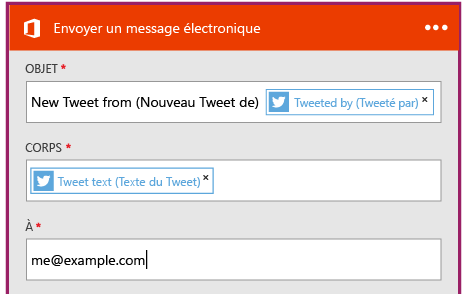

<properties
	pageTitle="Créer une application logique | Microsoft Azure"
	description="Apprendre à créer une application logique connectant les services SaaS"
	authors="stepsic-microsoft-com"
	manager="dwrede"
	editor=""
	services="app-service\logic"
	documentationCenter=""/>

<tags
	ms.service="app-service-logic"
	ms.workload="na"
	ms.tgt_pltfrm="na"
	ms.devlang="na"
	ms.topic="get-started-article"
	ms.date="02/17/2016"
	ms.author="stepsic"/>

# Créer une application logique connectant les services SaaS

| Référence rapide |
| --------------- |
| [Langage de définition des applications logiques](https://msdn.microsoft.com/library/azure/dn948512.aspx?f=255&MSPPError=-2147217396) |
| [Documentation du connecteur des applications logiques](https://azure.microsoft.com/documentation/articles/app-service-logic-connectors-list/) |
| [Forum Logic Apps](https://social.msdn.microsoft.com/Forums/fr-FR/home?forum=azurelogicapps) |

Cette rubrique illustre comment se familiariser avec les [applications logiques App Services](app-service-logic-what-are-logic-apps.md) en quelques minutes. Nous allons suivre un flux de travail qui vous permet d'envoyer un ensemble de tweets qui vous intéressent vers un dossier Dropbox.

Pour activer ce scénario, vous avez besoin des éléments suivants :

- Un abonnement Azure
- un compte Twitter ;
- Un compte Office 365

## Créer une application logique pour vous envoyer des tweets par courrier électronique

1. Dans le tableau de bord du portail Azure, sélectionnez **Marketplace**. 
2. Dans Tout, recherchez « applications logiques », puis sélectionnez **Logic App (version préliminaire)**. Vous pouvez également sélectionner **Nouveau**, **Web + Mobile** et **Logic App (version préliminaire)**. 
3. Entrez un nom pour votre application logique, sélectionnez le plan de service d’application, puis **Créer**. Dans cette étape, nous partons du principe que vous disposez d’un plan de service d’application et que vous connaissez bien les propriétés requises. Dans le cas contraire, ne vous inquiétez pas : vous pouvez commencer par lire l’article [Présentation détaillée des plans Azure App Service](azure-web-sites-web-hosting-plans-in-depth-overview.md). 

4. Lorsque l’application logique s’ouvre pour la première fois, vous avez besoin d’un déclencheur. Par exemple, vous pouvez utiliser **Périodicité** : 

	Avec le déclencheur Périodicité, votre application logique s’exécute en continu en utilisant l’heure choisie. Par exemple, vous pouvez exécuter votre application logique toutes les 30 secondes, toutes les 5 heures, tous les jours à 8:00 PST, toutes les nuits à 2:00 EST, etc. Vous pouvez également supprimer la périodicité de votre application logique. Si tel est le cas, vous démarrez alors manuellement votre application logique.

5. Néanmoins, pour ce didacticiel, nous allons faire exécuter le déclencheur chaque fois qu’un tweet correspond à une condition. Cliquez sur le menu `...` pour supprimer le déclencheur Périodicité.

6. Recherchez **twitter** dans la zone de recherche de déclencheur, puis sélectionnez-le.

7. Vous allez taper le mot-clé que vous souhaitez rechercher dans Twitter. 

5. Sélectionnez le signe plus (+), puis choisissez **Ajouter une action** ou **Ajouter une condition** : 
6. Si vous sélectionnez **Ajouter une action**, tous les connecteurs accompagnés de leurs actions disponibles sont répertoriés. Vous pouvez alors choisir le connecteur et l’action à ajouter à votre application logique. Par exemple, vous pouvez sélectionner **Office 365 - Envoyer un message électronique** ainsi que d’autres actions Office 365 : 

7. À présent, vous devez remplir les paramètres du message électronique : 

8. Pour finir, vous pouvez sélectionner **Enregistrer** pour que votre application logique soit générée.

## Gérer votre application logique après la création

Votre application logique est maintenant opérationnelle. Chaque fois que le flux de travail planifié s’exécute, il vérifie la présence de tweets avec le hashtag spécifique. Quand il trouve un tweet correspondant, il le place dans votre dossier Dropbox. Pour finir, vous allez découvrir comment désactiver l'application ou analyser ses performances.

1. Cliquez sur **Parcourir** sur le côté gauche de l’écran, et sélectionnez **Applications logiques**.

2. Cliquez sur la nouvelle application logique que vous venez de créer pour afficher l'état actuel et des informations générales.

3. Pour modifier votre nouvelle application logique, cliquez sur **Déclencheurs et actions**.

5. Pour désactiver l’application, cliquez sur **Désactiver** dans la barre de commandes.

En moins de cinq minutes, vous avez réussi à configurer une application logique simple exécutée dans le cloud. Pour en savoir plus sur l’utilisation des fonctionnalités des applications logiques, consultez [Utiliser les fonctionnalités des applications logiques]. Pour en savoir plus sur les définitions d'application logique, consultez la rubrique [Créer des définitions d'application logique](app-service-logic-author-definitions.md).

<!-- Shared links -->
[Azure portal]: https://portal.azure.com
[Utiliser les fonctionnalités des applications logiques]: app-service-logic-create-a-logic-app.md

<!---HONumber=AcomDC_0224_2016-->