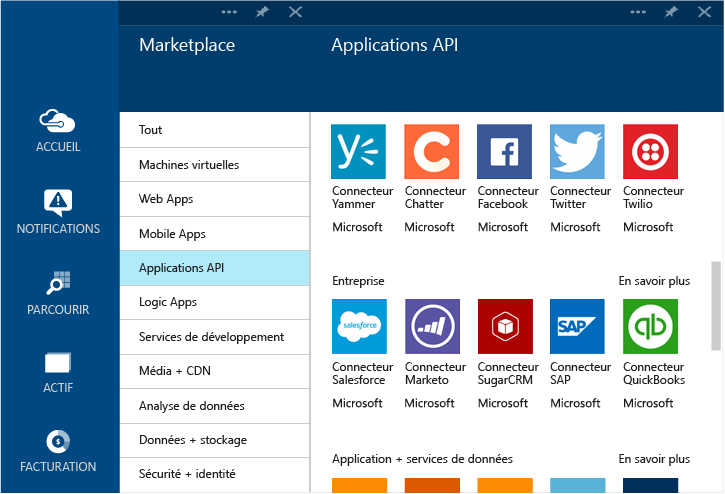

# Qu'est-ce qu'un connecteur et une application API BizTalk ?
[!INCLUDE [app-service-logic-version-message](../../includes/app-service-logic-version-message.md)]

Un *Connecteur* est un type d’application API axé sur la connectivité. Comme toute autre application API, les connecteurs s'utilisent à partir d'applications web, mobiles et logiques. Ils facilitent la connexion à des services existants et aident à gérer l'authentification, à fournir une analyse et bien plus encore.

Les développeurs peuvent créer leurs propres applications API et les déployer en privé. À l’avenir, les développeurs pourront partager et valoriser leurs applications API via le Marketplace. 

Pour accélérer la création de solutions, l’équipe Azure a ajouté plusieurs connecteurs au Marketplace pour répondre à de nombreux scénarios courants. En outre, pour étendre la portée aux scénarios d’intégration avancés et complexes, plusieurs fonctionnalités Premium et BizTalk sont également disponibles.

Différents niveaux de service sont disponibles. Tous les niveaux incluent l’ensemble des connecteurs et applications API, y compris leurs fonctionnalités complètes.  

[Tarification App Service](https://azure.microsoft.com/pricing/details/app-service/) décrit les niveaux de service et répertorie également ce qui y est inclus. Les sections suivantes décrivent les différentes catégories d’applications API et connecteurs BizTalk.

## Connecteurs hybrides
Les connecteurs hybrides étendent la portée dans l’entreprise avec une connectivité pour [DB2](app-service-logic-connector-db2.md), [Informix](app-service-logic-connector-informix.md) et WebSphere MQ. 

Ressources complémentaires : [Connecteurs B2B et applications API](app-service-logic-b2b-connectors.md)  
[Création d’un processus B2B](app-service-logic-create-a-b2b-process.md)  
[Créez un accord de partenariat commercial](app-service-logic-create-a-trading-partner-agreement.md)  
[Suivre des messages B2B](app-service-logic-track-b2b-messages.md)  

## Règles
Les règles d'entreprise englobent les stratégies et les décisions qui contrôlent les processus d'entreprise. En règle générale, les règles sont dynamiques et changent au fil du temps pour différentes raisons, y compris les plans d’activités, les réglementations, etc. [règles BizTalk](app-service-logic-use-biztalk-rules.md) vous permettent de découpler ces stratégies de votre code d’application et de simplifier et d’accélérer le processus de modification.

## Liste des connecteurs et applications API
Consultez la page [Liste des connecteurs et applications API](app-service-logic-connectors-list.md) pour obtenir la liste complète des connecteurs et des applications API inclus dans chaque catégorie, y compris les connecteurs standard, IAE BizTalk, les connecteurs Premium et ainsi de suite.

<!--HONumber=Oct16_HO2-->

